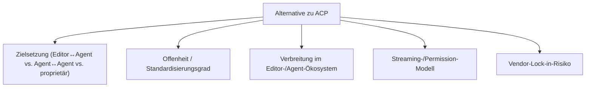
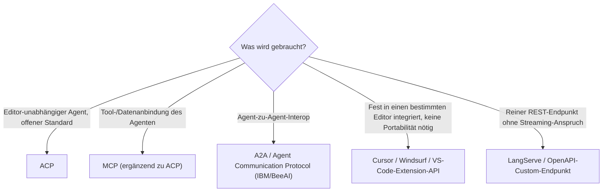

# Beste Alternativen zum Agent Client Protocol (ACP) — Top-20-Topliste

Nach der [ACP-Übersicht](agent-client-protocol-acp.md) dieser Serie geht es hier um die Einordnung: **Welche Protokolle, Standards und proprietären Ansätze konkurrieren mit ACP** — oder ergänzen es —, wenn es um die Kommunikation zwischen Editor/Client und KI-Coding-Agent geht? Bewertet werden sowohl offene Protokolle als auch etablierte proprietäre Integrationsmuster, da in der Praxis beide Wege nebeneinander existieren.

!!! note "Hinweis: Namensverwirrung „ACP""
    Neben dem hier behandelten **Agent Client Protocol** (Zed) existiert unabhängig davon das **Agent Communication Protocol** (ebenfalls als „ACP" abgekürzt, ursprünglich von IBM/BeeAI initiiert, mittlerweile bei der Linux Foundation) für Agent-zu-Agent-Kommunikation. Beide Protokolle haben trotz identischer Abkürzung unterschiedliche Zielsetzungen und keinen gemeinsamen Ursprung — siehe Rang 6.

---

## Bewertungskriterien

!!! warning "Achtung: Momentaufnahme in einer sehr jungen Kategorie"
    Standardisierte Protokolle für Editor-Agent-Kommunikation sind ein sehr neues Feld — die meisten hier gelisteten Alternativen sind entweder proprietäre Einzellösungen oder Protokolle, die primär andere Probleme (Agent-zu-Agent, Tool-Anbindung) lösen und nur indirekt mit ACP vergleichbar sind. **Stand: Juli 2026.**

---

## Top 20 im Überblick

| Rang | Alternative | Kategorie | Herkunft | Einschätzung | Besondere Stärke | Abgrenzung zu ACP |
|---|---|---|---|---|---|---|
| 1 | **Model Context Protocol (MCP)** | Offenes Protokoll | Anthropic | Sehr stark | Breiteste Verbreitung aller hier gelisteten Protokolle, riesiges Tool-/Server-Ökosystem | Löst Tool-/Datenanbindung des Agenten, nicht die Editor-Kommunikation selbst — komplementär statt konkurrierend |
| 2 | **Agent2Agent Protocol (A2A)** | Offenes Protokoll | Google (mittlerweile Linux Foundation) | Stark | Fokus auf Interoperabilität zwischen unterschiedlichen Agenten-Plattformen | Regelt Agent-zu-Agent-Kommunikation, nicht Editor-zu-Agent wie ACP |
| 3 | **Language Server Protocol (LSP)** | Offenes Protokoll | Microsoft | Sehr stark (als Vorbild) | Architektonisches Vorbild für ACP, extrem breite Editor-Unterstützung seit Jahren | Für reine Code-Intelligenz konzipiert, keine nativen Agenten-Konzepte (Sessions, Permission-Requests) |
| 4 | **Debug Adapter Protocol (DAP)** | Offenes Protokoll | Microsoft | Stark (als Vorbild) | Gleiche JSON-RPC-über-stdio-Philosophie wie ACP, seit Jahren produktionserprobt | Für Debugger-Steuerung konzipiert, keine Agenten-/Streaming-Semantik |
| 5 | **AG-UI Protocol** | Offenes Protokoll | CopilotKit / Community | Solide bis stark | Fokus auf Streaming von Agent-Zuständen in beliebige Web-UIs, nicht nur Editoren | Zielt auf generische Web-Frontends statt speziell auf Code-Editoren |
| 6 | **Agent Communication Protocol (ACP, IBM/BeeAI)** | Offenes Protokoll | IBM / BeeAI, Linux Foundation | Solide | Eigenständiger Standard für Agent-zu-Agent-Interop mit REST-nahem Ansatz | Trotz identischer Abkürzung ein anderes Protokoll mit anderem Zweck (siehe Hinweis oben) |
| 7 | **LangServe** | Offenes Framework | LangChain | Solide | Macht LangChain-/LangGraph-Agenten als REST-/Streaming-Endpunkt verfügbar | REST-basiert statt stdio-JSON-RPC, kein natives Editor-Permission-Modell |
| 8 | **OpenAI Assistants / Responses API** | Proprietäre Vendor-API | OpenAI | Solide bis stark | Sehr ausgereiftes gehostetes Sitzungs-/Tool-Modell direkt beim Anbieter | Cloud-gebunden, kein editor-neutrales offenes Protokoll |
| 9 | **OpenAI-kompatible Chat-Completions-Konvention** | De-facto-Standard | OpenAI + breites Ökosystem | Solide | Von den meisten Anbietern/Aggregatoren übernommen, sehr breite Tool-Unterstützung | Reines Request/Response-API-Format, keine Editor-Session- oder Permission-Semantik |
| 10 | **VS Code Language Model / Chat Extension API** | Proprietäre Editor-API | Microsoft | Solide | Sehr tief in VS Code integriert, großes Erweiterungs-Ökosystem | Nur innerhalb von VS Code nutzbar, kein editor-übergreifender Standard |
| 11 | **GitHub Copilot Extensions API** | Proprietäre Vendor-Plattform | GitHub/Microsoft | Solide | Direkter Zugriff auf Copilot-Chat-Kontext und -UI | An das Copilot-/GitHub-Ökosystem gebunden |
| 12 | **JetBrains AI Assistant Plugin SDK** | Proprietäre Editor-API | JetBrains | Solide | Gute Integration in die gesamte JetBrains-IDE-Familie (IntelliJ, PyCharm, …) | Nur innerhalb JetBrains-IDEs nutzbar |
| 13 | **Cursor (proprietäre Agent-Integration)** | Proprietäre Editor-Integration | Anysphere | Solide | Sehr ausgereifte, eng verzahnte Agent-Erfahrung direkt im Fork | Kein offenes Protokoll — Agent-Logik fest in den Editor-Fork eingebaut |
| 14 | **Windsurf / Codeium Cascade** | Proprietäre Editor-Integration | Codeium | Solide | Eigenes „Flow"-Interaktionsmodell mit tiefer Codebase-Indexierung | Ebenfalls fest an den eigenen Editor-Fork gebunden, kein offener Standard |
| 15 | **Continue.dev Custom-Provider-Konfiguration** | Offene Konfiguration (kein formales Protokoll) | Continue.dev | Solide | Modell-/Provider-agnostisch über eine offene Config statt Vendor-Lock-in | Kein formales Wire-Protokoll, eher ein Plugin-Konfigurationsschema |
| 16 | **Amazon Q Developer IDE-Plugin-Protokoll** | Proprietäre Vendor-Integration | AWS | Ausreichend bis solide | Gute Anbindung an AWS-Infrastruktur direkt aus der IDE | Proprietäres, AWS-zentriertes Protokoll ohne offene Spezifikation |
| 17 | **gRPC-basierte Custom-Agent-Schnittstellen** | Generischer Ansatz (Eigenbau) | Unternehmensintern / Community | Ausreichend bis solide | Hohe Performance, stark typisiert über Protobuf, gut für interne Enterprise-Landschaften | Kein Standard — jede Implementierung inkompatibel zu jeder anderen |
| 18 | **WebSocket-basierte proprietäre Copilot-Protokolle** | Proprietäre Vendor-Integration | diverse IDE-Anbieter | Ausreichend | Ermöglicht bidirektionales Streaming ohne stdio-Subprozess-Modell | Fragmentiert — praktisch jeder Anbieter mit eigenem, inkompatiblem Format |
| 19 | **REST/OpenAPI-basierte Custom-Agent-Endpunkte** | Generischer Ansatz (Eigenbau) | Unternehmensintern | Ausreichend | Einfach zu implementieren, breites Tooling-Ökosystem rund um OpenAPI | Kein Streaming-/Permission-Modell wie bei ACP, Polling statt echtem Push |
| 20 | **stdio-JSON-Lines-Ad-hoc-Protokolle** | Generischer Ansatz (Eigenbau) | diverse CLI-Agenten vor ACP-Adaption | Ausreichend | Minimalistisch, keine Abhängigkeit von einer Spezifikation nötig | Jede Implementierung mit eigenem, undokumentiertem Format — genau das Problem, das ACP lösen soll |

!!! tip "Tipp: Komplementär denken statt „entweder/oder""
    In der Praxis schließen sich die meisten Einträge dieser Liste nicht gegenseitig mit ACP aus. **MCP** wird oft parallel zu ACP eingesetzt (ACP zum Editor, MCP zu den Tools). Proprietäre Editor-Integrationen (Cursor, Windsurf, VS-Code-Extension-APIs) sind vor allem dann relevant, wenn man ohnehin in deren Ökosystem bleibt — der Mehrwert von ACP zeigt sich erst, sobald ein Agent editor-unabhängig bleiben soll.

---

## Entscheidungshilfe

---

## 🔗 Verwandte Themen

- [Startseite](../../index.md) — zurück zur Dokumentations-Zentrale
- [Agent Client Protocol (ACP) — Übersicht](agent-client-protocol-acp.md) — Grundlagen und Architektur von ACP selbst
- [Beste KI-Agent-CLIs (Allgemein, Top 20)](ki-agent-cli-topliste.md) — Agenten, die ACP oder proprietäre Alternativen implementieren
- [Beste KI-Agent-IDEs (Allgemein, Top 20)](ki-agent-ide-topliste.md) — Editoren mit proprietärer oder ACP-basierter Agent-Integration
- [Beste KI-Agent-SDKs nach Programmiersprachen-Vielfalt (Top 20)](ki-agent-sdk-sprachen-topliste.md) — Frameworks zum Bau der Agent-Seite dieser Protokolle
- [Antigravity CLI 2 — Kapitel 9: MCP, Headless & Security](antigravity-cli-advanced-mcp-cicd.md) — vertiefend zu Rang 1 (MCP)
- [Continue.dev & Tabby AI](continue-dev-setup.md) — vertiefend zu Rang 15
