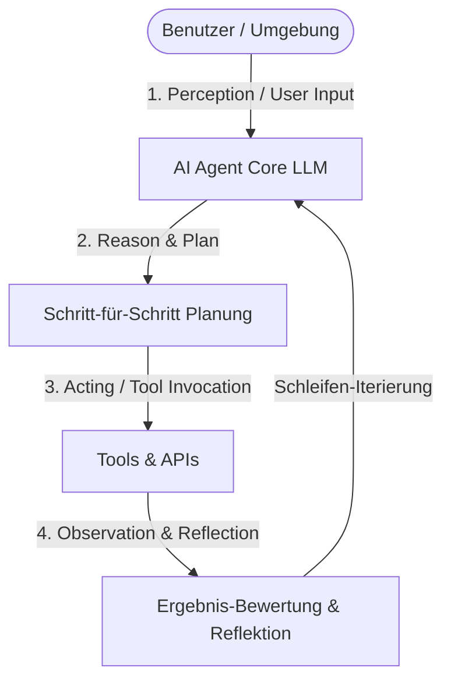
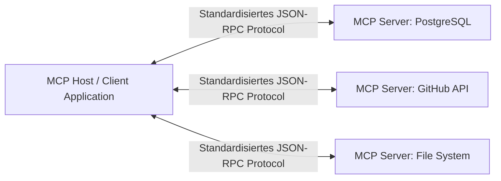
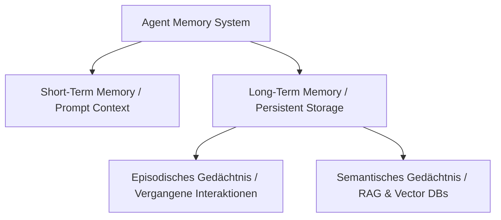

# AI Agents – Das Praxis-Handbuch & Architektur-Leitfaden

**AI Agents** (autonome KI-Agenten) repräsentieren den nächsten Evolutionsschritt in der Anwendung großer Sprachmodelle (LLMs). Während klassische LLMs rein textgenerierend agieren, können autonome Agenten eigenständig Entscheidungen treffen, externe Werkzeuge (Tools) nutzen, Umgebungen wahrnehmen, Pläne anpassen und komplexe mehrstufige Aufgaben lösen.

Dieses Handbuch bietet einen praxisorientierten Überblick über die Funktionsweise, Architekturen, Memory-Systeme, Tool-Integrationen (MCP), Evaluierung und Sicherheitsaspekte von AI Agents.

---

## 🚀 1. Grundlagen & Der Agentic Loop

### Was ist ein AI Agent?
Ein **AI Agent** kombiniert ein Sprachmodell (als zentrales Gehirn) mit Speicher (Memory), Werkzeugen (Tools) und einer Regelschleife. Dadurch ist der Agent in der Lage, dynamisch auf Eingaben zu reagieren und ein festgelegtes Ziel autonom zu verfolgen.



### Der Agent Loop (Die agentische Schleife)
Jeder Agent durchläuft kontinuierlich 4 Kernphasen:

1. **Perception (Wahrnehmung)**: Erfassung des Prompts, des Systemkontexts und externer Umgebungssignale.
2. **Reason & Plan (Denken & Planen)**: Analyse der nächsten notwendigen Schritte zur Zielerreichung.
3. **Acting (Werkzeugausführung)**: Aufruf von Schnittstellen (APIs, Datenbanken, Shell, Web-Scraper).
4. **Observation & Reflection (Reflektion)**: Bewertung des Werkzeug-Ergebnisses. War die Aktion erfolgreich oder ist eine Korrektur erforderlich?

### Praxis-Anwendungsfälle (Usecases)
* **Persönliche Assistenten**: Kalenderverwaltung, E-Mail-Bearbeitung und Ticket-Erstellung.
* **Code Generation & Engineering**: Autonome Fehlersuche, Refactoring und Pull-Request-Reviews.
* **Data Analysis & Mining**: Automatisiertes Auslesen, Bereinigen und Visualisieren von Daten.
* **Web Scraping & Extraction**: Interaktives Navigieren auf Websites und Datenextraktion.
* **Gaming & NPC AI**: Dynamische Nicht-Spieler-Charaktere mit Gedächtnis und Verhaltensmuster.

---

## 🧠 2. LLM-Fundamente & Generierungssteuerung

### Transformer-Modelle & Mechanik
Um Agenten effizient zu bauen, sind grundlegende Kenntnisse der Modellparameter essenziell:

* **Tokenization**: Umwandlung von Text in mathematische Token-Einheiten (ca. 1000 Tokens ≈ 750 Wörter).
* **Context Windows**: Die maximale Anzahl an Tokens, die das Modell gleichzeitig im Arbeitsspeicher verarbeiten kann (z. B. 128k bis 2 Mio. Tokens).
* **Open Weight vs. Closed Weight Models**:
  * *Closed Weight* (z. B. GPT-4o, Claude 3.7 Sonnet, Gemini 1.5 Pro): Höchste Reasoning-Leistung über Cloud-APIs.
  * *Open Weight* (z. B. Llama 3.3, Mistral NeMo, Qwen 2.5): Lokale Kontrollierbarkeit, Datenschutz und Hosting via Ollama/vLLM.

### Steuerungsparameter (Generation Controls)

| Parameter | Beschreibung | Empfohlener Wert für Agenten |
|---|---|---|
| **Temperature** | Steuert die Kreativität/Zufälligkeit der Ausgabe | `0.0` – `0.2` (für präzise Tool-Aufrufe) |
| **Top-p (Nucleus Sampling)** | Begrenzt die Wortauswahl auf die wahrscheinlichsten Tokens | `0.9` |
| **Frequency Penalty** | Bestraft sich häufig wiederholende Wörter | `0.0` – `0.5` |
| **Presence Penalty** | Fördert die Einführung neuer Themen | `0.0` – `0.5` |
| **Stopping Criteria** | Abbruchbedingungen (z. B. `["\nObservation:"]`) | Spezifisch für ReAct-Prompts |

---

## 🛠️ 3. Tools, Actions & Model Context Protocol (MCP)

### Werkzeug-Definition (Tool Definition)
Agenten agieren über strukturierte Werkzeugdefinitionen (Function Calling). Jedes Tool benötigt:
* **Name & Beschreibung**: Erklärung für das LLM, *wann* das Tool genutzt werden soll.
* **Input/Output Schema**: JSON-Schema zur Validierung der Argumente.
* **Error Handling**: Abfangen von Timeouts, 404-Fehlern und invaliden Typen.

=== "Python Function Calling Definition"
    ```python
    from pydantic import BaseModel, Field

    class DatabaseQueryInput(BaseModel):
        query: str = Field(description="SQL-Abfrage zum Ausführen auf der Kunden-DB")
        max_rows: int = Field(default=10, description="Maximale Anzahl an Zeilen")

    # Tool-Beschreibung für das Sprachmodell
    tool_definition = {
        "name": "query_customer_db",
        "description": "Führt eine Leseabfrage auf der SQL-Datenbank aus.",
        "parameters": DatabaseQueryInput.model_json_schema()
    }
    ```

### Model Context Protocol (MCP)
Das **Model Context Protocol** (MCP) von Anthropic ist ein offener Standard zur Anbindung von Datenquellen und Tools an KI-Agenten.



#### MCP-Architekturkomponenten
* **MCP Host**: Die Anwendung, die den Agenten ausführt (z. B. Claude Code, Antigravity CLI, Custom App).
* **MCP Client**: Stellt die Verbindung zu den MCP-Servern her.
* **MCP Server**: Stellt Ressourcen, Prompts und Tools über ein einheitliches Protokoll bereit.
* **Deployment Modes**: Lokal auf dem Desktop (via Standard I/O) oder Remote im Netzwerk (via HTTP/SSE).

---

## 💾 4. Agent Memory (Gedächtnis & Speicher)

Ein funktionierender Agent benötigt Strategien zur Speicherung von Gesprächsverläufen und Wissen:



### Kurzzeit- vs. Langzeitgedächtnis

| Gedächtnistyp | Speichermedium | Anwendungsfall |
|---|---|---|
| **Short-Term Memory** | In-Prompt Context Window | Aktueller Gesprächsverlauf und temporäre Tool-Ergebnisse |
| **Long-Term Episodic** | SQL-DB / Key-Value Store | Benutzerpräferenzen, Historie früherer Sessions |
| **Long-Term Semantic** | Vektordatenbank (Chroma, Qdrant, pgvector) | Fachwissen, Dokumente, Wissensdatenbanken (RAG) |

### Memory-Management & Kompression
* **Summarization & Compression**: Regelmäßiges Zusammenfassen alter Interaktionen, um das Token-Limit nicht zu überschreiten.
* **Aging & Forgetting**: Verwerfen veralteter oder irrelevanter Informationen anhand von Zeitstempeln oder Relevance Scores.
* **User Profile Storage**: Speichern strukturierter Fakten über den Nutzer in separaten JSON/SQL-Tabellen.

---

## 🏗️ 5. Agenten-Architekturen & Patterns

Je nach Komplexität der Aufgabe kommen verschiedene Architekturmuster zum Einsatz:

### 1. ReAct (Reason + Act)
Das Standard-Pattern für iterative Aufgaben:
```text
Thought: Ich muss die aktuellen Umsatzzahlen für Q3 abrufen.
Action: query_customer_db({"query": "SELECT SUM(amount) FROM sales WHERE quarter='Q3'"})
Observation: {"sum": 450000}
Thought: Nun berechne ich das Wachstum im Vergleich zu Q2.
...
```

### 2. Chain of Thought (CoT)
Zerlegung komplexer Logikketten in Zwischenschritte vor der finalen Antwortgenerierung.

### 3. Planner-Executor Pattern
Entkopplung von Planung und Ausführung:
* **Planner**: Erstellt einen vollständigen Ausführungsplan (DAG - Directed Acyclic Graph).
* **Executor**: Arbeitet die Teilschritte nacheinander ab und übergibt die Ergebnisse an den Planner zur Überprüfung.

### 4. Tree-of-Thought (ToT)
Verzweigte Vergleiche mehrerer Lösungswege parallel. Das LLM evaluiert Zwischenzustände und wählt den am erfolgversprechendsten Pfad (Backtracking möglich).

---

## 💻 6. Agenten bauen: Frameworks vs. Native

### Native Implementierung (From Scratch)
Bei maximaler Kontrolle wird die Agentic Loop ohne externe Frameworks implementiert:

```python
def run_agent_loop(user_prompt: str, tools: list):
    messages = [{"role": "user", "content": user_prompt}]
    
    while True:
        # 1. LLM Aufruf mit Function Calling Definitionen
        response = llm.chat(messages=messages, tools=tools)
        
        # 2. Prüfen, ob das Modell ein Tool aufrufen möchte
        if not response.tool_calls:
            return response.content # Finale Antwort
            
        # 3. Tool ausführen & Observation anhängen
        for tool_call in response.tool_calls:
            result = execute_tool(tool_call.name, tool_call.args)
            messages.append({"role": "tool", "tool_call_id": tool_call.id, "content": str(result)})
```

### Framework-Vergleich

| Framework | Stärken | Haupt-Anwendungsfall |
|---|---|---|
| **LangChain / LangGraph** | Zustandsbehaftete Graphen, hohe Flexibilität | Komplexe Produktions-Workflows |
| **CrewAI** | Rollenbasierte Multi-Agenten-Teams | Kollaborative Task-Verarbeitung |
| **AutoGen (Microsoft)** | Konversationsbasierte Multi-Agenten | Forschung, Simulation & Gruppen-Chats |
| **LlamaIndex** | RAG-Fokussierung & Datenanbindung | Wissensintensive Agenten |
| **Smolagents (HuggingFace)** | Leichtgewichtig, Code-First Agenten | Schnelle Skripte & schlanke KI-Pipelinen |

---

## 📊 7. Evaluierung, Testing & Monitoring

Ein produktiver Agent erfordert kontinuierliche Qualitätskontrolle:

### Metriken (Metrics to Track)
* **Task Completion Rate**: Prozentsatz erfolgreich gelöster Aufgaben.
* **Token Usage & Latency**: Kosten und Antwortzeiten pro Session.
* **Tool Accuracy**: Korrektheit der übergebenen Argumente an Schnittstellen.

### Observability & Tracing Tools
* **LangSmith**: Tracing von LLM-Aufrufen, Tool-Execution-Trees und Prompt-Debugging.
* **LangFuse**: Open-Source Tracing, Kostenanalysen und Feedback-Erfassung.
* **Helicone & OpenLLMetry**: Performance-Monitoring und Rate-Limit-Management.

---

## 🛡️ 8. Sicherheit & Ethik (Security & Ethics)

!!! warning "Sicherheitsrisiken bei autonomen Agenten"
    Da Agenten selbstständig Befehle ausführen, müssen strenge Sicherheitsbarrieren (Guardrails) installiert werden.

### Sicherheitsmaßnahmen
1. **Prompt Injection Guardrails**: Schutz vor Schad-Prompts aus externen Datenquellen (z. B. präparierte Webseiten oder E-Mails).
2. **Tool Sandboxing & Permissions**: Ausführen von Shell-Code ausschließlich in isolierten Docker-Containern; manuelle Bestätigung bei kritischen Befehlen.
3. **PII Redaction (Datenschutz)**: Automatische Anonymisierung von personen-bezogenen Daten (Namen, E-Mails, Kreditkarten) vor der Übertragung an das LLM.
4. **Safety & Red Team Testing**: Systematische Simulation von Angriffs-Szenarien vor dem Release.

---

## 🔗 9. Verwandte Themen & Weiterführende Links
* [Zurück zur KI-Coding Übersicht](index.md)
* [Agentic Workflows (LangGraph)](agentic-workflows-langgraph.md)
* [AutoGen Multi-Agent Framework](autogen-multiagent-framework.md)
* [Claude Code Praxis-Handbuch](claude-code-praxis.md)
