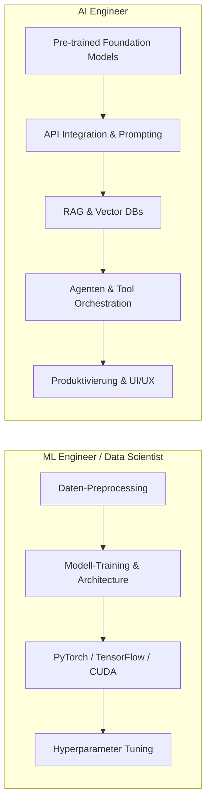
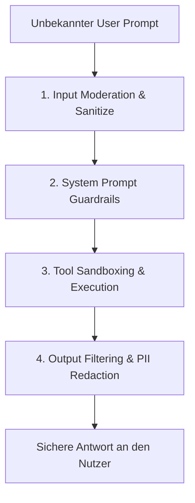
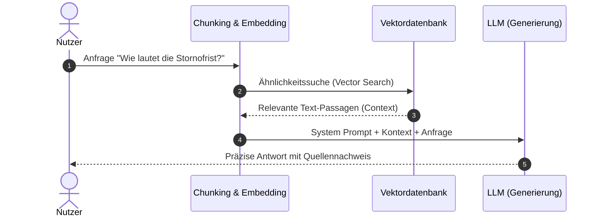

# AI Engineer – Das Praxis-Handbuch & Roadmap-Leitfaden

Der **AI Engineer** verbindet moderne Softwareentwicklung mit dem praktischen Einsatz künstlicher Intelligenz. Im Gegensatz zum klassischen *Machine Learning (ML) Engineer*, der primär Modelle trainiert und mathematische Architekturen entwirft, konzentriert sich der *AI Engineer* auf die Integration, Orchestrierung und produktive Bereitstellung von KI-Systemen, Foundation Models und agentischen Pipelines in Anwendungen.

Dieses Handbuch fasst das komplette Berufsbild, Plattformen, Modell-Ökosysteme, RAG-Pipelines, Vektordatenbanken, Sicherheit und multimodale Systeme praxisnah zusammen.

---

## 🚀 1. Rolle & Grundlagen des AI Engineers

### AI Engineer vs. ML Engineer



| Merkmal | AI Engineer | ML Engineer / Data Scientist |
|---|---|---|
| **Hauptfokus** | Anwendungsentwicklung, API-Integration, RAG & Agenten | Modellarchitektur, Training, Parameter-Optimierung |
| **Primäre Tools** | OpenAI/Anthropic APIs, LangChain, LlamaIndex, Vector DBs | PyTorch, TensorFlow, CUDA, Scikit-Learn |
| **Eingangsdaten** | Strukturierte/Unstrukturierte Prompts, JSON, Embeddings | Rohdaten, Tensor-Matrizen, Trainings-Datensätze |
| **Geschwindigkeit** | Extrem schnelle Prototyping- & Release-Zyklen | Längere Forschungs- & Trainingsphasen |

### Grundbegriffe (Common Terminology)
* **LLM (Large Language Model)**: Hochskalierte neuronale Netze zur Sprachverarbeitung (z. B. GPT-4o, Claude 3.7 Sonnet).
* **Inference (Inferenz)**: Das Ausführen des trainierten Modells zur Generierung von Antworten.
* **Embeddings**: Vektorrepräsentationen von Text, Bildern oder Audio in hochdimensionalen Räumen.
* **Vector Database**: Spezialisierte Datenbank zur Speicherung und Ähnlichkeitssuche von Vektoren.
* **RAG (Retrieval-Augmented Generation)**: Dynamische Anicherung von Prompts mit externem Wissen.
* **AI Agents**: Autonome Systeme mit Speicher, Planung und Werkzeug-Zugriff.

---

## 🌐 2. Pre-trained Models & Modell-Ökosysteme

Der AI Engineer wählt je nach Anwendungsfall das optimale Modell bezüglich Latenz, Kontextlänge, Datenschutz und Kosten aus:

### Proprietäre Cloud-Modelle (Closed Source)
* **OpenAI (GPT-4o, o1, o3-mini)**: Branchenstandard für komplexe Reasoning- und Function-Calling-Aufgaben.
* **Anthropic (Claude 3.7 Sonnet, Opus, Haiku)**: Führend bei Coding-Aufgaben, langen Kontexten und Prompt Caching.
* **Google (Gemini 1.5 Pro / Flash)**: Riesiges Kontextfenster (bis zu 2 Mio. Tokens) und native Multimodalität.
* **Hyperscaler Platforms**: Azure OpenAI Service, AWS Bedrock / SageMaker.

### Open-Source & Lokale Modelle
* **Modelle**: Llama 3.3 (Meta), Mistral / Mixtral, Qwen 2.5 (Alibaba), DeepSeek-R1.
* **Hugging Face Hub**: Zentrale Plattform für Open-Source-Modelle, Datasets und Spaces.
* **Lokale Execution (Ollama / vLLM)**: Ausführen von Modellen auf eigener Hardware via `ollama run llama3.3` oder vLLM für High-Throughput Inferenz.

=== "Ollama Python Execution"
    ```python
    import ollama

    response = ollama.chat(
        model='llama3.3',
        messages=[{'role': 'user', 'content': 'Erkläre RAG in 2 Sätzen.'}]
    )
    print(response['message']['content'])
    ```

=== "Transformers.js (Browser Execution)"
    ```javascript
    import { pipeline } from '@xenova/transformers';

    // Inferenz direkt im Browser/Node.js ausführen
    const extractor = await pipeline('feature-extraction', 'Xenova/all-MiniLM-L6-v2');
    const output = await extractor('AI Engineering ist die Zukunft.', { pooling: 'mean', normalize: true });
    ```

---

## 🔒 3. AI Safety, Sicherheit & Ethik

Die Absicherung von KI-Pipelines ist eine Kernverantwortung des AI Engineers.

### Sicherheitsrisiken & Best Practices



1. **Prompt Injection Attacks**:
   * *Direct Injection*: Der Nutzer versucht, den System-Prompt zu überschreiben.
   * *Indirect Injection*: Schadcode befindet sich in extern geladenen Dokumenten/Websites.
   * *Abhilfe*: Klare Trennung von System- und User-Prompts, Validierung aller Tool-Eingaben.
2. **OpenAI Moderation API & Guardrails**: Vorab-Prüfung von Inhalten auf Hassrede, Gewalt oder selbstgefährdende Inhalte.
3. **End-User IDs**: Anfügen transparenter User-IDs in API-Aufrufen zur Erkennung von Missbrauch durch Einzelnutzer.
4. **Data Privacy & PII Redaction**: Maskieren von personenbezogenen Daten (Namen, IBANs, Passwörter) vor der Modellanfrage.

---

## 📐 4. Embeddings & Vektordatenbanken

### Was sind Embeddings?
Embeddings wandeln unstrukturierte Daten (Text, Code, Audio, Bild) in hochdimensionale Vektoren (z. B. 1536 Dimensionen) um. Verwandte Begriffe liegen im Vektorraum nah beieinander.

#### Anwendungsfälle
* **Semantic Search**: Suche nach Bedeutung statt exakter Stichworttreffer.
* **Recommendation Systems**: Empfehlung ähnlicher Artikel oder Dokumente.
* **Anomaly Detection**: Erkennung von Abweichungen im Vektorraum.
* **Data Classification**: Zuordnung zu Kategorien ohne manuelles Regelwerk.

### Beliebte Vektordatenbanken im Vergleich

| Datenbank | Typ | Hauptanwendungsfall |
|---|---|---|
| **Chroma** | Open Source / Embedded | Lokale Entwicklung, schnelles Prototyping |
| **Qdrant** | Open Source / Rust | High-Performance, Filtermöglichkeiten, On-Premise/Cloud |
| **Pinecone** | Fully Managed Cloud | Enterprise Skalierung ohne Infrastruktur-Aufwand |
| **pgvector (PostgreSQL)** | DB-Erweiterung | Integration in bestehende relationalen SQL-Datenbanken |
| **FAISS (Meta)** | Library | In-Memory Ähnlichkeitssuche für große Datenmengen |

---

## 📚 5. RAG (Retrieval-Augmented Generation)

RAG verbindet externe Wissensquellen dynamisch mit Sprachmodellen, ohne dass ein teures Fine-Tuning nötig ist.

### Die RAG-Pipeline im Detail



### RAG vs. Fine-Tuning

| Kriterium | RAG (Retrieval-Augmented Generation) | Fine-Tuning |
|---|---|---|
| **Hauptzweck** | Zugriff auf dynamisches, aktuelles Wissen | Anpassung von Stil, Format oder spezifischem Verhalten |
| **Kosten** | Gering (Vektorsuche & API-Tokens) | Hoch (GPUs & Trainingsläufe) |
| **Aktualität** | Echtzeit (Datenbank-Update genügt) | Statisch (Erfordert Nachtraining) |
| **Halluzinationen** | Stark reduziert durch Belege | Kann weiterhin auftreten |

---

## 👁️ 6. Multimodale KI (Multimodal AI)

Moderne AI Engineers arbeiten nicht nur mit Text, sondern integrieren Bild, Audio und Video:

### Anwendungsfälle & APIs
* **Vision & Image Understanding** (GPT-4o Vision, Claude 3.7, Gemini): Analyse von Diagrammen, OCR von Dokumenten, Code-Generierung aus UI-Mocks.
* **Image Generation** (DALL-E 3, Midjourney, Flux, Stable Diffusion): Dynamische Generierung von Assets.
* **Audio Processing & Speech**:
  * *Speech-to-Text (STT)*: Whisper API / Faster-Whisper für Transkriptionen.
  * *Text-to-Speech (TTS)*: ElevenLabs, OpenAI Audio API für natürliche Sprachausgabe.

---

## 🛠️ 7. AI Code Editors & Entwickler-Tools

AI Engineers nutzen moderne Entwicklungs-Tools zur Beschleunigung eigener Workflows:
* **Cursor / Windsurf**: KI-native Code-Editoren mit tiefem Repository-Kontext.
* **Antigravity CLI / Claude Code**: Terminal-Agenten für automatisierte Workflows.
* **GitHub Copilot & Continue.dev**: Inline-Code-Vervollständigung und Chat in der IDE.

---

## 🔗 8. Verwandte Themen & Weiterführende Links
* [Zurück zur KI-Coding Übersicht](index.md)
* [AI Agents Praxis-Handbuch](ai-agents-praxis.md)
* [Claude Code Praxis-Handbuch](claude-code-praxis.md)
* [Lokales RAG & LLM-Serving](lokales-rag-ollama.md)
