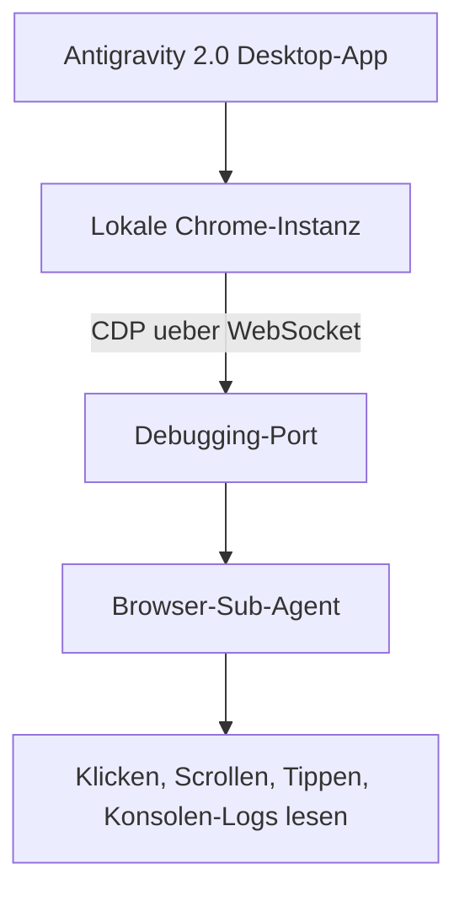

# Antigravity 2.0 im Browser nutzen

Antigravity 2.0 kann einen lokalen Chrome-Browser direkt steuern, um Web-Projekte zu testen, Dokumentation zu lesen und Browser-Aufgaben zu automatisieren. Dieses Kapitel erklärt den technischen Ansatz und den praktischen Einsatz.

---

## 🔌 Technischer Ansatz: Chrome DevTools Protocol

Anders als die Claude-in-Chrome-Erweiterung (siehe [Cowork im Browser](claude-cowork-browser-chrome-erweiterung.md)) arbeitet Antigravitys Browser-Agent direkt über das **Chrome DevTools Protocol (CDP)**:



- Antigravity verbindet sich über einen lokalen Debugging-Port per WebSocket mit der Chrome-Instanz.
- Für den vollständig verwalteten Browser-Modus ist zusätzlich eine kleine **Antigravity-Chrome-Erweiterung** erforderlich, die Chrome separat installiert sein voraussetzt.
- Wenn der Hauptagent eine Browser-Interaktion benötigt, ruft er einen spezialisierten **Browser-Sub-Agenten** auf.

---

## 🛠️ Fähigkeiten des Browser-Sub-Agenten

| Fähigkeit | Beschreibung |
|---|---|
| **Navigation** | Seiten öffnen, zwischen Tabs wechseln, Links folgen. |
| **Interaktion** | Klicken, Tippen, Scrollen, Formulare ausfüllen. |
| **Beobachtung** | Konsolen-Logs lesen, Netzwerk-Requests einsehen, Screenshots erstellen. |
| **Verifikation** | Prüfen, ob eine UI-Änderung wie erwartet gerendert wird. |

---

## 🧪 Praxisbeispiel: Automatisiertes UI-Testing

Das offizielle Google-Codelab „Automated UI Testing with Antigravity" kombiniert den Antigravity-CLI-Agenten mit **BrowserMCP** und **Playwright**:

```text
Implementiere die neue Checkout-Seite und verifiziere anschließend
im Browser, dass alle drei Zahlungsmethoden korrekt angezeigt werden
und die Bestätigungsseite nach dem Absenden erscheint.
```

1. Der Agent implementiert die Änderung im Code.
2. Der Browser-Sub-Agent öffnet die lokale Entwicklungsumgebung im verwalteten Chrome.
3. Er interagiert mit der Seite wie ein menschlicher Tester und prüft das Ergebnis.
4. Bei Abweichungen bessert der Hauptagent den Code nach, ohne dass manuell eingegriffen werden muss.

---

## ⚠️ Voraussetzungen und Grenzen

!!! warning "Chrome-Installation erforderlich"
    Der verwaltete Browser-Modus benötigt eine separate, lokale Chrome-Installation sowie die zugehörige Antigravity-Chrome-Erweiterung. Ohne diese Kombination steht die volle Browser-Steuerung nicht zur Verfügung.

- Der Browser-Agent arbeitet mit dem **lokalen** Chrome auf dem Rechner, auf dem die Desktop-App läuft – kein Cloud-Browser wie bei Cowork.
- Wie bei jedem Agenten mit Browserzugriff gilt: unbekannte Webseiten und Formulare vor dem automatisierten Ausfüllen prüfen, insbesondere bei folgenreichen Aktionen (Zahlungen, Absenden von Formularen mit personenbezogenen Daten).

---

## 🔗 Verwandte Themen

- [Ihr erstes Projekt mit Antigravity 2.0](antigravity-2-erstes-projekt.md)
- [Antigravity 2.0 in der Praxis anwenden](antigravity-2-praxis.md)
- [Empfohlene Tools und kostenlose Ressourcen](antigravity-2-tools-ressourcen.md)
- [Antigravity SDK & Managed Agents API](antigravity-2-sdk-managed-agents.md)
- [Antigravity 2.0 auf macOS, Windows und Linux](antigravity-2-plattformen.md)
- [Claude Cowork in Ihrem Browser nutzen (+Chrome-Erweiterung)](claude-cowork-browser-chrome-erweiterung.md) — der Vergleich zum Anthropic-Ansatz
