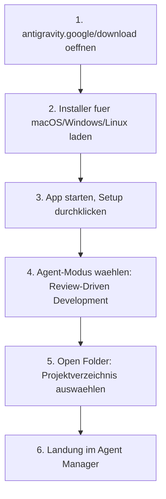

# Ihr erstes Projekt mit Antigravity 2.0 (Schritt für Schritt)

Dieses Kapitel führt durch die ersten Schritte mit **Antigravity 2.0**, Googles am 19. Mai 2026 auf der I/O vorgestellter Standalone-Plattform. Es baut auf der Einordnung in [Claude Cowork vs. Claude Code vs. Antigravity](claude-cowork-code-antigravity-vergleich.md) auf und übersetzt sie in eine konkrete Anleitung für die Desktop-App.

!!! note "Antigravity IDE vs. Antigravity 2.0"
    Die **Antigravity IDE** (VS-Code-Fork mit Editor- & Manager-View) bleibt Teil der Desktop-Erfahrung. **Antigravity 2.0** erweitert sie um systemweite Multi-Agent-Orchestrierung, Hintergrund-Scheduling und drei zusätzliche Plattform-Bausteine (CLI, SDK, Managed Agents API). Dieses Kapitel behandelt die Desktop-App; für den Terminal-Weg siehe die [Antigravity CLI 2 Tutorials](antigravity-cli.md).

---

## 🚀 Installation & erster Start



1. **Download:** Installer für das eigene Betriebssystem von `antigravity.google/download` laden – Antigravity 2.0 läuft nativ auf **macOS, Windows und Linux**.
2. **Setup durchlaufen:** Beim ersten Start fragt die App nach dem bevorzugten Agent-Modus. Für den Einstieg empfiehlt sich **Review-Driven Development** – Claude/Gemini schlägt Schritte vor, die vor Ausführung bestätigt werden.
3. **Projekt öffnen:** Über **Open Folder** ein oder mehrere Verzeichnisse als Projekt-Scope festlegen.
4. **Agent Manager:** Nach dem Öffnen landet man im Agent Manager – der zentralen Kommandozentrale für alle laufenden Agenten.

---

## 🗂️ Das Projekt-Konzept

Antigravity 2.0 arbeitet **projekt-zentriert**: Ein Projekt ist eine Konfiguration aus Ordnern, die Umgebung, Werkzeuge und Berechtigungen eines Agenten festlegt.

| Merkmal | Beschreibung |
|---|---|
| **Ein-Ordner-Projekt** | Klassischer Anwendungsfall: ein Repository, ein Agent. |
| **Mehr-Ordner-Projekt** | Ein Agent arbeitet über mehrere verwandte Verzeichnisse hinweg (z. B. Frontend- und Backend-Repo gemeinsam). |
| **Scope-Isolation** | Agenten erhalten nur Zugriff auf die im Projekt definierten Ordner, nicht auf das gesamte Dateisystem. |

---

## 🔎 Die Auxiliary Pane

Die **Auxiliary Pane** oben rechts zeigt alle vom Agenten erzeugten Artefakte:

- **Implementation Plan:** Die vom Agenten entworfene Lösungsstrategie vor der Umsetzung.
- **Task Plan:** Eine Schritt-für-Schritt-Aufgabenliste, die der Agent gemäß dem Implementation Plan abarbeitet.
- **Output-Protokoll:** Laufende Ausgaben, Befehle und Zwischenergebnisse während der Ausführung.

!!! tip "Review-Driven Development in der Praxis"
    Im Review-Driven-Modus hält der Agent vor kritischen Schritten an und präsentiert den Implementation Plan zur Freigabe – vergleichbar mit dem `/plan`-Modus des Antigravity CLI, aber visuell in der Auxiliary Pane statt im Terminal.

---

## 📋 Beispielprojekt: Bug-Fix mit Review

=== "Aufgabe"
    ```text
    Öffne das Projekt "webshop-frontend" und behebe den Fehler,
    dass der Warenkorb bei mehr als 10 Artikeln nicht mehr aktualisiert wird.
    ```

=== "Ablauf"
    1. Der Agent analysiert die Projektstruktur und identifiziert die betroffene Komponente.
    2. In der Auxiliary Pane erscheint ein Implementation Plan mit der vorgeschlagenen Lösung.
    3. Nach Freigabe erstellt der Agent den Task Plan und arbeitet ihn ab.
    4. Änderungen erscheinen als Diff im Editor – vor dem Übernehmen prüfbar.

=== "Nächster Schritt"
    Über den Agent Manager lässt sich ein zweiter Agent parallel auf ein anderes Projekt ansetzen, ohne die laufende Sitzung zu unterbrechen (siehe [Praxis-Kapitel](antigravity-2-praxis.md)).

---

## 🔗 Verwandte Themen

- [Antigravity 2.0 in der Praxis anwenden](antigravity-2-praxis.md)
- [Empfohlene Tools und kostenlose Ressourcen](antigravity-2-tools-ressourcen.md)
- [Antigravity 2.0 im Browser nutzen](antigravity-2-browser.md)
- [Antigravity SDK & Managed Agents API](antigravity-2-sdk-managed-agents.md)
- [Antigravity 2.0 auf macOS, Windows und Linux](antigravity-2-plattformen.md)
- [Claude Cowork vs. Claude Code vs. Antigravity](claude-cowork-code-antigravity-vergleich.md) — Einordnung ins Gesamtbild
- [Antigravity CLI 2 Tutorials](antigravity-cli.md) — der Terminal-Weg
