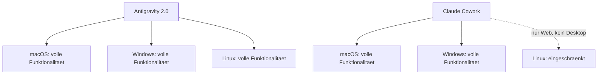
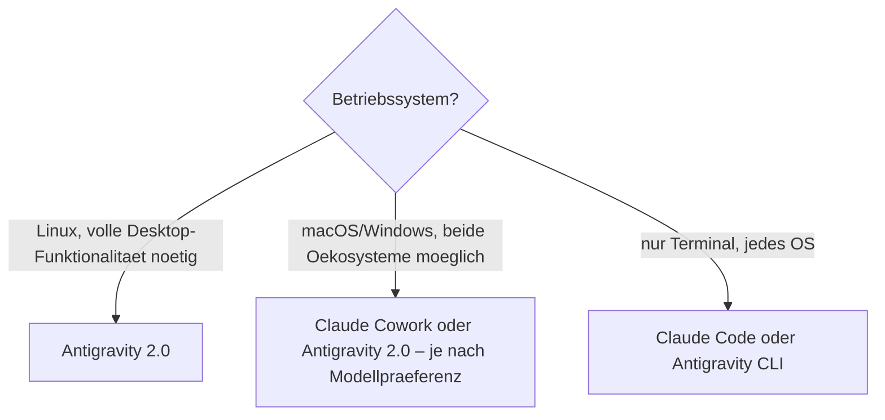

# Antigravity 2.0 auf macOS, Windows und Linux

Anders als Claude Cowork (siehe [Claude Cowork unter Linux](claude-cowork-linux.md)) hat Google Antigravity 2.0 von Anfang an als **plattformübergreifende** Desktop-App konzipiert. Dieses Kapitel fasst die Plattformverfügbarkeit zusammen.

---

## 🖥️ Offizielle Plattformunterstützung (Stand 08/2026)

| Plattform | Desktop-App | CLI (`agy`) | SDK |
|---|---|---|---|
| **macOS** | ✅ | ✅ | ✅ |
| **Windows** | ✅ | ✅ | ✅ |
| **Linux** | ✅ | ✅ | ✅ |

Alle drei Bausteine der Plattform – Desktop-App, Terminal-CLI und SDK – laufen nativ auf allen drei großen Betriebssystemen. Das unterscheidet Antigravity 2.0 deutlich von Claude Cowork, dessen volles Desktop-Erlebnis bislang auf macOS und Windows beschränkt bleibt.

---

## 📲 Mobile Begleitung

Für die mobile Steuerung bietet Google selbst kein offizielles Pendant zur Claude-Mobile-App (siehe [Claude Cowork vom Smartphone aus](claude-cowork-smartphone.md)). In der Community existieren einzelne inoffizielle Projekte, die Antigravity-Sitzungen aufs Smartphone spiegeln.

!!! warning "Inoffizielle Mobile-Erweiterungen mit Vorsicht behandeln"
    Community-Projekte, die Antigravity-Sitzungen per MCP oder OpenAPI aufs Smartphone spiegeln, stammen nicht von Google. Vor der Installation Quelle, Aktivität und angeforderte Berechtigungen prüfen – dieselbe Vorsicht gilt wie bei jeder Drittanbieter-Erweiterung mit Zugriff auf laufende Agenten-Sitzungen.

---

## 🧭 Was das für die Plattformwahl bedeutet

!!! tip "Fazit"
    Wer auf Linux entwickelt und ein visuelles Desktop-Werkzeug mit Multi-Agent-Orchestrierung sucht, ist bei **Antigravity 2.0** aktuell besser aufgehoben als bei Claude Cowork. Für reines Terminal-Arbeiten sind ohnehin sowohl [Claude Code](claude-code-praxis.md) als auch der [Antigravity CLI](antigravity-cli.md) plattformunabhängig nutzbar.

---

## 🔗 Verwandte Themen

- [Ihr erstes Projekt mit Antigravity 2.0](antigravity-2-erstes-projekt.md)
- [Antigravity 2.0 in der Praxis anwenden](antigravity-2-praxis.md)
- [Empfohlene Tools und kostenlose Ressourcen](antigravity-2-tools-ressourcen.md)
- [Antigravity 2.0 im Browser nutzen](antigravity-2-browser.md)
- [Antigravity SDK & Managed Agents API](antigravity-2-sdk-managed-agents.md)
- [Claude Cowork unter Linux](claude-cowork-linux.md) — der Vergleichsfall bei Anthropic
- [Claude Cowork vs. Claude Code vs. Antigravity](claude-cowork-code-antigravity-vergleich.md)
