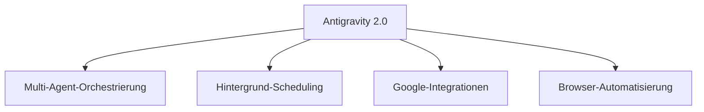

# Antigravity 2.0 in der Praxis anwenden

Nach dem [ersten Projekt](antigravity-2-erstes-projekt.md) zeigt dieses Kapitel, wofür sich die Multi-Agent-Orchestrierung und das Hintergrund-Scheduling von Antigravity 2.0 im Alltag eignen.

---

## 🗂️ Themenfelder im Überblick



---

## 🤖 Mehrere Agenten parallel orchestrieren

Der **Agent Manager** ist auf gleichzeitig laufende Agenten ausgelegt – anders als ein klassisches Terminal, das nur eine Sitzung im Fokus hat:

- Ein Agent refaktoriert das Backend, während ein zweiter parallel die Frontend-Tests aktualisiert.
- Ein Agent prüft offene Pull Requests auf Konsistenz, während ein anderer an einem neuen Feature arbeitet.
- Sub-Agenten für spezialisierte Teilaufgaben (z. B. ein Browser-Sub-Agent für UI-Tests) werden vom Hauptagenten bei Bedarf automatisch aufgerufen.

!!! tip "Wann sich Multi-Agent-Betrieb lohnt"
    Parallelisierung zahlt sich vor allem bei **unabhängigen** Teilaufgaben aus (unterschiedliche Module, unterschiedliche Dateien). Bei eng verzahnten Änderungen an denselben Dateien ist ein einzelner Agent mit vollem Kontext oft zuverlässiger.

---

## ⏰ Hintergrund-Scheduling

Antigravity 2.0 kann Aufgaben automatisch zu festgelegten Zeitpunkten starten, ohne dass die App aktiv bedient werden muss:

```text
Führe jeden Freitag um 16 Uhr die vollständige Test-Suite aus,
erstelle bei Fehlern einen Bug-Report mit Stacktrace und lege ihn
im Ordner "reports/" ab.
```

| Anwendungsfall | Beispiel |
|---|---|
| **Nächtliche Qualitätssicherung** | Linting, Tests und Sicherheits-Scans über Nacht laufen lassen, Ergebnis morgens im Report. |
| **Regelmäßige Abhängigkeits-Checks** | Wöchentlich prüfen, ob neue Versionen kritischer Pakete verfügbar sind. |
| **Wiederkehrende Refactoring-Pässe** | Nach jedem Merge in `main` automatisch nach Code-Duplikaten suchen lassen. |

---

## 🔌 Integration mit Google AI Studio, Android und Firebase

Die Desktop-App bindet drei Google-Ökosysteme direkt an:

- **Google AI Studio:** Prompts und Modellkonfigurationen lassen sich zwischen Antigravity 2.0 und AI Studio austauschen.
- **Android:** Für Android-Projekte greift Antigravity 2.0 auf Emulator- und Build-Tooling zu, um Änderungen direkt zu testen.
- **Firebase:** Backend-Dienste (Auth, Firestore, Hosting) lassen sich aus derselben Sitzung heraus konfigurieren und deployen.

---

## 🌐 Browser-gestützte Aufgaben

Für Web-Projekte kann ein Agent den Browser-Sub-Agent hinzuziehen, um Änderungen direkt visuell zu prüfen (Details im [Browser-Kapitel](antigravity-2-browser.md)):

```text
Implementiere das neue Login-Formular und prüfe anschließend im
Browser, ob die Validierungsfehler korrekt angezeigt werden.
```

---

## 🔗 Verwandte Themen

- [Ihr erstes Projekt mit Antigravity 2.0](antigravity-2-erstes-projekt.md)
- [Empfohlene Tools und kostenlose Ressourcen](antigravity-2-tools-ressourcen.md)
- [Antigravity 2.0 im Browser nutzen](antigravity-2-browser.md)
- [Antigravity SDK & Managed Agents API](antigravity-2-sdk-managed-agents.md)
- [Antigravity 2.0 auf macOS, Windows und Linux](antigravity-2-plattformen.md)
- [Claude Cowork vs. Claude Code vs. Antigravity](claude-cowork-code-antigravity-vergleich.md)
