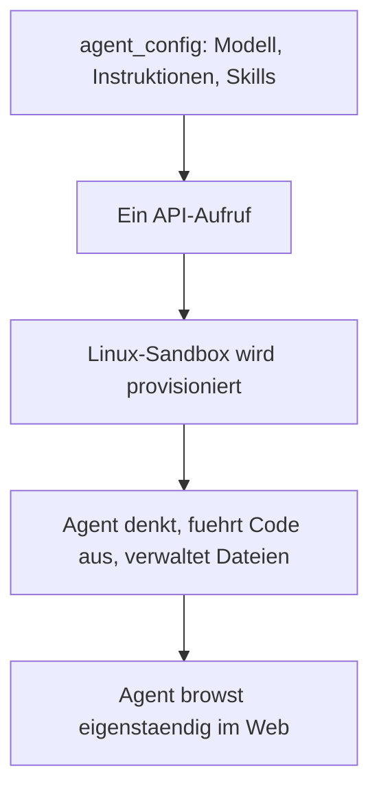

# Antigravity SDK & Managed Agents API

Neben Desktop-App und CLI bildet das **Antigravity SDK** die dritte Säule von Antigravity 2.0: eine programmatische Schnittstelle, um eigene Agenten als verwaltete Dienste auf der Gemini API zu betreiben – ohne eigene Infrastruktur.

---

## 🏗️ Architektur der Managed Agents API



Ein einzelner API-Aufruf provisioniert eine **Linux-Sandbox**, in der der Agent eigenständig denkt, Code ausführt, Dateien verwaltet und im Web recherchiert – vergleichbar mit einer Cloud-Version des Desktop-Agenten, aber vollständig programmatisch ansteuerbar.

---

## ⚙️ Eigenen Agenten konfigurieren

Das zugrunde liegende Modell (z. B. Gemini 3.7 Flash, Gemini 3.6 Flash oder Gemini 3.5 Flash) wird über `agent_config` festgelegt und lässt sich um eigene Instruktionen, Skills und Daten erweitern:

=== "Inline-Konfiguration (schnellster Einstieg)"
    Die Konfiguration wird direkt beim Erstellen einer neuen Interaktion mitgegeben – ohne separaten Registrierungsschritt. Geeignet für schnelle Prototypen und einmalige Aufgaben.

=== "Strukturiertes Verzeichnis (produktionsreif)"
    Die Agenten-Dateien (Instruktionen, Skills, Konfiguration) werden in einer versionierbaren Verzeichnisstruktur organisiert und beim Start in die Agentenumgebung eingebunden – geeignet für wiederverwendbare, teambasierte Agenten.

---

## 🧩 Anpassungsmöglichkeiten

| Baustein | Funktion |
|---|---|
| **Custom Functions** | Eigene Python-Funktionen einbinden, die der Agent bei Bedarf aufruft. |
| **Structured Outputs** | Ausgaben über Schemata an eigene Datentypen binden, statt Freitext zu parsen. |
| **MCP-Server** | Externe APIs und Datenbanken über das Model Context Protocol anbinden. |
| **Function Calling** | Eigene Funktionen als Werkzeuge registrieren, um den Agenten an bestehende Systeme anzuschließen. |

---

## 📋 Beispiel: Ein Recherche-Agent per API

```text
agent_config = {
  "model": "gemini-3.6-flash",
  "instructions": "Du bist ein Recherche-Agent für Markttrends.
                    Fasse Ergebnisse als strukturierte JSON-Liste zusammen.",
  "tools": ["web_search", "custom_function:save_to_database"]
}
```

Ein solcher Agent lässt sich per API-Aufruf in eine bestehende Anwendung integrieren – etwa als Backend-Dienst, der auf eingehende Anfragen mit einer eigenständigen Recherche antwortet, ohne dass ein Mensch die Desktop-App bedienen muss.

!!! tip "Verhältnis zur Desktop-App"
    Die Managed Agents API eignet sich für **automatisierte, wiederkehrende** Agentenaufgaben ohne menschliche Aufsicht im Loop. Für interaktive Entwicklungsarbeit mit Review-Schritten bleibt die Desktop-App (siehe [erstes Projekt](antigravity-2-erstes-projekt.md)) der bessere Einstieg.

---

## 🔗 Verwandte Themen

- [Ihr erstes Projekt mit Antigravity 2.0](antigravity-2-erstes-projekt.md)
- [Antigravity 2.0 in der Praxis anwenden](antigravity-2-praxis.md)
- [Empfohlene Tools und kostenlose Ressourcen](antigravity-2-tools-ressourcen.md)
- [Antigravity 2.0 im Browser nutzen](antigravity-2-browser.md)
- [Antigravity 2.0 auf macOS, Windows und Linux](antigravity-2-plattformen.md)
- [MCP-Server-Topliste](mcp-server-topliste.md)
