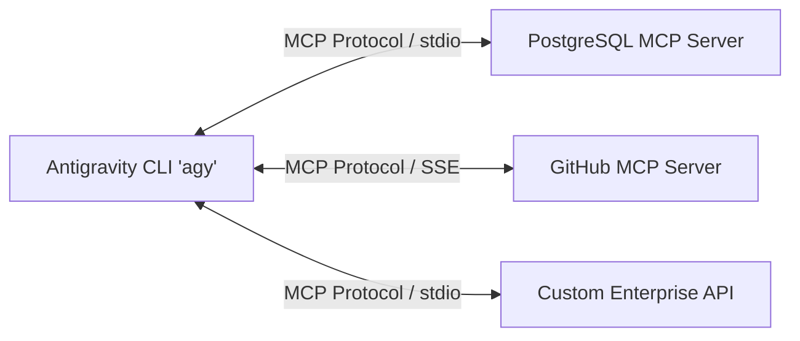

# Antigravity CLI 2 – Kapitel 9: Advanced Features – MCP, Headless-Mode, Git Worktrees & Security

In diesem finalen Kapitel behandeln wir die fortgeschrittenen Einsatzszenarien des **Antigravity CLI 2** (`agy`), darunter die Anbindung externer Tools via MCP, automatisierte CI/CD-Pipelines, Git Worktree Abspaltungen und Security Best Practices.

---

## 🔌 Connecting Tools with Model Context Protocol (MCP)

Das **Model Context Protocol (MCP)** ist ein offener Standard, der es dem Antigravity CLI 2 ermöglicht, sich nahtlos mit externen Datenquellen, Datenbanken, APIs und Drittanbieter-Diensten zu verbinden.



### Konfiguration von MCP-Servern

MCP-Server werden in der Datei `~/.gemini/antigravity-cli/settings.json` definiert:

```json
{
  "mcpServers": {
    "postgres-db": {
      "command": "npx",
      "args": ["-y", "@modelcontextprotocol/server-postgres", "postgresql://localhost:5432/production"]
    },
    "github": {
      "command": "npx",
      "args": ["-y", "@modelcontextprotocol/server-github"],
      "env": {
        "GITHUB_PERSONAL_ACCESS_TOKEN": "ghp_xxxxxxxxxxxx"
      }
    }
  }
}
```

Nach der Konfiguration stehen die Werkzeuge des MCP-Servers dem CLI-Agenten automatisch zur Verfügung. Status-Abfrage via `/mcp`.

---

## 🤖 Headless-Mode & CI/CD Pipelines

Der Antigravity CLI 2 kann vollautomatisiert ohne TUI in Continuous Integration (CI) Umgebungen ausgeführt werden.

### Beispiel: GitHub Actions Pipeline

```yaml
name: AI Code Audit & Doc Check
on: [push, pull_request]

jobs:
  antigravity-audit:
    runs-on: ubuntu-latest
    steps:
      - uses: actions/checkout@v4
      - name: Set up Python
        uses: actions/setup-python@v5
        with:
          python-version: '3.11'
          
      - name: Install Dependencies
        run: |
          python -m venv .venv
          .venv/bin/pip install -r requirements.txt
          
      - name: Run Antigravity CLI Audit
        env:
          ANTIGRAVITY_API_KEY: ${{ secrets.ANTIGRAVITY_API_KEY }}
        run: |
          npx @google/antigravity-cli --prompt "Überprüfe das Projekt auf fehlerhafte Links und führe .venv/bin/zensical build aus"
```

---

## 🌳 Git Worktrees & Agent Teams

Für parallele Entwicklungsvorhaben kann der Antigravity CLI 2 **Git Worktrees** nutzen. Dadurch arbeitet der Agent auf einem isolierten Checkout des Quellcodes, während Sie auf Ihrem Haupt-Branch ungestört weiterarbeiten.

```bash
# Agenten auf einem neuen Git-Worktree ausführen
agy --branch feature/neue-authentifizierung
```

### Agent Teams (Multi-Agent Orchestrierung)
Kombinieren Sie spezialisierte Subagenten (z. B. `Code-Architect`, `Security-Auditor`, `Test-Runner`) zu einem aufeinander abgestimmten **Agent Team**, um komplexe Releases autonom vorzubereiten.

---

## 🛡️ Security Best Practices

1. **Vermeiden Sie Wildcard-Berechtigungen**:
   Erteilen Sie niemals Schreibrechte auf systemweiten Pfaden (`/`, `/usr`, `~`). Restrikten Sie Schreib-Rechte immer auf das aktuelle Projektverzeichnis.
2. **Keine Klartext-Secrets im Code oder Prompt**:
   Verwenden Sie Umgebungsvariablen für API-Schlüssel und Sensitive Data.
3. **Regelmäßige Audits durchführen**:
   Nutzen Sie `/permissions` und prüfen Sie die Protokollierung in `.system_generated/logs/transcript.jsonl`.

---

## 🔗 Verwandte Themen
- [Kapitel 1: Einführung & Grundlagen](antigravity-cli-einfuehrung-grundlagen.md)
- [Kapitel 6: Subagenten Orchestrierung](antigravity-cli-subagents.md)
- [Kapitel 8: Kontext-Management & Performance](antigravity-cli-kontext-performance.md)
- [Antigravity CLI Handbuch & Roadmap](antigravity-cli-roadmap-handbuch.md)
