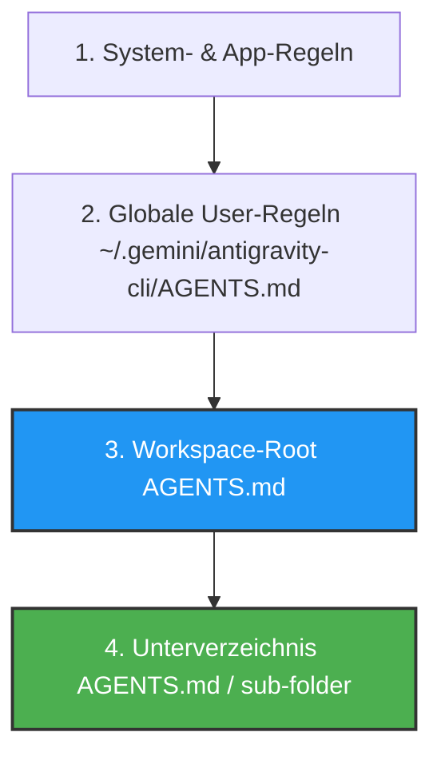

# Antigravity CLI 2 – AGENTS.md Struktur & Standorte

Die Datei **`AGENTS.md`** ist das zentrale Steuerungselement des Antigravity CLI (`agy`). Sie definiert verbindliche Regeln, Befehlsstrukturen, Code-Konventionen und Sicherheitsschranken für KI-Agenten, die in einem Projekt arbeiten.

---

## 📍 Standorte & Hierarchie von `AGENTS.md`

Der Antigravity CLI sucht und kombiniert `AGENTS.md`-Dateien auf verschiedenen Ebenen des Dateisystems. Bei widersprüchlichen Anweisungen gilt eine klare Prioritätenordnung (Precedence).



### Die vier Standorte im Detail

1. **System- & Builtin-Regeln**:
   - Fest im Antigravity CLI verankert. Definieren grundlegende Sicherheitsbarrieren und Standardwerkzeuge.
2. **Globale Benutzer-Regeln (`~/.gemini/antigravity-cli/AGENTS.md`)**:
   - Gilt für **alle** CLI-Sitzungen des Benutzers auf dem lokalen System. Ideal für persönliche Vorlieben (z. B. Sprachbevorzugung Deutsch, bevorzugte Linter oder Shell-Flags).
3. **Workspace-Root (`<project-root>/AGENTS.md`)**:
   - Gilt projektspezifisch für das gesamte Repository. Wird im Versionskontrollsystem (Git) eingecheckt, damit das gesamte Team dieselben KI-Regeln nutzt.
4. **Unterverzeichnis-Regeln (`<project-root>/<subfolder>/AGENTS.md`)**:
   - Gilt spezifisch für ein Teilprojekt oder ein Modul (z. B. Frontend, Backend oder Dokumentation). Überschreibt oder erweitert die Workspace-Regeln für diesen spezifischen Pfad.

!!! note "Vererbung & Priorität"
    Spezifischere Regeln (Unterverzeichnis > Workspace > Global) überschreiben allgemeinere Regeln. Dadurch können Sie allgemeine Standards auf Projekt-Ebene festlegen und in Unterordnern spezielle Vorgaben durchsetzen.

---

## 🏗️ Professionelle Strukturierung von `AGENTS.md`

Eine gut strukturierte `AGENTS.md` ist übersichtlich in logische Abschnitte unterteilt. Verwenden Sie klare Markdown-Überschriften und Bullet-Points.

### Empfohlener Aufbau einer `AGENTS.md`

```markdown
# AGENTS.md – Projektregeln für Antigravity CLI

## 1. Projektübersicht & Architektur
- **Technologie-Stack**: Python 3.11, Zensical, FastAPI
- **Sprache**: Deutsch für Dokumentation, Englisch für Quellcode/Kommentare
- **Architektur-Muster**: Modulare Monolith-Struktur

## 2. Befehle & Workflows (Commands)
```bash
.venv/bin/pip install -r requirements.txt  # Setup
.venv/bin/zensical build                   # Validierung / Build
npm run ver                                # Deployment
```

## 3. Zwingende Richtlinien (Do's & Don'ts)
- ✅ **Erforderlich**: Nach jeder Codeänderung `.venv/bin/zensical build` zur Validierung ausführen.
- ❌ **VERBOTEN**: Niemals `mkdocs build` oder `mkdocs serve` aufrufen.
- ❌ **VERBOTEN**: Keine hartkodierten API-Keys im Code ablegen.

## 4. Code- & Dateikonventionen
- Dateinamen: `kebab-case.md` für Dokumente, `snake_case.py` für Python.
- Interne Verlinkung: Ausschließlich **relative Markdown-Links** nutzen.
- Fehlerbehandlung: Keine Ausnahmen stumm abfangen (`except: pass`).

## 5. Werkzeug- & Berechtigungsgrenzen
- Schreibzugriffe sind auf das Verzeichnis `docs/` und `src/` beschränkt.
- Datenbank-Migrationen dürfen nur nach Rückfrage beim Benutzer gestartet werden.
```

---

## 🛠️ Praxis-Beispiele für verschiedene Projekttypen

=== "Dokumentations-Projekt (Zensical / MkDocs)"
    ```markdown
    # AGENTS.md – Zensical Dokumentations-Regeln

    ## Build-Befehle
    - Build-Test: `.venv/bin/zensical build`
    - Lokaler Server: `.venv/bin/zensical serve`

    ## Regeln für Markdown
    - Verwende Admonitions auf Deutsch: `!!! note "Hinweis"`, `!!! tip "Tipp"`.
    - Diagramme mittels Mermaid ` ```mermaid ` einbinden.
    - Alle Dateipfade in relativer Form verlinken.
    ```

=== "Python / FastAPI Backend"
    ```markdown
    # AGENTS.md – FastAPI Regeln

    ## Test & Linting
    - Tests ausführen: `pytest tests/`
    - Linting: `ruff check src/`
    - Typ-Prüfung: `mypy src/`

    ## Sicherheitsregeln
    - Änderungen an `auth.py` müssen immer Unit-Tests in `tests/test_auth.py` enthalten.
    ```

---

## 💡 Best Practices zur Pflege von `AGENTS.md`

1. **Halten Sie Regeln prägnant**: KI-Modelle verarbeiten kurze, eindeutige Anweisungen besser als lange Fließtexte.
2. **Nutzen Sie klare Ausrufezeichen & Aufzählungspunkte**: Fetten Sie verbotene Befehle (z. B. `❌ **VERBOTEN**`) deutlich.
3. **Checken Sie `AGENTS.md` in Git ein**: So arbeiten alle Entwickler:innen und der Antigravity CLI mit identischen Leitplanken.
4. **Verwenden Sie den `/learn` Slash-Command**: Wenn der Agent eine Korrektur durchführt, können Sie mit `/learn` die neue Regel direkt in `AGENTS.md` übernehmen lassen.

---

## 🔗 Verwandte Themen
- [Antigravity CLI Übersicht](antigravity-cli.md)
- [Skills & Skill-Entwicklung](antigravity-cli-skills.md)
- [Subagenten & Multi-Agenten Orchestrierung](antigravity-cli-subagents.md)
- [Handbuch & Agenten-Roadmap](antigravity-cli-roadmap-handbuch.md)
