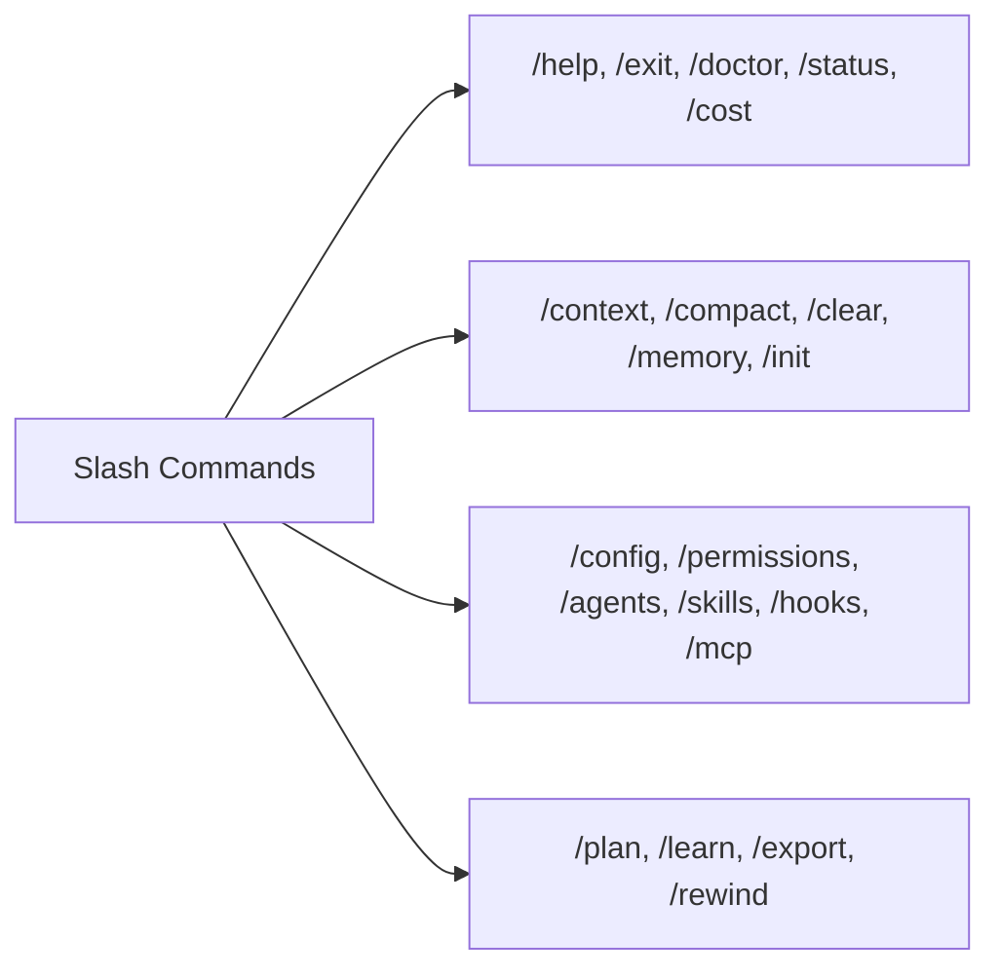

# Antigravity CLI 2 – Kapitel 2: Befehle, TUI & Cheatsheet

Dieses Kapitel bietet eine vollständige Befehlsreferenz für den **Antigravity CLI 2** (`agy`), inklusive aller Tastenkürzel, CLI-Flags, Slash-Commands und Session-Befehle.

---

## ⌨️ Tastenkürzel & Eingabe-Präfixe (Shortcuts & Prefixes)

In der interaktiven Terminal-Oberfläche (TUI) stehen Ihnen folgende Hotkeys zur Verfügung:

| Tastenkürzel | Funktion |
|---|---|
| `Ctrl+C` | Laufende Generierung oder aktuellen Tool-Aufruf abbrechen. |
| `Ctrl+R` | Befehlshistorie durchsuchen. |
| `Esc` / `Esc+Esc` | Fokus zwischen Chat-Eingabefeld und Ausgabeelementen wechseln. |
| `Shift+Tab` | Zeilenumbruch im Eingabefeld einfügen (Multi-Line Prompting). |

### Präfix-Zeichen in der Eingabe

- **`!` (Shell-Befehl)**: Führt den nachfolgenden Text direkt in der lokalen Bash-Shell aus (z. B. `!git status`).
- **`\` (Multi-Line Escaping)**: Erlaubt das Verfassen mehrzeiliger Prompts.
- **`@` (Datei-Erwähnung)**: Bindet den Inhalt einer spezifischen Datei direkt in den Kontext ein (z. B. `@src/auth.py Überprüfe die Validierung`).

---

## 🚀 CLI-Startflaggen (Command-Line Flags)

Der Aufruf von `agy` im Terminal unterstützt verschiedene Befehlszeilenparameter:

```bash
# Standard-Start der interaktiven TUI
agy

# Prompt direkt übergeben (Non-Interactive / Headless)
agy --prompt "Analysiere den Code und erstelle Unit-Tests"

# Kürzel-Form für direkte Prompt-Ausführung
agy -p "Führe .venv/bin/zensical build aus"

# Bestehende Sitzung fortsetzen
agy --resume <session-id>
agy -r <session-id>

# Arbeitsbereich um ein zusätzliches Verzeichnis erweitern
agy --add-dir /pfad/zum/weiteren/repo
```

---

## 📋 Slash-Commands Übersicht

Slash-Commands werden direkt im TUI-Chat eingegeben und beginnen mit einem Schrägstrich `/`.



### 1. System- & Diagnose-Befehle

- `/help`: Zeigt die Liste aller verfügbaren Befehle an.
- `/status`: Zeigt den aktuellen Systemstatus, Modell-Informationen und Ausführungsmodi.
- `/cost` / `/usage`: Zeigt den verbrauchten Token-Stand und die geschätzten API-Kosten der Sitzung.
- `/doctor`: Führt eine Selbstdiagnose durch (Prüfung von Netzwerk, API-Keys, Sandbox-Rechten und Tools).
- `/exit` oder `/quit`: Beendet die `agy`-Sitzung.

### 2. Kontext- & Speicher-Befehle

- `/context`: Detaillierte Ansicht des aktuellen Kontextfensters und aller geladenen Dateien.
- `/compact`: Komprimiert den bisherigen Gesprächsverlauf zur Token-Ersparnis.
- `/clear`: Setzt das Chat-Fenster zurück (löscht den Arbeits-Kontext).
- `/memory`: Zeigt projektspezifisches Langzeitwissen des Agenten.
- `/init`: Erstellt eine initiale `AGENTS.md`-Vorlage im aktuellen Arbeitsverzeichnis.

### 3. Konfigurations- Befehle

- `/config`: Öffnet die Einstellungen (`settings.json`).
- `/permissions`: Verwalte aktive Sandbox- und Dateiberechtigungen.
- `/agents`: Übersicht über aktive Subagenten.
- `/skills`: Übersicht über geladene Skills.
- `/hooks`: Übersicht über registrierte Event-Hooks.
- `/mcp`: Status der aktiven Model Context Protocol Server.

### 4. Workflow- & Aktions-Befehle

- `/plan <Ziel>`: Aktiviere den interaktiven Plan-Modus.
- `/learn`: Speichert eine nützliche Erkenntnis oder Benutzerkorrektur in `AGENTS.md`.
- `/export`: Exportiert das aktuelle Sitzungsprotokoll als Markdown-Datei.
- `/rewind`: Macht die letzten Agenten-Aktionen schrittweise rückgängig.

---

## 🔗 Verwandte Themen
- [Kapitel 1: Einführung & Grundlagen](antigravity-cli-einfuehrung-grundlagen.md)
- [Kapitel 3: Workflow & Sessions](antigravity-cli-workflow-sessions.md)
- [Antigravity CLI Handbuch & Roadmap](antigravity-cli-roadmap-handbuch.md)
