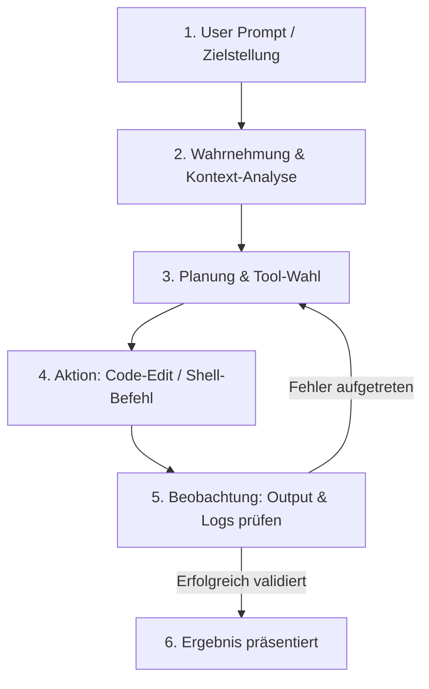

# Antigravity CLI 2 – Kapitel 1: Einführung & Grundlagen

Willkommen zum ersten Kapitel des Tutorials zum **Antigravity CLI 2** (`agy`). Dieses Kapitel führt Sie in die Grundlagen der agentischen Softwareentwicklung ein, erklärt Kernkonzepte wie Vibe Coding und den Agentic Loop und zeigt das Setup sowie die Modell-Auswahl.

---

## 🎯 Vibe Coding, Coding Agenten & Agentic Loop

### What is Vibe Coding?
**Vibe Coding** bezeichnet die moderne Art der Softwareentwicklung, bei der Entwickler:innen die Rolle von KI-Dirigenten einnehmen. Statt jede Zeile Code manuell zu tippen, beschreiben Sie dem Agenten Ziele, Architekturwünsche und Systemvorgaben in natürlicher Sprache. Der Antigravity CLI setzt diese Vorstellungen iterativ in voll funktionsfähigen Code um.

### What is a Coding Agent?
Ein **Coding Agent** unterscheidet sich grundlegend von klassischen Autovervollständigungen (wie Copilot Inline Completion). Ein Agent besitzt:
- **Autonomie**: Er plant mehrstufige Arbeitsabläufe selbstständig.
- **Werkzeugzugriff**: Er kann Dateien im Projekt lesen, schreiben und durchsuchen sowie Shell-Befehle (Compiler, Linter, Tests) ausführen.
- **Fehlerkorrektur**: Er analysiert Build- und Testfehler automatisch und bessert den Code selbst nach.

### What is the Agentic Loop?
Der **Agentic Loop** ist der kontinuierliche Denk- und Handlungszyklus des Antigravity CLI 2:



---

## 💻 Nutzungsarten des Antigravity CLI 2

Der Antigravity CLI lässt sich flexibel in bestehende Entwickler-Workflows integrieren:

1. **Terminal / TUI (`agy`)**:
   - Die bevorzugte interaktive Schnittstelle im Terminal. Bietet Rich-Text-Ausgaben, Tastenkürzel und Slash-Commands.
2. **Headless / Non-Interactive Mode (`agy --prompt "..."`)**:
   - Ausführung im Hintergrund oder in CI/CD-Pipelines (z. B. GitHub Actions) für automatische Audits, Refactorings oder Release-Validierungen.
3. **Integration mit Antigravity IDE & 2.0 Desktop App**:
   - Nahtloser Austausch von Sitzungen und Kontexten zwischen Terminal, VS Code Fork und Desktop-App.

---

## ⚙️ Setup & Modell-Auswahl

### Installation & Authentifizierung

```bash
# Antigravity CLI starten
agy

# Aufruf mit direkter Prompt-Übergabe
agy --prompt "Analysiere das Repository und erstelle eine Übersicht"
```

Beim ersten Start führt `agy` durch den geführten Authentifizierungsprozess (via Google Cloud / Vertex AI Account).

---

## 🧠 Modell-Differenzierung & Thinking Effort

Der Antigravity CLI 2 unterstützt verschiedene LLM-Modellstufen für unterschiedliche Anforderungen:

| Modell-Stufe | Eigenschaften | Empfohlener Einsatzbereich |
|---|---|---|
| **Gemini 3.5 Pro** | Höchste Denkleistung, tiefes Architekturverständnis | Komplexes Refactoring, `/plan`-Modus, schwierige Bugs |
| **Gemini 3.5 Flash** | Ausgewogen, sehr schnell, geringe Latenz | Standard-Coding, Datei-Erstellung, TUI-Interaktion |
| **Gemini 3.5 Flash-Lite** | Extrem schnell, token-sparend | Schnelle Codebase-Recherchen, simple Suchen |

!!! tip "Thinking Modes & Effort Control"
    Sie können den Denkaufwand (Thinking Effort) des Agenten steuern. Für knifflige mathematische Logik oder tief verschachtelte Algorithmen wählt der Agent automatisch einen höheren Reasoning-Level.

---

## 🔗 Verwandte Themen
- [Kapitel 2: CLI Befehle & TUI Cheatsheet](antigravity-cli-befehle-tui-cheatsheet.md)
- [Kapitel 3: Workflow & Sessions](antigravity-cli-workflow-sessions.md)
- [Antigravity CLI Handbuch & Roadmap](antigravity-cli-roadmap-handbuch.md)
