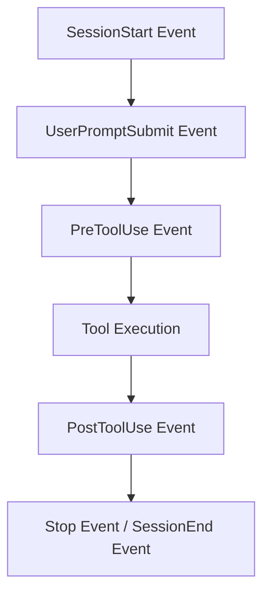

# Antigravity CLI 2 – Kapitel 7: Hooks, Lifecycle Events & Automatisierung

**Hooks** ermöglichen es Entwickler:innen, den Antigravity CLI 2 (`agy`) an entscheidenden Punkten im Ausführungszyklus zu erweitern. Sie führen automatisch benutzerdefinierte Skripte oder Befehle aus, sobald spezifische Ereignisse (Events) eintreten.

---

## ⚡ Lifecycle Event Übersicht

Ein Lifecycle Event bezeichnet ein bestimmtes Phänomen während des Agenten-Betriebs.



### Die wichtigsten Hook Events

1. **`SessionStart`**:
   - Wird sofort beim Starten einer neuen `agy`-Sitzung ausgelöst. Ideal zum Prüfen von Umgebungsvariablen oder zum Vorbereiten von Abhängigkeiten.
2. **`UserPromptSubmit`**:
   - Wird aufgerufen, wenn der Benutzer eine neue Anfrage im Chat abschickt, bevor das LLM antwortet. Ideal zum Prüfen von Passwörtern/Secrets im Prompt.
3. **`PreToolUse`**:
   - Wird unmittelbar **vor** der Ausführung eines Werkzeugs (z. B. `run_command` oder `replace_file_content`) getriggert. Kann Werkzeuge abfangen oder Parameter modifizieren.
4. **`PostToolUse`**:
   - Wird unmittelbar **nach** Abschluss eines Werkzeugs getriggert. Perfekt für automatische Formatierung (z. B. Prettier/Ruff nach Dateiedits).
5. **`Stop`**:
   - Wird ausgelöst, wenn eine Ausführung durch den Benutzer manuell abgebrochen wird.
6. **`SessionEnd`**:
   - Wird beim geordneten Beenden des Antigravity CLI aufgerufen. Ideal zum Aufräumen von temporären Dateien.

---

## 🛠️ Hook-Typen & Konfiguration

Hooks werden in der Datei `~/.gemini/antigravity-cli/settings.json` oder projektspezifisch in `.gemini/config.json` definiert.

### Beispiel: PostToolUse Hook für automatischen Linter

```json
{
  "hooks": {
    "PostToolUse": [
      {
        "matcher": {
          "tool": "replace_file_content",
          "file_pattern": "*.py"
        },
        "command": "ruff format ${file_path}"
      }
    ]
  }
}
```

---

## 📥 Hook Inputs & Outputs

Wenn ein Hook ausgeführt wird, übergibt der Antigravity CLI wichtige Kontextdaten als Umgebungsvariablen oder JSON-Input über `stdin`:

- `${file_path}`: Der Pfad der bearbeiteten Datei.
- `${tool_name}`: Der Name des aufgerufenen Werkzeugs.
- `${user_prompt}`: Der ursprüngliche Benutzertext.

### Exit-Codes & Kontrollfluss

- **Exit Code 0**: Der Hook wurde erfolgreich ausgeführt. Der Agent setzt seine Arbeit fort.
- **Exit Code 1+ (Fehler)**: Der Hook bricht ab. Im Falle eines `PreToolUse`-Hooks wird die Werkzeugausführung verhindert.

---

## 💡 Praxis-Anwendungsfälle für Hooks

1. **Automatischer Code-Formatter**:
   Führe nach jeder Änderung an TypeScript- oder Python-Dateien automatisch `prettier` oder `ruff` aus.
2. **Secret-Scanning im Prompt**:
   Verhindere, dass versehentlich AWS-Keys oder Passwörter im `UserPromptSubmit`-Event an das LLM gesendet werden.
3. **Build-Validierung**:
   Führe nach Datei-Modifikationen in Dokumentationsprojekten automatisch den Build-Befehl aus.

---

## 🔗 Verwandte Themen
- [Kapitel 1: Einführung & Grundlagen](antigravity-cli-einfuehrung-grundlagen.md)
- [Kapitel 3: Workflow & Sessions](antigravity-cli-workflow-sessions.md)
- [Kapitel 8: Kontext-Management & Performance](antigravity-cli-kontext-performance.md)
- [Antigravity CLI Handbuch & Roadmap](antigravity-cli-roadmap-handbuch.md)
