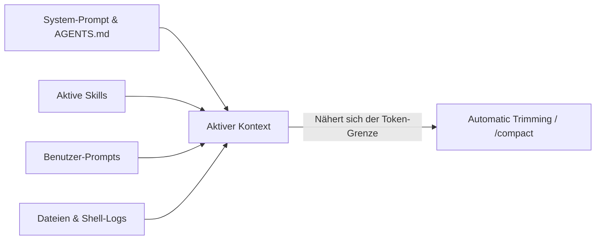

# Antigravity CLI 2 – Kapitel 8: Kontext-Management, Token-Effizienz & Performance

Ein kluges **Kontext-Management** ist der Schlüssel für lange, stabile und kosteneffiziente Sitzungen mit dem Antigravity CLI 2 (`agy`). In diesem Kapitel erfahren Sie, wie der Agent Kontext verarbeitet und wie Sie die Performance maximieren.

---

## 🧠 Wie der Antigravity CLI 2 Kontext verwaltet

Jede Interaktion (Prompts, Dateiinhalte, Werkzeugausgaben und Systemantworten) verbraucht Speicherplatz im Kontextfenster des LLMs. 

---

## 🛠️ Befehle zur Kontext-Steuerung

### 1. Token-Verbrauch prüfen (`/context` & `/usage`)
Mit `/context` sehen Sie exakt, welche Dateien geladen sind und wie viele Tokens die aktuellen System-Prompts, Skills und Verlaufselemente belegen. `/usage` zeigt die akkumulierten Kosten der Sitzung.

### 2. Komprimieren des Verlaufs (`/compact`)
Wenn eine Sitzung sehr lang wird, führt `/compact` eine intelligentes Summarization durch. Wichtige Architekturentscheidungen und Zwischenergebnisse bleiben erhalten, während alte Werkzeugausgaben und ausführliche Logs verworfen werden.

### 3. Zurücksetzen des Arbeitsbereichs (`/clear`)
Starten Sie für eine völlig neue, unzusammenhängende Aufgabe mit `/clear`. Dies leert den Kontextsicherheitsraum vollständig und verhindert Verwirrung durch alte Projektkontexte.

---

## ⚡ Prompt Caching & Effizienz-Techniken

### Prompt Caching
Der Antigravity CLI 2 nutzt fortgeschrittenes **Prompt Caching**. Statische Kontextinhalte (wie das System-Prompt, geladene `AGENTS.md`-Regeln und aktivierte Skills) werden im Modell gecached. Dadurch sinken die Latenzzeiten bei Folgefragen um bis zu 80 % und die API-Kosten werden drastisch reduziert.

### 4 Goldene Regeln für maximale Performance

1. **Gezielte Dateieinbindungen via `@`**:
   Statt den Agenten das gesamte Repository durchsuchen zu lassen, nennen Sie relevante Dateien direkt (z. B. `@src/api/users.py`).
2. **Nutze Subagenten für aufwendige Suchen**:
   Delegieren Sie riesige Log-Analysen oder Repository-weite Suchen an Subagenten mit dem schnellen `flash`-Modell. Der Subagent liefert nur die Zusammenfassung zurück.
3. **Behalte Erweiterungen & Plugins im Blick**:
   Jeder aktive MCP-Server injiziert Tool-Definitionen in den System-Prompt. Deaktivieren Sie nicht benötigte MCP-Plugins.
4. **Regelmäßiges Komprimieren (`/compact`)**:
   Führen Sie bei längeren Refactoring-Sitzungen nach jedem erreichten Meilenstein `/compact` aus.

---

## 🔗 Verwandte Themen
- [Kapitel 2: CLI Befehle & TUI Cheatsheet](antigravity-cli-befehle-tui-cheatsheet.md)
- [Kapitel 6: Subagenten Orchestrierung](antigravity-cli-subagents.md)
- [Kapitel 9: Advanced Features – MCP, CI/CD & Security](antigravity-cli-advanced-mcp-cicd.md)
- [Antigravity CLI Handbuch & Roadmap](antigravity-cli-roadmap-handbuch.md)
