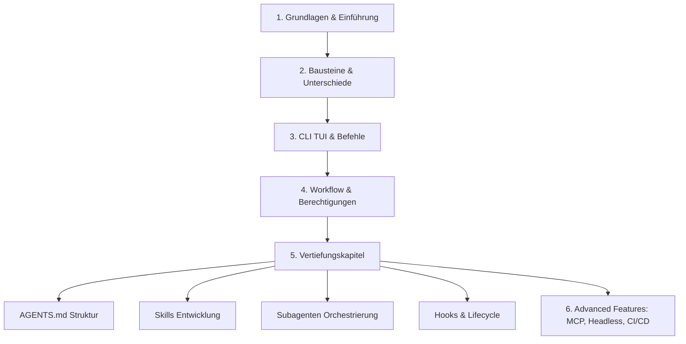

# Antigravity CLI 2 – Das umfassende Entwickler-Handbuch & Roadmap

Dieses Handbuch ist die ultimative Referenz für den **Antigravity CLI 2** (`agy`). Es baut auf der architektonischen Agenten-Roadmap auf und übersetzt alle Konzepte in praxistaugliche, deutsche Anleitungen.

---

## 🗺️ Antigravity CLI 2 Architektur-Roadmap



---

## 1. 🚀 Grundlagen & Einführung

### Was ist Vibe Coding?
**Vibe Coding** beschreibt eine Entwicklungsphilosophie, bei der Entwickler:innen die High-Level-Architektur und Problemstellung in natürlicher Sprache beschreiben, während der KI-Agent den Quellcode generiert, testet und refaktoriert.

### Was ist ein Coding Agent?
Ein **Coding Agent** ist nicht bloß ein Autovervollständiger, sondern ein autonomer Partner. Der Antigravity CLI 2 besitzt direkte Lese- und Schreibrechte im Dateisystem, führt Shell-Befehle aus und reagiert auf Feedback.

### Was ist der Agentic Loop?
Der **Agentic Loop** beschreibt die kontinuierliche Iterationsschleife des CLI-Agenten:
1. **Perceive**: Anweisung lesen & Projektkontext analysieren.
2. **Plan**: Lösungsstrategie oder `/plan` erstellen.
3. **Act**: Code-Änderung oder Befehl ausführen (`replace_file_content`, `run_command`).
4. **Observe**: Ausgaben, Fehlermeldungen oder Build-Status auswerten.
5. **Iterate**: Bei Fehlern selbstständig nachbessern, bis das Ziel erreicht ist.

---

## 2. ⚡ Bausteine & Unterschiede im Überblick

| Komponente | Funktion |
|---|---|
| **`AGENTS.md`** | Projektregeln, Verbotene Befehle & Architektur-Vorgaben. |
| **`Skills`** | Wiederverwendbare Prozeduren, Skripte & Vorlagen in `.gemini/skills/`. |
| **`Context`** | Aktueller Gesprächs- & Dateiverlauf inkl. Transkripten. |
| **`Modes`** | Betriebsarten wie Chat, Plan-Modus (`/plan`) oder Non-Interactive. |
| **`Tools`** | Integrierte Systemwerkzeuge (`run_command`, `view_file`, `grep_search` etc.). |
| **`MCP`** | Model Context Protocol zur Anbindung externer APIs & Datenbanken. |
| **`Hooks`** | Event-Trigger für Skripte vor/nach Werkzeugaufrufen. |
| **`Subagents`** | Delegierbare Hintergrund-Agenten mit eigener Rolle & Workspace. |

---

## 3. ⌨️ CLI TUI, Tastenkürzel & Slash-Befehle

### Tastenkürzel & Präfixe

- `Ctrl+C`: Aktuelle Generierung oder Befehl abbrechen.
- `Ctrl+R`: Befehlshistorie durchsuchen.
- `Esc + Esc`: Zwischen Chat-Eingabe und TUI-Panels wechseln.
- `Shift+Tab`: Multi-Line Eingabemodus umschalten.
- `!` (Präfix): Direkte Shell-Befehlsausführung.
- `@` (Präfix): Erwähnung und Einbindung spezifischer Dateien im Prompt.

### Slash-Commands Cheatsheet

=== "Kernbefehle"
    - `/help`: Übersicht aller verfügbaren Befehle und Parameter anzeigen.
    - `/plan <Ziel>`: Den strukturierten Plan-Modus zur Arbeitsvorbereitung aktivieren.
    - `/clear`: Das aktuelle Gesprächsfenster zurücksetzen.
    - `/exit` oder `/quit`: Den Antigravity CLI beenden.

=== "Kontext & Speicher"
    - `/context`: Aktuelle Token-Belegung und geladene Dateien anzeigen.
    - `/compact`: Den bisherigen Gesprächsverlauf zusammenfassen und Tokens sparen.
    - `/memory`: Projektgedächtnis und gelernte Regeln einsehen.
    - `/learn`: Eine neue Regel direkt in `AGENTS.md` speichern.

=== "Konfiguration & Erweiterungen"
    - `/config`: CLI-Einstellungen bearbeiten.
    - `/permissions`: Aktive Sandbox- & Dateiberechtigungen anzeigen.
    - `/agents`: Aktive Subagenten verwalten.
    - `/skills`: Geladene Skills auflisten.
    - `/mcp`: MCP-Server Status prüfen.
    - `/hooks`: Aktive Lifecycle Hooks anzeigen.

---

## 4. 🔄 Workflow & Sitzungsmanagement

### Berechtigungsmodi (Permission Modes)

1. **Interactive Approval**: Der Agent fragt bei kritischen Operationen nach Erlaubnis.
2. **Auto-Approve / Sandbox Scopes**: Über `ask_permission` erteilt der Benutzer spezifische Rechte für bestimmte Verzeichnisse oder Befehle.
3. **Unsandboxed Commands**: Befehle außerhalb der Sandbox erfordern explizite Bestätigung.

### Plan-Modus (`/plan`)

```text
1. Prompting  ➜  /plan "Erstelle ein neues Authentifizierungs-Modul"
2. Analyse    ➜  Agent prüft Architektur & bestehende Dateien.
3. Plan.md    ➜  Agent erstellt strukturiertes Plan-Artefakt.
4. Freigabe   ➜  Entwickler:in stützt den Plan ab oder passt ihn an.
5. Execution ➜  Schrittweise Umsetzung inklusive Build-Validierung.
```

### Sitzungen verwalten (Manage Sessions)

- **Resume (`agy --resume <session-id>`)**: Eine unterbrochene Sitzung exakt an der vorherigen Stelle fortsetzen.
- **Rewind (`/rewind`)**: Änderungen auf einen früheren Stand in der Sitzung zurückrollen.
- **Hintergrund-Tasks (`schedule`, `manage_task`)**: Befehle im Hintergrund laufen lassen und automatisch benachrichtigt werden.

---

## 5. ⚓ Hooks & Lifecycle Automatisierung

Hooks ermöglichen das Ausführen lokaler Skripte bei bestimmten Events im CLI:

| Event | Auslösezeitpunkt |
|---|---|
| `SessionStart` | Beim Start einer neuen `agy`-Sitzung. |
| `SessionEnd` | Beim Beenden des CLI. |
| `PreToolUse` | Unmittelbar bevor ein Tool (z. B. `replace_file_content`) ausgeführt wird. |
| `PostToolUse` | Direkt nach erfolgreicher Ausführung eines Werkzeugs. |
| `UserPromptSubmit` | Sobald die Entwicklerin einen neuen Prompt abschickt. |
| `Stop` | Wenn die Ausführung durch den Benutzer gestoppt wird. |

---

## 6. 🛠️ Erweitere Themen (Advanced Antigravity CLI)

### Headless-Mode & CI/CD Integration
Der CLI kann in automatisierten Pipelines (z. B. GitHub Actions) betrieben werden:

```bash
agy --prompt "Prüfe alle Markdown-Dateien und führe .venv/bin/zensical build aus"
```

### Model Context Protocol (MCP) Integration
Binden Sie externe Systeme wie Datenbanken, JIRA oder GitHub direkt ein. Konfigurieren Sie MCP-Server in `~/.gemini/antigravity-cli/settings.json`.

---

## 🔗 Verwandte Themen
- [Antigravity CLI Übersicht](antigravity-cli.md)
- [AGENTS.md Struktur & Standorte](antigravity-cli-agents-md.md)
- [Skills & Skill-Entwicklung](antigravity-cli-skills.md)
- [Subagenten & Multi-Agenten Orchestrierung](antigravity-cli-subagents.md)
