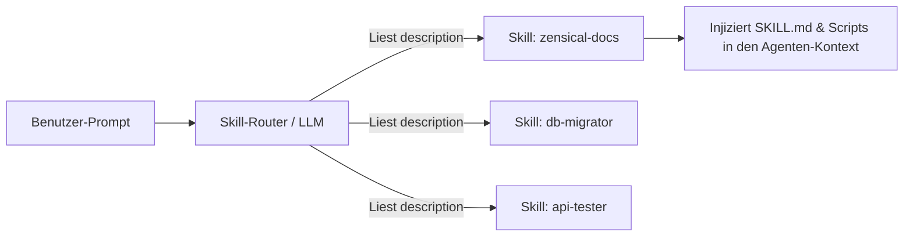

# Antigravity CLI 2 – Skills & Skill-Entwicklung

**Skills** sind modulare, wiederverwendbare Erweiterungspakete für den Antigravity CLI (`agy`). Sie statten den Agenten mit spezialisiertem Wissen, vordefinierten Abläufen, Vorlagen und Hilfsskripten aus.

---

## 🎯 Was ist ein Antigravity Skill?

Ein Skill kapselt Best Practices für wiederkehrende Entwicklungsaufgaben. Wenn ein Benutzer eine Aufgabe stellt, analysiert der Antigravity CLI die Beschreibung aller verfügbaren Skills und aktiviert automatisch das passende Skill-Paket.



---

## 📂 Verzeichnisstruktur eines Skills

Skills können global (`~/.gemini/antigravity-cli/skills/`) oder lokal im Projekt (`.gemini/skills/`) abgelegt werden.

```text
.gemini/skills/<skill-name>/
├── SKILL.md              # ZWINGEND: Hauptanleitung mit YAML-Frontmatter
├── scripts/              # Optional: Python-, Bash- oder JS-Skripte
├── templates/            # Optional: Code- oder Markdown-Vorlagen
└── references/           # Optional: Ausführliche Referenzdokumentation
```

---

## 🛠️ Erstellung benutzerdefinierter Skills (Schritt-für-Schritt)

### Schritt 1: Skill-Verzeichnis anlegen

Erstellen Sie im Projekt den Ordner für Ihren neuen Skill:

```bash
mkdir -p .gemini/skills/db-schema-checker
```

### Schritt 2: `SKILL.md` mit Frontmatter erstellen

Die Datei `SKILL.md` bildet das Herzstück des Skills. Sie **muss** einen YAML-Frontmatter-Header enthalten:

```markdown
---
name: db-schema-checker
description: Prüft PostgreSQL-Datenbankschemata auf fehlende Indizes, N+1 Abfragepotenziale und Konsistenzregeln. Aktivieren bei Datenbank-Migrationsfragen.
---

# PostgreSQL Schema Checker Skill

Dieser Skill leitet den Agenten bei der Überprüfung von Datenbankschemata an.

## 📋 Ablauf & Checkliste

1. **Schema analysieren**:
   - Untersuche alle SQL-Dateien unter `migrations/`.
   - Prüfe, ob Fremdschlüssel (Foreign Keys) entsprechende Indizes besitzen.

2. **Performance-Prüfung**:
   - Identifiziere Tabellen ohne Primary Key.
   - Warne vor `TEXT`-Feldern ohne Längenbegrenzung in Indizes.

## 🛠️ Hilfsskripte ausführen
Führe bei Bedarf das mitgelieferte Skript aus:
```bash
python3 .gemini/skills/db-schema-checker/scripts/check_indexes.py
```
```

---

## 💡 Bewährte Verfahren (Best Practices) zur Skill-Entwicklung

### 1. Präzise & aussagekräftige `description` schreiben
Die `description` im YAML-Frontmatter entscheidet darüber, wann der Agent den Skill aktiviert.
- ❌ **Schlecht**: `description: Ein Skript für Datenbanken.`
- ✅ **Gut**: `description: Analysiert PostgreSQL Schemata, prüft Indizes und generiert Migrations-Skripte für SQLAlchemy.`

### 2. Single Responsibility Principle (SRP)
Ein Skill sollte sich auf **eine** spezifische Domäne oder Aufgabe konzentrieren (z. B. `zensical-docs`, `docker-hardening`, `unit-testing`). Erstellen Sie lieber mehrere kleine Skills als einen riesigen Monolithen.

### 3. Unterlagen in `references/` auslagern
Laden Sie große Dokumentationen nicht komplett in `SKILL.md`, da dies das Kontextfenster belastet. Verwenden Sie Unterordner:

```markdown
## Ausführliche Referenz
Weitere Details zur Konfiguration finden Sie in:
[references/rules.md](file:///.gemini/skills/my-skill/references/rules.md)
```

### 4. Kombiniere Anweisungen mit Skripten
Skills sind besonders mächtig, wenn sie Anweisungen in `SKILL.md` mit automatisierten Skripten in `scripts/` kombinieren.

---

## 🔗 Verwandte Themen
- [Antigravity CLI Übersicht](antigravity-cli.md)
- [AGENTS.md Struktur & Standorte](antigravity-cli-agents-md.md)
- [Subagenten & Multi-Agenten Orchestrierung](antigravity-cli-subagents.md)
- [Handbuch & Agenten-Roadmap](antigravity-cli-roadmap-handbuch.md)
