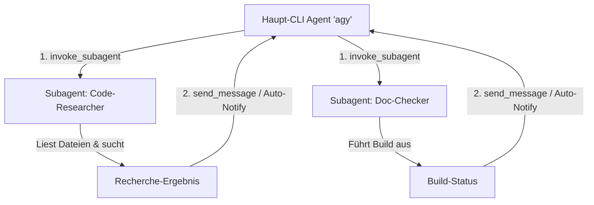

# Antigravity CLI 2 – Subagenten & Multi-Agenten Orchestrierung

**Subagenten** sind eigenständige KI-Agenteninstanzen, die vom Haupt-Agenten im Antigravity CLI (`agy`) gestartet werden. Sie ermöglichen die parallele Bearbeitung komplexer Aufgaben, ohne das Haupt-Kontextfenster zu überlasten.

---

## 🤖 Das Subagenten-Konzept im Antigravity CLI

Ein Subagent läuft in einem separaten Ausführungskontext. Er kann über eigene Tools, ein spezialisiertes Modell (z. B. ein schnelleres `flash`-Modell für Suchen) und einen isolierten Workspace verfügen.



---

## 🛠️ Werkzeuge zur Subagenten-Steuerung

Der Antigravity CLI stellt vier primäre Schnittstellen für die Subagenten-Verwaltung bereit:

| Tool | Zweck |
|---|---|
| `invoke_subagent` | Startet einen oder mehrere Subagenten mit definierter Rolle, Modell und Prompt. |
| `define_subagent` | Definieren neuer Subagenten-Typen mit benutzerdefiniertem System-Prompt und Tools. |
| `send_message` | Sendet Nachrichten/Instruktionen an einen laufenden Subagenten via ConversationID. |
| `manage_subagents` | Listet laufende Subagenten auf (`list`) oder beendet sie (`kill`, `kill_all`). |

---

## 🚀 Schritt-für-Schritt: Subagenten erstellen & aufrufen

### 1. Einen vordefinierten Subagenten starten (`invoke_subagent`)

Um einen Subagenten für eine spezifische Teilaufgabe zu starten, übergeben Sie die Parameter `TypeName`, `Role` und `Prompt`:

```json
{
  "Subagents": [
    {
      "TypeName": "research",
      "Role": "Codebase Researcher",
      "Model": "flash",
      "Prompt": "Durchsuche das Verzeichnis src/auth nach allen Stellen, an denen JWT-Tokens validiert werden, und liefere eine Zusammenstellung der Dateipfade und Zeilen."
    }
  ]
}
```

### 2. Einen neuen Subagenten-Typ definieren (`define_subagent`)

Wenn ein spezialisierter Agententyp benötigt wird, der im Projekt noch nicht existiert, kann er dynamisch definiert werden:

```json
{
  "name": "security-auditor",
  "description": "Prüft Codeänderungen auf OWASP Top 10 Sicherheitslücken.",
  "system_prompt": "Du bist ein erfahrener Security-Auditor. Prüfe allen eingehenden Code auf SQL-Injection, XSS und unsichere Deserialisierung.",
  "enable_write_tools": false,
  "enable_subagent_tools": false
}
```

Nach der Definition steht der Typ `security-auditor` sofort über `invoke_subagent` bereit.

---

## ⚙️ Workspace-Modi & Modell-Auswahl

### Workspace-Isolierung

Beim Start eines Subagenten kann festgelegt werden, wie dieser auf das Dateisystem zugreift:

- `inherit` *(Default)*: Nutzt dasselbe Arbeitsverzeichnis wie der Haupt-Agent.
- `branch`: Erstellt einen isolierten Workspace-Branch/Klon für gefahrlose Experimente.
- `share`: Nutzt Verzeichnis-Sharing (Git Worktree Äquivalent) für unabhängige Branches ohne Speicherverdopplung.

### Modell-Stufen (`Model`)

- `inherit`: Nutzt das Modell des Haupt-Agenten.
- `flash_lite` / `flash`: Sehr schnelle, kosteneffiziente Modelle für reine Suchen, File-Reads und Einfachaufgaben.
- `pro`: Großes Modell mit tiefem Denkvermögen für komplexe Refactorings und Architekturplanung.

---

## 💡 Best Practices für Multi-Agenten-Workflows

1. **Kein manuelles Polling erforderlich**:
   Der Antigravity CLI nutzt ein reaktives Event-System. Sobald ein Subagent seine Aufgabe beendet oder eine Nachricht sendet, wird der Haupt-Agent automatisch aufgeweckt.

2. **Gezielter Einsatz von `flash`-Modellen**:
   Delegieren Sie aufwendige Datei-Suchläufe oder Log-Analysen an Subagenten mit `Model: "flash"`, um Zeit und Token-Budget zu sparen.

3. **Subagenten nach Abschluss aufräumen**:
   Nutzen Sie `manage_subagents` mit `Action="kill_all"`, um beendete Subagenten-Instanzen nach der Aufgabenfertigstellung sauber zu schließen.

---

## 🔗 Verwandte Themen
- [Antigravity CLI Übersicht](antigravity-cli.md)
- [AGENTS.md Struktur & Standorte](antigravity-cli-agents-md.md)
- [Skills & Skill-Entwicklung](antigravity-cli-skills.md)
- [Handbuch & Agenten-Roadmap](antigravity-cli-roadmap-handbuch.md)
