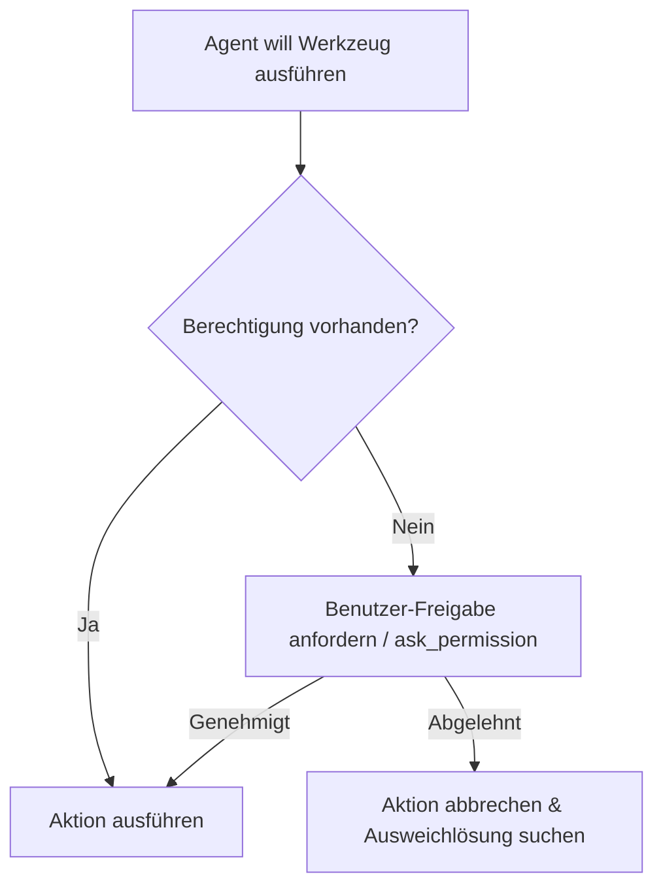

# Antigravity CLI 2 – Kapitel 3: Workflows, Berechtigungsmodi & Sitzungsverwaltung

In diesem Kapitel lernen Sie die Kern-Workflows des **Antigravity CLI 2** (`agy`) kennen: von Sicherheits- und Berechtigungskonzepten über den strukturierte Plan-Modus bis hin zum praxisnahen Sitzungsmanagement.

---

## 🔒 Berechtigungsmodi (Permission Modes) & Sandbox

Der Antigravity CLI 2 führt Befehle und Dateiedits standardmäßig in einer geschützten Sandbox aus. Das Sicherheitsmodell unterscheidet drei Stufen:



### Die Berechtigungsstufen im Detail

1. **Interactive Approval (Standard)**:
   - Vor der Ausführung kritischer Shell-Befehle oder Dateiänderungen bittet der Agent in der TUI um Freigabe.
2. **Permission Scopes (`ask_permission`)**:
   - Der Agent kann dynamisch eng begrenzte Lese- oder Schreibrechte anfordern (z. B. Schreibrechte für `docs/` oder Berechtigung für `git`-Befehle).
3. **Admin Escalation**:
   - Befehle mit System-Rechten (z. B. `sudo` oder Paketinstallationen) können niemals automatisch genehmigt werden und erfordern stets explizite Benutzerbestätigung.

---

## 📋 Der Plan-Modus (`/plan`)

Der Plan-Modus ist das mächtigste Werkzeug für mittelgroße und große Softwareentwicklungsvorhaben. Er verhindert unüberlegte Code-Änderungen durch eine klare Trennung von Planung und Ausführung.

### Ablauf des Plan-Modus

```text
Phase 1: Zieldefinition
└─> Benutzer startet den Modus: /plan "Refaktoriere die Benutzeroberfläche"

Phase 2: Codebase-Analyse
└─> Agent liest Dateien, sucht Abhängigkeiten und analysiert die Architektur (ohne Schreibzugriffe).

Phase 3: Artefakt-Erstellung (plan.md)
└─> Agent generiert einen detaillierten Ausführungsplan mit Meilensteinen und Validierungsschritten.

Phase 4: Entwickler-Review
└─> Sie prüfen den Plan in der TUI oder der IDE und geben Feedback oder die Freigabe.

Phase 5: Schrittweise Umsetzung & Validierung
└─> Agent setzt Meilenstein für Meilenstein um und testet nach jedem Schritt.
```

!!! tip "Vorteil des Plan-Modus"
    Durch die vorherige Analyse sparen Sie wertvolle Token und vermeiden fehlerhafte Architekturentscheidungen.

---

## 🔄 Sitzungen verwalten (Manage Sessions)

Eine Sitzung (Session) im Antigravity CLI umfasst den vollständigen Interaktionsverlauf, alle Werkzeugausgaben und den geladenen Kontext.

### 1. Sitzungen fortsetzen (`Resume`)

Wenn Sie am nächsten Tag weiterarbeiten oder das Terminal neu starten, können Sie Ihre vorherige Sitzung nahtlos fortsetzen:

```bash
# Sitzungen auflisten und letzte fortsetzen
agy --resume

# Spezifische Sitzungs-ID fortsetzen
agy --resume 3201dc39-7e0f-4f5f-b266-d498e1506982
```

### 2. Änderungen zurückrollen (`Rewind`)

Falls eine Änderung des Agenten nicht Ihren Vorstellungen entspricht, können Sie mit `/rewind` im TUI-Chat zu einem früheren Stand in der Sitzung zurückkehren.

### 3. Asynchrone Hintergrundaufgaben & Multitasking

Lange laufende Befehle (z. B. große Builds, Scrapes oder Test-Suites) können als Hintergrundaufgabe gestartet werden.

```text
# Timer oder periodische Aufgaben planen
schedule DurationSeconds=300 Prompt="Prüfe den Build-Status" TimerCondition="any"

# Hintergrund-Tasks verwalten
manage_task Action="list"
manage_task Action="status" TaskId="task-123"
manage_task Action="kill" TaskId="task-123"
```

!!! note "Kein Polling erforderlich"
    Das Antigravity-System benachrichtigt den Agenten automatisch, sobald eine Hintergrundaufgabe beendet ist oder ein Subagent seine Ergebnisse liefert.

---

## 🔗 Verwandte Themen
- [Kapitel 1: Einführung & Grundlagen](antigravity-cli-einfuehrung-grundlagen.md)
- [Kapitel 2: CLI Befehle & TUI Cheatsheet](antigravity-cli-befehle-tui-cheatsheet.md)
- [Kapitel 4: AGENTS.md Struktur & Standorte](antigravity-cli-agents-md.md)
- [Antigravity CLI Handbuch & Roadmap](antigravity-cli-roadmap-handbuch.md)
