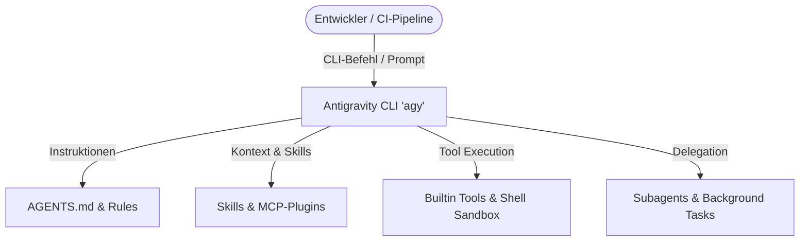
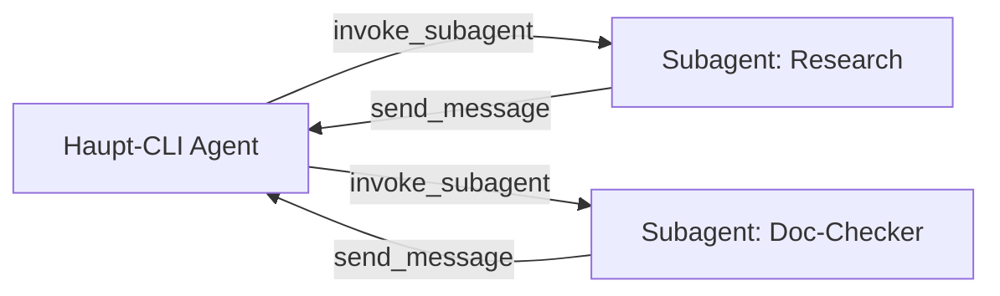

# Antigravity CLI 2 (`agy`) – Referenz & Praxisleitfaden

Der **Antigravity CLI** (`agy`) ist die hochleistungsfähige, terminalbasierte Schnittstelle der Google Antigravity Agentic Platform. Er ermöglicht es Entwickler:innen und KI-Agenten, direkt in der Konsole komplexe Softwareentwicklungs-, Refactoring- und Automatisierungsaufgaben auszuführen.

---

## 🚀 Was ist der Antigravity CLI?

Der Antigravity CLI ist ein autonomes Agenten-Werkzeug für das Terminal, das auf modernen LLMs (wie Gemini 3.5 Pro/Flash) basiert. Im Gegensatz zu reinen Chat-Bots führt `agy` Befehle aus, liest und editiert Dateien im Projektverzeichnis, verwaltet Hintergrundaufgaben und orchestriert Subagenten.



### Gegenüberstellung: CLI vs. IDE vs. Antigravity 2.0

| Merkmal | Antigravity CLI (`agy`) | Antigravity IDE | Antigravity 2.0 (Desktop) |
|---|---|---|---|
| **Oberfläche** | Terminal / TUI / Headless | Vollwertige IDE (VS Code Fork) | Desktop-Anwendung mit Auxiliary Pane |
| **Ressourcenbedarf** | Extrem gering | Mittel bis Hoch | Mittel |
| **Hauptfokus** | Skripting, CI/CD, schnelle Terminal-Workflows | Visuelles Coden, Inline-Diffs, Refactoring | Multi-Agenten-Orchestrierung, UI-Mockups |
| **Automatisierung** | Headless-Modus & Cron-Jobs möglich | Manuell interaktiv | Interaktiv & visueller Kontext |

---

## 🧩 Antigravity CLI Basic & Bausteine

### 1. `AGENTS.md` – KI-Regeln & Steuerung

Die Datei `AGENTS.md` bildet das zentrale Regelwerk für den CLI-Agenten in einem Projekt. Sie wird beim Start von `agy` im aktuellen Arbeitsverzeichnis gelesen.

!!! note "Hierarchie der Regelwerke"
    1. **Globale Systemregeln**: Standardeinstellungen der Antigravity-Plattform.
    2. **Benutzerregeln**: Systemweite User-Rules (z. B. unter `~/.gemini/antigravity-cli/`).
    3. **Projektregeln (`AGENTS.md`)**: Spezifische Regeln des aktuellen Repositorys.

#### Beispiel einer `AGENTS.md`
```markdown
# Projekt-Regeln für Antigravity CLI

## Build & Validierung
- Vor jedem Commit zwingend `.venv/bin/zensical build` ausführen.
- Keine fehlerhaften internen Links zulassen.

## Verbotene Befehle
- `mkdocs build` oder `mkdocs serve` dürfen NIEMALS verwendet werden.
- Nutze ausschließlich `.venv/bin/zensical`.
```

---

### 2. Skills – Wiederverwendbare Fähigkeiten

Skills erweitern die Funktionalität des CLI-Agenten um spezialisierte Handlungsanweisungen, Vorlagen und Skripte.

- **Ablageort**: `.gemini/skills/<skill-name>/SKILL.md` (projektbezogen) oder global.
- **Aufbau**: Enthält YAML-Frontmatter (`name`, `description`) sowie detaillierte Instruktionen.

```markdown
---
name: zensical-docs
description: Hilft beim Erstellen und Validieren von Dokumentationsseiten mit Zensical.
---

# Zensical Docs Skill
Instruktionen für die Erstellung von Dokumentationsseiten...
```

---

### 3. Context – Kontext- & Speicherverwaltung

Der Antigravity CLI verwaltet den Gesprächs- und Dateikontext hochgradig token-effizient:

- **Transkripte**: Alle Interaktionen werden in `.system_generated/logs/transcript.jsonl` protokolliert.
- **Kontext-Trimming**: Ältere Werkzeugausgaben werden automatisch gekürzt, um das Token-Fenster optimal zu nutzen.
- **Dateikontext**: Dateien werden nur bei Bedarf über `view_file` oder `grep_search` in den Kontext geladen.

---

### 4. Modes – Betriebsmodi

Der CLI unterstützt verschiedene Interaktionsmodi je nach Anwendungsfall:

=== "Interactive Chat Mode"
    ```bash
    agy
    ```
    Startet die interaktive Terminal-Oberfläche (TUI) für den dialogbasierten Betrieb.

=== "Plan-Modus (`/plan`)"
    ```text
    /plan "Refaktoriere die Authentifizierungs-Pipeline"
    ```
    Der Agent erstellt zuerst einen detaillierten Ausführungsplan (`plan.md`) und wartet auf Bestätigung, bevor Änderungen vorgenommen werden.

=== "Headless / Non-Interactive"
    ```bash
    agy --prompt "Prüfe den Build-Status und behebe Fehler"
    ```
    Ideal für Skripte, CI/CD-Pipelines oder Automatisierungen ohne Benutzerinteraktion.

---

### 5. Tools – Integrierte Werkzeuge

Dem CLI-Agenten stehen integrierte Werkzeuge zur Verfügung:

| Tool-Name | Beschreibung |
|---|---|
| `run_command` | Führt Shell-Befehle (Bash) im Workspace aus (synchron oder asynchron). |
| `view_file` | Liest Text- oder Binärdateien mit Zeilenbereichsunterstützung. |
| `replace_file_content` | Ersetzt einen zusammenhängenden Codeblock in einer Datei. |
| `multi_replace_file_content` | Ersetzt mehrere nicht-zusammenhängende Codeblöcke atomar. |
| `write_to_file` | Erstellt neue Dateien inklusive Verzeichnisstruktur. |
| `grep_search` | Schnellsuche in Dateien mittels Ripgrep (Regex / String). |
| `list_dir` | Verzeichnisinhalte und Verzeichnisbäume auflisten. |
| `schedule` | Timer oder wiederkehrende Cron-Jobs für Hintergrundbenachrichtigungen. |
| `ask_permission` | Fordert explizite Dateizugriffs- oder Befehlsrechte an. |
| `ask_question` | Stellt dem Benutzer eine strukturierte Multiple-Choice-Frage. |

---

### 6. Plugins & MCP (Model Context Protocol)

Über das **Model Context Protocol (MCP)** kann der Antigravity CLI mit externen Tools, Datenbanken und APIs verbunden werden.

```json
// ~/.gemini/antigravity-cli/settings.json (Auszug)
{
  "mcpServers": {
    "postgres": {
      "command": "npx",
      "args": ["-y", "@modelcontextprotocol/server-postgres", "postgresql://localhost/mydb"]
    }
  }
}
```

---

### 7. Hooks – Lifecycle-Automatisierung

Hooks erlauben das Ausführen von benutzerdefinierten Skripten bei bestimmten Lifecycle-Events:

- `pre_command`: Vor der Ausführung eines Shell-Befehls.
- `post_tool_call`: Nach Abschluss eines Tool-Aufrufs.
- `on_error`: Bei Auftreten von Laufzeit- oder Build-Fehlern.

---

### 8. Subagents – Multi-Agenten-Orchestrierung

Der CLI kann eigenständige Hintergrund-Agenten (Subagents) starten, um komplexe Aufgaben parallel abzuarbeiten.

- `invoke_subagent`: Spawnt einen neuen Subagenten mit definierter Rolle und Prompt.
- `define_subagent`: Definiert zur Laufzeit neue Subagenten-Typen.
- `send_message`: Kommuniziert asynchron mit laufenden Subagenten.



---

## 🔄 Antigravity CLI Workflow & Praxis

### Berechtigungsmodi & Sicherheit

Der Antigravity CLI arbeitet standardmäßig in einer abgesicherten Sandbox. Werkzeugzugriffe erfordern je nach Konfiguration explizite Rechte:

1. **Interactive Approval**: Der Benutzer bestätigt kritische Shell-Befehle oder Dateiänderungen manuell.
2. **Auto-Approve / Sandbox Scopes**: Über `ask_permission` kann der Agent eng definierte Berechtigungen (z. B. `write_file` für Unterverzeichnisse) anfordern.
3. **Admin Escalation**: Befehle mit erhöhten Rechten müssen explizit vom Benutzer freigegeben werden.

!!! warning "Sicherheitshinweis"
    Erteilen Sie niemals globale Lese- oder Schreibrechte auf Wurzelverzeichnissen (`/`). Begrenzen Sie Berechtigungen stets auf den jeweiligen Workspace.

---

### Plan-Modus (`/plan`)

Der Plan-Modus strukturiert komplexe Entwicklungsaufgaben in transparente Teilschritte:

1. **Analyse**: Der Agent liest Relevanzdateien und analysiert das Problem.
2. **Planerstellung**: Ein Markdown-Artefakt (`plan.md`) wird generiert, das alle Teilschritte detailliert beschreibt.
3. **Review**: Entwickler:innen prüfen den Plan und geben Feedback oder die Freigabe.
4. **Ausführung**: Der Agent arbeitet den Plan Schritt für Schritt ab und validiert jeden Teilerfolg.

---

### Sitzungen verwalten praxisbezogen

Sitzungen (Sessions) im Antigravity CLI sind hochgradig persistent:

=== "Sitzung starten & fortsetzen"
    ```bash
    # Neue Sitzung im aktuellen Projekt starten
    agy

    # Zu einer bestehenden Sitzung zurückkehren
    agy --resume <session-id>
    ```

=== "Hintergrundaufgaben & Asynchronität"
    ```text
    Verwende 'schedule' für Timer oder führe Befehle im Hintergrund aus.
    Verwende 'manage_task', um Hintergrund-Prozesse zu steuern:
    - manage_task Action="status" TaskId="..."
    - manage_task Action="kill" TaskId="..."
    ```

!!! tip "Kein Loop-Polling nötig"
    Sobald eine Hintergrundaufgabe oder ein Subagent fertig ist, sendet das Antigravity-System automatisch eine Nachricht an den CLI-Agenten. Polling per Schleife ist nicht erforderlich.

---

## 💡 Anwendungspraktiken & Best Practices

1. **Empirische Validierung vor Erfolgsmeldung**:
   Verlassen Sie sich nicht darauf, dass Code korrigiert wurde, nur weil eine Datei geschrieben wurde. Führen Sie stets den Build- oder Testbefehl aus (z. B. `.venv/bin/zensical build`).

2. **Kompakte & präzise Prompting-Strategie**:
   Verwenden Sie Slash-Commands wie `/plan`, `/goal` oder `/learn`, um komplexe Workflows effizient einzuleiten.

3. **Multi-Replacements nutzen**:
   Bei mehreren Änderungen in derselben Datei ist `multi_replace_file_content` dem mehrfachen Einzelaufruf vorzuziehen.

---

## 🔗 Verwandte Themen

- [KI Coding Grundlagen](ki-coding.md)
- [Continue.dev & Tabby AI Setup](continue-dev-setup.md)
- [Vibe Coding & Engineering](vibe-coding-engineering.md)
- [Zurück zur KI-Übersicht](index.md)
