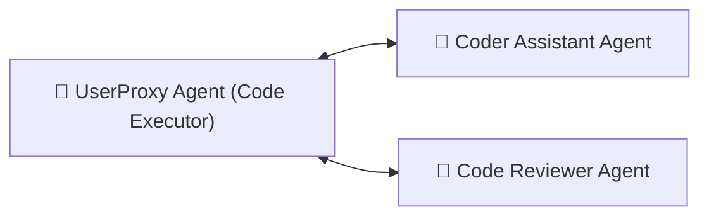

# Praxis-Guide: AutoGen Multi-Agenten Framework

**Microsoft AutoGen** ermöglicht das Erstellen autonomer Teams von KI-Agenten, die miteinander kommunizieren, Code schreiben, ausführen und komplexe Entwicklungsaufgaben im Dialog lösen.

---



---

## 🛠️ 1. Installation

```bash
pip install autogen-agentchat pyautogen
```

---

## 🐍 2. Python Skript (`multi_agent_chat.py`)

```python
import autogen

# 1. LLM Konfiguration (Lokaler Ollama / vLLM oder OpenAI API)
config_list = [
    {
        "model": "llama3.1",
        "base_url": "http://localhost:11434/v1",
        "api_key": "ollama",
    }
]

llm_config = {"config_list": config_list, "temperature": 0.2}

# 2. Agenten definieren
coder = autogen.AssistantAgent(
    name="Coder",
    llm_config=llm_config,
    system_message="Du bist ein spezialisierter Python-Entwickler. Schreibe sauberen Code."
)

user_proxy = autogen.UserProxyAgent(
    name="UserProxy",
    human_input_mode="NEVER",
    max_consecutive_auto_reply=5,
    is_termination_msg=lambda x: "BEENDET" in x.get("content", ""),
    code_execution_config={"work_dir": "workspace", "use_docker": False}
)

# 3. Unterhaltung starten
user_proxy.initiate_chat(
    coder,
    message="Schreibe ein Python-Skript, das das aktuelle Wetter aus einer öffentlichen API abruft und in CSV speichert."
)
```

---

## 🔗 Verwandte Themen
* [Agentic Workflows (LangGraph)](agentic-workflows-langgraph.md) – Agenten mit LangGraph
* [Structured LLM Outputs (Pydantic)](structured-outputs-pydantic.md) – Pydantic Schemas
* [Lokales RAG & LLM-Serving](lokales-rag-ollama.md) – Ollama RAG
