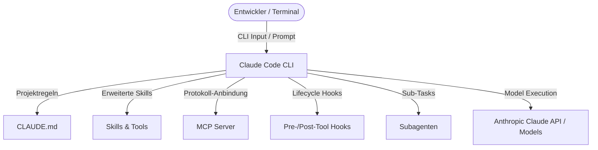
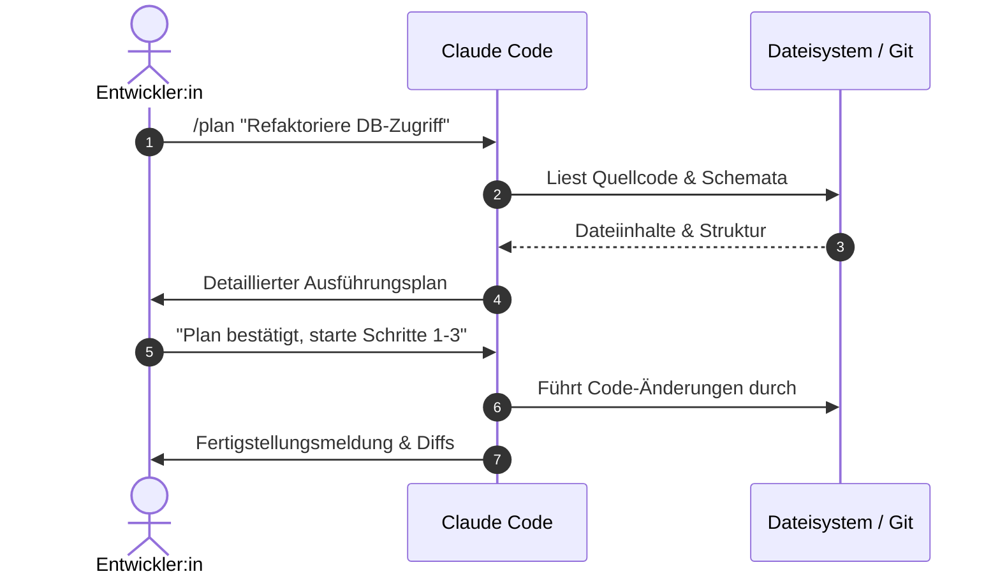

# Claude Code – Das Praxis-Handbuch & Workflow-Guide

**Claude Code** ist das agentische Command-Line-Tool von Anthropic, das entwickelt wurde, um direkt im Terminal als intelligenter Paarprogrammierer zu agieren. Es liest und editiert Codebestandteile, führt Tests und Terminalbefehle aus, orchestriert MCP-Server (Model Context Protocol) und unterstützt komplexe Softwarearchitekturen über strukturierte Workflows.

Dieses Praxis-Handbuch fasst alle Konzepte, Befehle, Shortcuts, Konfigurationen und Best Practices zusammen – strukturiert nach den Anforderungen des täglichen Entwicklungseinsatzes.

---

## 🚀 1. Einführung & Architekturgrundlagen

### Was ist Claude Code?
Claude Code erweitert das klassische Terminal um ein autonomes Sprachmodell (wie Claude 3.7 Sonnet). Im Gegensatz zu reinen Chat-Oberflächen besitzt Claude Code direkten Zugriff auf Ihr Dateisystem und Ihre Entwicklungs-Tools (über Shell-Execution).



### Vibe Coding vs. Agentic Engineering
In der modernen KI-gestützten Softwareentwicklung unterscheidet man zwei wesentliche Arbeitsweisen:

* **Vibe Coding**: Schnelles, intuitives Prototyping mit generativ erzeugtem Code ohne tiefe Kontrolle aller Zeilen. Ideal für Experimente und Proofs of Concept.
* **Agentic Engineering**: Ein strukturierter, qualitätsgesicherter Prozess, bei dem der Agent durch dedizierte Regeln (`CLAUDE.md`), automatisierte Tests, Linters und Hooks in geordnete Bahnen gelenkt wird.

### Was ist ein Coding Agent?
Ein Coding Agent arbeitet in einer sogenannten **Agentic Loop** (agentischen Schleife):

1. **Beobachtung (Observe)**: Liest den Prompt, Projektregeln (`CLAUDE.md`) und Dateien.
2. **Entscheidung (Think)**: Wählen des nächsten Handlungsschritts (Werkzeugaufruf oder Antwort).
3. **Aktion (Act)**: Ausführen von Datei-Edits, Shell-Befehlen oder Testläufen.
4. **Bewertung (Evaluate)**: Auswertung der Ausgabe/Fehlermeldungen und Wiederholung der Schleife.

### Nutzungsvarianten (Ways to use Claude)
Claude steht in verschiedenen Umgebungen zur Verfügung:
* **Claude CLI**: Die primäre Terminal-Oberfläche für maximale Performance und Skripte.
* **Desktop App**: Visuelle Benutzeroberfläche mit graphischen Zusatzfenstern.
* **Editor Extensions**: Integrationen für VS Code, JetBrains IDEs und Neovim.
* **Community Tools**: Drittanbieter-Skripte und Orchestrierungswerkzeuge.

### Setup & Authentifizierung
!!! note "Voraussetzungen"
    Claude Code erfordert Node.js (v18+) und ein Anthropic-Konto (Subscription oder API-Schlüssel).

=== "Installation & Login"
    ```bash
    # Globale Installation via npm
    npm install -g @anthropic-ai/claude-code

    # Navigieren in Ihr Projektverzeichnis
    cd /path/to/project

    # Erstmaliger Start & Authentifizierung
    claude
    ```

=== "API-Usage vs. Subscription"
    * **Subscription Model (Claude Pro / Team / Enterprise)**: Direkter Login über das Anthropic-Benutzerkonto. Ideal für Entwicklerteams mit Flatrate-Kontingenten.
    * **API Usage (Pay-as-you-go)**: Nutzung eines `ANTHROPIC_API_KEY`. Ermöglicht direkte Abrechnung nach verbrauchten Tokens und Nutzung von Prompt Caching.

---

## 🧩 2. Kernkomponenten & Architektursäulen

Claude Code basiert auf mehreren aufeinander abgestimmten Bausteinen. Die folgende Tabelle bietet eine Übersicht der Kernkonzepte:

| Konzept | Beschreibung | Praxisnutzen |
|---|---|---|
| **CLAUDE.md** | Projektweite Regeldokumentation im Root- oder Unterordner | Legt Coding-Standards, Build-Befehle und Verhaltenskodex fest |
| **Skills** | Wiederverwendbare Funktions- & Prompt-Pakete | Automatisierte Standardaufgaben (z. B. Docs, Code-Reviews) |
| **Context** | Arbeitsspeicher des Agenten (Files, Transkript) | Bestimmt, welche Informationen dem Modell vorliegen |
| **Modes** | Betriebsmodi wie Plan-Modus (`/plan`) oder Standard | Wechsel zwischen reiner Strategieplanung und Code-Editierung |
| **Models** | Claude 3.7 Sonnet, Opus, Haiku | Abstimmung von Denkleistung, Geschwindigkeit und Kosten |
| **Tools & MCP** | Lokale & externe Schnittstellen (Model Context Protocol) | Anbindung an Datenbanken, Git, JIRA und APIs |
| **Hooks** | Event-gesteuerte Skripte (Lifecycle) | Automatisierte Prüfungen vor/nach Werkzeugaufrufen |
| **Subagents** | Ausgelagerte Unter-Agenten | Parallele & isolierte Bearbeitung von Teilaufgaben |

### Modellauswahl (When to use what model?)
* **Claude 3.7 Sonnet / Sonnet**: Das Standardmodell. Bietet das beste Verhältnis aus Coding-Kompetenz, Denkfähigkeit (Reasoning) und Geschwindigkeit.
* **Claude 3.5 / 3.7 Opus (`Opusplan`)**: Für hochkomplexe Architektur-Entscheidungen, tiefes Refactoring und diffizile Bugfixes. In `Opusplan` plant Opus die Schritte, während Sonnet die Ausführung übernimmt.
* **Claude Haiku**: Extrem schnelles Modell für einfache Aufgaben wie Log-Analyse, Skript-Generierung oder Tagging.

---

## ⌨️ 3. Befehle, Cheatsheet & Shortcuts

### CLI Start-Parameter & Flags

```bash
# Standard: Interaktive TUI-Session starten
claude

# Einmalige Prompt-Ausführung mit direkter Beendung (-p / --print)
claude -p "Erstelle einen Unit-Test für auth.py"

# Vorherige Session im aktuellen Ordner fortsetzen (-c / --continue)
claude -c

# Eine spezifische alte Session wiederaufnehmen (-r / --resume)
claude -r <session-id>

# Zusätzliches Verzeichnis in den Kontext aufnehmen (--add-dir)
claude --add-dir ../shared-libraries
```

### Shortcuts & Tasten-Prefixes

| Shortcut / Prefix | Funktion & Beschreibung |
|---|---|
| `Ctrl + C` | Aktuelle Generierung oder Tool-Ausführung sofort abbrechen |
| `Ctrl + R` | Session-Historie durchsuchen |
| `Esc` / `Esc + Esc` | Prompt-Eingabe abbrechen oder TUI-Fokus zurücksetzen |
| `Shift + Tab` | Mehrzeiligen Eingabemodus umschalten |
| `!` | Shell-Befehl direkt im Terminal ausführen (z. B. `!git status`) |
| `\` | Escape-Zeichen für Sonderzeichen im Prompt |
| `@` | Datei, Ordner oder Symbol direkt referenzieren (z. B. `@src/auth.py`) |
| `/` | Slash-Command Auswahlmenü öffnen |

### In-Session Slash-Commands

=== "Allgemeine Befehle"
    * `/help`: Zeigt das Hilfemenü und verfügbare Slash-Commands an.
    * `/clear`: Leert den Bildschirm und setzt den aktuellen Kontext zurück.
    * `/exit`: Beendet die Claude Code Session.
    * `/status`: Zeigt den aktuellen System- und Session-Status an.
    * `/usage`: Ausführliche Statistik zum Token-Verbrauch und API-Limits.
    * `/cost`: Zeigt die geschätzten Kosten der aktuellen Session an.
    * `/export`: Exportiert den bisherigen Gesprächsverlauf als Datei.
    * `/doctor`: Führt eine Selbstdiagnose von Umgebung, Tools und Netzwerk durch.

=== "Workflow & Planung"
    * `/plan`: Wechselt in den dedizierten Plan-Modus für sichere Code-Änderungen.
    * `/rewind`: Macht die letzten durch Claude ausgeführten Schritte rückgängig.
    * `/context`: Zeigt aktuell im Kontext befindliche Dateien und Tokens an.
    * `/compact`: Komprimiert den Gesprächsverlauf zur Reduzierung von Tokens.
    * `/init`: Erstellt eine initiale `CLAUDE.md` Vorlage im aktuellen Verzeichnis.
    * `/memory`: Verwaltet das langzeitige Gedächtnis des Projekts.

=== "Verwaltung & Konfiguration"
    * `/config`: Öffnet die Konfigurationsansicht für lokale/globale Parameter.
    * `/permissions`: Konfiguriert die Rechtevergabe für Shell- und Tool-Aufrufe.
    * `/model`: Umschalten des aktiven Sprachmodells (Sonnet, Opus, Haiku).
    * `/agents`: Übersicht und Steuerung von aktiven Subagenten.
    * `/hooks`: Übersicht und Konfiguration von Lifecycle-Hooks.
    * `/mcp`: Verwaltung von verbundenen MCP-Servern.

---

## 🔄 4. Claude Workflows & Session-Management

### Berechtigungsmodi (Permission Modes)
Claude Code unterstützt unterschiedliche Sicherheitsstufen für die Ausführung von Shell-Befehlen und Dateimodifikationen:

1. **Interactive Approval (Standard)**: Vor jedem potenziell schreibenden Zugriff oder Shell-Befehl wird eine Bestätigung vom Entwickler eingeholt.
2. **Auto-Approve / Unattended**: Gefahrlose Lesebefehle und gewählte Routinen werden automatisch ohne Rückfrage ausgeführt.
3. **ReadOnly / Sandboxed**: Schreibzugriffe auf das Dateisystem werden blockiert.

### Plan-Modus (`/plan`)
Der Plan-Modus verhindert vorschnelle oder ungewollte Änderungen in produktiven Repositories.



### Session-Wiederherstellung & Rückgängigmachen
* **Rückgängigmachen (`/rewind`)**: Ermöglicht das Zurücksetzen von Änderungen auf einen vorherigen Stand im Arbeitsprozess.
* **Sitzungen fortsetzen (`claude -r`)**: Unterbrochene Sessions können mit `claude -r <id>` jederzeit exakt an der Stelle fortgeführt werden, an der sie gestoppt wurden.

---

## 🛠️ 5. Projektsteuerung & Erweiterungen

### `CLAUDE.md` – Das zentrale Regelwerk
Die Datei `CLAUDE.md` bildet die Leitplanke für Claude Code im jeweiligen Repository. Sie sollte präzise, kurz und direkt verständlich formuliert sein.

#### Empfohlener Aufbau einer `CLAUDE.md`
```markdown
# Projekt-Regeln & Standards

## Build & Test Befehle
- Ausführen des Builds: `npm run build`
- Unit Tests: `npm test`
- Linter: `npm run lint`

## Code-Style Guidelines
- Sprachstandard: TypeScript (strict mode enabled).
- Keine `any`-Typen verwenden.
- Fehlerbehandlung: Nutzen von expliziten Result-Typen oder Try/Catch mit strukturierter Protokollierung.

## Git & Formatting
- Commit-Format: Conventional Commits (`feat:`, `fix:`, `docs:`).
- Code-Formatierung: Prettier mit 2 Leerzeichen Einrückung.
```

### Skills – Wiederverwendbare Funktionspakete
Skills sind benutzerdefinierte Instruktionen und Prozeduren, die unter `.claude/skills/<skill-name>/SKILL.md` abgelegt werden.

```markdown
---
name: security-audit
description: Analysiert geänderte Dateien auf OWASP-Sicherheitslücken.
---

# Security Audit Skill

1. Führe `git diff` aus, um die neuesten Änderungen zu ermitteln.
2. Überprüfe den Code auf typische Schwachstellen (SQL Injection, XSS, Hardcoded Credentials).
3. Generiere einen zusammenfassenden Audit-Bericht in Markdown.
```

### Hooks – Event-gesteuerte Automatisierung
Hooks ermöglichen die automatische Ausführung von Skripten zu bestimmten Lifecycle-Zeitpunkten von Claude Code:

| Event | Auslöser | Beispielhafter Anwendungsfall |
|---|---|---|
| `SessionStart` | Start einer neuen Session | Initiales Laden von Umgebungsvariablen oder Git-Status |
| `SessionEnd` | Beenden der Session | Aufräumen temporärer Artefakte oder Session-Export |
| `PreToolUse` | Vor Werkzeugaufruf | Sicherheitsprüfung von Dateipfaden oder Shell-Befehlen |
| `PostToolUse` | Nach Werkzeugaufruf | Automatisches Ausführen von `prettier` oder Linter nach Edits |
| `UserPromptSubmit` | Vor Prompt-Verarbeitung | Anreichern von Prompts mit Kontextdaten |
| `Stop` | Manuelles Abbrechen | Beenden von im Hintergrund laufenden Prozessen |

---

## 💰 6. Kontext- & Kostenmanagement

### Token-Effizienz mit `/compact` und `/clear`
Claude Code verwaltet den Arbeitskontext im Token-Fenster. Um Kosten zu minimieren und die Genauigkeit hochzuhalten:

* **`/compact`**: Fasst lange Gesprächsverläufe zusammen und entfernt alte Tool-Ausgaben. Sollte regelmäßig bei längeren Sessions verwendet werden.
* **`/clear`**: Setzt den Kontext vollständig zurück. Empfohlen beim Themenwechsel.

### Extended Thinking & Effort Levels
Bei Modellen wie Claude 3.7 Sonnet kann das **Denk-Level (Effort)** angepasst werden:
* **Niedriger Effort**: Für schnelle, unkomplizierte Fragen und kleine Fixes.
* **Hoher Effort**: Für komplexe algorithmische Aufgaben und Systemarchitektur.

### Prompt Caching
Claude Code nutzt automatisches Prompt Caching für `CLAUDE.md`, System-Prompts und Tool-Definitionen. Dadurch reduzieren sich die API-Kosten bei wiederholten Interaktionen um bis zu 90 %.

---

## ⚡ 7. Fortgeschrittene Features & Skalierung

### Model Context Protocol (MCP) Integration
Über das Model Context Protocol lässt sich Claude Code mit externen Datenquellen und Werkzeugen verbinden (z. B. PostgreSQL, GitHub, Slack).

```json
{
  "mcpServers": {
    "postgres": {
      "command": "npx",
      "args": ["-y", "@modelcontextprotocol/server-postgres", "postgresql://localhost/mydb"]
    }
  }
}
```

### Skalierung im Team & CI/CD
* **Headless Mode**: Ausführen von Claude Code in unüberwachten CI/CD-Pipelines (`claude -p "Analysiere PR" --headless`).
* **Git Worktrees**: Parallele Bearbeitung mehrerer Features in separaten Git Worktrees ohne Wechsel des Hauptzweigs.
* **Agent Teams**: Aufteilung von Großprojekten auf mehrere spezialisierte Subagenten (z. B. Docs-Agent, Test-Agent).

!!! warning "Sicherheits-Tipp"
    Speichern Sie NIEMALS API-Schlüssel, Passwörter oder vertrauliche Zugangsdaten in `CLAUDE.md` oder Prompt-Logs.

---

## 🔗 8. Verwandte Themen & Weiterführende Links
* [Zurück zur KI-Coding Übersicht](index.md)
* [Antigravity CLI 2 Handbuch](antigravity-cli.md)
* [Vibe Coding & Engineering](vibe-coding-engineering.md)
