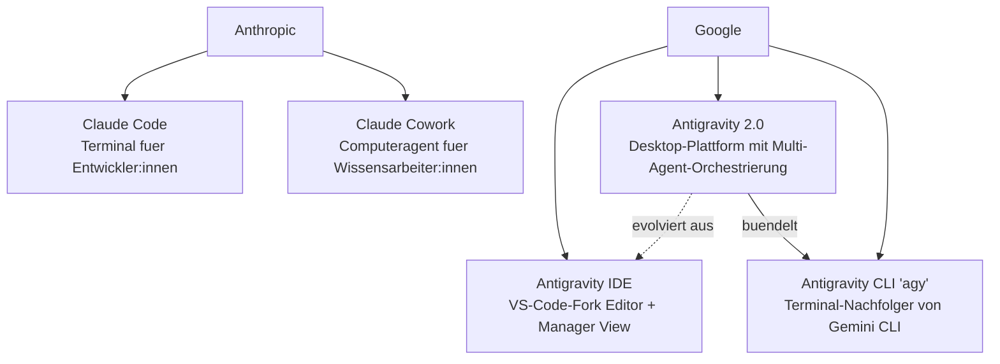

# Claude Cowork vs. Claude Code vs. Antigravity 2.0 vs. Antigravity IDE vs. Antigravity CLI – Was ist der Unterschied?

Anthropic und Google haben ihre agentischen KI-Werkzeuge 2026 stark ausdifferenziert. Auf den ersten Blick klingen **Claude Cowork**, **Claude Code**, **Antigravity 2.0**, **Antigravity IDE** und **Antigravity CLI** wie Varianten desselben Produkts – tatsächlich adressieren sie fünf unterschiedliche Nutzergruppen, Oberflächen und Automatisierungstiefen. Dieser Buchabschnitt ordnet alle fünf Werkzeuge ein und liefert eine praxistaugliche Entscheidungshilfe.

!!! note "Zwei Anbieter, zwei Philosophien"
    **Anthropic** trennt strikt zwischen Entwickler-Terminal (**Claude Code**) und General-Purpose-Computeragent für Wissensarbeiter (**Claude Cowork**). **Google** dagegen bündelt Editor, Desktop-Orchestrierung, Terminal, SDK und Enterprise-Bausteine unter der gemeinsamen Marke **Antigravity** – mit **IDE**, **2.0** und **CLI** als Teilprodukten derselben Plattform.

---

## 🗺️ Familienübersicht

| | Anbieter | Erstveröffentlichung | Kernmetapher |
|---|---|---|---|
| **Claude Code** | Anthropic | 2025 (GA), seither iterativ erweitert | Terminal-Pair-Programmer |
| **Claude Cowork** | Anthropic | 12. Januar 2026 (Research Preview, macOS) | Autonomer Desktop-Assistent für Büroarbeit |
| **Antigravity IDE** | Google | 18. November 2025 (Public Preview, mit Gemini 3 Pro) | VS-Code-Fork mit Editor- & Manager-View |
| **Antigravity 2.0** | Google | 19. Mai 2026 (Google I/O) | Standalone-Plattform: Desktop-App + CLI + SDK + Managed Agents API |
| **Antigravity CLI (`agy`)** | Google | Mai/Juni 2026 (Nachfolger von Gemini CLI) | Terminalbasierter Agent, in Go geschrieben |

---

## 🔵 Claude Code

**Claude Code** ist Anthropics agentisches Command-Line-Tool für die Softwareentwicklung. Es liest und editiert Dateien im Projektverzeichnis, führt Shell-Befehle und Tests aus, orchestriert Subagenten und bindet externe Werkzeuge über das **Model Context Protocol (MCP)** an. Steuerung erfolgt über `CLAUDE.md`-Regelwerke, Skills, Hooks und Slash-Commands.

- **Zielgruppe:** Entwickler:innen, DevOps-/Platform-Teams.
- **Oberfläche:** Terminal/CLI, zusätzlich Editor-Extensions (VS Code, JetBrains) und eine Desktop-App als grafische Ergänzung.
- **Stärken:** Tiefe Codebase-Kontrolle, Headless-/CI-Betrieb, granulare Berechtigungsmodi, großes Skill-/Subagenten-Ökosystem.
- **Nicht der Fokus:** Allgemeine Büroaufgaben (Tabellen, Präsentationen, E-Mail-Workflows) ohne Code-Bezug.

Ausführliche Praxisanleitung: [Claude Code Praxis-Handbuch](claude-code-praxis.md).

---

## 🟣 Claude Cowork

**Claude Cowork** ist Anthropics general-purpose "Computeragent" – eine Research Preview, die am 12. Januar 2026 vorgestellt wurde. Cowork nutzt dasselbe technische Fundament wie Claude Code, richtet sich aber an **nicht-technische Wissensarbeiter:innen** ("Normies") statt an Entwickler:innen.

### Was Cowork konkret tut

- **Datei- und Ordnerzugriff mit expliziter Berechtigung:** Cowork liest, erstellt und bearbeitet lokale Dokumente, ohne dass Dateien manuell hochgeladen werden müssen.
- **Parallele Aufgabenverarbeitung:** Mehrere Aufgaben können in eine Warteschlange gestellt und parallel abgearbeitet werden – ein Bruch mit dem klassischen Turn-basierten Chat-Modell.
- **Typische Anwendungsfälle:** Belege in Excel-Tabellen umwandeln, Dateien organisieren, Berichte und Präsentationen erstellen, Web-Recherche über ein Chrome-Plugin.

### Ausbau seit Juli 2026

Am 7. Juli 2026 kündigte Anthropic die Ausweitung von Cowork von einer reinen macOS-Desktop-App auf **Web (claude.ai) und Mobile (iOS/Android)** an, zunächst in Beta für Max-Abonnent:innen:

- **Cloud-Hintergrundausführung:** Aufgaben laufen serverseitig weiter, selbst wenn der Laptop geschlossen ist.
- **Geräteübergreifende Synchronisierung:** Eine Aufgabe kann auf dem Laptop gestartet, im Hintergrund fortgesetzt und später auf dem Smartphone geprüft werden.
- **Beispiel-Workflow:** Eine um 6 Uhr geplante Aufgabe sichtet über Nacht E-Mails, Slack-Nachrichten und Meeting-Transkripte, erstellt ein Briefing-Dokument und legt eine unversendete Antwort-E-Mail zur Freigabe an.

!!! warning "Verfügbarkeit beachten"
    Claude Cowork ist (Stand August 2026) auf **Claude-Max-Abonnements** beschränkt und befindet sich weiterhin im Beta-/Preview-Status. Funktionsumfang und Plattformverfügbarkeit können sich kurzfristig ändern.

---

## 🟢 Antigravity IDE

Die **Antigravity IDE** ist Googles am 18. November 2025 parallel zu Gemini 3 Pro veröffentlichte, stark modifizierte **VS-Code-Fork**. Sie kombiniert einen klassischen Editor mit einer **Manager View** – einer Kommandozentrale, die mehrere autonome Agenten parallel über Editor, Terminal und einen eingebetteten Chromium-Browser hinweg orchestriert.

- **Zielgruppe:** Entwickler:innen, die eine visuelle IDE statt eines reinen Terminals bevorzugen.
- **Modelle:** Unterstützt u. a. Gemini 3, Anthropic Claude Sonnet 4.5 und GPT-OSS – modellagnostisch nutzbar.
- **Preis:** Kostenlose Public Preview mit großzügigen Rate-Limits für Gemini 3 Pro.
- **Architekturprinzip:** Dual-View – **Editor View** für klassisches, hands-on Coding, **Manager View** für Multi-Agent-Steuerung.

---

## 🟡 Antigravity 2.0

**Antigravity 2.0** wurde am 19. Mai 2026 auf der Google I/O als Weiterentwicklung der ursprünglichen Antigravity-Plattform vorgestellt. Statt eines einzelnen Editors ist 2.0 eine **eigenständige, agent-first Plattform** mit fünf Bausteinen:

| Baustein | Funktion |
|---|---|
| **Desktop-App** | Orchestriert mehrere Agenten gleichzeitig, plant Hintergrundaufgaben automatisch, bindet Google AI Studio, Android und Firebase an. |
| **Antigravity CLI** (`agy`) | Terminalbasierte Variante für Entwickler:innen, die kein GUI möchten (siehe eigener Abschnitt unten). |
| **Antigravity SDK** | Ermöglicht das Bauen eigener Agenten auf Basis von Googles Coding-Framework, inkl. Google-Cloud-Integration. |
| **Managed Agents API** | Serverseitig gehostete Agenten innerhalb der Gemini API, ohne eigene Infrastruktur. |
| **Enterprise-Pfad** | Vorlagen und Deployment-Unterstützung für Unternehmenskunden in AI Studio. |

- **Antriebsmodell:** Gemini 3.5 Flash, laut Google "gemeinsam mit Antigravity entwickelt".
- **Preisstruktur:** Drei Tarifstufen inkl. neuem AI-Ultra-Plan (5-fache Pro-Limits, 100 USD) und Top-Tier (20-fache Pro-Limits, 200 USD).
- **Konsumenten-Reichweite:** Antigravity-Fähigkeiten fließen zusätzlich in die Google-Suche ein (Echtzeit-UI-Generierung, Mini-App-Erstellung während der Recherche).

!!! tip "Verhältnis zur Antigravity IDE"
    Antigravity 2.0 löst die ursprüngliche IDE nicht ab, sondern **erweitert** sie: Editor View und Manager View aus der Antigravity IDE bleiben Teil der Desktop-Erfahrung, werden in 2.0 aber um systemweite Multi-Agent-Orchestrierung, Hintergrund-Scheduling und die neuen Plattform-Bausteine (CLI, SDK, Managed Agents API, Enterprise) ergänzt.

---

## 🟠 Antigravity CLI (`agy`)

Der **Antigravity CLI** ist die terminalbasierte Schnittstelle der Antigravity-2.0-Plattform und **Nachfolger von Gemini CLI**, das Google ab dem 18. Juni 2026 für Google-AI-Pro-/Ultra- sowie kostenlose Nutzer:innen eingestellt hat. Der CLI wurde neu in **Go** geschrieben und ist laut Google spürbar schneller und reaktionsfreudiger als sein Vorgänger.

- **Zielgruppe:** Entwickler:innen und CI/CD-Pipelines, die einen ressourcenschonenden, skriptfähigen Agenten ohne GUI benötigen.
- **Steuerung:** `AGENTS.md`-Regelwerke, Skills, Subagenten, MCP-Anbindung, Hooks – funktional eng verwandt mit Claude Codes `CLAUDE.md`/Skill-Modell.
- **Betriebsmodi:** Interactive Chat (TUI), Plan-Modus (`/plan`), Headless/Non-Interactive für Automatisierung.

Ausführliche Dokumentation: [Antigravity CLI 2 – Referenz & Praxisleitfaden](antigravity-cli.md) und das vollständige [Handbuch & Roadmap](antigravity-cli-roadmap-handbuch.md) mit den neun Kapiteln.

---

## 📊 Direktvergleich aller fünf Werkzeuge

| Merkmal | Claude Code | Claude Cowork | Antigravity IDE | Antigravity 2.0 | Antigravity CLI |
|---|---|---|---|---|---|
| **Anbieter** | Anthropic | Anthropic | Google | Google | Google |
| **Oberfläche** | Terminal/CLI + Editor-Extensions | Desktop-App, seit Juli 2026 auch Web & Mobile | VS-Code-Fork (Editor + Manager View) | Standalone Desktop-App mit Auxiliary Pane | Terminal/TUI/Headless |
| **Primäre Zielgruppe** | Entwickler:innen | Wissensarbeiter:innen ohne Coding-Hintergrund | Entwickler:innen (visuell) | Entwickler:innen & Teams (Multi-Agent-Orchestrierung) | Entwickler:innen, CI/CD |
| **Kernaufgabe** | Code lesen/editieren, Tests, Terminalbefehle | Dokumente, Tabellen, Dateiorganisation, Web-Recherche | Visuelles Coden, Inline-Diffs, Refactoring | Multi-Agent-Orchestrierung, Hintergrund-Scheduling, SDK, Managed Agents | Skripting, CI/CD, schnelle Terminal-Workflows |
| **Automatisierung** | Headless-Modus, Hooks, CI/CD | Geplante Hintergrundaufgaben (cloudseitig) | Manuell interaktiv | Automatisches Hintergrund-Scheduling mehrerer Agenten | Headless-Modus & Cron-Jobs |
| **Modell(e)** | Claude-Modellfamilie (Anthropic API) | Claude-Modellfamilie (Anthropic API) | Gemini 3, Claude Sonnet 4.5, GPT-OSS | Gemini 3.5 Flash | Gemini 3.5 Pro/Flash |
| **Ressourcenbedarf** | Gering | Mittel (Desktop-/Cloud-Prozess) | Mittel bis hoch | Mittel | Extrem gering |
| **Erweiterbarkeit** | MCP, Skills, Subagenten, Hooks | Chrome-Plugin, Dateisystem-Berechtigungen | MCP, Multi-Modell-Auswahl | SDK, MCP, Managed Agents API | AGENTS.md, Skills, MCP, Subagenten |
| **Verfügbarkeit (Stand 08/2026)** | GA, breit verfügbar | Beta, Max-Abo, macOS/Web/Mobile | Public Preview, kostenlos | GA seit I/O 2026, gestaffelte Tarife | GA, ersetzt Gemini CLI |

---

## 🧭 Entscheidungshilfe – Welches Tool passt?

=== "Ich bin Entwickler:in und arbeite im Terminal"
    → **Claude Code** (Anthropic-Ökosystem) oder **Antigravity CLI** (Google-Ökosystem). Beide sind headless-fähig und CI/CD-tauglich.

=== "Ich möchte visuell in einer IDE coden und Agenten live beobachten"
    → **Antigravity IDE** (VS-Code-Fork mit Manager View) oder, im erweiterten Umfang, die Desktop-App von **Antigravity 2.0**.

=== "Ich bin keine Entwicklerin und will Büroaufgaben automatisieren"
    → **Claude Cowork** – Dateien organisieren, Tabellen erzeugen, Recherchen erledigen, ohne Kommandozeile.

=== "Ich will mehrere Agenten parallel orchestrieren und im Hintergrund laufen lassen"
    → **Antigravity 2.0** (Desktop-App mit automatischem Scheduling) oder, cloudbasiert, **Claude Cowork** seit der Juli-2026-Erweiterung.

=== "Ich will eigene Agenten programmieren (SDK/API)"
    → **Antigravity SDK** bzw. die **Managed Agents API** innerhalb der Gemini API.

!!! tip "Beide Ökosysteme lassen sich kombinieren"
    Da die Antigravity IDE modellagnostisch ist, lässt sich **Claude Sonnet** auch innerhalb der Antigravity IDE nutzen. Umgekehrt kann der Antigravity CLI über MCP-Server ähnliche externe Werkzeuge einbinden wie Claude Code. Die Wahl ist also nicht zwingend exklusiv – viele Teams nutzen Claude Code für tiefe Codebase-Arbeit und Cowork oder Antigravity 2.0 parallel für breitere Automatisierung.

---

## 🔗 Verwandte Themen

- [Ihr erstes Projekt mit Claude Cowork (Schritt für Schritt)](claude-cowork-erstes-projekt.md)
- [Claude Cowork in der Praxis anwenden](claude-cowork-praxis.md)
- [Claude Cowork in Ihrem Browser nutzen (+Chrome-Erweiterung)](claude-cowork-browser-chrome-erweiterung.md)
- [Claude Code Praxis-Handbuch](claude-code-praxis.md)
- [Antigravity CLI 2 – Referenz & Praxisleitfaden](antigravity-cli.md)
- [Antigravity CLI 2 – Handbuch & Roadmap](antigravity-cli-roadmap-handbuch.md)
- [Beste KI-Agent-CLIs (Allgemein, Top 20)](ki-agent-cli-topliste.md)
- [Beste KI-Agent-IDEs (Allgemein, Top 20)](ki-agent-ide-topliste.md)
- [Zurück zur KI-Übersicht](index.md)
