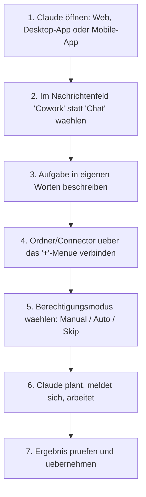

# Ihr erstes Projekt mit Claude Cowork (Schritt für Schritt)

Dieses Kapitel führt durch die ersten Schritte mit **Claude Cowork** – von der Moduswahl im Nachrichtenfeld bis zum abgeschlossenen ersten Projekt. Es baut auf der Einordnung in [Claude Cowork vs. Claude Code vs. Antigravity](claude-cowork-code-antigravity-vergleich.md) auf und übersetzt sie in eine konkrete Anleitung.

!!! note "Voraussetzung"
    Claude Cowork ist Teil der Pro-, Max-, Team- und Enterprise-Pläne auf claude.ai (Enterprise nur nach Freischaltung durch Admins). Ein kostenloser Claude-Account reicht nicht aus.

---

## 🧭 Chat vs. Cowork – der entscheidende Unterschied

Chat und Cowork teilen sich dieselbe Oberfläche, sind aber zwei verschiedene Betriebsarten:

| | Chat | Cowork |
|---|---|---|
| **Charakter** | Gespräch, Frage-Antwort | Arbeitssitzung mit echtem Ergebnis |
| **Dateizugriff** | Nur hochgeladene Dateien | Verbundene Ordner, Apps, Connectors |
| **Ablauf** | Ein Austausch pro Nachricht | Claude plant, führt aus, meldet sich bei Bedarf |
| **Ergebnis** | Text im Chatfenster | Bearbeitete/erzeugte Dateien, erledigte Aufgaben |

---

## 🚀 Schritt für Schritt zum ersten Projekt



1. **Öffnen:** Claude auf `claude.ai`, in der Desktop-App oder in der Mobile-App starten – alle drei greifen auf dieselbe Session-Historie zu.
2. **Cowork statt Chat wählen:** Im Nachrichtenfeld befindet sich ein Umschalter zwischen den beiden Modi.
3. **Aufgabe beschreiben:** Konkret formulieren, was am Ende herauskommen soll (z. B. "Sortiere die Belege im Ordner `Rechnungen/2026` nach Monat und erstelle eine Übersichtstabelle").
4. **Ordner oder Connector verbinden:** Über das **„+"-Menü** im Nachrichtenfeld oder unter **Customize → Connectors** wird festgelegt, auf welche Ordner, Google-Drive-Freigaben, Gmail-Postfächer oder Slack-Workspaces Claude zugreifen darf.
5. **Berechtigungsmodus wählen** (siehe nächster Abschnitt).
6. **Ausführung beobachten:** Ein Fortschrittsanzeiger zeigt Claudes aktuellen Schritt und Begründung; die Sitzung lässt sich jederzeit unterbrechen, umlenken oder von einem anderen Gerät aus einsehen.
7. **Ergebnis prüfen:** Erzeugte oder geänderte Dateien liegen im verbundenen Ordner bzw. werden im Chat verlinkt.

---

## 🔐 Berechtigungsmodi

Ein Modus-Schalter im Nachrichtenfeld bestimmt, wie oft Cowork um Erlaubnis fragt:

| Modus | Verhalten |
|---|---|
| **Manual** | Claude hält vor jeder Aktion an und fragt um Freigabe. |
| **Auto** | Claude prüft Aktionen selbstständig auf Sicherheit und fragt nur bei kritischen Schritten nach. |
| **Skip** | Claude arbeitet ohne Rückfragen durch – nur für vertraute, risikoarme Aufgaben empfohlen. |

!!! warning "Desktop-App muss geöffnet bleiben"
    Lokaler Dateizugriff, Browser-Nutzung und Computer-Steuerung laufen zwar serverseitig in der Cloud, benötigen dafür aber eine **geöffnete und verbundene Claude-Desktop-App** auf dem Rechner mit den betreffenden Dateien. Wird die App geschlossen, pausiert die Aufgabe.

---

## ⚙️ Globale Anweisungen einrichten

Wiederkehrende Vorgaben (Tonfall, Format, Rollen-Kontext) lassen sich einmalig hinterlegen, statt sie bei jeder Aufgabe zu wiederholen:

1. **Settings → Cowork** öffnen.
2. Neben **Global instructions** auf **Edit** klicken.
3. Präferenzen eintragen, z. B. "Antworte immer auf Deutsch, formatiere Tabellen als Markdown, sprich mich per Sie an."
4. **Save** klicken.

---

## 📋 Beispielprojekt: Belege sortieren

=== "Aufgabe"
    ```text
    Öffne alle PDF-Belege im Ordner "Rechnungen/2026", extrahiere Datum,
    Lieferant und Bruttobetrag und erstelle eine Excel-Tabelle
    "Belegübersicht_2026.xlsx" mit einer Zeile pro Beleg.
    ```

=== "Ablauf"
    1. Cowork liest die PDF-Dateien im verbundenen Ordner.
    2. Es meldet sich mit einer kurzen Zusammenfassung des Vorgehens (Plan).
    3. Nach Freigabe (Manual-Modus) extrahiert es die Felder Beleg für Beleg.
    4. Am Ende liegt `Belegübersicht_2026.xlsx` im selben Ordner.

=== "Nächster Schritt"
    Die fertige Tabelle lässt sich in derselben Sitzung direkt weiterverarbeiten lassen, z. B. "Erstelle daraus ein Balkendiagramm nach Kategorie."

---

## 🔗 Verwandte Themen

- [Claude Cowork in der Praxis anwenden](claude-cowork-praxis.md) — weitere Alltagsbeispiele
- [Empfohlene Tools und kostenlose Ressourcen](claude-cowork-tools-ressourcen.md)
- [Claude Cowork in Ihrem Browser nutzen (+Chrome-Erweiterung)](claude-cowork-browser-chrome-erweiterung.md)
- [Claude Cowork von Ihrem Smartphone aus nutzen](claude-cowork-smartphone.md)
- [Claude Cowork unter Linux](claude-cowork-linux.md)
- [Claude Cowork vs. Claude Code vs. Antigravity](claude-cowork-code-antigravity-vergleich.md) — Einordnung ins Gesamtbild
