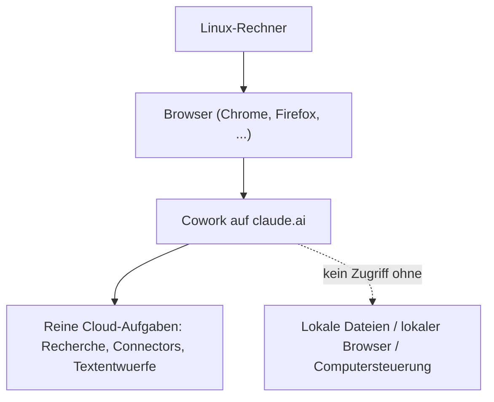

# Und weiter: Claude Cowork unter Linux

Anders als bei Claude Code (das als Terminal-Tool plattformunabhängig läuft) gibt es bei Claude Cowork eine klare Lücke: **Linux gehört bislang nicht zu den offiziell unterstützten Plattformen.** Dieses Kapitel ordnet ein, was auf Linux trotzdem geht – und was nicht.

---

## 🐧 Der aktuelle Stand (08/2026)

| Zugriffsweg | Linux-Status |
|---|---|
| **Claude-Desktop-App** | Nicht offiziell für Linux verfügbar (nur macOS und Windows) |
| **Cowork im Web (`claude.ai`)** | Läuft in jedem modernen Browser, also auch unter Linux |
| **Claude-in-Chrome-Erweiterung** | Läuft, sofern Chrome selbst unter Linux installiert ist |
| **Lokaler Datei-/Browser-/Computerzugriff** | Nicht verfügbar, da dafür die Desktop-App vorausgesetzt wird |

!!! warning "Kein natives Cowork-Desktop-Erlebnis unter Linux"
    Ohne Claude-Desktop-App fehlt Linux-Nutzer:innen die Komponente, die lokale Dateien liest, den lokalen Browser steuert oder Aktionen direkt auf dem Rechner ausführt. Das schränkt Cowork unter Linux auf **reine Cloud-Aufgaben** ein.

---

## ✅ Was unter Linux funktioniert

- **Cowork im Browser nutzen:** Über `claude.ai` (siehe [Browser-Kapitel](claude-cowork-browser-chrome-erweiterung.md)) lassen sich Aufgaben starten, die ausschließlich mit Connectors (Gmail, Slack, Google Drive) und cloudseitigen Daten arbeiten.
- **Chrome-Erweiterung:** Läuft unter Linux, sofern Google Chrome selbst installiert ist – für Aufgaben innerhalb des Browsers (Formulare, Web-Portale) unabhängig vom Betriebssystem.
- **Fernsteuerung eines Mac/Windows-Rechners:** Läuft die Desktop-App auf einem separaten Mac- oder Windows-System, lässt sich eine dort gestartete Sitzung von Linux aus über den Browser oder die Mobile-App verfolgen und lenken (siehe [Smartphone-Kapitel](claude-cowork-smartphone.md) – dasselbe Prinzip gilt für jeden Zweitrechner).

---

## ❌ Was unter Linux nicht funktioniert

- Kein lokaler Dateizugriff auf Ordner des Linux-Rechners selbst.
- Keine Steuerung eines lokal auf Linux installierten Browsers durch Cowork (nur die Chrome-Erweiterung im Chrome-eigenen Kontext).
- Keine direkten Computer-Aktionen (Klicks, Tastatureingaben außerhalb des Browsers) auf dem Linux-System.

!!! danger "Von inoffiziellen Linux-Repacks abraten"
    Vereinzelt kursieren inoffizielle, nicht von Anthropic stammende Linux-Pakete oder Wine-Wrapper für die Claude-Desktop-App. Solche Fremdbuilds sollten **nicht installiert** werden: Es gibt keine Garantie für Integrität oder Sicherheit des Codes, und sie können bei einem Tool mit Datei- und Browserzugriff erheblichen Schaden anrichten. Bis Anthropic offiziell Linux unterstützt, bleibt der Web-Zugriff der sichere Weg.

---

## 🔗 Verwandte Themen

- [Ihr erstes Projekt mit Claude Cowork](claude-cowork-erstes-projekt.md)
- [Claude Cowork in der Praxis anwenden](claude-cowork-praxis.md)
- [Empfohlene Tools und kostenlose Ressourcen](claude-cowork-tools-ressourcen.md)
- [Claude Cowork in Ihrem Browser nutzen (+Chrome-Erweiterung)](claude-cowork-browser-chrome-erweiterung.md)
- [Claude Cowork von Ihrem Smartphone aus nutzen](claude-cowork-smartphone.md)
- [Claude Cowork vs. Claude Code vs. Antigravity](claude-cowork-code-antigravity-vergleich.md) — Claude Code läuft dagegen als Terminal-Tool nativ auf Linux
