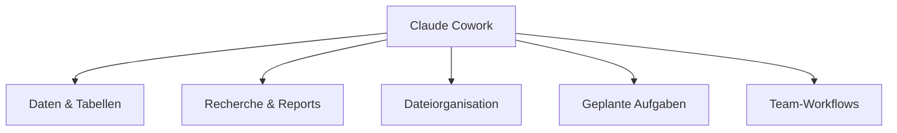

# Claude Cowork in der Praxis anwenden

Nach dem [ersten Projekt](claude-cowork-erstes-projekt.md) stellt sich die Frage: Wofür lohnt sich Cowork im Alltag wirklich? Dieses Kapitel ordnet die gängigsten Anwendungsfälle nach Themenfeld und liefert konkrete Beispiel-Prompts.

---

## 🗂️ Themenfelder im Überblick



---

## 📊 Daten & Tabellen

Cowork liest bestehende Dateien direkt, ohne Copy-Paste-Umweg:

- CSV-Dateien bereinigen: Spalten normalisieren, Duplikate entfernen, Ausreißer markieren.
- Aus einer Rohdatentabelle eine analysefertige Excel-Datei mit berechneten Spalten erstellen.
- Zahlen aus einer bestehenden Tabelle ziehen, ein Diagramm aktualisieren und das Ergebnis direkt speichern.

```text
Öffne "Umsatz_Q2.xlsx", berechne die monatliche Wachstumsrate je Produktlinie
und füge ein Balkendiagramm auf einem neuen Tabellenblatt "Auswertung" ein.
```

---

## 🔎 Recherche & Reports

Bei mehreren Quellen in einem Ordner (PDFs, Transkripte, Notizen) übernimmt Cowork die Synthese:

- Mehrere PDF-Studien einlesen und eine Meta-Analyse mit gemeinsamen Kennzahlen erstellen.
- Interview-Transkripte auf wiederkehrende Themen durchsuchen und strukturiert zusammenfassen.
- Aus verstreuten Recherchenotizen einen zusammenhängenden Bericht mit Quellenangaben verfassen.

```text
Lies alle PDF-Dateien im Ordner "Studien/Wettbewerbsanalyse", identifiziere
gemeinsame KPIs und fasse die Ergebnisse in einer Seite als Management-Summary
zusammen.
```

---

## 🗃️ Dateiorganisation

- Downloads-Ordner nach Dateityp und Datum sortieren.
- Projektordner nach einem vorgegebenen Namensschema umbenennen.
- Doppelte oder veraltete Dateiversionen erkennen und zur Löschung vorschlagen (Cowork löscht nichts endgültig ohne Freigabe).

---

## ⏰ Geplante Aufgaben

Ein oft unterschätzter Anwendungsfall: eine Aufgabe **einmal** einrichten, danach läuft sie automatisch.

!!! tip "Beispiel: wöchentliches Marketing-Briefing"
    "Erstelle jeden Montagmorgen um 7 Uhr eine Zusammenfassung der Website-Zugriffe und Neuanmeldungen der Vorwoche aus den verbundenen Analytics- und CRM-Connectors und lege sie als Briefing-Dokument ab."

Geplante Aufgaben laufen serverseitig – die Desktop-App muss dafür zum Ausführungszeitpunkt nicht zwingend geöffnet sein, solange keine lokalen Dateien oder der lokale Browser benötigt werden.

---

## 👥 Team-Workflows

Über Connectors (Google Drive, Gmail, Slack u. a.) lassen sich Aufgaben team-übergreifend anstoßen:

| Connector | Typischer Einsatz |
|---|---|
| **Gmail** | Eingehende Rechnungen erkennen, Daten extrahieren, Antwortentwurf vorbereiten (unversendet, zur Freigabe). |
| **Slack** | Diskussionen aus einem Kanal zusammenfassen und als Protokoll ablegen. |
| **Google Drive** | Freigegebene Dokumente mehrerer Personen konsolidieren. |

!!! warning "Freigabe vor dem Versand"
    Cowork legt E-Mails, Nachrichten oder Freigaben standardmäßig **unversendet** zur Prüfung an – der Versand selbst bleibt eine bewusste, manuelle Aktion.

---

## 🔗 Verwandte Themen

- [Ihr erstes Projekt mit Claude Cowork](claude-cowork-erstes-projekt.md)
- [Empfohlene Tools und kostenlose Ressourcen](claude-cowork-tools-ressourcen.md)
- [Claude Cowork in Ihrem Browser nutzen (+Chrome-Erweiterung)](claude-cowork-browser-chrome-erweiterung.md)
- [Claude Cowork von Ihrem Smartphone aus nutzen](claude-cowork-smartphone.md)
- [Claude Cowork unter Linux](claude-cowork-linux.md)
- [Claude Cowork vs. Claude Code vs. Antigravity](claude-cowork-code-antigravity-vergleich.md)
