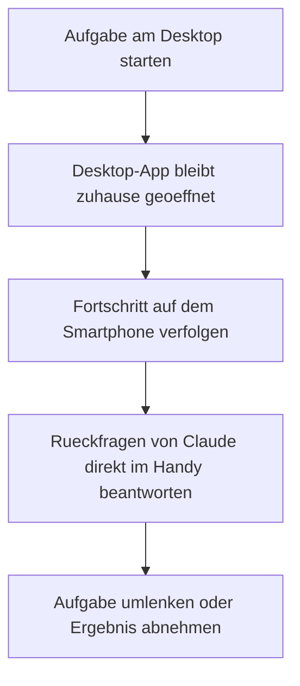

# Claude-News: Nutzen Sie Claude Cowork von Ihrem Smartphone aus

Seit dem 7. Juli 2026 gehört Cowork auch zur mobilen Claude-App – ohne eigene Zusatz-App. Dieses Kapitel fasst zusammen, was auf dem Smartphone tatsächlich möglich ist und wo die Grenzen liegen.

---

## 📱 Keine separate App nötig

Claude Cowork lebt direkt in der **Seitenleiste der bestehenden Claude-App** für iOS und Android. Eine Installation der Mobile-App genügt – ein Update oder Zusatzprodukt ist nicht erforderlich.

**Verfügbarkeit (Stand 08/2026):** Beta für Pro-, Max- und Team-Pläne; Enterprise nach Freischaltung durch Admins.

---

## ✅ Was vom Smartphone aus funktioniert

- **Sitzungen geräteübergreifend fortsetzen:** Eine am Rechner gestartete Aufgabe lässt sich vom Handy aus einsehen, kommentieren und umlenken.
- **Neue Aufgaben per Text anstoßen:** Eine Aufgabe lässt sich direkt aus der mobilen App heraus formulieren; die Ausführung übernimmt das verbundene Desktop-System oder rein cloudbasierte Connectors.
- **Geplante Aufgaben verwalten:** Ergebnisse geplanter Jobs (siehe [Praxis-Kapitel](claude-cowork-praxis.md)) lassen sich unterwegs prüfen.

---

## ⚠️ Was das Smartphone nicht ersetzt

!!! warning "Kein Fernzugriff auf den heimischen Rechner ohne laufende Desktop-App"
    Das Smartphone dient zur **Steuerung und Beobachtung**, nicht als eigenständige Ausführungsumgebung für lokale Dateien. Aufgaben, die auf lokale Ordner, den lokalen Browser oder direkte Computer-Steuerung angewiesen sind, benötigen weiterhin eine geöffnete und verbundene **Claude-Desktop-App** auf dem jeweiligen Rechner – das Handy schickt nur den Befehl, die Ausführung passiert dort.

Reine Cloud-Aufgaben (Recherche über Connectors, Textentwürfe, Auswertung bereits verbundener Dienste wie Gmail oder Slack) laufen dagegen unabhängig vom Desktop-Status.

---

## 🧭 Typischer Ablauf: Aufgabe zuhause starten, unterwegs prüfen

1. Am heimischen Rechner eine Aufgabe in Cowork starten (Desktop-App bleibt geöffnet).
2. Unterwegs die Claude-Mobile-App öffnen und dieselbe Sitzung aus der Historie öffnen.
3. Fortschritt und Zwischenergebnisse einsehen.
4. Bei einer Rückfrage von Claude direkt im Handy antworten – die Ausführung läuft am Desktop-Rechner weiter.
5. Nach Rückkehr an den Rechner das fertige Ergebnis lokal übernehmen.

---

## 🔗 Verwandte Themen

- [Ihr erstes Projekt mit Claude Cowork](claude-cowork-erstes-projekt.md)
- [Claude Cowork in der Praxis anwenden](claude-cowork-praxis.md)
- [Empfohlene Tools und kostenlose Ressourcen](claude-cowork-tools-ressourcen.md)
- [Claude Cowork in Ihrem Browser nutzen (+Chrome-Erweiterung)](claude-cowork-browser-chrome-erweiterung.md)
- [Claude Cowork unter Linux](claude-cowork-linux.md)
- [Claude Cowork vs. Claude Code vs. Antigravity](claude-cowork-code-antigravity-vergleich.md)
