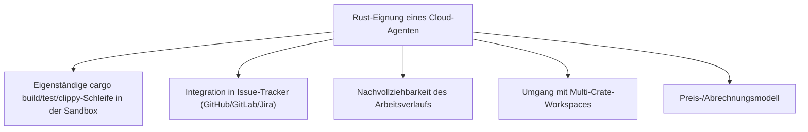
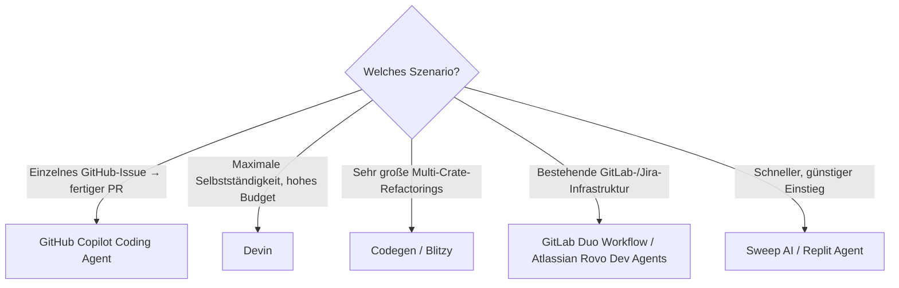

# Beste Cloud-Agenten für Rust-Programmierung — Top-20-Topliste

Die [Agenten-Topliste](ki-agenten-rust-topliste.md) bewertet interaktive Werkzeuge, die im eigenen Terminal oder Editor mitlaufen und bei jedem Schritt Rückmeldung geben. **Cloud-Agenten** funktionieren anders: Eine Aufgabe (Issue, Ticket, PR-Beschreibung) wird eingereicht, der Agent arbeitet vollständig **asynchron in einer eigenen Cloud-Sandbox** — klont das Repository, baut, testet, iteriert selbstständig — und liefert am Ende einen fertigen Pull Request zur Prüfung. Kein Terminal, das offen bleiben muss, keine Echtzeit-Interaktion nötig. Diese Seite ordnet die verbreiteten Cloud-Agenten danach ein, wie zuverlässig sie das speziell bei Rust umsetzen.

!!! note "Hinweis: Cloud-Agent ≠ lokaler Agent"
    Werkzeuge wie Claude Code, Cline oder Aider aus der [Agenten-Topliste](ki-agenten-rust-topliste.md) laufen in der eigenen Entwicklungsumgebung und erfordern eine aktive Sitzung. Cloud-Agenten laufen unabhängig davon in einer eigenen, meist containerisierten Sandbox weiter — auch wenn der eigene Rechner ausgeschaltet ist. Einige Anbieter (Devin, Replit Agent) bieten inzwischen beide Betriebsarten an; bewertet wird hier ausschließlich der Cloud-/Async-Modus.

---

## Bewertungskriterien

!!! warning "Achtung: Junge Produktkategorie, hohe Veränderungsgeschwindigkeit"
    Cloud-Agenten sind eine der jüngsten Kategorien in diesem KI-Coding-Vergleich — Funktionsumfang, Preise und Erfolgsquoten ändern sich schneller als bei etablierten IDE-Plugins. Die Einordnung unten ist eine **Momentaufnahme (Stand: Juli 2026)**, ein eigener Test am konkreten Rust-Repository ersetzt sie nicht.

---

## Top 20 im Überblick

| Rang | Cloud-Agent | Anbieter | Rust-Einschätzung | Besondere Stärke | Schwäche |
|---|---|---|---|---|---|
| 1 | **Devin** | Cognition Labs | Sehr stark | Eigene vollständige Entwicklungsumgebung inkl. Browser/Terminal in der Sandbox, sehr gute mehrstufige Selbstkorrektur bei Borrow-Checker-Fehlern | Hoher Preis, für kurze Rust-Fixes meist überdimensioniert |
| 2 | **GitHub Copilot Coding Agent** | GitHub/Microsoft | Sehr stark | Direkt an GitHub Issues gekoppelt, öffnet automatisch einen Draft-PR mit nachvollziehbarem Commit-Verlauf | Rust-Vorschläge in Randfällen etwas hinter Devin/Jules |
| 3 | **Google Jules** | Google | Stark | Gemini-3.1-Pro-Basis mit großem Kontextfenster, gute Übersicht über Änderungen vor dem Merge | Coding-spezifisches Tooling jünger als bei GitHub-Pendant |
| 4 | **Cursor Background Agents** | Anysphere | Stark | Nahtloser Übergang zwischen interaktivem Cursor-Agent und asynchronem Cloud-Lauf für dieselbe Aufgabe | Setzt eine bestehende Cursor-Nutzung voraus |
| 5 | **OpenAI Codex Cloud Agent** | OpenAI | Stark | GPT-5.6-Sol-Basis, gute Integration in bestehende ChatGPT-/Team-Workflows | Sandbox-Transparenz (welche Befehle liefen) weniger detailliert als bei Devin |
| 6 | **Augment Code (Augment Agent)** | Augment | Stark | Sehr tiefes Codebase-Kontextverständnis bei großen Rust-Workspaces mit vielen Crates | Kleinere Community/Praxis-Berichte als die Top 5 |
| 7 | **GitLab Duo Workflow** | GitLab | Solide bis stark | Direkt in bestehende GitLab-CI/CD-Pipelines eingebettet, guter Fit bei GitLab-basierten Rust-Projekten | Modellwahl weniger transparent als bei eigenständigen Agenten |
| 8 | **Codegen** | Codegen.com | Solide bis stark | Ausgelegt auf große, mehrstufige Refactorings über viele Dateien hinweg | Für kleine Einzelaufgaben eher überdimensioniert |
| 9 | **Amazon Q Developer (/dev-Agent)** | AWS | Solide | Gute Integration in AWS-native Rust-Projekte (Lambda, Cloud-Infrastruktur) | Allgemeine Rust-Idiomatik seltener im Fokus als bei Top 5 |
| 10 | **Factory AI (Droids)** | Factory | Solide | Auf Enterprise-Workflows zugeschnitten, mehrere spezialisierte „Droids" für unterschiedliche Aufgabentypen | Einstieg eher auf Teams als auf Einzelentwickler ausgelegt |
| 11 | **Genie (Cosine)** | Cosine | Solide | Guter Fokus auf nachvollziehbare, testgetriebene Änderungen | Kleinere Verbreitung, weniger Rust-spezifisches Praxis-Feedback |
| 12 | **Replit Agent (Cloud-Modus)** | Replit | Solide | Sehr niedrige Einstiegshürde direkt im Browser, gut für Prototypen | Für produktionsnahe Multi-Crate-Workspaces weniger ausgelegt |
| 13 | **Poolside** | Poolside | Solide | Eigenes trainiertes Modell mit Fokus auf Enterprise-Codebasen | Rust im Vergleich zu Python/Java seltener der primäre Trainingsfokus |
| 14 | **Blitzy** | Blitzy | Ausreichend bis solide | Ausgelegt auf sehr große autonome Codegenerierungs-Läufe (ganze Module) | Weniger geeignet für punktuelle, kleine Rust-Fixes |
| 15 | **Sweep AI** | Sweep | Ausreichend bis solide | Leichtgewichtiger, günstiger Issue-zu-PR-Bot | Weniger ausgereifte Selbstkorrektur bei komplexen Lifetime-Fehlern |
| 16 | **Atlassian Rovo Dev Agents** | Atlassian | Ausreichend bis solide | Guter Fit bei bestehender Jira-/Bitbucket-Infrastruktur | Rust-spezifische Erfolgsquote seltener dokumentiert als bei GitHub-nahen Agenten |
| 17 | **Magic AI** | Magic.dev | Ausreichend | Sehr langes Kontextfenster für große Rust-Monorepos | Öffentliche Verfügbarkeit/Praxis-Erfahrung geringer als bei etablierten Anbietern |
| 18 | **CodeRabbit (Autonomous Fix)** | CodeRabbit | Ausreichend | Primär Code-Review-Tool, Autonomous-Fix-Modus für einfache Korrekturen brauchbar | Kein vollwertiger eigenständiger Feature-Entwicklungs-Agent |
| 19 | **Traycer** | Traycer | Ausreichend | Fokus auf Planungsschritt vor der eigentlichen Codegenerierung, gut für komplexe Refactoring-Vorhaben | Jüngeres Produkt, kleinere Nutzerbasis |
| 20 | **Terragon Labs** | Terragon | Grundlegend | Günstiger Einstieg in asynchrones Cloud-Coding | Deutlich kleinere Erfolgsquote-Dokumentation als etablierte Top 10 |

!!! tip "Tipp: Rang ≠ einzige Entscheidungsgröße"
    Für **klar abgegrenzte, ticketbasierte Aufgaben** (Bug-Fix, kleines Feature) sind die Top 5 aktuell am zuverlässigsten. Für **sehr große, mehrstufige Refactorings über viele Rust-Crates** lohnt sich ein Blick auf Codegen oder Blitzy, die explizit auf diesen Anwendungsfall ausgelegt sind statt auf einzelne Tickets.

---

## Die Top 5 im Detail

### 1. Devin (Cognition Labs)

Der bekannteste Cloud-Agent verfügt über eine vollständige eigene Entwicklungsumgebung inklusive Browser und Terminal in der Sandbox — dadurch kann Devin bei Rust-Aufgaben nicht nur `cargo build`/`clippy` ausführen, sondern auch Crate-Dokumentation im Web nachschlagen, wenn eine API unklar ist. Die mehrstufige Selbstkorrektur bei Borrow-Checker-Fehlern gehört zu den zuverlässigsten in dieser Liste, bei entsprechend hohem Preis.

### 2. GitHub Copilot Coding Agent

Direkt an ein GitHub Issue gekoppelt: Zuweisung des Agenten öffnet automatisch einen Draft-Pull-Request, dessen Commit-Verlauf jeden Zwischenschritt nachvollziehbar macht. Für Teams, die ohnehin über GitHub Issues arbeiten, die reibungsloseste Integration unter den Top 5 — kein separates Tool, kein Kontextwechsel.

### 3. Google Jules

Profitiert vom großen Kontextfenster von Gemini 3.1 Pro (siehe [Sprachmodell-Topliste](llm-rust-topliste.md)) — bei großen Multi-Crate-Rust-Workspaces bleiben Änderungen dadurch konsistent über viele Module hinweg. Die Übersichtsansicht vor dem Merge zeigt Änderungen kompakt und nachvollziehbar an.

### 4. Cursor Background Agents

Besonders praktisch für Teams, die bereits Cursor als interaktiven Editor nutzen ([Agenten-Topliste](ki-agenten-rust-topliste.md)): Dieselbe Aufgabe kann bei Bedarf nahtlos vom interaktiven in den asynchronen Cloud-Modus wechseln, ohne Kontextverlust zwischen beiden Betriebsarten.

### 5. OpenAI Codex Cloud Agent

Nutzt GPT-5.6 Sol als Backend-Modell und fügt sich gut in bestehende ChatGPT-Team-Workflows ein. Die Sandbox-Transparenz — welche konkreten Befehle während der Bearbeitung liefen — ist etwas weniger detailliert einsehbar als bei Devin, dafür ist der Einstieg für bestehende ChatGPT-Nutzer besonders niedrigschwellig.

---

## Empfehlung nach Einsatzszenario

!!! warning "Achtung: Fertige PRs immer vollständig reviewen"
    Da Cloud-Agenten ohne Zwischenbestätigung arbeiten, sollte der resultierende Pull Request genauso gründlich geprüft werden wie der eines menschlichen Beitragenden — insbesondere bei `unsafe`-Code, FFI-Grenzen oder sicherheitskritischen Modulen. Ein grüner CI-Lauf bestätigt nur, dass der Code kompiliert und Tests bestehen, nicht, dass die Änderung inhaltlich korrekt und sicher ist.

---

## 🔗 Verwandte Themen

- [Startseite](../../index.md) — zurück zur Dokumentations-Zentrale
- [Beste KI-Coding-Agenten für Rust-Programmierung (Top 20)](ki-agenten-rust-topliste.md) — das interaktive/lokale Gegenstück
- [Beste Sprachmodelle für Rust-Programmierung (Top 20)](llm-rust-topliste.md) — welches Modell hinter dem jeweiligen Cloud-Agenten läuft
- [Beste KI-Assistenten & Code-Editoren für Rust-Programmierung (Top 20)](ki-assistenten-rust-topliste.md)
- [Beste IDEs & Editoren mit Rust-Unterstützung (Top 20)](../../entwicklung/system/rust-ide-topliste.md)
- [Beste Aggregatoren & Multi-Modell-Provider für Rust-Programmierung (Abo-Abrechnung, Top 20)](llm-aggregatoren-abo-rust-topliste.md)
- [Beste Cloud-KI-Agenten (Allgemein, Top 20)](cloud-ki-agenten-topliste.md) — nicht Rust-/coding-spezifische Variante
