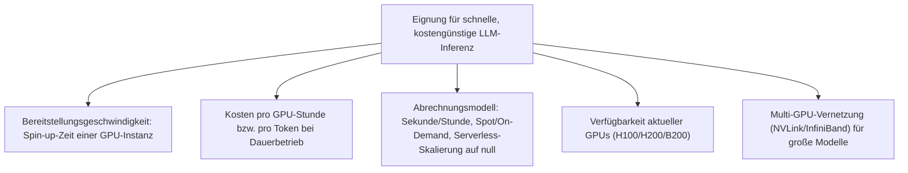
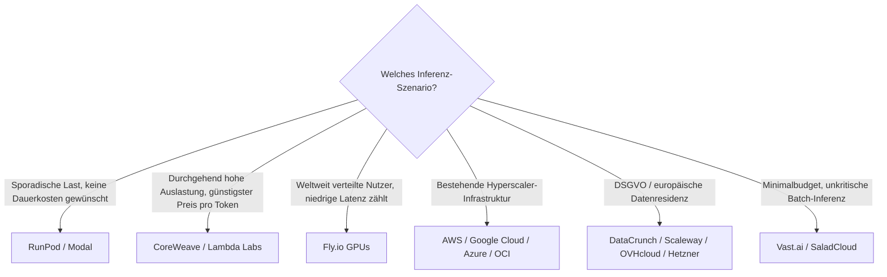

# Beste Cloud-GPU-Anbieter für KI-Workloads & LLM-Inferenz — Top-20-Topliste

Wer ein Sprachmodell selbst betreiben will — für Inferenz, Fine-Tuning oder Batch-Verarbeitung — statt eine fertige API zu nutzen, braucht dafür gemietete NVIDIA-GPU-Rechenleistung. Diese Seite vergleicht die verbreiteten Cloud-Anbieter dafür, mit Fokus auf die beiden Kriterien, die bei LLM-Inferenz-Workloads am stärksten ins Gewicht fallen: **wie schnell** eine GPU-Instanz einsatzbereit ist und **wie günstig** sich damit tatsächlich pro Anfrage/Token rechnen lässt — bewusst getrennt von fertigen Inferenz-APIs, bei denen kein eigener Server-Betrieb nötig ist.

!!! note "Hinweis: GPU-Miete ≠ fertige Inferenz-API"
    Bei den hier gelisteten Anbietern wird **Rechenleistung** gemietet (GPU-Stunde, VRAM, Netzwerk) — Modellwahl, Serving-Software ([vLLM](vllm-high-throughput-serving.md), [Ollama](lokales-rag-ollama.md), TGI) und Betrieb liegen vollständig in eigener Verantwortung. Wer stattdessen ein bereits gehostetes Modell per API ansprechen möchte, findet passende Anbieter in der [Aggregatoren-Topliste](llm-aggregatoren-rust-topliste.md) oder [Direkt-Anbieter-Topliste](llm-direktanbieter-rust-topliste.md). Für eine modellspezifische Vertiefung (welche GPU für welches offene Rust-Coding-Modell) siehe die [Cloud-GPU-Provider-Topliste für Rust-Coding-Modelle](cloud-gpu-provider-rust-topliste.md) — diese Seite bewertet dieselbe Anbieterlandschaft allgemeiner, mit Fokus auf Bereitstellungsgeschwindigkeit und Inferenzkosten statt auf ein einzelnes Modell-Ökosystem.

---

## Bewertungskriterien

!!! warning "Achtung: Preise & GPU-Verfügbarkeit schwanken stark"
    GPU-Preise reagieren empfindlich auf Angebot und Nachfrage — Spot-Preise können sich innerhalb von Tagen deutlich ändern, neue Kartengenerationen (H200, B200) verschieben ganze Preisstufen. Die Einordnung unten ist eine **Momentaufnahme (Stand: August 2026)** zur Größenordnung — vor Buchung immer die aktuelle Preisseite des Anbieters prüfen.

---

## Top 20 im Überblick

| Rang | Anbieter | Typ | Spin-up-Geschwindigkeit | Besondere Stärke | Schwäche |
|---|---|---|---|---|---|
| 1 | **RunPod** | Serverless-GPU + Pods | Sekunden (Serverless) | Sekundengenaue Abrechnung, Skalierung auf null bei Inferenz-Lastspitzen, fertige vLLM-/Ollama-Templates | Community-Cloud-Instanzen weniger verlässlich als „Secure Cloud"-Tier |
| 2 | **Modal** | Serverless-GPU (Entwickler-First) | Sekunden (Serverless) | Automatische Skalierung nach Anfragevolumen, sehr gute Entwicklererfahrung für Inferenz-Endpunkte | Abrechnung pro Funktionsaufruf weniger planbar bei konstant hoher Auslastung |
| 3 | **CoreWeave** | GPU-Cloud (Enterprise) | Minuten | Sehr große H100/H200-Cluster mit InfiniBand — günstigster Preis pro Token bei Dauerlast auf großen Modellen | Setup eher auf größere Teams zugeschnitten als auf schnellen Einzeleinsatz |
| 4 | **Lambda Labs** | GPU-Cloud (ML-fokussiert) | Minuten | Gutes On-Demand-Preisniveau für H100, reservierte Cluster für planbare Dauerlast | Kapazität bei Spitzenlast teils ausgebucht |
| 5 | **Nebius AI Cloud** | GPU-Cloud + Inferenz-API | Minuten | Guter H100-Zugang bei wettbewerbsfähigem Preis, zusätzlich fertige Inferenz-Endpunkte als Alternative zum Eigenbetrieb | Preistabelle für reines GPU-Hosting nicht immer vollständig öffentlich |
| 6 | **Voltage Park** | GPU-Cloud (H100-fokussiert) | Minuten | Großes H100-Cluster zu vergleichsweise günstigen Konditionen | Kleineres Zusatz-Ökosystem (Templates, Support) als Top 3 |
| 7 | **Crusoe Cloud** | GPU-Cloud (Clean Energy) | Minuten | Wachsende H100-Kapazität bei günstigen Konditionen durch Abwärme-/Flare-Gas-Nutzung | Kleinere Gesamtkapazität als die großen Hyperscaler |
| 8 | **AWS (EC2 P5/P4/G5)** | Hyperscaler | Minuten | Breitestes Ökosystem, nahtlose Integration in bestehende AWS-Infrastruktur | Preisniveau über spezialisierten GPU-Clouds bei On-Demand-Buchung |
| 9 | **Google Cloud (A3/A2 + TPU)** | Hyperscaler | Minuten | Sehr gute Skalierung für große Cluster, TPU als kosteneffiziente Alternative für sehr hohe Inferenz-Durchsätze | Setup-Komplexität höher als bei spezialisierten Anbietern |
| 10 | **Oracle Cloud Infrastructure (OCI)** | Hyperscaler | Minuten | Wettbewerbsfähige GPU-Preise, Bare-Metal-H100-Cluster verfügbar | Ökosystem/Community kleiner als bei AWS/GCP |
| 11 | **Microsoft Azure (NC/ND-Serie)** | Hyperscaler | Minuten | Gute Integration in bestehende Microsoft-/Enterprise-Verträge | GPU-Verfügbarkeit regional teils eingeschränkt |
| 12 | **DataCrunch** | GPU-Cloud (europäisch) | Minuten | Gute H100-Preise bei europäischem Standort (DSGVO-relevant) | Kleineres Angebot an Zusatzdiensten als Hyperscaler |
| 13 | **Paperspace (DigitalOcean)** | GPU-Cloud + Notebooks | Minuten | Einfacher Einstieg über Gradient-Notebooks, gut zum schnellen Prototyping | Für große Multi-GPU-Cluster weniger ausgelegt als CoreWeave/Lambda |
| 14 | **Fly.io GPUs** | Edge-/Serverless-GPU | Sekunden bis Minuten | Kombiniert GPU-Instanzen mit globalem Edge-Netzwerk — niedrige Latenz für weltweit verteilte Inferenz-Nutzer | Kleinerer GPU-Katalog als reine GPU-Cloud-Spezialisten |
| 15 | **Scaleway (GPU Instances)** | GPU-Cloud (europäisch) | Minuten | DSGVO-Standort, einfache Buchung ab kleinen Instanzgrößen | Aktuellste GPU-Generationen (H200/B200) seltener sofort verfügbar |
| 16 | **OVHcloud (GPU Instances)** | GPU-Cloud (europäisch) | Minuten | Europäischer Anbieter mit planbaren Festpreisen | Kleinerer Katalog an High-End-GPU-Optionen |
| 17 | **Genesis Cloud** | GPU-Cloud (europäisch, erneuerbar) | Minuten | Europäischer Standort mit Fokus auf erneuerbare Energie | Kleinerer GPU-Katalog als globale Anbieter |
| 18 | **Hetzner (GPU-Server)** | Budget-Cloud (europäisch) | Minuten bis Stunden | Sehr günstige Festpreise, bekannte europäische Infrastruktur | Katalog auf ältere/kleinere GPU-Typen beschränkt |
| 19 | **Vast.ai** | GPU-Marktplatz | Minuten | Sehr günstige Preise durch Marktplatzmodell, große Auswahl an Kartentypen | Verlässlichkeit hängt vom jeweiligen privaten Anbieter ab — eher für Tests |
| 20 | **SaladCloud** | Verteiltes Consumer-GPU-Netz | Minuten | Extrem günstig durch ungenutzte Consumer-Hardware — niedrigste Kosten pro Token dieser Liste | Instanzen jederzeit unterbrechbar — nur für unkritische Batch-Inferenz geeignet |

---

## Highlights im Detail

### Rang 1–2: Serverless als schnellster Weg zu produktiver LLM-Inferenz
RunPod und Modal lösen das „schnell **und** kostengünstig"-Kriterium am konsequentesten: Beide skalieren GPU-Kapazität automatisch mit dem Anfragevolumen bis auf null herunter — bei sporadischer oder stark schwankender Inferenz-Last entstehen so keine Kosten für ungenutzte Wartezeit, während ein On-Demand-Anbieter (Rang 3–13) durchgehend für eine gebuchte Instanz zahlt, unabhängig von der tatsächlichen Auslastung.

### Rang 3–4: die günstigste Wahl bei vorhersehbarer Dauerlast
Sobald ein LLM-Inferenz-Dienst durchgehend hohe Auslastung hat, kippt die Rechnung zugunsten reservierter Kapazität — CoreWeave und Lambda Labs bieten hier den niedrigsten Preis pro Token, weil keine Serverless-Marge für Elastizität eingepreist ist, die bei Dauerbetrieb ohnehin nicht gebraucht wird.

### Rang 14: Latenz statt reiner Rechenkosten als Entscheidungsgröße
Fly.io GPUs verschiebt den Fokus von „günstigste GPU-Stunde" auf „niedrigste Antwortzeit für den Endnutzer" — durch die Kombination aus GPU-Instanzen und einem global verteilten Edge-Netzwerk lohnt sich dieser Anbieter besonders für interaktive LLM-Inferenz mit weltweit verteilten Nutzern, weniger für reine Batch-Verarbeitung.

### Rang 19–20: niedrigste Kosten, höchstes Ausfallrisiko
Vast.ai und SaladCloud erreichen die niedrigsten Kosten pro Token dieser Liste, indem sie ungenutzte Kapazität Dritter bzw. Consumer-Hardware vermitteln — beide eignen sich für unkritische Batch-Inferenz oder Preisvergleiche, nicht für Produktivbetrieb mit Verfügbarkeitsanforderungen.

---

## Empfehlung nach Einsatzszenario

!!! tip "Tipp: Modellspezifische Vertiefung"
    Für die Frage, welche GPU-Größe zu welchem offenen Modell passt (z. B. 70B+ mit Tensor-Parallelismus), bietet die [Cloud-GPU-Provider-Topliste für Rust-Coding-Modelle](cloud-gpu-provider-rust-topliste.md) eine modellorientierte Vertiefung derselben Anbieterlandschaft.

---

## 🔗 Verwandte Themen

- [Startseite](../../index.md) — zurück zur Dokumentations-Zentrale
- [Beste Cloud-Provider für GPU-Hosting eigener Rust-Coding-Modelle (Top 20)](cloud-gpu-provider-rust-topliste.md) — modellorientierte Schwester-Topliste derselben Anbieterlandschaft
- [Lokales RAG & LLM-Serving](lokales-rag-ollama.md) — Ollama-Setup auf eigener oder gemieteter Hardware
- [vLLM High-Throughput Serving](vllm-high-throughput-serving.md) — produktionsreifes Self-Hosting für hohen Durchsatz
- [Beste Aggregatoren & Multi-Modell-Provider für Rust-Programmierung (Top 20)](llm-aggregatoren-rust-topliste.md) — Alternative ohne eigenen Infrastrukturbetrieb
- [Beste Direkt-Anbieter (Offizielle Entwickler-APIs) für Rust-Programmierung (Top 20)](llm-direktanbieter-rust-topliste.md) — Alternative ohne eigenen Infrastrukturbetrieb
- [Local LLM Fine-Tuning (Unsloth)](lora-finetuning-unsloth.md) — eigene Modelle auf gemieteten GPUs nachtrainieren
- [Beste Cloud-Agenten für Rust-Programmierung (Top 20)](cloud-agenten-rust-topliste.md) — asynchrone Cloud-Sandbox-Agenten als Gegenmodell zum eigenen GPU-Betrieb
