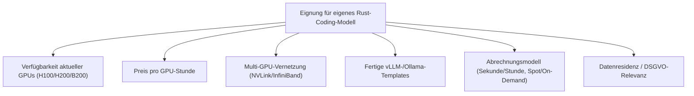
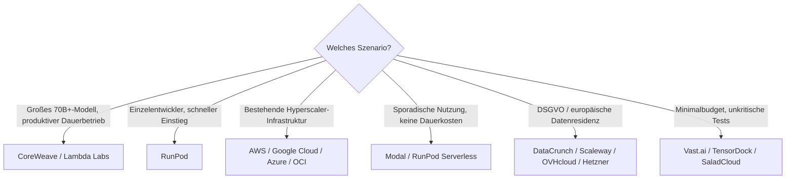

# Beste Cloud-Provider für GPU-Hosting eigener Rust-Coding-Modelle — Top-20-Topliste

Wer starke offene Rust-Modelle wie GLM-5.1, Qwen 3.7 oder DeepSeek V4 Pro nicht über eine API, sondern **selbst gehostet** betreiben will — aus Datenschutzgründen, für volle Kostenkontrolle bei Dauerlast oder für eigenes Fine-Tuning — braucht dafür gemietete GPU-Rechenleistung statt eigener Hardware. Diese Seite vergleicht die verbreiteten Cloud-Provider, die genau das anbieten: rohe GPU-Instanzen oder Serverless-GPU-Zeit, auf denen [vLLM](vllm-high-throughput-serving.md) oder [Ollama](lokales-rag-ollama.md) mit einem selbst gewählten Modell laufen — bewusst getrennt von den fertigen Inferenz-APIs der [Aggregatoren-](llm-aggregatoren-rust-topliste.md) und [Direkt-Anbieter-Topliste](llm-direktanbieter-rust-topliste.md).

!!! note "Hinweis: GPU-Hosting ≠ Inferenz-API"
    Bei den hier gelisteten Anbietern wird **Rechenleistung** gemietet (GPU-Stunde, VRAM, Netzwerk) — das Modell, der Server (vLLM/Ollama/TGI) und der Betrieb liegen vollständig in eigener Verantwortung. Wer stattdessen ein bereits gehostetes Modell per API ansprechen möchte, findet die passenden Anbieter in der [Aggregatoren-Topliste](llm-aggregatoren-rust-topliste.md) oder [Direkt-Anbieter-Topliste](llm-direktanbieter-rust-topliste.md).

---

## Bewertungskriterien

!!! warning "Achtung: Preise & GPU-Verfügbarkeit schwanken stark"
    GPU-Preise reagieren empfindlich auf Angebot und Nachfrage — Spot-Preise können sich innerhalb von Tagen deutlich ändern, neue Kartengenerationen (H200, B200) verschieben ganze Preisstufen. Die Einordnung unten ist eine **Momentaufnahme (Stand: Juli 2026)** zur Größenordnung — vor Buchung immer die aktuelle Preisseite des Anbieters prüfen.

---

## Top 20 im Überblick

| Rang | Anbieter | Typ | Eignung | Besondere Stärke | Schwäche |
|---|---|---|---|---|---|
| 1 | **CoreWeave** | GPU-Cloud (Enterprise) | Sehr stark | Sehr große H100/H200-Cluster mit InfiniBand, für 70B+-Modelle mit Tensor-Parallelismus ausgelegt | Setup eher auf größere Teams zugeschnitten als auf Einzelentwickler |
| 2 | **Lambda Labs** | GPU-Cloud (ML-fokussiert) | Sehr stark | Gutes On-Demand-Preisniveau für H100, reservierte Cluster für Dauerlast, ML-natives Tooling | Kapazität bei Spitzenlast teils ausgebucht |
| 3 | **RunPod** | Serverless-GPU + Pods | Sehr stark | Fertige vLLM-/Ollama-Templates per Klick, sekundengenaue Abrechnung, guter Preis-Leistungs-Bereich | Community-Cloud-Instanzen weniger verlässlich als „Secure Cloud"-Tier |
| 4 | **AWS (EC2 P5/P4/G5)** | Hyperscaler | Stark | Breitestes Ökosystem, nahtlose Integration in bestehende AWS-Infrastruktur | Preisniveau über spezialisierten GPU-Clouds bei On-Demand-Buchung |
| 5 | **Google Cloud (A3/A2 + TPU)** | Hyperscaler | Stark | Sehr gute Skalierung für große Cluster, TPU als Alternative zu GPU-basierter Inferenz | Setup-Komplexität höher als bei spezialisierten Anbietern |
| 6 | **Oracle Cloud Infrastructure (OCI)** | Hyperscaler | Stark | Wettbewerbsfähige GPU-Preise, Bare-Metal-H100-Cluster verfügbar | Ökosystem/Community kleiner als bei AWS/GCP |
| 7 | **Microsoft Azure (NC/ND-Serie)** | Hyperscaler | Stark | Gute Integration in bestehende Microsoft-/Enterprise-Verträge | GPU-Verfügbarkeit regional teils eingeschränkt |
| 8 | **Voltage Park** | GPU-Cloud (H100-fokussiert) | Solide bis stark | Großes H100-Cluster zu vergleichsweise günstigen Konditionen | Kleineres Zusatz-Ökosystem (Templates, Support) als Top 3 |
| 9 | **Nebius AI Cloud** | GPU-Cloud | Solide bis stark | Guter H100-Zugang bei wettbewerbsfähigem Preis, auch als API-Aggregator aktiv (siehe [Aggregatoren-Topliste](llm-aggregatoren-rust-topliste.md)) | Preistabelle für reines GPU-Hosting nicht immer vollständig öffentlich |
| 10 | **Crusoe Cloud** | GPU-Cloud (Clean Energy) | Solide bis stark | Wachsende H100-Kapazität, Fokus auf saubere Energie (Flare-Gas-Nutzung) | Kleinere Gesamtkapazität als die großen Hyperscaler |
| 11 | **DataCrunch** | GPU-Cloud (europäisch) | Solide | Gute H100-Preise bei europäischem Standort (DSGVO-relevant) | Kleineres Angebot an Zusatzdiensten als Hyperscaler |
| 12 | **Modal** | Serverless-GPU (Entwickler-First) | Solide | Sehr gute Entwicklererfahrung, automatische Skalierung, gut für sporadische statt Dauerlast | Abrechnung pro Funktionsaufruf weniger planbar bei konstant hoher Auslastung |
| 13 | **Paperspace (DigitalOcean)** | GPU-Cloud + Notebooks | Solide | Einfacher Einstieg über Gradient-Notebooks, gut zum Prototyping vor Produktivbetrieb | Für große Multi-GPU-Cluster weniger ausgelegt als CoreWeave/Lambda |
| 14 | **Genesis Cloud** | GPU-Cloud (europäisch, erneuerbar) | Ausreichend bis solide | Europäischer Standort mit Fokus auf erneuerbare Energie | Kleinerer GPU-Katalog als globale Anbieter |
| 15 | **Scaleway (GPU Instances)** | GPU-Cloud (europäisch) | Ausreichend bis solide | DSGVO-Standort, einfache Buchung ab kleinen Instanzgrößen | Aktuellste GPU-Generationen (H200/B200) seltener sofort verfügbar |
| 16 | **OVHcloud (GPU Instances)** | GPU-Cloud (europäisch) | Ausreichend bis solide | Europäischer Anbieter mit planbaren Festpreisen | Kleinerer Katalog an High-End-GPU-Optionen |
| 17 | **Vast.ai** | GPU-Marktplatz | Ausreichend | Sehr günstige Preise durch Marktplatzmodell, große Auswahl an Kartentypen | Verlässlichkeit/Verfügbarkeit hängt vom jeweiligen privaten Anbieter ab — eher für Tests als Produktivbetrieb |
| 18 | **TensorDock** | GPU-Marktplatz | Ausreichend | Günstige Einstiegspreise, breite Kartenauswahl | Ähnlich wie Vast.ai: Qualität/Uptime variiert je nach Host |
| 19 | **Hetzner (GPU-Server)** | Budget-Cloud (europäisch) | Ausreichend | Sehr günstige Festpreise, bekannte europäische Infrastruktur | Katalog auf ältere/kleinere GPU-Typen beschränkt, kaum für 70B+-Modelle mit Tensor-Parallelismus geeignet |
| 20 | **SaladCloud** | Verteiltes Consumer-GPU-Netz | Grundlegend | Extrem günstig durch ungenutzte Consumer-Hardware | Instanzen jederzeit unterbrechbar — nur für unkritische Batch-/Test-Workloads geeignet |

!!! tip "Tipp: Rang ≠ einzige Entscheidungsgröße"
    Für **70B+-Modelle mit Tensor-Parallelismus über mehrere GPUs** zählt vor allem die Netzwerk-Anbindung der Top 3 (InfiniBand/NVLink). Für **sporadische Nutzung** (z. B. nächtliche Fine-Tuning-Läufe) lohnt sich oft ein serverloser Anbieter wie RunPod oder Modal, da dort keine Dauerkosten für ungenutzte GPU-Zeit anfallen.

---

## Die Top 5 im Detail

### 1. CoreWeave

Speziell für sehr große Modelle ausgelegt: dichte H100-/H200-Cluster mit InfiniBand-Vernetzung ermöglichen effizienten Tensor-Parallelismus über mehrere GPUs hinweg — relevant, sobald ein einzelnes offenes Rust-Modell (z. B. eine große GLM-5.1- oder Llama-3.3-70B-Variante) nicht mehr auf eine einzelne Karte passt. Enterprise-SLA und NVIDIA-Partnerschaft sorgen für verlässliche Kapazität auch bei hoher Nachfrage am Markt.

### 2. Lambda Labs

Einer der am längsten etablierten ML-spezifischen GPU-Clouds, mit gutem On-Demand-Preisniveau für H100-Instanzen und der Option auf reservierte Cluster bei Dauerlast. Das Tooling ist von Grund auf für ML-/LLM-Workloads gedacht, nicht als generischer Cloud-Baustein nachgerüstet.

### 3. RunPod

Der praktischste Einstieg für Einzelentwickler und kleine Teams: fertige Templates starten vLLM oder Ollama mit wenigen Klicks, die Abrechnung erfolgt sekundengenau statt in vollen Stunden. Die „Secure Cloud"-Instanzen bieten dabei deutlich verlässlichere Verfügbarkeit als die günstigere Community-Cloud-Variante.

### 4. AWS (EC2 P5/P4/G5)

Wer bereits auf AWS-Infrastruktur setzt, profitiert von nahtloser Integration in bestehende VPCs, IAM-Rollen und Abrechnung — praktisch, wenn ein selbst gehostetes Rust-Coding-Modell neben ohnehin vorhandenen AWS-Diensten (z. B. CI/CD-Pipelines) betrieben werden soll. Preislich meist über spezialisierten GPU-Clouds, dafür mit dem größten Gesamt-Ökosystem.

### 5. Google Cloud (A3/A2 + TPU)

Neben klassischen H100-Instanzen (A3) bietet Google mit TPUs eine Alternative zur GPU-basierten Inferenz — für sehr große Skalierung interessant, auch wenn die meisten offenen Rust-Modelle primär für GPU-Inferenz (vLLM) optimiert sind. Gute Wahl bei bereits bestehender GCP-Infrastruktur.

---

## Empfehlung nach Einsatzszenario

!!! warning "Achtung: Marktplatz- und Consumer-GPU-Anbieter nicht für Produktivbetrieb"
    Vast.ai, TensorDock und insbesondere SaladCloud vermitteln Rechenleistung Dritter bzw. ungenutzter Consumer-Hardware — Instanzen können ohne Vorwarnung unterbrochen werden. Für produktive agentische Rust-Coding-Workflows mit ständiger Modellverfügbarkeit sind diese Anbieter ungeeignet, für Experimente und Preisvergleiche jedoch eine günstige Option.

---

## 🔗 Verwandte Themen

- [Startseite](../../index.md) — zurück zur Dokumentations-Zentrale
- [Lokales RAG & LLM-Serving](lokales-rag-ollama.md) — Ollama-Setup auf eigener oder gemieteter Hardware
- [vLLM High-Throughput Serving](vllm-high-throughput-serving.md) — produktionsreifes Self-Hosting für hohen Durchsatz
- [Beste lokale Sprachmodelle für Rust-Programmierung (Self-Hosting, Top 20)](lokale-sprachmodelle-rust-topliste.md) — welches offene Modell sich für Self-Hosting eignet
- [Beste Aggregatoren & Multi-Modell-Provider für Rust-Programmierung (Top 20)](llm-aggregatoren-rust-topliste.md) — Alternative ohne eigenen Infrastrukturbetrieb
- [Beste Direkt-Anbieter (Offizielle Entwickler-APIs) für Rust-Programmierung (Top 20)](llm-direktanbieter-rust-topliste.md) — Alternative ohne eigenen Infrastrukturbetrieb
- [Beste Abo-basierte Direkt-Anbieter (Offizielle Entwickler-Abos) für Rust-Programmierung (Top 20)](llm-abo-anbieter-rust-topliste.md) — Alternative ohne eigenen Infrastrukturbetrieb, fester Monatspreis
- [Local LLM Fine-Tuning (Unsloth)](lora-finetuning-unsloth.md) — eigene Modelle auf gemieteten GPUs nachtrainieren
- [Beste Rust-Frameworks & Web-Backends mit KI-Unterstützung (Top 20)](rust-web-frameworks-ki-topliste.md) — womit das selbst gehostete Modell in Rust angesprochen wird
