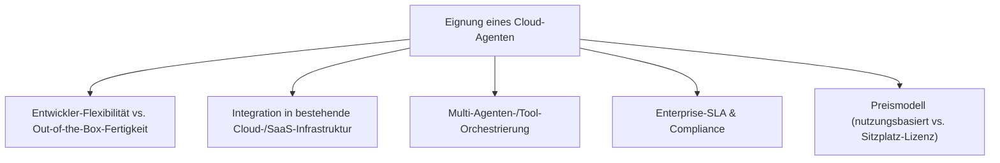
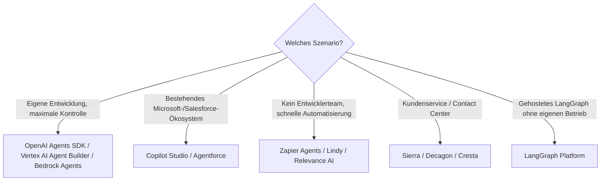

# Beste Cloud-KI-Agenten (Allgemein) — Top-20-Topliste

Als Gegenstück zur [Self-Hosting-Topliste](selbsthosting-ki-agenten-topliste.md) geht es hier um **gehostete KI-Agenten-Plattformen**: Entwickler-Plattformen großer Cloud-Anbieter, No-Code/Low-Code-Baukästen und spezialisierte Enterprise-Produkte für Kundenservice, Vertrieb und Prozessautomatisierung — alle ohne eigenen Infrastrukturbetrieb nutzbar.

!!! note "Hinweis: Entwickler-Plattform vs. fertiges Produkt"
    Ein Teil dieser Liste sind SDKs/APIs zum eigenen Aufbau von Agenten (OpenAI Agents SDK, Vertex AI Agent Builder, Bedrock Agents); ein anderer Teil sind fertige, auf einen Anwendungsfall zugeschnittene Produkte (Sierra, Decagon, Cresta für Kundenservice). Diese Unterscheidung ist bei der Auswahl oft wichtiger als der reine Rang.

---

## Bewertungskriterien

!!! warning "Achtung: Junger, sich schnell wandelnder Markt"
    Der Markt für Cloud-KI-Agenten-Plattformen ist noch jung — Produktnamen, Preise und Funktionsumfang ändern sich häufig, Konsolidierung durch Übernahmen ist üblich. **Stand: Juli 2026.**

---

## Top 20 im Überblick

| Rang | Plattform | Anbieter | Kategorie | Einschätzung | Besondere Stärke | Schwäche |
|---|---|---|---|---|---|---|
| 1 | **OpenAI Agents SDK / Assistants API** | OpenAI | Entwickler-Plattform | Sehr stark | Größtes Ökosystem, ausgereiftes Function-Calling, breite SDK-Unterstützung | Vendor-Lock-in auf OpenAI-Modelle |
| 2 | **Google Vertex AI Agent Builder** | Google | Entwickler-Plattform | Sehr stark | Tiefe GCP-Integration, gute Grounding-/RAG-Anbindung, große Modellauswahl (Gemini) | Setup-Komplexität höher als bei No-Code-Baukästen |
| 3 | **AWS Bedrock Agents** | Amazon | Entwickler-Plattform | Sehr stark | Nahtlose AWS-Infrastruktur-Anbindung (Lambda, Knowledge Bases), Multi-Modell-Auswahl über Bedrock | Enterprise-Preisstruktur, weniger für kleine Teams optimiert |
| 4 | **Microsoft Copilot Studio** | Microsoft | Low-Code-Plattform | Stark | Tiefe Microsoft-365-/Teams-Integration, guter Einstieg für Nicht-Entwickler | Außerhalb des Microsoft-Ökosystems weniger flexibel |
| 5 | **Salesforce Agentforce** | Salesforce | Enterprise-Produkt | Stark | Direkt in CRM-Daten und -Prozesse eingebettet, guter Fit für Vertrieb/Service | Sinnvoll primär bei bestehender Salesforce-Nutzung |
| 6 | **LangGraph Platform (Cloud)** | LangChain | Entwickler-Plattform (gehostet) | Stark | Gehostete Variante des [Self-Hosting-Frameworks](selbsthosting-ki-agenten-topliste.md) ohne eigenen Betrieb | Zusätzliche Hosting-Kosten gegenüber Self-Hosting |
| 7 | **IBM watsonx Orchestrate** | IBM | Enterprise-Plattform | Stark | Gute Prozessautomatisierungs-Anbindung, Enterprise-Compliance-Zertifizierungen | Setup eher auf große Organisationen zugeschnitten |
| 8 | **Sierra** | Sierra | Spezialisiertes Produkt (Kundenservice) | Solide bis stark | Sehr ausgereifte konversationelle Kundenservice-Agenten, hohe Erfolgsquote bei komplexen Dialogen | Fokus ausschließlich auf Kundenservice, kein Allzweck-Agent |
| 9 | **Decagon** | Decagon | Spezialisiertes Produkt (Kundenservice) | Solide bis stark | Gutes Preis-Leistungs-Verhältnis im Kundenservice-Segment | Kleineres Funktionsspektrum außerhalb Support-Anwendungsfällen |
| 10 | **Zapier Agents (Central)** | Zapier | No-Code-Plattform | Solide | Riesiges Integrations-Ökosystem (7000+ Apps), sehr niedrige Einstiegshürde | Komplexere Multi-Agenten-Logik schwerer abzubilden als bei Code-Frameworks |
| 11 | **Relevance AI** | Relevance AI | No-Code-Plattform | Solide | Guter Baukasten für Team-übergreifende Agenten-Workflows | Kleineres Ökosystem als Zapier |
| 12 | **Dust** | Dust | Enterprise-Wissensarbeit | Solide | Guter Fokus auf unternehmensinternes Wissen und Team-Zusammenarbeit | Weniger auf technische Automatisierung als auf Wissensarbeit ausgelegt |
| 13 | **Stack AI** | Stack AI | No-Code-Plattform (Enterprise) | Solide | Guter Kompromiss aus No-Code-Einstieg und Enterprise-Anforderungen | Community/Ökosystem kleiner als bei Zapier |
| 14 | **Lindy** | Lindy | No-Code-Plattform | Solide | Sehr benutzerfreundlicher Einstieg für Geschäftsautomatisierung ohne IT-Team | Für sehr komplexe technische Integrationen weniger geeignet |
| 15 | **Cresta** | Cresta | Spezialisiertes Produkt (Contact Center) | Solide | Starke Echtzeit-Unterstützung für menschliche Agenten im Contact Center | Eher Assistenz für Menschen als vollautonomer Agent |
| 16 | **Gumloop** | Gumloop | No-Code-Plattform | Ausreichend bis solide | Visueller Workflow-Builder mit Fokus auf Datenverarbeitung | Kleinere Nutzerbasis als etablierte No-Code-Anbieter |
| 17 | **Beam AI** | Beam AI | Enterprise-Prozessautomatisierung | Ausreichend bis solide | Fokus auf Back-Office-Prozessautomatisierung | Weniger bekannt/dokumentiert als Top 10 |
| 18 | **Multion** | Multion | Web-Aktions-Agent | Ausreichend | Spezialisiert auf autonome Web-Interaktionen (Formulare, Buchungen) | Schmalerer Anwendungsbereich als Allzweck-Plattformen |
| 19 | **Adept** | Amazon (übernommen) | Aktions-Agent | Ausreichend | Ursprünglich Pionier bei handlungsfähigen KI-Agenten | Eigenständiges Produktangebot seit Übernahme unklarer |
| 20 | **Cognosys** | Cognosys | Autonomer Recherche-Agent | Grundlegend | Einfacher Einstieg für autonome Recherche-/Rechercheaufgaben | Deutlich kleinerer Funktionsumfang als Enterprise-Plattformen |

!!! tip "Tipp: Rang ≠ einzige Entscheidungsgröße"
    Für **eigene Entwicklung mit maximaler Kontrolle** sind die Top 3 (OpenAI, Google, AWS) die naheliegendste Wahl. Für **schnelle Geschäftsautomatisierung ohne Entwicklerteam** liefern Zapier Agents, Lindy oder Relevance AI den kürzesten Weg zum Ergebnis. Für **spezialisierte Anwendungsfälle** (Kundenservice, Contact Center) schlagen dedizierte Produkte wie Sierra oder Decagon oft Allzweck-Plattformen.

---

## Empfehlung nach Einsatzszenario

---

## 🔗 Verwandte Themen

- [Startseite](../../index.md) — zurück zur Dokumentations-Zentrale
- [Beste Self-Hosting-KI-Agenten (Allgemein, Top 20)](selbsthosting-ki-agenten-topliste.md) — das selbst betriebene Gegenstück
- [AI Agents Praxis-Handbuch](ai-agents-praxis.md) — Architektur-Grundlagen für eigene Agenten
- [Agentic Workflows (LangGraph)](agentic-workflows-langgraph.md) — Grundlage für Rang 6 (LangGraph Platform)
- [Microsoft Semantic Kernel](semantic-kernel-python.md) — Alternative Entwickler-Basis für eigene Agenten-Orchestrierung
- [Beste Cloud-Agenten für Rust-Programmierung (Top 20)](cloud-agenten-rust-topliste.md) — spezialisierte Variante für Rust-Coding
