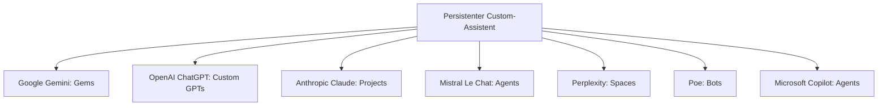

# Custom Chat-Assistenten im Anbieter-Vergleich: Gems, GPTs, Projects & Co.

Google hat mit **Gems** in Gemini ein Konzept popularisiert, das inzwischen praktisch jeder große Chat-Anbieter in einer eigenen Variante anbietet: ein **persistenter, benutzerdefinierter Chat-Assistent** mit fest hinterlegten Anweisungen, eigenem Wissen (hochgeladene Dateien) und optional eigenen Werkzeugen — einmal konfiguriert, danach ohne erneutes Prompting wiederverwendbar. Diese Seite ordnet ein, welcher Anbieter dieses Konzept wie nennt, was es jeweils kann und wo die Unterschiede liegen.

!!! warning "Achtung: Funktionsumfang ändert sich laufend"
    Diese Chat-Produktfunktionen werden deutlich häufiger erweitert als API-Preise. Die Angaben hier sind eine **Momentaufnahme (Stand: Juli 2026)** — vor einer Entscheidung die aktuelle Produktseite des jeweiligen Anbieters prüfen.

---

## Übersicht

!!! note "Hinweis: Gemeinsamer Kern trotz unterschiedlicher Namen"
    Alle unten genannten Funktionen basieren auf demselben Prinzip: **System-Prompt/Custom Instructions + optionale Wissensbasis (Dateien) + optionale Werkzeuge/Actions**, dauerhaft unter einem eigenen Namen gespeichert und wiederverwendbar. Der Unterschied liegt vor allem in Teilbarkeit, Tool-Anbindung und Voraussetzungen (Abo-Stufe).

---

## Anbieter-Vergleich

| Anbieter | Funktionsname | Verfügbar ab | Eigene Dateien/Wissen | Eigene Tools/Actions | Öffentlich teilbar | Voraussetzung |
|---|---|---|---|---|---|---|
| **Google (Gemini)** | **Gems** | Gemini-App (Web/Mobile) | ja (Dateien, Google Drive, Docs/Sheets) | begrenzt (Gemini-eigene Erweiterungen, kein offenes Actions-Schema) | nein, nur privat bzw. im Google-Workspace-Kontext teilbar | kostenlos nutzbar, mehr Kontingent mit Google AI Pro/Ultra |
| **OpenAI (ChatGPT)** | **Custom GPTs** (+ „Projects" als loseres Ordner-Pendant) | ChatGPT Plus/Pro/Team/Enterprise | ja (Dateien, Wissensbasis-Upload) | ja, offenes **Actions**-Schema (eigene API via OpenAPI-Spec anbindbar) | ja, öffentlich im **GPT Store** veröffentlichbar | Erstellung erfordert ChatGPT Plus oder höher |
| **Anthropic (Claude)** | **Projects** (+ **Skills** für wiederverwendbare Fähigkeiten) | Claude Pro/Max/Team/Enterprise | ja (Projekt-Wissensbasis, Dateien) | ja, über verbundene MCP-Server/Tools innerhalb des Projekts | nein, Projects sind team-/orgintern, nicht öffentlich | Claude Pro oder höher |
| **Mistral AI (Le Chat)** | **Agents** | Le Chat (Free/Pro) | ja (Connectors, Dateien) | ja, u. a. Code-Interpreter, Websuche, Bildgenerierung als Bausteine | teilweise, je nach Workspace-Einstellung | teils im Free-Tier, volle Funktionen mit Le Chat Pro |
| **Perplexity** | **Spaces** | Perplexity (Free/Pro) | ja (Dateien als Kontext pro Space) | begrenzt (primär Such-/Recherche-Fokus, kein offenes Actions-Schema) | ja, Spaces können öffentlich/team-freigegeben werden | Grundfunktion kostenlos, mehr Kontingent mit Perplexity Pro |
| **Poe (Quora)** | **Bots** (Custom Bots) | Poe (Free/Abo-Stufen) | ja (Wissensbasis-Upload) | ja, über Server-Bot-Protokoll oder API-Anbindung an Modelle Dritter | ja, öffentlich im Poe-Katalog veröffentlichbar, teils monetarisierbar | kostenlos erstellbar, Nutzung durch andere kostet Punkte/Abo |
| **Microsoft Copilot / 365 Copilot** | **Agents** (Copilot Studio / Declarative Agents) | Copilot Pro / Microsoft 365 Copilot | ja (SharePoint/OneDrive-Dateien, Dataverse) | ja, breite Konnektor-Palette (Microsoft Graph, Power Platform, eigene Actions) | ja, orgintern veröffentlichbar über Copilot Studio/Teams | primär Microsoft-365-Enterprise-Umfeld |
| **xAI (Grok)** | kein dediziertes Pendant | — | teilweise über Projekt-Kontext in der Grok-App | eingeschränkt | — | — |
| **DeepSeek** | kein dediziertes Pendant | — | nein | nein | — | — |

!!! tip "Tipp: Auswahlkriterium nach Anwendungsfall"
    - **Eigene Firmen-Wissensbasis + öffentliche Weitergabe** → OpenAI Custom GPTs (GPT Store) oder Poe Bots.
    - **Tiefe Werkzeug-/API-Integration über einen offenen Standard** → Anthropic Projects mit MCP-Servern oder OpenAI Actions.
    - **Enge Anbindung an bestehende Google-Dokumente** → Gemini Gems.
    - **Microsoft-365-/SharePoint-lastige Unternehmensumgebung** → Copilot Agents (Copilot Studio).
    - **Rechercheorientierte Nutzung mit Quellenangaben** → Perplexity Spaces.

!!! warning "Achtung: Kein Ersatz für die Entwickler-API"
    Wie bei Chat-Abos generell (siehe [Multi-LLM- & Sprachmodell-Anbieter im Vergleich](llm-anbieter-vergleich.md#token-abrechnung-vs-abo-der-wichtigste-unterschied-vor-der-anbieterwahl)) sind Gems, Custom GPTs, Projects & Co. **Chat-Produktfunktionen** und laufen über das jeweilige Abo-Kontingent — für den produktiven, programmatischen Einsatz (Agenten, Automatisierung, Server-Anwendungen) wird weiterhin ein separater API-Zugang benötigt, z. B. über [Anthropic-Projects/MCP im Coding-Kontext](../coding/prompt-gems-gemini-claude-mdbook.md) oder direkt über die jeweilige Modell-API.

---

## Funktionsbausteine im Detail

### 1. Custom Instructions / System Prompt
Bei allen Anbietern der Kern der Funktion: dauerhaft hinterlegte Rollen-, Ton- und Verhaltensvorgaben, die bei jeder neuen Unterhaltung automatisch geladen werden, ohne dass sie erneut eingegeben werden müssen.

### 2. Wissensbasis (Dateien/Connectors)
Hochgeladene Dokumente, verbundene Cloud-Speicher (Google Drive, SharePoint) oder Datenbank-Connectors, die der Assistent als zusätzlichen Kontext heranzieht — meist über Retrieval-Mechanismen (RAG) im Hintergrund, ohne dass Nutzer das selbst konfigurieren müssen. Details zum zugrunde liegenden Prinzip: [Lokales RAG & LLM-Serving](lokales-rag-ollama.md).

### 3. Werkzeuge/Actions
Der entscheidende Unterschied zwischen den Anbietern: OpenAI erlaubt mit **Actions** die Anbindung beliebiger eigener APIs über eine OpenAPI-Spezifikation, Anthropic nutzt dafür den offenen **MCP-Standard** (Model Context Protocol), Microsoft setzt auf sein eigenes Konnektor-Ökosystem, während Google bei Gems bislang auf eigene, vordefinierte Erweiterungen beschränkt bleibt.

### 4. Teilen & Veröffentlichen
Nur ein Teil der Anbieter erlaubt die öffentliche Weitergabe des fertigen Assistenten an andere Nutzer (OpenAI GPT Store, Poe-Katalog, Perplexity Spaces, Copilot Studio orgintern) — Google Gems und Anthropic Projects sind primär auf den eigenen bzw. Team-/Organisations-Kontext beschränkt.

---

## Verwandte Themen

- [Startseite](../../index.md) — zurück zur Dokumentations-Zentrale
- [Multi-LLM- & Sprachmodell-Anbieter im Vergleich](llm-anbieter-vergleich.md) — Preise & API-Zugriffswege der gleichen Anbieter
- [Prompt Gems & System Prompts: Gemini, Claude & mdBook](prompt-gems-gemini-claude-mdbook.md) — konkrete Prompt-Vorlagen für Gems und Claude Projects
- [Meine Gems Liste und Claude Projekt Liste](gems/projekt.md) — persönliche Sammlung eigener Gems/Projects
