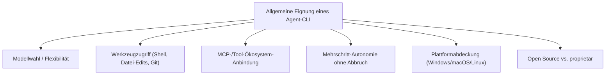
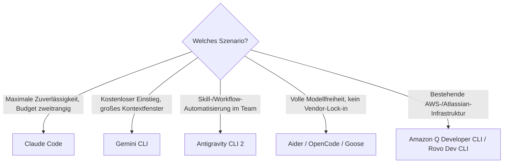

# Beste KI-Agent-CLIs (Allgemein) — Top-20-Topliste

Nach den Rust-spezifischen Agenten- und Cloud-Agenten-Toplisten dieser Serie geht es hier allgemein zu: Welche **terminalbasierten KI-Agenten** eignen sich unabhängig von einer bestimmten Programmiersprache am besten für agentisches Arbeiten — Datei-Edits, Shell-Befehle, Git-Commits, mehrstufige autonome Aufgaben, alles direkt im Terminal? Diese Seite bewertet reine Kommandozeilen-Werkzeuge, nicht IDE-Plugins oder Weboberflächen.

!!! note "Hinweis: Abgrenzung zu den Rust-Toplisten"
    Die [Rust-Agenten-Topliste](ki-agenten-rust-topliste.md) bewertet dieselbe Werkzeug-Kategorie speziell nach Rust-Eignung (Borrow-Checker-Fehlerbehebung, Cargo-Integration). Diese Seite bewertet allgemeine CLI-Qualität — Modellflexibilität, Werkzeug-Ökosystem, Plattformabdeckung — unabhängig von einer Zielsprache.

---

## Bewertungskriterien

!!! warning "Achtung: Momentaufnahme in einer sehr dynamischen Kategorie"
    Terminalbasierte KI-Agenten zählen zu den am schnellsten weiterentwickelten Werkzeugen im gesamten KI-Ökosystem — neue CLIs erscheinen quasi monatlich. **Stand: Juli 2026.**

---

## Top 20 im Überblick

| Rang | CLI | Anbieter | Lizenz | Einschätzung | Besondere Stärke | Schwäche |
|---|---|---|---|---|---|---|
| 1 | **Claude Code** | Anthropic | Proprietär | Sehr stark | Ausgereifteste Selbstkorrektur-Schleife, tiefes MCP-Ökosystem, siehe [Praxis-Handbuch](claude-code-praxis.md) | Standardmäßig an Claude-Modelle gebunden |
| 2 | **Gemini CLI** | Google | Apache-2.0 (Open Source) | Sehr stark | Kostenloses Kontingent, sehr großes Kontextfenster, quelloffen | Agentic-Tooling-Ökosystem jünger als bei Claude Code |
| 3 | **Antigravity CLI 2** | siehe [Antigravity-CLI-Reihe](antigravity-cli.md) | Proprietär | Sehr stark | Skill- und Subagenten-System für maßgeschneiderte Workflows | Steilere Lernkurve als einfachere CLIs |
| 4 | **OpenAI Codex CLI** | OpenAI | Proprietär | Stark | Gute Integration in bestehende ChatGPT-/Team-Abos | Modellwahl enger als bei modell-agnostischen CLIs |
| 5 | **Aider** | Community | Apache-2.0 | Stark | Git-nativ von Grund auf, modellagnostisch, sehr ausgereift | Reine Terminal-Bedienung ohne grafisches Interface |
| 6 | **OpenCode** | OpenCode-Team | MIT | Stark | Bindet 75+ Modell-Anbieter einheitlich an, sehr flexibel | Setup pro Anbieter nötig |
| 7 | **Goose** | Block | Apache-2.0 | Stark | Gute MCP-Erweiterbarkeit, aktive Open-Source-Entwicklung | Kleinere Community als Claude Code/Aider |
| 8 | **Amazon Q Developer CLI** | AWS | Proprietär | Solide bis stark | Sehr gute AWS-Infrastruktur-Anbindung | Außerhalb des AWS-Ökosystems weniger Mehrwert |
| 9 | **Warp (Agent-Modus)** | Warp | Proprietär | Solide bis stark | Modernes Terminal mit KI-Agent nativ eingebaut, guter Kompromiss aus klassischem Terminal und Automatisierung | Reine Multi-Datei-Refactoring-Tiefe geringer als bei dedizierten Coding-CLIs |
| 10 | **Qwen Code** | Alibaba | Apache-2.0 | Solide bis stark | Quelloffen, gute Anbindung an Qwen3-Coder-Modelle | Tooling-Ökosystem kleiner als bei etablierten Anbietern |
| 11 | **Auggie CLI** | Augment Code | Proprietär | Solide | Sehr tiefes Codebase-Kontextverständnis bei großen Repositories | Kleinere Nutzerbasis als Top 5 |
| 12 | **Rovo Dev CLI** | Atlassian | Proprietär | Solide | Guter Fit bei bestehender Jira-/Bitbucket-Infrastruktur | Außerhalb des Atlassian-Ökosystems weniger relevant |
| 13 | **Crush** | Charm | MIT (Open Source) | Solide | Sehr polierte, ansprechende Terminal-Oberfläche (TUI) | Jüngeres Projekt, kleinere Praxis-Erfahrungsbasis |
| 14 | **SWE-agent** | Princeton/Community | MIT | Solide | Forschungsnah stark bei automatisierter GitHub-Issue-Lösung | Weniger auf alltägliche interaktive Nutzung ausgelegt |
| 15 | **Plandex** | Community | AGPL-3.0/MIT (gemischt) | Solide | Planungsschritt vor Codeänderung reduziert Fehlversuche bei großen Aufgaben | Workflow-Modell gewöhnungsbedürftiger als „direkt loslegen"-CLIs |
| 16 | **Open Interpreter** | Community | AGPL-3.0 | Solide | Allgemeiner lokaler Ausführungs-Agent, nicht nur für Coding | AGPL-Lizenz bei kommerziellem Einsatz beachten |
| 17 | **Trae CLI** | ByteDance | Proprietär (kostenlos) | Ausreichend bis solide | Kostenloser Zugang zu leistungsfähigen Modellen | Kleinere internationale Community/Dokumentation |
| 18 | **Devika** | Community | MIT | Ausreichend bis solide | Quelloffenes Grundgerüst für einen autonomen Software-Ingenieur-Agenten | Weniger produktionsreif als etablierte kommerzielle CLIs |
| 19 | **GPT Engineer** | Community | Apache-2.0 | Ausreichend | Guter Ausgangspunkt für vollständige Projekt-Scaffolds aus einer Beschreibung | Weniger auf iterative Weiterentwicklung bestehender Projekte ausgelegt |
| 20 | **Continue CLI (Headless-Modus)** | Continue.dev | Apache-2.0 | Ausreichend | Dieselbe offene Modellwahl wie die [IDE-Erweiterung](continue-dev-setup.md), jetzt auch im Terminal | Headless-Modus jünger und weniger ausgereift als das IDE-Plugin |

!!! tip "Tipp: Rang ≠ einzige Entscheidungsgröße"
    Für **maximale Zuverlässigkeit bei komplexen, mehrstufigen Aufgaben** liefern die Top 3 aktuell die konsistentesten Ergebnisse. Für **volle Modell-/Anbieterflexibilität ohne Vendor-Lock-in** sind Aider, OpenCode und Goose oft die pragmatischere Wahl, auch wenn sie im reinen Ranking dahinter liegen.

---

## Empfehlung nach Einsatzszenario

---

## 🔗 Verwandte Themen

- [Startseite](../../index.md) — zurück zur Dokumentations-Zentrale
- [Beste KI-Coding-Agenten für Rust-Programmierung (Top 20)](ki-agenten-rust-topliste.md) — dieselbe Werkzeug-Kategorie speziell für Rust bewertet
- [Beste Cloud-Agenten für Rust-Programmierung (Top 20)](cloud-agenten-rust-topliste.md) — asynchrones Gegenstück in der Cloud
- [Beste Self-Hosting-KI-Agenten (Allgemein, Top 20)](selbsthosting-ki-agenten-topliste.md) — serverseitige Agenten-Frameworks statt Terminal-CLIs
- [Beste Cloud-KI-Agenten (Allgemein, Top 20)](cloud-ki-agenten-topliste.md) — gehostete Agenten-Plattformen
- [Beste lokale Computer-KI-Agenten (Allgemein, Top 20)](../automatisierung/lokale-ki-agenten-topliste.md) — Agenten mit Bildschirm-/Maussteuerung statt reinem Terminal
- [Beste KI-Agent-IDEs (Allgemein, Top 20)](ki-agent-ide-topliste.md) — IDE-Gegenstück mit nativer Agenten-Integration
- [Claude Code Praxis-Handbuch](claude-code-praxis.md) — vertiefender Workflow für Rang 1
- [Antigravity CLI 2 — Übersicht](antigravity-cli.md) — vertiefender Workflow für Rang 3
- [Beste Voice-Steuerung-KI-Agenten für CLI-Automatisierung (Top 20)](../automatisierung/voice-steuerung-cli-automatisierung-topliste.md) — diese CLIs freihändig per Sprache steuern
