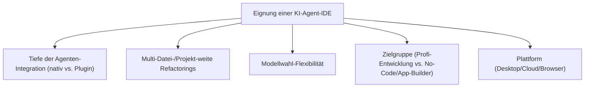
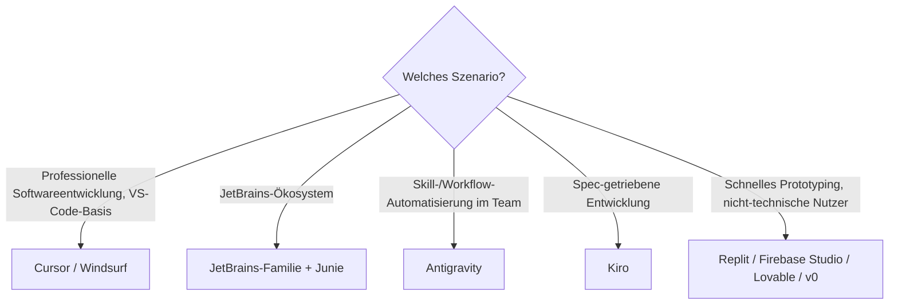

# Beste KI-Agent-IDEs (Allgemein) — Top-20-Topliste

Neben terminalbasierten Agenten ([KI-Agent-CLIs](ki-agent-cli-topliste.md)) hat sich eine zweite Kategorie etabliert: **IDEs mit nativ eingebautem KI-Agenten** — Multi-Datei-Refactorings, autonome Bearbeitungsschleifen und Projektkontext direkt im Editor, nicht nur als aufgesetztes Plugin. Diese Seite bewertet die verbreiteten Agent-IDEs allgemein, unabhängig von einer bestimmten Programmiersprache (für Rust siehe die separate [Rust-IDE-Topliste](../../entwicklung/system/rust-ide-topliste.md)).

!!! note "Hinweis: Native Integration vs. Plugin"
    Manche Einträge dieser Liste (Cursor, Windsurf, Antigravity, Kiro) sind von Grund auf als Agent-IDE konzipiert. Andere (VS Code, JetBrains-Familie) erreichen dasselbe über tief integrierte Erweiterungen. Diese Unterscheidung fließt als Kriterium mit ein, ist aber nicht automatisch ein Qualitätsmerkmal — gut integrierte Plugins können nativen Lösungen ebenbürtig sein.

---

## Bewertungskriterien

!!! warning "Achtung: Sehr dynamische Produktkategorie"
    Agent-IDEs zählen aktuell zu den am schnellsten weiterentwickelten Produktkategorien im gesamten KI-Ökosystem — Funktionsumfang und Namen ändern sich häufig (z. B. Rebrandings, Übernahmen). **Stand: Juli 2026.**

---

## Top 20 im Überblick

| Rang | IDE | Anbieter | Basis | Einschätzung | Besondere Stärke | Schwäche |
|---|---|---|---|---|---|---|
| 1 | **Cursor** | Anysphere | VS-Code-Fork | Sehr stark | Ausgereiftester Agent-Modus, Cursor-Tab-Mehrzeilenvorhersage, breite Modellwahl | Eigenständiges Ökosystem, kein reines VS-Code-Plugin |
| 2 | **Windsurf** | Codeium | VS-Code-Fork | Sehr stark | Cascade-Agent-Modus mit gutem Multi-Datei-Kontext | Ökosystem kleiner als bei Cursor |
| 3 | **Antigravity** | Google | Eigenständige IDE | Sehr stark | Tiefe Integration mit dem Antigravity-CLI-Skill-System (siehe [CLI-Reihe](antigravity-cli.md)) | Steilere Lernkurve als klassische VS-Code-Forks |
| 4 | **JetBrains-Familie + Junie** | JetBrains | Native IDE | Sehr stark | Autonomer Agent tief in Typinferenz/Refactoring-Werkzeuge der jeweiligen JetBrains-IDE eingebettet | Setzt eine JetBrains-IDE-Lizenz voraus |
| 5 | **VS Code + GitHub Copilot (Agent-Modus)** | Microsoft/GitHub | Editor + Plugin | Stark | Größte Verbreitung, tiefste GitHub-Ökosystem-Integration | Agent-Modus als Plugin etwas weniger nahtlos als native Lösungen |
| 6 | **Kiro** | Amazon | Eigenständige IDE | Stark | Spec-getriebene Entwicklung (Anforderungen → Design → Code) als Kernkonzept | Jüngeres Produkt, kleinere Community |
| 7 | **Zed** | Zed Industries | Native IDE | Stark | Extrem niedrige Latenz, kollaborative Bearbeitung, wächst schnell in Richtung Agent-Funktionen | Agent-Modus jünger/weniger ausgereift als Top 5 |
| 8 | **Trae** | ByteDance | VS-Code-Fork | Solide bis stark | Kostenloser Zugang zu leistungsfähigen Modellen | Kleinere internationale Community/Dokumentation |
| 9 | **Firebase Studio** | Google | Cloud-IDE (Browser) | Solide bis stark | Agentisches Prototyping direkt im Browser inkl. Firebase-/Hosting-Anbindung | Primär auf Web-/Firebase-Projekte ausgerichtet |
| 10 | **Void** | Community | VS-Code-Fork (Open Source) | Solide | Quelloffene Cursor-Alternative, volle Datenhoheit | Jüngeres Projekt, Feinschliff noch im Aufbau |
| 11 | **Replit** | Replit | Cloud-IDE (Browser) | Solide | Guter Einstieg für schnelle Prototypen direkt im Browser, integrierter Agent | Für produktionsnahe, große Codebasen weniger ausgelegt |
| 12 | **Warp (Agentic Development Environment)** | Warp | Terminal + Agent-UI | Solide | Guter Kompromiss aus klassischem Terminal und agentischer Entwicklungsumgebung | Kein klassisches Datei-Explorer-/Editor-Erlebnis wie bei IDEs |
| 13 | **Eclipse Theia IDE (AI)** | Eclipse Foundation | Native IDE (Open Source) | Solide | Quelloffene, anpassbare Basis mit eingebauten KI-Funktionen | Kleinere Nutzerbasis als kommerzielle Top 10 |
| 14 | **Android Studio + Gemini** | Google | Native IDE (JetBrains-Basis) | Solide | Gute Integration für Android-/Kotlin-/Java-Projekte inkl. Agentenfunktionen | Fokus stark auf Android-Entwicklung begrenzt |
| 15 | **Amazon Q Developer (IDE-Plugins)** | AWS | Plugin (VS Code/JetBrains) | Solide | Guter Agent-Modus für AWS-native Projekte direkt in bestehender IDE | Außerhalb des AWS-Ökosystems weniger Mehrwert |
| 16 | **Xcode + Swift Assist** | Apple | Native IDE | Ausreichend bis solide | Gute Integration für Apple-Plattform-Entwicklung, wachsende Agentenfunktionen | Nur auf macOS verfügbar, primär Swift-/Apple-Ökosystem |
| 17 | **CodeSandbox** | CodeSandbox | Cloud-IDE (Browser) | Ausreichend bis solide | Guter Einstieg für Web-Prototypen mit KI-Unterstützung | Agentic-Tiefe geringer als bei dedizierten Agent-IDEs |
| 18 | **StackBlitz + Bolt.new** | StackBlitz | Cloud-IDE (Browser) | Ausreichend bis solide | Sehr schnelles Prototyping kompletter Web-Apps aus einer Beschreibung | Primär auf Web-Frontend-Stacks ausgelegt |
| 19 | **Lovable** | Lovable | Cloud-App-Builder | Ausreichend | Guter Einstieg für nicht-technische Nutzer beim Bau von Web-Apps | Weniger geeignet für komplexe, individuelle Softwareprojekte |
| 20 | **v0** | Vercel | Cloud-UI-Generator | Ausreichend | Praktisch für schnelles UI-Prototyping auf Basis von React/Next.js | Kein Allzweck-Agent-IDE, Fokus eng auf UI-Generierung |

!!! tip "Tipp: Rang ≠ einzige Entscheidungsgröße"
    Für **professionelle Softwareentwicklung mit hohem Qualitätsanspruch** liefern die Top 7 aktuell die verlässlichsten Ergebnisse. Für **schnelles Prototyping oder nicht-technische Nutzer** sind Cloud-App-Builder wie Firebase Studio, Replit, Lovable oder v0 oft der praktischere Einstieg, auch wenn sie im reinen Ranking dahinter liegen.

---

## Empfehlung nach Einsatzszenario

---

## 🔗 Verwandte Themen

- [Startseite](../../index.md) — zurück zur Dokumentations-Zentrale
- [Beste IDEs & Editoren mit Rust-Unterstützung (Top 20)](../../entwicklung/system/rust-ide-topliste.md) — dieselbe Kategorie speziell für Rust bewertet
- [Beste KI-Agent-CLIs (Allgemein, Top 20)](ki-agent-cli-topliste.md) — terminalbasiertes Gegenstück
- [Beste KI-Coding-Agenten für Rust-Programmierung (Top 20)](ki-agenten-rust-topliste.md)
- [Beste Cloud-Agenten für Rust-Programmierung (Top 20)](cloud-agenten-rust-topliste.md)
- [Beste Self-Hosting-KI-Agenten (Allgemein, Top 20)](selbsthosting-ki-agenten-topliste.md)
- [Beste Cloud-KI-Agenten (Allgemein, Top 20)](cloud-ki-agenten-topliste.md)
- [Antigravity CLI 2 — Übersicht](antigravity-cli.md) — vertiefender Workflow für Rang 3
