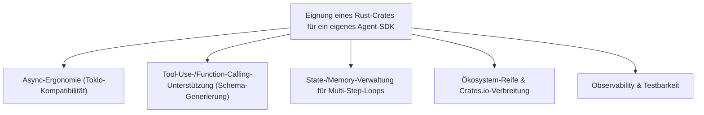
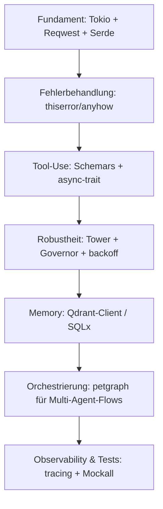

# Beste Rust-Bibliotheken & Frameworks für ein eigenes KI-Agent-SDK — Top-20-Topliste

Die [KI-Agent-SDK-Topliste nach Programmiersprachen-Vielfalt](ki-agent-sdk-sprachen-topliste.md) bewertet fertige Agent-Frameworks wie LangChain oder Semantic Kernel. Hier geht es um den umgekehrten Weg: **Welche Rust-Crates und Bausteine eignen sich, um ein eigenes Agent-SDK von Grund auf selbst zu programmieren** — Tool-Use-Definitionen, Multi-Agent-Orchestrierung, Speicher/Memory, Prompt-Templating und Observability inklusive?

!!! note "Hinweis: Baukasten statt Fertigprodukt"
    Diese Liste bewertet keine fertigen Agent-Frameworks, sondern die einzelnen **Bausteine**, aus denen ein eigenes SDK zusammengesetzt wird. Wer kein eigenes SDK bauen, sondern ein bestehendes nutzen will, findet in der [Rust-Frameworks-&-Web-Backends-Topliste](rust-web-frameworks-ki-topliste.md) fertige Lösungen wie Rig oder Candle.

---

## Bewertungskriterien

!!! warning "Achtung: Eigenbau erfordert mehr Integrationsaufwand"
    Anders als bei fertigen Frameworks übernimmt keines dieser Crates allein die komplette Agent-Logik — sie müssen kombiniert werden. Der Vorteil: volle Kontrolle über Verhalten, Bundle-Größe und Sicherheitsgrenzen, ohne den Overhead eines vollständigen Frameworks. **Stand: Juli 2026.**

---

## Top 20 im Überblick

| Rang | Crate | Kategorie | Rolle im eigenen Agent-SDK | Besondere Stärke | Schwäche |
|---|---|---|---|---|---|
| 1 | **Tokio** | Async-Runtime | Fundament für alle nebenläufigen Agent-Schritte (Tool-Aufrufe, Streaming) | De-facto-Standard, von praktisch jedem anderen Crate in dieser Liste vorausgesetzt | Keine KI-Logik selbst, reine Laufzeitumgebung |
| 2 | **Serde / serde_json** | Serialisierung | (De-)Serialisierung von Tool-Aufrufen, Prompts und Modell-Antworten | Praktisch universeller Standard, exzellente Derive-Makros | Schema-Validierung selbst nicht enthalten, braucht Ergänzung |
| 3 | **Reqwest** | HTTP-Client | Kommunikation mit LLM-Endpunkten aus dem eigenen Agent-Loop heraus | Sehr ausgereift, Tokio-nativ, breite Middleware-Unterstützung | Kein eingebautes LLM-Wissen (reiner HTTP-Client) |
| 4 | **Schemars** | Schema-Generierung | Erzeugt JSON-Schema aus Rust-Structs für Tool-/Function-Definitionen | Nimmt viel Handarbeit bei Tool-Use-Deklarationen ab | Nicht jedes komplexe Rust-Typsystem-Feature wird 1:1 abgebildet |
| 5 | **async-trait** | Trait-Erweiterung | Ermöglicht austauschbare, asynchrone Tool-Interfaces (Plugin-Architektur) | Sauberste verbreitete Lösung für async Trait-Objekte vor Stabilisierung in std | Kleiner Laufzeit-Overhead durch Boxing |
| 6 | **Tower** | Middleware-Abstraktion | Retry-, Timeout- und Rate-Limit-Schichten um Tool-/Modell-Aufrufe | Komponierbare Middleware-Schicht, im gesamten Rust-Ökosystem etabliert | Lernkurve durch generisches `Service`-Trait-Konzept |
| 7 | **petgraph** | Graph-Datenstruktur | Modelliert Multi-Agent-/Multi-Step-Workflows als Graph (ähnlich LangGraph) | Sehr flexible Basis für zustandsbehaftete Agent-Steuerung | Kein fertiges Agent-Konzept, reine Graph-Bibliothek |
| 8 | **Governor** | Rate-Limiting | Begrenzt eigene Anfragen an LLM-APIs client-seitig | Leichtgewichtig, feingranular konfigurierbar | Muss manuell an provider-spezifische Limits angepasst werden |
| 9 | **backoff** | Retry-Logik | Exponentielles Backoff bei transienten API-Fehlern im Agent-Loop | Einfache, robuste Standardlösung für Wiederholungsversuche | Keine Provider-spezifische Fehlerklassifizierung eingebaut |
| 10 | **Qdrant-Client** | Vector-DB-Anbindung | Langzeit-/Memory-Speicher für Agenten (RAG-gestütztes Gedächtnis) | Nativer Rust-Client zur in Rust geschriebenen Vector-DB, sehr performant | Für einfache Kurzzeit-Memory-Fälle oft überdimensioniert |
| 11 | **SQLx** | Datenbank-Zugriff | Persistenz von Konversations-/Agent-Zuständen zwischen Sessions | Compile-Zeit-geprüfte SQL-Queries, async-nativ | Erfordert Schema-Design für Konversationshistorie selbst |
| 12 | **Tera** | Templating | Prompt-Templates mit Variablen, Bedingungen und Includes verwalten | Jinja2-ähnliche, vertraute Syntax für komplexe Prompt-Zusammensetzung | Zusätzliche Abhängigkeit für etwas, das auch mit `format!` ginge |
| 13 | **tiktoken-rs** | Tokenisierung | Token-Zählung für Kontextfenster-Management und Kostenschätzung | Portierung der Original-OpenAI-Tokenizer, hohe Genauigkeit | Muss bei neuen Tokenizer-Versionen manuell aktuell gehalten werden |
| 14 | **tracing** | Observability | Strukturiertes Logging jedes Agent-Schritts (Tool-Aufruf, Antwort, Retry) | Sehr guter Ökosystem-Support (OpenTelemetry-Exporter etc.) | Sinnvolle Instrumentierung erfordert disziplinierten Einsatz im Code |
| 15 | **thiserror / anyhow** | Fehlerbehandlung | Saubere, unterscheidbare Fehlertypen für Tool-Fehler vs. API-Fehler | Standard-Kombination in praktisch jedem produktiven Rust-Projekt | Erfordert bewusste Trennung zwischen Bibliotheks- (thiserror) und Anwendungscode (anyhow) |
| 16 | **Mockall** | Testing | Mockt Tool-Aufrufe und LLM-Antworten für deterministische Agent-Tests | Ermöglicht Unit-Tests von Agent-Logik ohne echte API-Aufrufe | Zusätzlicher Boilerplate-Aufwand bei komplexen Trait-Hierarchien |
| 17 | **Swiftide** | Indexierungs-Pipeline | Ingestion- und RAG-Pipeline-Bausteine als Ergänzung zum eigenen Agent-Loop | Guter Startpunkt für Retrieval-Bausteine statt Eigenbau von Grund auf | Jüngeres Projekt, kleinere Community als Python-Pendants |
| 18 | **langchain-rust** | Referenz-Implementierung | Community-Port als Ideen-/Code-Referenz für eigene Agent-Bausteine | Guter Fundus an bereits gelösten Design-Problemen zum Nachschlagen | Weniger aktiv gepflegt als das offizielle Python-/JS-LangChain |
| 19 | **Uuid** | Identifikation | Eindeutige Session-/Agent-/Trace-IDs über den gesamten Agent-Loop hinweg | Trivial einzubinden, quasi ohne Nachteile | Reines Hilfswerkzeug, keine Agent-Logik |
| 20 | **config** | Konfigurationsverwaltung | Verwaltung mehrerer Modell-/Provider-Konfigurationen und Umgebungen | Vereinheitlicht Env-Variablen, Dateien und Overrides sauber | Zusätzliche Abstraktionsebene bei sehr kleinen Projekten oft unnötig |

!!! tip "Tipp: Minimaler Startstack"
    Für den **schnellsten Einstieg in ein eigenes Agent-SDK** genügt die Kombination aus Tokio, Reqwest, Serde/Schemars und thiserror — das deckt HTTP, Async, Serialisierung und Fehlerbehandlung ab. Tower, Governor und petgraph lohnen sich erst, sobald Multi-Agent-Orchestrierung oder produktionsreifes Retry-/Rate-Limit-Verhalten gebraucht wird.

---

## Aufbau-Reihenfolge für ein eigenes Agent-SDK

---

## 🔗 Verwandte Themen

- [Startseite](../../index.md) — zurück zur Dokumentations-Zentrale
- [Beste KI-Agent-SDKs nach Programmiersprachen-Vielfalt (Top 20)](ki-agent-sdk-sprachen-topliste.md) — fertige Agent-Frameworks statt einzelner Rust-Bausteine
- [Beste Rust-Bibliotheken & Frameworks für ein eigenes KI-Sprachmodell-SDK (Top 20)](llm-sdk-rust-bibliotheken-topliste.md) — dieselbe Fragestellung für reine LLM-Client-SDKs statt Agent-Orchestrierung
- [Beste Rust-Frameworks & Web-Backends mit KI-Unterstützung (Top 20)](rust-web-frameworks-ki-topliste.md) — fertige Frameworks (Rig, Candle) statt Einzel-Bausteinen
- [Beste Self-Hosting-KI-Agenten (Allgemein, Top 20)](selbsthosting-ki-agenten-topliste.md) — fertige Agenten statt Eigenentwicklung
- [Beste KI-Coding-Agenten für Rust-Programmierung (Self-Hosting, Top 20)](selbsthosting-ki-agenten-rust-topliste.md) — Agenten, die beim Schreiben dieses SDK-Codes selbst unterstützen
- [AI Agents Praxis-Handbuch](ai-agents-praxis.md) — sprachunabhängige Grundlagen zu Agent-Architekturen
