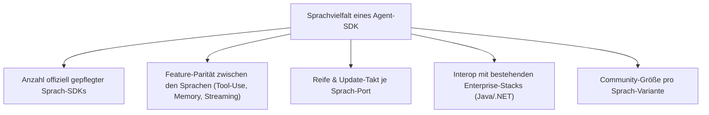
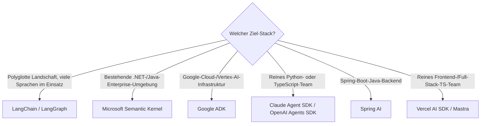

# Beste KI-Agent-SDKs nach Programmiersprachen-Vielfalt — Top-20-Topliste

Nach den allgemeinen [Self-Hosting-](selbsthosting-ki-agenten-topliste.md)- und [Cloud-KI-Agenten](cloud-ki-agenten-topliste.md)-Toplisten dieser Serie geht es hier um eine gezielte Frage: **In wie vielen Programmiersprachen bieten Agent-Frameworks offizielle SDKs an?** Wer Agenten in ein bestehendes Java-, Go- oder .NET-System einbetten will statt sie als eigenständigen Python-Dienst zu betreiben, profitiert von einem Framework mit breiter nativer Sprachunterstützung statt einem reinen Python-first-Ökosystem.

!!! note "Hinweis: Zählweise"
    Gezählt werden **offiziell vom Projekt gepflegte SDKs** sowie eigenständige, etablierte Ports, die im offiziellen Ökosystem des Projekts gelistet sind (z. B. `langchain4j` für Java im LangChain-Umfeld). Reine Drittanbieter-Wrapper ohne Anbindung an das Kernprojekt zählen nicht.

---

## Bewertungskriterien

!!! warning "Achtung: Momentaufnahme in einer sehr dynamischen Kategorie"
    Agent-Frameworks zählen zu den am schnellsten weiterentwickelten Werkzeugen im KI-Ökosystem — neue Sprach-Ports erscheinen laufend, und die Python-Variante erhält neue Features fast immer zuerst. **Stand: Juli 2026.**

---

## Top 20 im Überblick

| Rang | Agent-SDK | Anbieter | Anzahl Sprachen | Sprachen | Einschätzung | Besondere Stärke | Schwäche |
|---|---|---|---|---|---|---|---|
| 1 | **LangChain / LangGraph** | LangChain Inc. + Community | 8 | Python, JavaScript/TypeScript (offiziell) — Java (`langchain4j`), Go (`langchaingo`), Rust (`langchain-rust`), PHP, Ruby, .NET (Community) | Sehr stark | Größtes Ökosystem, praktisch jede Sprache hat einen aktiv gepflegten Port | Feature-Parität zwischen Python und Community-Ports schwankt stark |
| 2 | **Microsoft Semantic Kernel** | Microsoft | 3 (alle offiziell erstklassig) | C#, Python, Java | Sehr stark | Einziges großes Framework mit drei gleichrangig offiziell gepflegten Sprachen statt Python-first + Ports | Kleineres Plugin-Ökosystem als LangChain |
| 3 | **Google Agent Development Kit (ADK)** | Google | 3 | Python, Java, Go (Preview) | Stark | Native Einbettung in Vertex AI & Gemini, wächst schnell | Go-Support noch als Preview markiert |
| 4 | **OpenAI Agents SDK** | OpenAI + Community | 3 offiziell (+ Community-Ports) | Python, TypeScript — community: Go, Rust, .NET | Stark | Sehr sauberes, minimalistisches Kern-API, direkte Anbindung an OpenAI-Modelle | Offizielle Sprachabdeckung schmaler als LangChain |
| 5 | **Anthropic Claude Agent SDK** | Anthropic | 2 | Python, TypeScript | Stark | Direkter Zugriff auf denselben Agent-Loop wie Claude Code, sehr konsistentes Tool-Use-Modell | Nur zwei offizielle Sprachen, keine Community-Ports auf Anbieterebene gelistet |
| 6 | **AutoGen / AG2** | Microsoft / Community | 2 | Python, .NET/C# | Stark | Starkes Multi-Agent-Konversationsmodell, gute Forschungs-Basis | .NET-Port jünger und weniger feature-vollständig als Python-Kern |
| 7 | **Spring AI** | VMware/Broadcom (Spring-Team) | 2 (JVM-Familie) | Java, Kotlin | Solide bis stark | Idiomatische Einbettung in bestehende Spring-Boot-Enterprise-Landschaften | Außerhalb der JVM-Welt nicht nutzbar |
| 8 | **LlamaIndex** | LlamaIndex Inc. | 2 | Python, TypeScript (`LlamaIndex.TS`) | Solide bis stark | Sehr starkes Daten-/RAG-Ökosystem als Agent-Grundlage | TypeScript-Variante deutlich schmaler als das Python-Kernpaket |
| 9 | **Vercel AI SDK** | Vercel | 1 (breite Framework-Abdeckung) | TypeScript/JavaScript (React, Vue, Svelte, Angular) | Solide bis stark | Sehr breite Frontend-Framework-Abdeckung innerhalb einer Sprache | Nur eine Programmiersprache, kein Backend-Agent-Ökosystem wie LangChain |
| 10 | **Mastra** | Gatsby-Team (Community) | 1 | TypeScript | Solide | Modernes, gut dokumentiertes TS-first Agent-Framework | Kein Python-Pendant, für Python-Teams ungeeignet |
| 11 | **Dify** (Agent-Plattform mit API) | Dify AI | 4 (API-Client-SDKs) | Python, Node.js, Java, Go | Solide bis stark | Low-Code-Oberfläche plus mehrsprachige API-Anbindung an bestehende Workflows | Kernlogik bleibt in der Plattform, Agent-Individualisierung über SDKs begrenzt |
| 12 | **CrewAI** | CrewAI Inc. | 1 offiziell (+ Community-Wrapper) | Python — community: Node.js-Wrapper | Solide | Sehr eingängiges Rollen-/Crew-Modell für Multi-Agent-Teams | Offiziell nur Python, Node-Wrapper nicht vom Kernteam gepflegt |
| 13 | **Haystack** | deepset | 1 | Python | Solide | Sehr ausgereiftes Pipeline-Konzept für RAG-gestützte Agenten | Keine offizielle Zweitsprache |
| 14 | **Rasa** | Rasa Technologies | 1 (Kern) + SDK-Anbindung | Python (Kern), Aktion-SDKs auch für Node.js/JVM ansprechbar | Solide | Sehr ausgereift für regelbasierte + generative Dialogagenten kombiniert | Setup-Aufwand höher als bei leichtgewichtigen Frameworks |
| 15 | **Botpress** | Botpress Inc. | 1 | TypeScript/Node.js | Solide | Gute visuelle Flow-Oberfläche kombiniert mit Code-Erweiterbarkeit | Kein Python-SDK für Data-Science-lastige Teams |
| 16 | **Flowise** | FlowiseAI | 1 | TypeScript/Node.js (baut auf LangChain.js auf) | Ausreichend bis solide | Niedrige Einstiegshürde durch visuellen Editor | Individualisierung über Code stößt schneller an Grenzen als bei LangChain direkt |
| 17 | **AWS Strands Agents** | Amazon | 2 | Python, TypeScript (Preview) | Ausreichend bis solide | Gute native Anbindung an Bedrock-Modelle | Jüngstes SDK in dieser Liste, Ökosystem noch klein |
| 18 | **n8n (AI-Agent-Nodes)** | n8n GmbH | 1 | TypeScript/Node.js | Ausreichend | Low-Code-Workflow-Tool mit Agent-Knoten statt dediziertem Code-SDK | Kein eigenständiges Programmier-SDK, eher visuelle Automatisierung |
| 19 | **Eliza (ai16z)** | Community | 1 | TypeScript | Ausreichend | Fokus auf autonome Social-/Krypto-Agenten mit aktiver Nischen-Community | Sehr spezialisierter Anwendungsbereich, kleines Kernteam |
| 20 | **Open Interpreter** | Community | 1 | Python | Ausreichend | Allgemeiner lokaler Ausführungsagent, nicht auf eine Nische beschränkt | AGPL-Lizenz bei kommerziellem Einsatz beachten, kein Zweitsprachen-SDK |

!!! tip "Tipp: Sprachanzahl vs. Team-Realität"
    Für **polyglotte Enterprise-Teams** liefern LangChain und Semantic Kernel die verlässlichste Mehrsprachen-Basis. Wer **rein im Python-/TypeScript-Ökosystem** arbeitet, findet mit dem Claude Agent SDK, OpenAI Agents SDK oder Google ADK oft die konsistentere, weniger fragmentierte Entwicklererfahrung — auch wenn diese in der reinen Sprachanzahl hinter Rang 1 liegen.

---

## Entscheidungshilfe nach Ziel-Stack

---

## 🔗 Verwandte Themen

- [Startseite](../../index.md) — zurück zur Dokumentations-Zentrale
- [Beste KI-Sprachmodell-SDKs nach Programmiersprachen-Vielfalt (Top 20)](llm-sdk-sprachen-topliste.md) — dasselbe Kriterium auf reine LLM-APIs statt Agent-Frameworks angewendet
- [AI Agents Praxis-Handbuch](ai-agents-praxis.md) — vertiefende Praxis unabhängig von der Sprachfrage
- [Agentic Workflows (LangGraph)](agentic-workflows-langgraph.md) — vertiefender Workflow für Rang 1
- [AutoGen Multi-Agent Framework](autogen-multiagent-framework.md) — vertiefender Workflow für Rang 6
- [Microsoft Semantic Kernel](semantic-kernel-python.md) — vertiefender Workflow für Rang 2
- [Beste Self-Hosting-KI-Agenten (Allgemein, Top 20)](selbsthosting-ki-agenten-topliste.md) — Gesamteinschätzung serverseitiger Agenten-Frameworks
- [Beste Cloud-KI-Agenten (Allgemein, Top 20)](cloud-ki-agenten-topliste.md) — gehostete Agenten-Plattformen
- [Beste KI-Agent-CLIs (Allgemein, Top 20)](ki-agent-cli-topliste.md) — Terminal-Agenten statt einbettbarer SDKs
- [Android-KI-Agent-Fernsteuerung für den lokalen PC selbst programmieren (Kotlin & KI-Agent-SDK)](../automatisierung/android-ki-agent-fernsteuerung-lokal-sdk-kotlin.md) — praktischer Einsatz eines Agent-SDK in Kotlin
