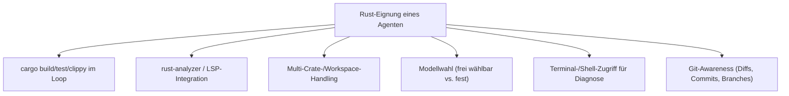
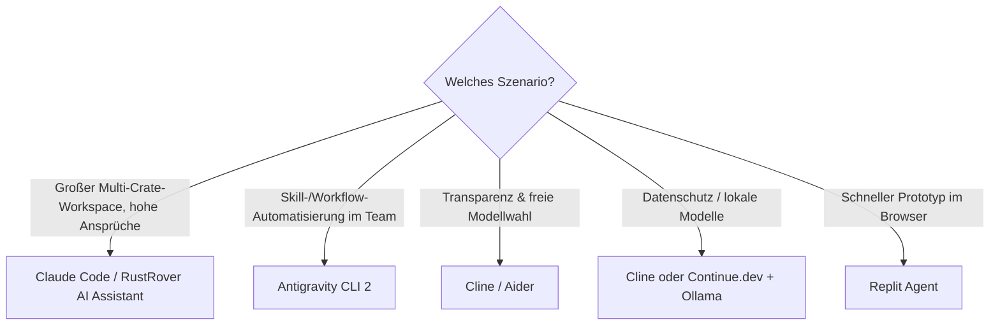

# Beste KI-Coding-Agenten für Rust-Programmierung — Top-20-Topliste

Während die [Topliste der Sprachmodelle für Rust](llm-rust-topliste.md) bewertet, welches **LLM** den besten Rust-Code erzeugt, geht es auf dieser Seite um das **Werkzeug drumherum**: den KI-Coding-Agenten, der Dateien liest, `cargo build`/`cargo test`/`cargo clippy` ausführt, Compiler-Fehler interpretiert und in einer Schleife selbstständig nachbessert. Bei Rust macht dieses Werkzeug einen überdurchschnittlich großen Unterschied — der Borrow Checker liefert präzise, aber oft mehrstufige Fehlermeldungen, die ein Agent aktiv in den nächsten Versuch einspeisen muss, statt sie nur einmalig anzuzeigen.

!!! warning "Achtung: Agent ≠ Modell"
    Die meisten Agenten in dieser Liste sind **modell-agnostisch** — die Rust-Qualität hängt stark davon ab, welches LLM dahinter läuft (siehe [Sprachmodell-Topliste](llm-rust-topliste.md)). Bewertet wird hier ausschließlich die **Agenten-Fähigkeit**: Werkzeugzugriff, Build-/Test-Integration, Workspace-Handling und Selbstkorrektur-Schleife — nicht das Sprachverständnis selbst. **Stand: Juli 2026.**

---

## Bewertungskriterien

!!! note "Hinweis: Warum die Build-Schleife entscheidend ist"
    Ein Agent, der nach jeder Änderung automatisch `cargo check` ausführt und die Fehlermeldung zurück ins Modell speist, korrigiert Borrow-Checker- und Lifetime-Fehler deutlich zuverlässiger als ein reiner Chat-Assistent ohne Werkzeugzugriff — selbst bei identischem zugrundeliegendem Modell. Diese Schleife ist der wichtigste Einzelfaktor in der Bewertung unten.

---

## Top 20 im Überblick

| Rang | Agent | Typ | Anbieter | Rust-Einschätzung | Besondere Stärke | Schwäche |
|---|---|---|---|---|---|---|
| 1 | **Claude Code** | CLI / Terminal-Agent | Anthropic | Sehr stark | Autonome `cargo build`/`clippy`-Schleife, sehr gute Selbstkorrektur bei Lifetime-Fehlern (siehe [Praxis-Handbuch](claude-code-praxis.md)) | Standardmäßig an Claude-Modelle gebunden |
| 2 | **RustRover + AI Assistant** | IDE (nativ) | JetBrains | Sehr stark | Einzige Liste-Position mit **Rust-spezifischer IDE**: nativer rust-analyzer, Makro-Expansion, Cargo-Workspace-Ansicht fest integriert | Kein freies CLI-/Headless-Agentic-Coding wie bei Terminal-Tools |
| 3 | **Antigravity CLI 2** | CLI / Terminal-Agent | siehe [Antigravity-CLI-Reihe](antigravity-cli.md) | Sehr stark | Skill- und Subagenten-System eignet sich gut für Rust-Workspace-Konventionen (Cargo-Skills, Clippy-Hooks) | Steilere Lernkurve als einfachere CLI-Agenten |
| 4 | **Cline** | VS-Code-Erweiterung (Open Source) | Community | Stark | Voller Terminal-/Diff-Zugriff, freie Modellwahl (inkl. lokaler Modelle), aktive Rust-Nutzerbasis | Kein natives rust-analyzer-Deep-Linking wie RustRover |
| 5 | **Aider** | CLI (Git-nativ) | Community | Stark | Git-Awareness von Grund auf, sehr gute automatische Commit-Nachrichten, liest Compiler-Fehler direkt aus `cargo`-Output | Kein grafisches Interface, reine Terminal-Bedienung |
| 6 | **Zed AI** | Editor (nativ) | Zed Industries | Stark | Editor selbst in Rust geschrieben — Community-Nähe zum Ökosystem, sehr niedrige Latenz durch native Performance | Agentic-Modus jünger/weniger ausgereift als bei Cline/Aider |
| 7 | **OpenCode** | CLI (Open Ecosystem) | OpenCode-Team | Stark | Bindet 75+ Modell-Anbieter einheitlich an, ideal um Top-Rust-Modelle flexibel zu kombinieren | Setup pro Anbieter (`/connect`) nötig, kein Modell „ab Werk" optimiert |
| 8 | **Windsurf** | IDE (Fork) | Codeium | Solide bis stark | „Cascade"-Agentenmodus mit gutem Multi-Datei-Kontext | rust-analyzer-Integration weniger tief als bei RustRover |
| 9 | **Cursor** | IDE (Fork) | Anysphere | Solide bis stark | Sehr breite Modellauswahl im Agent-Modus, gute Codebase-Indexierung großer Workspaces | Rust-Vorschläge im Autocomplete teils weniger idiomatisch als bei spezialisierten Agenten |
| 10 | **Continue.dev** | IDE-Plugin (Open Source) | Community | Solide | Freie Modellwahl, direkte LSP-Anbindung an rust-analyzer möglich (siehe [Setup](continue-dev-setup.md)) | Agentic-Loop-Funktionen weniger ausgereift als bei dedizierten CLI-Agenten |
| 11 | **Roo Code** | VS-Code-Erweiterung (Cline-Fork) | Community | Solide | Zusätzliche Modi (Architect/Debug) hilfreich bei komplexen Trait-Hierarchien | Kleinere Community als Cline selbst |
| 12 | **GitHub Copilot (Agent-Modus)** | IDE-Plugin / Workspace-Agent | GitHub/Microsoft | Solide | Größtes Ökosystem, tiefe GitHub-Integration (PRs, Issues, Actions) | Rust-spezifische Vorschläge historisch schwächer als bei Python/JS |
| 13 | **Amazon Q Developer** | IDE-Plugin | AWS | Solide | Gute AWS-SDK-Kenntnis, brauchbar für Rust-Lambdas/Cloud-native Projekte | Allgemeine Rust-Idiomatik seltener im Fokus |
| 14 | **Devin** | Autonomer Cloud-Agent | Cognition Labs | Solide | Sehr autonom bei mehrstufigen Aufgaben inkl. eigenem Sandbox-Environment | Hoher Preis, für kurze Rust-Fixes meist überdimensioniert |
| 15 | **Sourcegraph Cody** | IDE-Plugin | Sourcegraph | Solide | Starke Codebase-weite Suche/Kontext bei großen Multi-Repo-Rust-Projekten | Agentic-Build-Loop weniger im Fokus als reine Such-/Erklärfunktion |
| 16 | **Replit Agent** | Cloud-IDE-Agent | Replit | Ausreichend bis solide | Guter Einstieg für schnelle Rust-Prototypen direkt im Browser | Für produktionsnahe Multi-Crate-Workspaces weniger ausgelegt |
| 17 | **Warp AI (Agent Mode)** | Terminal | Warp | Ausreichend bis solide | Guter Kompromiss aus klassischem Terminal und Agentenfunktionen für `cargo`-Kommandos | Weniger tiefe Multi-Datei-Refactoring-Fähigkeit als IDE-Agenten |
| 18 | **Void** | IDE (Fork, Open Source) | Community | Ausreichend | Quelloffene Cursor-Alternative, volle Datenhoheit | Jüngeres Projekt, Rust-Feinschliff noch im Aufbau |
| 19 | **Tabnine** | IDE-Plugin | Tabnine | Ausreichend | Starker Fokus auf lokale/private Modelle, gut für Compliance-Vorgaben | Primär Autocomplete, schwächerer Agentic-Modus als Top-10 |
| 20 | **Codeium Autocomplete** | IDE-Plugin | Codeium (Basis von Windsurf) | Ausreichend | Kostenloses Kontingent, solide Basis-Vervollständigung | Kein eigenständiger Agentic-Build-Loop, eher reines Autocomplete |

!!! tip "Tipp: Rang ≠ einzige Entscheidungsgröße"
    Für **große, langlebige Rust-Projekte** (Multi-Crate-Workspaces, strenge Clippy-Policies) zahlen sich die Top 3 durch verlässliche Selbstkorrektur aus. Für **schnelle Prototypen oder Lern-Projekte** reicht oft ein leichtgewichtiger Agent aus Rang 10–15, kombiniert mit einem starken Modell aus der [Sprachmodell-Topliste](llm-rust-topliste.md).

---

## Die Top 5 im Detail

### 1. Claude Code (Anthropic)

Der aktuell zuverlässigste Terminal-Agent für Rust: führt `cargo build`, `cargo test` und `cargo clippy` eigenständig aus, interpretiert die Fehlerausgabe und korrigiert gezielt nach — ohne dabei unbeteiligten Code zu verändern. In Kombination mit Claude Fable 5 oder Claude Sonnet 5 (siehe [Sprachmodell-Topliste](llm-rust-topliste.md)) aktuell die stärkste Gesamtkombination für komplexe Rust-Workspaces. Details im [Claude Code Praxis-Handbuch](claude-code-praxis.md).

### 2. RustRover + AI Assistant (JetBrains)

Einziges Tool in dieser Liste, das als **Rust-spezifische IDE** entwickelt wurde statt als Allzweck-Editor mit KI-Aufsatz. Der native rust-analyzer-Unterbau liefert dem AI Assistant präzisen Zugriff auf Makro-Expansion, Trait-Auflösung und Cargo-Workspace-Metadaten — Vorteile, die reine Terminal-Agenten sich erst über Werkzeugaufrufe erarbeiten müssen. Besonders stark bei Refactorings über viele Dateien hinweg mit sofortigem visuellem Feedback.

### 3. Antigravity CLI 2

Das Skill- und Subagenten-System (siehe [Handbuch & Roadmap](antigravity-cli-roadmap-handbuch.md)) lässt sich gut auf Rust-Workspace-Konventionen zuschneiden — etwa ein eigener Skill für „vor jedem Commit `cargo clippy -- -D warnings` ausführen" oder ein Subagent für reine Lifetime-Fehlerbehebung. Erfordert etwas Einarbeitung (siehe [Kapitel 4 – AGENTS.md Struktur](antigravity-cli-agents-md.md)), zahlt sich bei wiederkehrenden Rust-Projektstrukturen aber aus.

### 4. Cline

Der quelloffene Vorreiter der VS-Code-Agenten-Erweiterungen: voller Zugriff auf Terminal, Diff-Ansicht vor jeder Änderung und freie Wahl des zugrundeliegenden Modells — inklusive lokal gehosteter Modelle wie GLM-5.1 oder Qwen 3.7 über [Ollama](lokales-rag-ollama.md). Besonders beliebt in der Rust-Community wegen der Transparenz (jeder Schritt sichtbar, nichts läuft „im Hintergrund").

### 5. Aider

Reiner Terminal-Agent mit Git als zentralem Konzept — jede Änderung wird automatisch sauber committet, was bei iterativen Borrow-Checker-Korrekturen einen lückenlosen Verlauf ergibt. Liest `cargo`-Fehlerausgaben direkt und arbeitet modellagnostisch, dadurch gut mit den günstigeren Modellen der [Sprachmodell-Topliste](llm-rust-topliste.md) kombinierbar, ohne auf Selbstkorrektur-Qualität zu verzichten.

---

## Empfehlung nach Einsatzszenario

!!! warning "Achtung: Agentic-Loop ohne Review ist bei `unsafe`-Code riskant"
    Unabhängig vom gewählten Agenten sollten `unsafe`-Blöcke, FFI-Grenzen und kryptographischer Code niemals ungeprüft aus einer automatisierten Schleife übernommen werden — Agenten optimieren auf „kompiliert erfolgreich", nicht zwangsläufig auf Speichersicherheit jenseits dessen, was der Compiler erzwingt.

---

## 🔗 Verwandte Themen

- [Startseite](../../index.md) — zurück zur Dokumentations-Zentrale
- [Beste Sprachmodelle für Rust-Programmierung (Top 20)](llm-rust-topliste.md) — welches LLM hinter dem Agenten laufen sollte
- [Beste lokale Sprachmodelle für Rust-Programmierung (Self-Hosting, Top 20)](lokale-sprachmodelle-rust-topliste.md) — offene Modelle für lokal laufende Agenten wie Cline/Aider
- [Beste Aggregatoren & Multi-Modell-Provider für Rust-Programmierung (Top 20)](llm-aggregatoren-rust-topliste.md) — Zugriffswege auf die Top-Rust-Modelle
- [Beste Direkt-Anbieter (Offizielle Entwickler-APIs) für Rust-Programmierung (Top 20)](llm-direktanbieter-rust-topliste.md) — direkter Weg ohne Gateway dazwischen
- [Beste Abo-basierte Direkt-Anbieter (Offizielle Entwickler-Abos) für Rust-Programmierung (Top 20)](llm-abo-anbieter-rust-topliste.md) — welche Abos die hier gelisteten Agenten bereits enthalten
- [Beste Cloud-Provider für GPU-Hosting eigener Rust-Coding-Modelle (Top 20)](cloud-gpu-provider-rust-topliste.md) — Self-Hosting statt API
- [Beste Rust-Frameworks & Web-Backends mit KI-Unterstützung (Top 20)](rust-web-frameworks-ki-topliste.md) — womit KI-Anwendungen in Rust selbst gebaut werden
- [Beste KI-Assistenten & Code-Editoren für Rust-Programmierung (Top 20)](ki-assistenten-rust-topliste.md) — nicht-agentische Autovervollständigung & Chat
- [Beste IDEs & Editoren mit Rust-Unterstützung (Top 20)](../../entwicklung/system/rust-ide-topliste.md) — reine Editor-/Tooling-Sicht ohne KI-Fokus
- [Claude Code Praxis-Handbuch](claude-code-praxis.md) — vertiefender Workflow für Rang 1
- [Antigravity CLI 2 — Übersicht](antigravity-cli.md) — vertiefender Workflow für Rang 3
- [Continue.dev & Tabby AI](continue-dev-setup.md) — Setup für IDE-Plugin-basierte Agenten
- [Lokales RAG & LLM-Serving](lokales-rag-ollama.md) — lokale Modelle für datenschutzsensible Rust-Projekte
