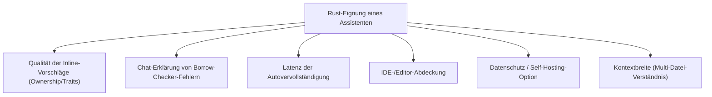
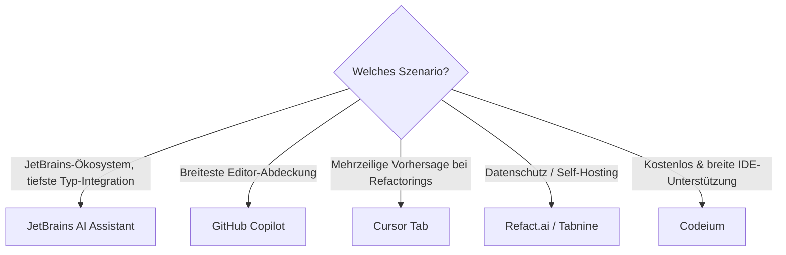

# Beste KI-Assistenten & Code-Editoren für Rust-Programmierung — Top-20-Topliste

Neben autonomen [KI-Coding-Agenten](ki-agenten-rust-topliste.md), die selbstständig `cargo build`/`test` ausführen und mehrstufig nachbessern, gibt es eine zweite, weiterhin sehr verbreitete Kategorie: **KI-Assistenten** — Inline-Autovervollständigung und Chat-basierte Hilfestellung, bei der jede Änderung einzeln vom Entwickler akzeptiert wird. Kein Werkzeugzugriff, kein eigenständiger Build-/Test-Loop, dafür maximale Kontrolle über jede einzelne Zeile. Diese Seite ordnet die verbreiteten Assistenten danach ein, wie gut sie speziell bei Rust — Ownership-Muster, Trait-Signaturen, Lifetime-Annotationen — brauchbare Vorschläge liefern.

!!! note "Hinweis: Assistent ≠ Agent"
    Der Unterschied zur [Agenten-Topliste](ki-agenten-rust-topliste.md) ist bewusst gewählt: Ein **Assistent** schlägt vor, der Mensch entscheidet Zeile für Zeile. Ein **Agent** führt selbstständig Werkzeuge aus (`cargo build`, Dateiänderungen über mehrere Dateien) und iteriert ohne Zwischenbestätigung. Viele Tools bieten mittlerweile beide Modi an — bewertet wird hier ausschließlich der reine Assistenten-/Autovervollständigungs-Modus, nicht ein eventuell zusätzlich vorhandener Agentic-Modus.

---

## Bewertungskriterien

!!! warning "Achtung: Einordnung statt Laborwert"
    Wie bei den beiden verwandten Toplisten gibt es keine offizielle, herstellerübergreifende Rust-Benchmark-Suite für Autovervollständigung — die Einordnung stützt sich auf Modellherkunft (siehe [Sprachmodell-Topliste](llm-rust-topliste.md)), IDE-Integrationstiefe und wiederkehrendes Praxis-Feedback. **Stand: Juli 2026.**

---

## Top 20 im Überblick

| Rang | Assistent | Modus | Anbieter | Rust-Einschätzung | Besondere Stärke | Schwäche |
|---|---|---|---|---|---|---|
| 1 | **JetBrains AI Assistant** | Autovervollständigung + Chat | JetBrains | Sehr stark | Direkter Zugriff auf RustRover-/CLion-Typinferenz, dadurch präzise Vorschläge bei komplexen Trait-Bounds | An JetBrains-IDEs gebunden |
| 2 | **GitHub Copilot (Completions + Chat)** | Autovervollständigung + Chat | GitHub/Microsoft | Sehr stark | Größte Trainingsdatenbasis an öffentlichem Rust-Code, sehr breite Editor-Abdeckung (VS Code, JetBrains, Neovim) | Vorschläge bei sehr spezifischen Nischen-Crates seltener treffsicher |
| 3 | **Cursor Tab** | Autovervollständigung (Multi-Line-Prediction) | Anysphere | Sehr stark | Sagt oft den nächsten sinnvollen Bearbeitungsschritt über mehrere Zeilen voraus, nicht nur die aktuelle | Nur innerhalb des Cursor-Editors nutzbar |
| 4 | **Supermaven** | Autovervollständigung | Supermaven | Stark | Sehr niedrige Latenz durch spezialisiertes Completion-Modell, sehr großes Kontextfenster für Multi-Datei-Vorschläge | Kein eigenständiger Chat-Modus so ausgereift wie bei Copilot/Cody |
| 5 | **Codeium (Autocomplete + Chat)** | Autovervollständigung + Chat | Codeium (Windsurf) | Stark | Großzügiges kostenloses Kontingent, breite Editor-Unterstützung inkl. weniger verbreiteter IDEs | Rust-Vorschläge bei komplexen Lifetimes seltener idiomatisch als bei Copilot |
| 6 | **Sourcegraph Cody** | Chat + Autovervollständigung | Sourcegraph | Stark | Starkes Codebase-weites Kontextverständnis bei großen Multi-Repo-Rust-Projekten | Reine Inline-Vervollständigung etwas weniger ausgereift als Chat-Funktion |
| 7 | **Google Gemini Code Assist** | Autovervollständigung + Chat | Google | Stark | Sehr großes Kontextfenster (Gemini-Modelle), gute Erklärung von Fehlermeldungen im Chat | Native Rust-Trainingsanteile geringer als bei Copilot |
| 8 | **Continue.dev (Assistenten-Modus)** | Autovervollständigung + Chat (Open Source) | Community | Stark | Freie Modellwahl inkl. lokaler Modelle, direkte rust-analyzer-Anbindung (siehe [Setup](continue-dev-setup.md)) | Setup aufwendiger als „ab Werk"-Lösungen |
| 9 | **Amazon Q Developer (Inline-Modus)** | Autovervollständigung + Chat | AWS | Solide bis stark | Gute AWS-SDK-Kenntnis für Rust-Lambdas/Cloud-native Code | Allgemeine Rust-Idiomatik seltener im Fokus als bei Copilot/Cody |
| 10 | **Refact.ai** | Autovervollständigung + Chat (Open Source, self-hostbar) | Refact AI | Solide | Vollständig selbst hostbar inkl. eigenem Fine-Tuning auf Firmencode | Kleinere Community/Trainingsbasis als die großen kommerziellen Anbieter |
| 11 | **Tabnine** | Autovervollständigung | Tabnine | Solide | Starker Fokus auf private/lokale Modelle, gut für Compliance-Vorgaben | Chat-Funktion und Kontextbreite schwächer als bei Top 10 |
| 12 | **Replit AI Assistant** | Autovervollständigung + Chat | Replit | Solide | Guter Einstieg direkt im Browser, kein lokales Setup nötig | Für produktionsnahe Multi-Crate-Workspaces weniger ausgelegt |
| 13 | **Pieces for Developers** | Kontext-Assistent + Snippet-Verwaltung | Pieces | Solide | Praktisch zum Sammeln/Wiederfinden von Rust-Codeschnipseln über Projekte hinweg | Kein eigenständiges starkes Completion-Modell, eher Ergänzung zu anderen Tools |
| 14 | **CodeGeeX** | Autovervollständigung + Chat (Open Source) | Zhipu AI | Solide | Multilingual trainiert, brauchbare Basis auch offline/self-hosted | Rust seltener Trainingsschwerpunkt als bei GLM-5.1-basierten Tools |
| 15 | **Bito AI** | Chat-Assistent (IDE-Plugin) | Bito | Ausreichend bis solide | Guter Fokus auf Code-Review-artige Chat-Erklärungen | Reine Autovervollständigung weniger im Zentrum des Produkts |
| 16 | **Blackbox AI** | Autovervollständigung + Code-Suche | Blackbox | Ausreichend bis solide | Praktische Code-Suche über öffentliche Repositories hinweg | Rust-spezifische Trefferqualität schwankt stärker als bei etablierten Anbietern |
| 17 | **aiXcoder** | Autovervollständigung | aiXcoder | Ausreichend | Lange am Markt, brauchbare Basisvervollständigung | Rust vergleichsweise spät und dünn unterstützt |
| 18 | **Mutable AI** | Refactoring-Assistent | Mutable AI | Ausreichend | Fokus auf automatisiertes Kommentieren/Dokumentieren bestehenden Codes | Kein starker Schwerpunkt auf Neuentwicklung in Rust |
| 19 | **Warp AI (Command-Vervollständigung)** | Terminal-Assistent | Warp | Ausreichend | Hilfreich für `cargo`-Kommandozeilen-Vorschläge, nicht für Code selbst | Kein Code-Autovervollständigung im eigentlichen Sinn |
| 20 | **IBM watsonx Code Assistant** | Autovervollständigung + Chat | IBM | Grundlegend | Sinnvoll bei bestehender IBM-/Enterprise-Infrastruktur | Rust vergleichsweise klein im unterstützten Sprachumfang |

!!! tip "Tipp: Rang ≠ einzige Entscheidungsgröße"
    Für **maximale Vorschlagsqualität bei komplexen Trait-Hierarchien** zahlen sich die Top 3 aus. Für **Datenschutz-/Compliance-Anforderungen** (Code darf die eigene Infrastruktur nicht verlassen) sind Refact.ai oder Tabnine oft die praktischere Wahl, unabhängig vom Rang.

---

## Die Top 5 im Detail

### 1. JetBrains AI Assistant

Profitiert direkt von der IDE-eigenen Typinferenz aus RustRover bzw. CLion (siehe [IDE-Topliste](../../entwicklung/system/rust-ide-topliste.md)) — Vorschläge berücksichtigen dadurch den tatsächlichen Trait-Kontext an der Cursor-Position präziser als rein textbasierte Modelle. Chat-Funktion erklärt Borrow-Checker-Fehler unter Rückgriff auf die IDE-interne Fehleranalyse, nicht nur auf reinen Text.

### 2. GitHub Copilot (Completions + Chat)

Größte Verbreitung und mit Abstand größte Menge an öffentlichem Rust-Trainingscode. Copilot Chat erklärt Compiler-Fehlermeldungen zuverlässig und schlägt passende Korrekturen vor, die der Entwickler einzeln übernimmt. Editor-Abdeckung (VS Code, JetBrains-Familie, Neovim, Visual Studio) ist die breiteste in dieser Liste.

### 3. Cursor Tab

Sagt oft nicht nur das nächste Token, sondern die nächste sinnvolle *Bearbeitung* voraus — etwa das Anpassen einer Signatur an mehreren Aufrufstellen nach einer Änderung. Bei Rust besonders hilfreich, wenn sich eine Funktionssignatur ändert und Folgeanpassungen an `impl`-Blöcken nötig werden. Nur innerhalb des Cursor-Editors verfügbar.

### 4. Supermaven

Spezialisiert auf niedrige Latenz bei gleichzeitig sehr großem Kontextfenster — Vorschläge berücksichtigen dadurch auch Definitionen aus weit entfernten Modulen desselben Workspace. Bei Rust nützlich, um Typdefinitionen aus anderen Crates korrekt in Vorschläge einzubeziehen, ohne spürbare Verzögerung beim Tippen.

### 5. Codeium (Autocomplete + Chat)

Großzügiges kostenloses Kontingent und breite Editor-Unterstützung machen Codeium zu einer soliden Einstiegsoption. Die zugrundeliegende Completion-Engine ist dieselbe, die auch in Windsurf zum Einsatz kommt (siehe [Agenten-Topliste](ki-agenten-rust-topliste.md)) — hier jedoch im reinen Assistenten-Modus ohne Agentic-Loop.

---

## Empfehlung nach Einsatzszenario

!!! warning "Achtung: Assistent ersetzt keine Selbstkorrektur-Schleife"
    Wer bei größeren Rust-Refactorings wiederholt Compiler-Fehler manuell zurück in den Chat kopieren muss, profitiert oft mehr von einem echten Agenten (siehe [KI-Coding-Agenten-Topliste](ki-agenten-rust-topliste.md)) als von einem reinen Assistenten — dort übernimmt das Tool diesen Zwischenschritt automatisch.

---

## 🔗 Verwandte Themen

- [Startseite](../../index.md) — zurück zur Dokumentations-Zentrale
- [Beste KI-Coding-Agenten für Rust-Programmierung (Top 20)](ki-agenten-rust-topliste.md) — autonome Build-/Test-Schleife statt Einzelvorschlägen
- [Beste Sprachmodelle für Rust-Programmierung (Top 20)](llm-rust-topliste.md) — welches LLM hinter dem Assistenten laufen kann
- [Beste Aggregatoren & Multi-Modell-Provider für Rust-Programmierung (Top 20)](llm-aggregatoren-rust-topliste.md) — Zugriffswege auf die Top-Rust-Modelle
- [Beste Direkt-Anbieter (Offizielle Entwickler-APIs) für Rust-Programmierung (Top 20)](llm-direktanbieter-rust-topliste.md) — direkter Weg ohne Gateway dazwischen
- [Beste Cloud-Provider für GPU-Hosting eigener Rust-Coding-Modelle (Top 20)](cloud-gpu-provider-rust-topliste.md) — Self-Hosting statt API
- [Beste Rust-Frameworks & Web-Backends mit KI-Unterstützung (Top 20)](rust-web-frameworks-ki-topliste.md) — womit KI-Anwendungen in Rust selbst gebaut werden
- [Beste IDEs & Editoren mit Rust-Unterstützung (Top 20)](../../entwicklung/system/rust-ide-topliste.md) — reine Editor-/Tooling-Sicht ohne KI-Fokus
- [Continue.dev & Tabby AI](continue-dev-setup.md) — Setup für Open-Source-Assistenten
- [Rust Praxis-Handbuch](../../entwicklung/system/rust-praxis.md) — Sprachgrundlagen
