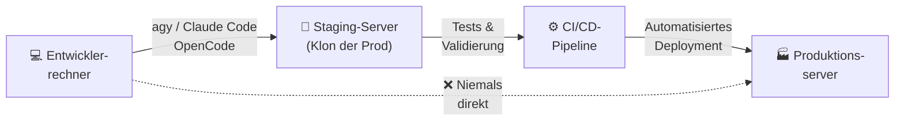

# KI-Coding-Tools auf dem Produktionsserver — Risiken, Regeln & beste Praxis

> **OpenCode · Claude Code · Antigravity CLI (`agy`)** — Darf ich diese Tools auf meinem Produktionsserver einsetzen? Die ehrliche Antwort lautet: **Mit Bedacht — ja. Unüberlegt — nein.**

Diese Seite liefert eine nüchterne Risikoabwägung, klare Regeln und konkrete Workflows für alle drei Tools.

---

## Warum diese Frage wichtig ist

KI-Coding-Agenten wie OpenCode, Claude Code und `agy` sind mächtige Werkzeuge: Sie lesen Dateien, schreiben Code, führen Shell-Befehle aus und können Konfigurationsdateien ändern — alles autonom, schnell und mit wenig manuellem Eingreifen.

Genau das macht sie auf einem Produktionsserver **gefährlich, wenn sie falsch eingesetzt werden.**

!!! danger "Grundprinzip"
    Ein KI-Agent auf einem Produktionsserver hat potenziell Zugriff auf Kundendaten, Produktionsdatenbanken, Secrets und kritische Systemdateien. **Ein einziger Fehler kann Dienste zum Absturz bringen oder Daten unwiderruflich löschen.**

---

## Die drei Tools im Vergleich

| Merkmal | OpenCode | Claude Code | Antigravity CLI (`agy`) |
|---|---|---|---|
| **Anbieter** | Open Source / Community | Anthropic | Google DeepMind |
| **Basis-Modell** | Konfigurierbar (Ollama, OpenAI, …) | Claude 4 (Sonnet/Opus) | Gemini 2.5 Pro/Flash |
| **Shell-Zugriff** | ✅ Ja | ✅ Ja | ✅ Ja |
| **Datei-Zugriff** | ✅ Ja (Projektverzeichnis) | ✅ Ja | ✅ Ja (Sandbox) |
| **Autonomiegrad** | Mittel | Hoch | Sehr hoch (Subagenten) |
| **Approval-Modus** | Konfigurierbar | Standardmäßig aktiv | Konfigurierbar |
| **Sandbox-Option** | Eingeschränkt | Eingeschränkt | Docker-Backend möglich |
| **Netzwerkzugriff** | Je nach Konfiguration | Eingeschränkt | Ja (mit MCP-Tools) |

---

## Risikoklassen auf dem Produktionsserver

### 🔴 Hohes Risiko — Diese Aktionen sind gefährlich

```
❌ KI-Agent hat uneingeschränkten Zugriff auf /etc, /var, /home
❌ Direkte Datenbankverbindung (PostgreSQL, MySQL, Redis) ohne Read-Only
❌ Ausführung als root-Benutzer
❌ Zugriff auf .env-Dateien mit Produktions-Secrets
❌ Automatische Git-Commits & Pushes in den main/master-Branch
❌ Systemd-Services stoppen/starten ohne Bestätigung
❌ Nginx/Apache-Konfigurationen automatisch überschreiben
```

### 🟡 Mittleres Risiko — Mit Vorsicht und Approval-Modus

```
⚠️  Lesen von Logdateien (keine Änderungen, aber Datenleck möglich)
⚠️  Deployment-Skripte ausführen (mit manuellem Approval)
⚠️  Docker-Container neu starten (mit Approval)
⚠️  Konfigurationsdateien lesen (Read-Only)
⚠️  Status-Befehle (systemctl status, docker ps, df -h)
```

### 🟢 Niedriges Risiko — Akzeptabel auf Produktionsservern

```
✅ Code aus dem Repository analysieren (Read-Only, kein Schreiben)
✅ Logs auslesen und zusammenfassen
✅ Monitoring-Daten interpretieren
✅ Deployment-Checklisten erstellen (ohne Ausführung)
✅ Dokumentation generieren
✅ Fehleranalyse aus bestehenden Logs
```

---

## OpenCode auf dem Produktionsserver

### Wann sinnvoll?

OpenCode eignet sich auf dem Produktionsserver hauptsächlich für **lesende und analysierende Aufgaben**:

```bash
# Logdateien analysieren
opencode "Analysiere /var/log/nginx/error.log und fasse die häufigsten Fehler zusammen"

# Code-Review ohne Änderungen
opencode "Überprüfe src/api/handler.py auf mögliche Sicherheitslücken" --no-write
```

### Schutzmaßnahmen für OpenCode

```bash
# 1. Dedizierten, unprivilegierten Benutzer verwenden
sudo useradd -m -s /bin/bash opencode-runner
sudo -u opencode-runner opencode "..."

# 2. Projektverzeichnis auf Read-Only mounten (wenn möglich)
mount --bind /var/www/myapp /home/opencode-runner/project
mount -o remount,ro /home/opencode-runner/project

# 3. Approval-Modus aktivieren (in der Konfiguration)
# opencode.config.json:
{
  "approval": "always",
  "allowedPaths": ["/home/opencode-runner/project"],
  "denyPaths": ["/etc", "/var/lib", "/home"]
}
```

!!! warning "Achtung: OpenCode und Secrets"
    OpenCode liest standardmäßig alle Dateien im Arbeitsverzeichnis. Stelle sicher, dass `.env`-Dateien mit Produktions-Secrets **niemals** im zugänglichen Verzeichnis liegen oder durch eine `.opencodeignore`-Datei ausgeschlossen sind.

---

## Claude Code auf dem Produktionsserver

### Die Anthropic-Empfehlung

Anthropic selbst empfiehlt, Claude Code **nicht direkt** auf Produktionsservern zu verwenden, sondern in einer **CI/CD-Pipeline** oder auf einem separaten Build-Server. Claude Code ist für die Entwicklungsumgebung optimiert.

### Wann Claude Code auf Prod akzeptabel ist

```
✅ Lesende Analyse und Debugging (keine Schreibrechte)
✅ Einmalige, sorgfältig überwachte Konfigurationsänderungen
✅ Notfall-Debugging mit manuellem Approval für jeden Schritt
✅ Dokumentation und Kommentierung bestehender Code-Basis
```

### Claude Code sicher konfigurieren

```bash
# Nur im aktuellen Verzeichnis arbeiten lassen
claude --no-permissions-prompt \
       --allowed-tools "Read,Write" \
       --disallowed-tools "Bash,Computer" \
       "Analysiere die Konfiguration in ./config/"

# Approval für jeden Bash-Befehl erzwingen
claude --approval bash \
       "Überprüfe den Nginx-Status"
```

```yaml
# .claude/settings.json (Produktionsprofil)
{
  "permissions": {
    "allow": [
      "Read(/var/www/myapp/**)",
      "Read(/var/log/nginx/**)"
    ],
    "deny": [
      "Bash(rm*)",
      "Bash(sudo*)",
      "Bash(systemctl stop*)",
      "Write(/etc/**)",
      "Write(/var/lib/**)"
    ]
  }
}
```

!!! note "Hinweis: Claude Code Permission-System"
    Claude Code verfügt seit Version 1.x über ein granulares Permission-System (`allow`/`deny`-Listen). Nutze dies konsequent, bevor du Claude Code auf einem Produktionsserver einsetzt.

---

## Antigravity CLI (`agy`) auf dem Produktionsserver

### Besonderheiten von `agy`

Der Antigravity CLI hat durch sein Subagenten-System und die MCP-Integration einen sehr hohen Autonomiegrad. Das macht ihn besonders leistungsfähig — und auf Produktionsservern besonders kritisch zu handhaben.

!!! danger "Achtung: Subagenten-Kaskaden"
    `agy` kann eigenständig Subagenten spawnen, die wiederum Shell-Befehle ausführen. Diese Kaskaden sind schwer zu unterbrechen und können schnell unkontrollierbar werden, wenn kein Approval-Modus aktiv ist.

### Das Docker-Backend als Sicherheitsnetz

Die sicherste Methode, `agy` auf oder in der Nähe eines Produktionssystems zu nutzen, ist das **Docker-Backend**: Der Agent läuft auf dem Host, führt aber jeden Shell-Befehl innerhalb eines isolierten Containers aus.

```bash
# agy mit Docker-Backend konfigurieren
# In ~/.gemini/antigravity-cli/settings.json:
{
  "terminal_backend": "docker",
  "docker_backend": {
    "image": "ubuntu:24.04",
    "volumes": [
      "/var/www/myapp:/workspace:ro"
    ],
    "network": "none"
  }
}
```

Dies bedeutet:
- Shell-Befehle laufen im isolierten Container, nicht direkt auf dem Host
- Das Produktionsverzeichnis kann als **Read-Only** eingebunden werden
- Kein Netzwerkzugriff aus dem Container heraus (`"network": "none"`)

### `agy` auf dem Produktionsserver — konkrete Szenarien

#### ✅ Empfohlen: Analyse & Dokumentation

```bash
# Logs analysieren (Read-Only)
agy "Analysiere die letzten 500 Zeilen in /var/log/app/error.log und erstelle eine Zusammenfassung der Fehlerursachen"

# Deployment-Checkliste erstellen (kein Ausführen)
agy "Erstelle eine Deployment-Checkliste für ein Zero-Downtime-Nginx-Update — führe nichts aus"

# Code-Qualität prüfen (Read-Only)
agy "Überprüfe alle Python-Dateien in /var/www/api/ auf fehlende Fehlerbehandlung — schreibe nichts"
```

#### ⚠️ Mit Vorsicht: Deployment-Unterstützung

```bash
# Deployment-Skript generieren — erst prüfen, dann manuell ausführen
agy "Erstelle ein Shell-Skript für das Deployment der neuen Version, aber führe es NICHT aus. Speichere es als deploy_v2.sh"

# Dann manuell prüfen und ausführen:
cat deploy_v2.sh
bash deploy_v2.sh
```

#### ❌ Nie: Autonome Produktionsänderungen

```bash
# GEFÄHRLICH — niemals so verwenden:
agy "Aktualisiere die Produktionsdatenbank und starte alle Services neu"
agy "Deploye die neue Version direkt auf dem Produktionsserver"
```

### AGENTS.md für den Produktionseinsatz

Erstelle eine spezielle `AGENTS.md` für produktionsnahe Arbeit:

```markdown
# AGENTS.md (Produktionsmodus)

## ⛔ Verbotene Aktionen
- Niemals systemctl stop/start/restart ausführen
- Niemals Datenbankoperationen ohne explizite Bestätigung
- Niemals Dateien in /etc, /var/lib, /home außer dem Projektverzeichnis schreiben
- Niemals .env-Dateien lesen oder modifizieren
- Niemals git push in main/master/production-Branches

## ✅ Erlaubte Aktionen
- Dateien im Projektverzeichnis lesen
- Logdateien analysieren (Read-Only)
- Skripte erstellen, aber NICHT ausführen
- Dokumentation erstellen
- Status-Abfragen (docker ps, systemctl status)

## 📋 Pflicht-Workflow
Für jede Änderung am System:
1. Erklären, was geändert werden soll
2. Auf Bestätigung warten
3. Skript/Befehl zeigen
4. Erst nach manueller Freigabe ausführen
```

---

## Der sichere Produktions-Workflow

Der goldene Standard: KI-Tools arbeiten **niemals direkt** auf dem Produktionssystem. Stattdessen:



### Schritt-für-Schritt: Sicheres KI-gestütztes Deployment

```bash
# 1. Auf Entwicklerrechner: KI erstellt Deployment-Artefakte
agy "Erstelle ein vollständiges Deployment-Paket für Version 2.1.0"

# 2. Alles in Git committen und prüfen
git diff
git add -p  # Interaktiv prüfen
git commit -m "deploy: v2.1.0 deployment package"

# 3. Auf Staging deployen und testen
# (CI/CD führt das Deployment aus — nicht der KI-Agent)
git push origin deploy/v2.1.0

# 4. Erst nach erfolgreichen Staging-Tests → Produktion
# (immer durch Menschen freigegeben)
```

---

## Secrets-Management — Das wichtigste Kapitel

KI-Coding-Agenten sind eine der häufigsten Ursachen für **unbeabsichtigte Secrets-Leaks**. Das passiert, wenn der Agent eine `.env`-Datei liest und ihren Inhalt in Logs, Zusammenfassungen oder Commit-Messages weitergibt.

### Regel 1: Secrets immer ausschließen

```bash
# .claudeignore / .opencodeignore / .geminiignore
.env
.env.*
*.pem
*.key
*_secret*
*_token*
credentials.json
secrets/
```

### Regel 2: Produktions-Secrets nie auf dem Entwicklerrechner

Nutze einen Secrets-Manager statt lokaler `.env`-Dateien:

```bash
# Mit AWS Secrets Manager
aws secretsmanager get-secret-value --secret-id prod/myapp/db

# Mit HashiCorp Vault
vault kv get secret/prod/myapp

# Mit dem System-Keyring (lokal)
secret-tool store --label="Prod DB" key prod-db-password
```

### Regel 3: KI-Agent-Sitzungen nie in öffentliche Repositories committen

Session-Logs der KI-Agenten können Secrets enthalten, die der Agent versehentlich gelesen hat.

```bash
# .gitignore erweitern
.agy/
.claude/
.opencode/
*.session
```

---

## Empfehlungen nach Einsatzszenario

| Szenario | OpenCode | Claude Code | `agy` |
|---|---|---|---|
| **Lokale Entwicklung** | ✅ Empfohlen | ✅ Empfohlen | ✅ Empfohlen |
| **Staging-Server** | ✅ Mit Approval | ✅ Mit Permissions | ✅ Mit Docker-Backend |
| **CI/CD-Pipeline** | ✅ Read-Only | ✅ Mit Limits | ✅ Headless-Modus |
| **Produktionsserver (Analyse)** | ⚠️ Nur Read-Only | ⚠️ Nur Read-Only | ⚠️ Nur Read-Only + Docker |
| **Produktionsserver (Änderungen)** | ❌ Nicht empfohlen | ❌ Nicht empfohlen | ❌ Nicht empfohlen |
| **Notfall-Debugging auf Prod** | ⚠️ Mit Aufsicht | ⚠️ Mit Aufsicht | ⚠️ Nur mit Aufsicht |

---

## Checkliste vor dem Einsatz auf dem Produktionsserver

Gehe diese Checkliste durch, **bevor** du einen KI-Agent auf einem Produktionsserver startest:

- [ ] Approval-Modus aktiviert? (Jeder Befehl muss manuell bestätigt werden)
- [ ] Unprivilegierter Benutzer (kein root)?
- [ ] Secrets aus dem Arbeitsverzeichnis entfernt oder ausgeschlossen?
- [ ] Kritische Pfade (`/etc`, `/var/lib`) in der Deny-Liste?
- [ ] Backup der wichtigsten Konfigurationen erstellt?
- [ ] Rollback-Plan vorhanden?
- [ ] Ein zweiter Mensch überwacht die Session live?
- [ ] Zeitfenster mit minimalem Traffic gewählt (z. B. Nacht/Wochenende)?

!!! tip "Tipp: Goldene Regel"
    Wenn du dir nicht 100 % sicher bist, was der KI-Agent als nächstes tun wird — stoppe und frage nach. Ein guter Agent erklärt jeden Schritt, bevor er ihn ausführt.

---

## Weiterführende Links

- [Antigravity CLI — Übersicht](antigravity-cli.md)
- [Antigravity CLI — Kapitel 9: MCP, Headless & Security](antigravity-cli-advanced-mcp-cicd.md)
- [KI/ML-Infrastrukturen](../../entwicklung/infrastruktur/ki-ml-infrastrukturen.md)
- [Claude Code Praxis-Handbuch](claude-code-praxis.md)
