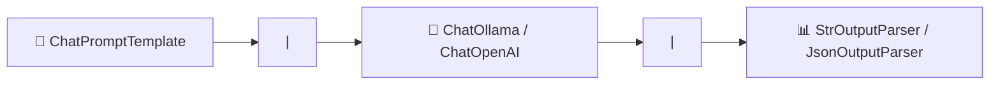

# Praxis-Guide: LangChain Expression Language (LCEL) & Runnable Chains

**LCEL** (LangChain Expression Language) ist die moderne Syntax zum deklarativen Zusammensetzen von Prompt-Templates, LLM-Modellen und Output-Parsern in verknüpfbaren, asynchronen und streambaren Pipelines (`|`).

---



---

## 🛠️ 1. Installation

```bash
pip install langchain langchain-community langchain-core
```

---

## 🐍 2. Python Skript (`lcel_pipeline.py`)

```python
import asyncio
from langchain_core.prompts import ChatPromptTemplate
from langchain_core.output_parsers import StrOutputParser
from langchain_community.chat_models import ChatOllama

# 1. Komponenten definieren
prompt = ChatPromptTemplate.from_template("Erkläre das Thema '{thema}' kurz in 3 Sätzen für Einsteiger.")
model = ChatOllama(model="llama3.1")
parser = StrOutputParser()

# 2. Pipeline verknüpfen via Pipe-Operator (|)
chain = prompt | model | parser

# 3. Asynchrone Ausführung & Streaming
async def main():
    print("Starte Streaming-Antwort:")
    async for chunk in chain.astream({"thema": "PostgreSQL Replikation"}):
        print(chunk, end="", flush=True)
    print("\n")

if __name__ == "__main__":
    asyncio.run(main())
```

---

## 🔗 Verwandte Themen
* [Agentic Workflows (LangGraph)](agentic-workflows-langgraph.md) – LangGraph
* [Structured LLM Outputs (Pydantic)](structured-outputs-pydantic.md) – Pydantic Schemas
* [Lokales RAG & LLM-Serving](lokales-rag-ollama.md) – Ollama RAG
