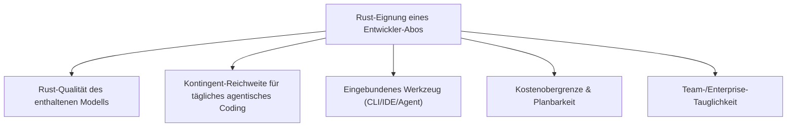
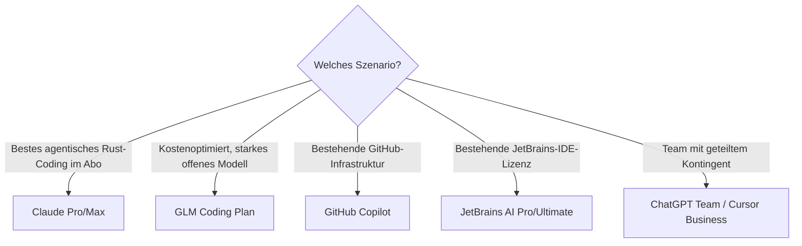

# Beste Abo-basierte Direkt-Anbieter (Offizielle Entwickler-Abos) für Rust-Programmierung — Top-20-Topliste

Die [Direkt-Anbieter-Topliste](llm-direktanbieter-rust-topliste.md) bewertet native APIs mit klassischer Token-Abrechnung. Diese Seite betrachtet das Gegenstück: **Abo-basierte Entwickler-Angebote** — fester Monatspreis statt Pay-per-Token, oft direkt an ein Chat-Produkt oder eine Coding-CLI gekoppelt (z. B. Claude Pro/Max inkl. Claude-Code-Kontingent, GitHub Copilot, GLM Coding Plan). Für Einzelentwickler mit regelmäßigem, aber nicht extremem Rust-Coding-Volumen sind Abos oft planbarer als Token-Abrechnung — die Frage ist, welches Abo das beste Rust-Ergebnis pro Euro liefert.

!!! note "Hinweis: Abo ≠ automatisch API-Zugriff"
    Wie in der [Anbieter-Übersicht](llm-anbieter-vergleich.md) beschrieben, deckt ein Chat-/Coding-Abo in der Regel **nicht** automatisch die Entwickler-API ab — für eigene Integrationen jenseits der mitgelieferten CLI/IDE bleibt oft ein separater API-Key mit Token-Abrechnung nötig (siehe [Direkt-Anbieter-Topliste](llm-direktanbieter-rust-topliste.md)). Bewertet wird hier ausschließlich die Eignung des **Abo-Kontingents selbst** für agentisches oder assistiertes Rust-Coding.

---

## Bewertungskriterien

!!! warning "Achtung: Kontingente ändern sich häufig"
    Abo-Kontingente (Nachrichten/Stunde, „fair use", Wochen-/Monatslimits) werden von Anbietern öfter angepasst als Token-Preise. Die Einordnung unten ist eine **Momentaufnahme (Stand: Juli 2026)** — vor Abschluss immer die aktuellen Fair-Use-Bedingungen des jeweiligen Anbieters prüfen.

---

## Top 20 im Überblick

| Rang | Abo | Anbieter | Preis (ca./Monat) | Rust-Einschätzung | Enthaltenes Werkzeug | Schwäche |
|---|---|---|---|---|---|---|
| 1 | **Claude Pro/Max** | Anthropic | $20 / $100–200 | Sehr stark | Claude-Chat + Claude-Code-Kontingent (Top-Agent, siehe [Agenten-Topliste](ki-agenten-rust-topliste.md)) | Max-Kontingent bei sehr intensiver Dauerlast trotzdem irgendwann gedeckelt |
| 2 | **ChatGPT Plus/Pro/Team** | OpenAI | $20 / $200 / $25–30 pro Nutzer | Sehr stark | Chat + begrenztes API-/Codex-Kontingent | Pro-Tier für Vollzeit-Agentic-Coding teuer |
| 3 | **GitHub Copilot** | GitHub/Microsoft | $10 / $39 / $100 (Einzelnutzer); $19–39/Nutzer (Team/Enterprise) | Stark | Autocomplete + Copilot Chat + Agent-Modus, tiefste GitHub-Integration | Rust-Vorschläge historisch etwas schwächer als bei Claude/GPT |
| 4 | **GLM Coding Plan** | Zhipu AI (Z.AI) | ≈ $3–6 / $15–72 / $30–160 | Stark | GLM-5.1 (Top-6-Rust-Modell) direkt in CLI-/IDE-Tools einbindbar | Kleineres Werkzeug-Ökosystem als bei Claude/GitHub |
| 5 | **Google AI Pro/Ultra** | Google | ≈ $20 / $125–250 | Stark | Gemini-Chat + Coding-Assist mit großem Kontextfenster | Coding-spezifisches Kontingent (CLI/Agent) weniger etabliert als bei Claude Code |
| 6 | **Cursor Pro/Business** | Anysphere | $20 / $40 pro Nutzer | Stark | Agent-Modus + Cursor Tab, freie Modellwahl im Hintergrund | Nutzungsbasierte Zusatzkosten bei intensiver Agenten-Nutzung möglich |
| 7 | **JetBrains AI Pro/Ultimate** | JetBrains | ≈ $8,33–20 zusätzlich zur IDE-Lizenz | Stark | JetBrains AI Assistant direkt in RustRover/CLion (siehe [IDE-Topliste](../../entwicklung/system/rust-ide-topliste.md)) | Setzt bereits eine JetBrains-IDE-Lizenz voraus |
| 8 | **Windsurf Pro/Teams** | Codeium | $15 / $30 pro Nutzer | Solide bis stark | Cascade-Agent-Modus + Autovervollständigung | Rust-Tiefe der Vorschläge etwas hinter Claude/GitHub |
| 9 | **SuperGrok** | xAI | $30–300 | Solide bis stark | Grok-Chat mit höherem Kontingent, teils erweiterten API-Zugriff | Coding-spezifisches Werkzeug-Ökosystem kleiner als bei Top 5 |
| 10 | **Amazon Q Developer Pro** | AWS | $19 pro Nutzer | Solide | Höheres Kontingent für Q-Developer-Chat/-Agent, gute AWS-Integration | Allgemeine Rust-Idiomatik seltener im Fokus |
| 11 | **Sourcegraph Cody Pro/Enterprise** | Sourcegraph | $9 / individuell | Solide | Erweiterte Codebase-weite Suche/Kontext im Abo enthalten | Agentic-Build-Loop-Funktionen weniger im Fokus |
| 12 | **ZenMux Abo** | ZenMux | $0 / $20 / $100 / $400 | Solide | Zugriff auf breiten Modellkatalog inkl. GLM/DeepSeek als Abo-Alternative zur Token-Abrechnung | Kein eigenes Coding-Werkzeug, reine Modellzugriffs-Flatrate |
| 13 | **OpenCode Go** | OpenCode-Team | $5 (erster Monat), danach $10 | Solide | Direkt an die CLI [OpenCode](ki-agenten-rust-topliste.md) gekoppelt, dollarbasierte Limits | Nutzungslimits ($12/5h) bei sehr intensiver Nutzung schnell erreicht |
| 14 | **Poe (Quora)** | Quora | $20–1000+ | Solide | Zugriff auf viele Modelle inkl. Claude/GPT über ein Punkte-Kontingent | Primär Chat-Endnutzer-Produkt, kein dedizierter Coding-Agent |
| 15 | **Replit Core** | Replit | $20–35 pro Nutzer | Solide | Replit-Agent-Kontingent inklusive, guter Einstieg im Browser | Für produktionsnahe Multi-Crate-Workspaces weniger ausgelegt |
| 16 | **Zed Pro** | Zed Industries | ≈ $20 | Solide | Gehostete KI-Funktionen im nativen, sehr schnellen Editor | Agentic-Modus jünger als bei Top 5 |
| 17 | **Tabnine Pro/Enterprise** | Tabnine | $12 / individuell | Ausreichend bis solide | Höheres Kontingent, guter Fokus auf private/lokale Modelle | Chat-/Agenten-Funktionen schwächer als bei Top 10 |
| 18 | **Warp Pro** | Warp | ≈ $15–20 | Ausreichend bis solide | Terminal-Agent-Modus für `cargo`-Kommandos im Abo | Weniger Multi-Datei-Refactoring-Tiefe als IDE-Agenten |
| 19 | **GitLab Duo Pro/Enterprise** | GitLab | $19 / $39 pro Nutzer | Ausreichend | Sinnvoll bei bestehender GitLab-Infrastruktur (CI/CD, Merge Requests) | Rust-spezifische Vorschlagsqualität seltener im Fokus der Duo-Entwicklung |
| 20 | **Perplexity Pro** | Perplexity | $20 | Ausreichend | Eingebaute Websuche hilfreich beim Nachschlagen aktueller Crate-Dokumentation | Kein dedizierter Coding-Agent, eher Rechercheergänzung |

!!! tip "Tipp: Rang ≠ einzige Entscheidungsgröße"
    Für **tägliches agentisches Rust-Coding** liefern die Top 4 das beste Verhältnis aus Modellqualität und enthaltenem Werkzeug. Für **Teams mit bereits vorhandener JetBrains-/GitHub-/GitLab-Infrastruktur** ist oft das jeweils integrierte Abo (Rang 3, 7, 19) die reibungsloseste Wahl, unabhängig vom reinen Rust-Rang.

---

## Die Top 5 im Detail

### 1. Claude Pro/Max (Anthropic)

Das Max-Kontingent deckt ein vollwertiges Claude-Code-Kontingent ab — laut [Agenten-Topliste](ki-agenten-rust-topliste.md) aktuell der zuverlässigste Rust-Coding-Agent überhaupt. Für Einzelentwickler mit täglichem, aber nicht durchgehend maximalem Nutzungsprofil deckt bereits der Pro-Tier viele Anwendungsfälle ab, bevor ein Umstieg auf Max oder API-Token-Abrechnung nötig wird.

### 2. ChatGPT Plus/Pro/Team (OpenAI)

Der Pro-Tier bietet ein großzügiges Kontingent inklusive begrenztem API-Zugriff — praktisch, um GPT-5.6 Sol (Top-2-Rust-Modell) ohne separate Token-Abrechnung in Codex-artigen Workflows zu testen. Team-Tier eignet sich gut für kleine Rust-Teams mit geteiltem Kontingent statt Einzel-Accounts.

### 3. GitHub Copilot

Die tiefste Integration in bestehende GitHub-Workflows (Pull Requests, Issues, Actions) unter den Abo-Anbietern. Rust-Vorschläge sind solide, wenn auch historisch nicht ganz auf dem Niveau von Claude/GPT bei sehr komplexen Trait-Konstrukten — der Mehrwert liegt vor allem in der nahtlosen Ökosystem-Anbindung, nicht in der reinen Modellqualität.

### 4. GLM Coding Plan (Zhipu AI)

Direkter Zugriff auf GLM-5.1 — eines der stärksten offenen Coding-Modelle laut [Sprachmodell-Topliste](llm-rust-topliste.md) — zu einem der günstigsten Abo-Preise in dieser Liste. Besonders attraktiv für kostenbewusste Einzelentwickler, die auf ein proprietäres Flaggschiff-Abo verzichten können.

### 5. Google AI Pro/Ultra

Das riesige Kontextfenster von Gemini 3.1 Pro steht auch im Abo-Kontingent zur Verfügung — nützlich bei großen Multi-Crate-Rust-Workspaces, die in einer einzigen Anfrage betrachtet werden sollen. Coding-spezifische Werkzeug-Integration ist weniger ausgereift als bei Claude Code, aber als Allround-Abo (inkl. Multimodalität) vielseitig einsetzbar.

---

## Empfehlung nach Einsatzszenario

!!! warning "Achtung: Bei sehr hohem Volumen Token-Abrechnung neu durchrechnen"
    Abos wirken planbar, sind aber bei sehr intensiver, durchgehender Nutzung (z. B. Vollzeit-Agenten-Betrieb über mehrere Rust-Projekte) nicht zwangsläufig günstiger als Token-Abrechnung über die [Direkt-Anbieter-](llm-direktanbieter-rust-topliste.md) oder [Aggregatoren-Topliste](llm-aggregatoren-rust-topliste.md). Vor einer langfristigen Entscheidung das tatsächliche monatliche Token-Volumen grob überschlagen.

---

## 🔗 Verwandte Themen

- [Startseite](../../index.md) — zurück zur Dokumentations-Zentrale
- [Beste Direkt-Anbieter (Offizielle Entwickler-APIs) für Rust-Programmierung (Top 20)](llm-direktanbieter-rust-topliste.md) — das Token-basierte Gegenstück
- [Beste Aggregatoren & Multi-Modell-Provider für Rust-Programmierung (Abo-Abrechnung, Top 20)](llm-aggregatoren-abo-rust-topliste.md) — Abos mit Modellwahl statt Einzelhersteller-Bindung
- [Beste Sprachmodelle für Rust-Programmierung (Top 20)](llm-rust-topliste.md) — welches Modell hinter dem jeweiligen Abo läuft
- [Beste Aggregatoren & Multi-Modell-Provider für Rust-Programmierung (Top 20)](llm-aggregatoren-rust-topliste.md)
- [Beste lokale Sprachmodelle für Rust-Programmierung (Self-Hosting, Top 20)](lokale-sprachmodelle-rust-topliste.md) — Alternative ganz ohne laufende Abo-Kosten
- [Beste KI-Coding-Agenten für Rust-Programmierung (Top 20)](ki-agenten-rust-topliste.md) — welche Agenten in den Abos enthalten sind
- [Beste KI-Assistenten & Code-Editoren für Rust-Programmierung (Top 20)](ki-assistenten-rust-topliste.md)
- [Multi-LLM- & Sprachmodell-Anbieter im Vergleich](llm-anbieter-vergleich.md) — Grundlagen zu Token- vs. Abo-Abrechnung
