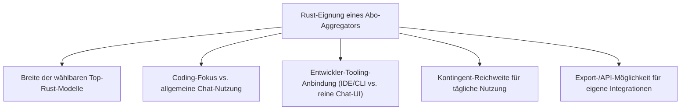
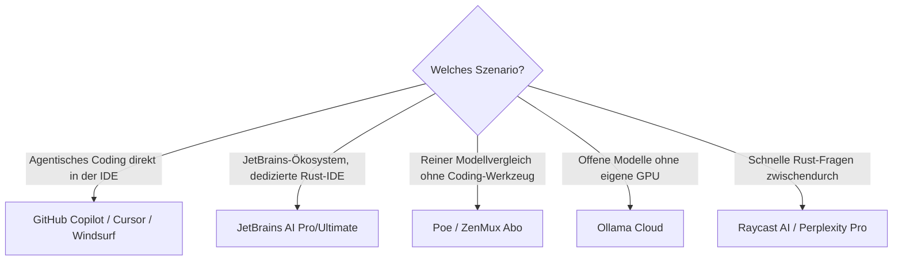

# Beste Aggregatoren & Multi-Modell-Provider für Rust-Programmierung (Abo-Abrechnung) — Top-20-Topliste

Die [Aggregatoren-Topliste](llm-aggregatoren-rust-topliste.md) bewertet Multi-Modell-Provider mit klassischer Token-Abrechnung, die [Abo-Direktanbieter-Topliste](llm-abo-anbieter-rust-topliste.md) native Hersteller-Abos für ein einzelnes Modell-Ökosystem. Diese Seite füllt die verbleibende Lücke: Dienste, deren **zentrales Verkaufsargument der Zugriff auf mehrere Modelle unterschiedlicher Hersteller unter einem festen Monatspreis** ist — Modellwahl statt Vendor-Lock-in, ohne Token-Abrechnung.

!!! note "Hinweis: Abgrenzung zur Abo-Direktanbieter-Topliste"
    Reine Einzelhersteller-Abos wie Claude Pro/Max, ChatGPT Plus/Pro oder Google AI Pro/Ultra stehen bewusst **nicht** hier, sondern in der [Abo-Direktanbieter-Topliste](llm-abo-anbieter-rust-topliste.md) — dort geht es um ein Abo pro Hersteller. Diese Liste bewertet ausschließlich Dienste, bei denen die **Auswahl zwischen mehreren Herstellern** (Claude, GPT, Gemini, GLM, DeepSeek, …) explizit Teil des Produkts ist.

---

## Bewertungskriterien

!!! warning "Achtung: Kontingente & Modellkataloge ändern sich häufig"
    Wie bei den verwandten Toplisten gilt: Abo-Kontingente und die Liste wählbarer Modelle verschieben sich bei diesen Diensten teils wöchentlich. Die Einordnung unten ist eine **Momentaufnahme (Stand: Juli 2026)**.

---

## Top 20 im Überblick

| Rang | Dienst | Preis (ca./Monat) | Rust-Einschätzung | Wählbare Modelle (Auswahl) | Schwäche |
|---|---|---|---|---|---|
| 1 | **GitHub Copilot** | $10 / $39 / $100 (Einzelnutzer); $19–39/Nutzer (Team/Ent.) | Sehr stark | GPT-5.6, Claude Fable 5/Sonnet 5, Gemini 3.1 Pro im Agent-Modus wählbar | Modellwahl teils nach Plan-Tier eingeschränkt |
| 2 | **Cursor Pro/Business** | $20 / $40 pro Nutzer | Sehr stark | Claude, GPT, Gemini, GLM u. a. im Agent-Modus frei wählbar | Nutzungsbasierte Zusatzkosten bei sehr intensiver Nutzung |
| 3 | **Windsurf Pro/Teams** | $15 / $30 pro Nutzer | Stark | Claude, GPT, Gemini und weitere im Cascade-Modus wählbar | Rust-Tiefe je nach gewähltem Modell schwankend |
| 4 | **JetBrains AI Pro/Ultimate** | ≈ $8,33–20 zzgl. IDE-Lizenz | Stark | Claude, GPT, Gemini sowie lokale Modelle direkt in RustRover/CLion wählbar (siehe [IDE-Topliste](../../entwicklung/system/rust-ide-topliste.md)) | Setzt bereits eine JetBrains-IDE-Lizenz voraus |
| 5 | **ZenMux Abo** | $0 / $20 / $100 / $400 | Stark | Breiter Katalog inkl. GLM-5.1, DeepSeek, Qwen, Claude, GPT | Kein eigenständiges IDE-/Agent-Werkzeug, reine Modellzugriffs-Flatrate |
| 6 | **OpenCode Go** | $5 (erster Monat), danach $10 | Stark | Über die [OpenCode-CLI](ki-agenten-rust-topliste.md) 75+ Anbieter/Modelle anbindbar | Dollarbasierte Nutzungslimits ($12/5h) bei Intensivnutzung schnell erreicht |
| 7 | **Poe (Quora)** | $20–1000+ | Solide bis stark | Sehr breiter Katalog inkl. Claude, GPT, Gemini, GLM, DeepSeek über Punkte-Kontingent | Primär Chat-Endnutzer-Produkt, kein dedizierter Coding-Agent |
| 8 | **Ollama Cloud** | Free $0 / Pro $20 / Max $100 | Solide bis stark | Gehostete offene Modelle (GLM-5.1, Qwen 3.7, DeepSeek) ohne eigene GPU | Nutzung als GPU-Zeit statt Tokens gemessen, Modelle vorab per `ollama pull` laden |
| 9 | **Perplexity Pro** | $20 | Solide | GPT, Claude, Gemini u. a. für Pro-Suchen wählbar | Kein dedizierter Coding-Agent, eher Rechercheergänzung |
| 10 | **GitLab Duo Pro/Enterprise** | $19 / $39 pro Nutzer | Solide | Multi-Modell-Backend (u. a. Anthropic-, Google-Modelle) hinter GitLab-Workflows | Modellwahl nicht direkt steuerbar, an GitLab-Auswahl gebunden |
| 11 | **Abacus.AI ChatLLM Teams** | ≈ $10–100 je Tier | Solide | Breiter Katalog inkl. Claude, GPT, Gemini, DeepSeek, Llama | Entwickler-Ökosystem kleiner als bei GitHub/Cursor |
| 12 | **TypingMind Team** | ≈ $20–39 pro Nutzer + eigene API-Keys optional | Solide | Frei konfigurierbar über eigene oder gebündelte API-Keys mehrerer Hersteller | Erfordert mehr Eigenkonfiguration als „ab Werk"-Lösungen |
| 13 | **Kagi Assistant (Ultimate-Plan)** | ≈ $25 | Ausreichend bis solide | Claude, GPT, Gemini u. a. wählbar, mit Fokus auf Privatsphäre/werbefreie Suche | Primär Such-/Recherche-Produkt, kein Coding-Agent |
| 14 | **You.com Pro** | ≈ $20 | Ausreichend bis solide | Mehrere Modelle wählbar inkl. Claude/GPT, kombiniert mit Websuche | Allgemeiner Chat-Fokus, wenig entwicklerspezifisches Tooling |
| 15 | **Msty Pro** | einmalig/günstiges Abo | Ausreichend | Desktop-App zum Mischen lokaler und Cloud-Modelle unter einer Oberfläche | Kleinere Nutzerbasis, weniger Rust-spezifisches Praxis-Feedback |
| 16 | **Raycast AI** | Bestandteil Raycast Pro (≈ $8–16) | Ausreichend | Mehrere Modelle direkt im macOS-Launcher wählbar, praktisch für schnelle Rust-Fragen | Kein Projekt-/Multi-Datei-Kontext wie bei IDE-Agenten |
| 17 | **Monica AI** | ≈ $15–20 | Ausreichend | Browser-Erweiterung mit mehreren wählbaren Modellen | Eher für kurze Snippets als für größere Rust-Refactorings gedacht |
| 18 | **Sider AI** | ≈ $15–20 | Ausreichend | Ähnliches Browser-Erweiterungs-Konzept mit Modellauswahl | Vergleichbare Einschränkungen wie Monica AI |
| 19 | **HIX.AI Chat** | ≈ $10–20 | Grundlegend | Breiter allgemeiner Modellkatalog, wenig coding-spezifisch | Kein dedizierter Rust-/Coding-Fokus |
| 20 | **Flowith** | ≈ $10–20 | Grundlegend | Multi-Modell-Arbeitsbereich, jüngeres Produkt | Kleinere Community, weniger etabliertes Rust-Praxis-Feedback |

!!! tip "Tipp: Rang ≠ einzige Entscheidungsgröße"
    Für **agentisches Rust-Coding direkt in der IDE** sind die Top 4 kaum zu schlagen — sie kombinieren Modellauswahl mit tiefer Werkzeug-Integration. Für **reinen Modellvergleich ohne Coding-Werkzeug** (z. B. um vor einer Kaufentscheidung mehrere Modelle an derselben Rust-Aufgabe zu testen) sind Poe oder ZenMux Abo oft der pragmatischere Einstieg.

---

## Die Top 5 im Detail

### 1. GitHub Copilot

Der Agent-Modus erlaubt die direkte Wahl zwischen GPT-5.6, Claude Fable 5/Sonnet 5 und Gemini 3.1 Pro innerhalb derselben Oberfläche — praktisch, um bei einem schwierigen Lifetime-Fehler kurzerhand das Modell zu wechseln, ohne den Anbieter zu verlassen. Kombiniert mit der tiefsten GitHub-Ökosystem-Integration unter allen Abo-Aggregatoren.

### 2. Cursor Pro/Business

Ähnlich breite Modellauswahl wie Copilot, dabei mit dem in der [Agenten-Topliste](ki-agenten-rust-topliste.md) beschriebenen starken Agent-Modus samt Cursor-Tab-Vorhersage. Für Teams, die verschiedene Modelle für verschiedene Rust-Teilaufgaben (schnelle Vorschläge vs. komplexe Refactorings) gezielt einsetzen wollen, eine der flexibelsten Optionen.

### 3. Windsurf Pro/Teams

Der Cascade-Agent-Modus bietet ebenfalls Modellwahl über mehrere Hersteller hinweg, bei etwas kleinerem Preis als Cursor. Gute Wahl für Teams, die bereits mit der Codeium-Infrastruktur vertraut sind.

### 4. JetBrains AI Pro/Ultimate

Einziger Eintrag in den Top 5, der die Modellwahl direkt in eine dedizierte Rust-IDE (RustRover) einbettet — Vorschläge verschiedener Modelle profitieren dadurch vom selben präzisen Typkontext wie in der [IDE-Topliste](../../entwicklung/system/rust-ide-topliste.md) beschrieben.

### 5. ZenMux Abo

Der mit Abstand breiteste Modellkatalog unter den reinen Abo-Aggregatoren, inklusive der starken offenen Rust-Modelle GLM-5.1, DeepSeek und Qwen aus der [Sprachmodell-Topliste](llm-rust-topliste.md). Kein eigenes Coding-Werkzeug, dafür maximale Flexibilität bei der Modellwahl zu planbaren Kosten.

---

## Empfehlung nach Einsatzszenario

!!! warning "Achtung: Modellwahl nicht mit Modellqualität verwechseln"
    Zugriff auf ein Top-Rust-Modell wie Claude Fable 5 über einen Aggregator ändert nichts an dessen Grundqualität aus der [Sprachmodell-Topliste](llm-rust-topliste.md) — der Mehrwert dieser Liste liegt in Flexibilität und Kostenplanbarkeit, nicht in besseren Rust-Ergebnissen als bei direkter Nutzung desselben Modells.

---

## 🔗 Verwandte Themen

- [Startseite](../../index.md) — zurück zur Dokumentations-Zentrale
- [Beste Aggregatoren & Multi-Modell-Provider für Rust-Programmierung (Top 20)](llm-aggregatoren-rust-topliste.md) — das Token-basierte Gegenstück
- [Beste Abo-basierte Direkt-Anbieter (Offizielle Entwickler-Abos) für Rust-Programmierung (Top 20)](llm-abo-anbieter-rust-topliste.md) — Einzelhersteller-Abos ohne Modellwahl
- [Beste Sprachmodelle für Rust-Programmierung (Top 20)](llm-rust-topliste.md) — welches der wählbaren Modelle tatsächlich am besten abschneidet
- [Beste KI-Coding-Agenten für Rust-Programmierung (Top 20)](ki-agenten-rust-topliste.md)
- [Beste lokale Sprachmodelle für Rust-Programmierung (Self-Hosting, Top 20)](lokale-sprachmodelle-rust-topliste.md)
- [Multi-LLM- & Sprachmodell-Anbieter im Vergleich](llm-anbieter-vergleich.md) — Grundlagen zu Token- vs. Abo-Abrechnung
