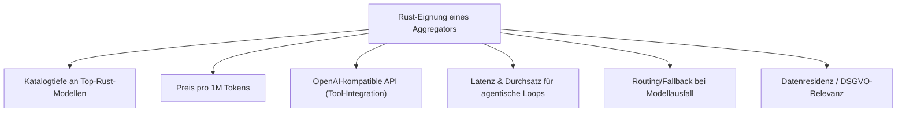
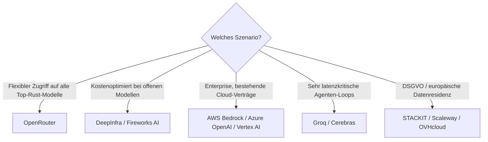

# Beste Aggregatoren & Multi-Modell-Provider für Rust-Programmierung — Top-20-Topliste

Die [Sprachmodell-Topliste für Rust](llm-rust-topliste.md) bewertet einzelne Modelle, die [Multi-LLM- & Sprachmodell-Anbieter im Vergleich](llm-anbieter-vergleich.md) ordnet den gesamten Anbietermarkt nach Preis ein. Diese Seite verbindet beides aus einem konkreten Blickwinkel: Welcher **Aggregator oder Multi-Modell-Provider** eignet sich am besten, um die Top-Rust-Modelle (Claude, GPT, GLM-5.1, DeepSeek, Qwen, …) zuverlässig, günstig und mit ausreichend Durchsatz für agentische `cargo build`/`clippy`-Schleifen anzubinden?

!!! note "Hinweis: Aggregator ≠ Modell-Hersteller"
    Bewertet werden hier ausschließlich **Zugriffswege** (Gateways, Multi-Modell-Plattformen, Cloud-Reselling), nicht die Modelle selbst — dafür siehe die [Sprachmodell-Topliste](llm-rust-topliste.md). Ein Aggregator kann exzellent sein, obwohl das dahinterliegende Modell nur mittelmäßig bei Rust abschneidet, wenn Preis, Latenz oder API-Kompatibilität für den agentischen Einsatz überzeugen.

---

## Bewertungskriterien

!!! warning "Achtung: Preise & Kataloge ändern sich laufend"
    Wie bei der allgemeinen [Anbieter-Übersicht](llm-anbieter-vergleich.md) gilt: Modellkataloge und Preise verschieben sich bei Aggregatoren teils wöchentlich. Die Einordnung unten ist eine **Momentaufnahme (Stand: Juli 2026)** — vor einer Entscheidung immer die aktuelle Modellliste des Anbieters prüfen, insbesondere ob die gewünschten Top-Rust-Modelle (siehe [Sprachmodell-Topliste](llm-rust-topliste.md)) aktuell noch geführt werden.

---

## Top 20 im Überblick

| Rang | Anbieter | Typ | Rust-Einschätzung | Besondere Stärke | Schwäche |
|---|---|---|---|---|---|
| 1 | **OpenRouter** | Aggregator (Pass-Through) | Sehr stark | Größter Katalog (987+ Modelle), praktisch alle Top-Rust-Modelle aus der Sprachmodell-Topliste verfügbar, automatisches Routing/Fallback | 5,5 % Gebühr beim Guthabenkauf |
| 2 | **DeepInfra** | Aggregator (Serverless-GPU) | Sehr stark | Günstigster Zugang zu starken offenen Rust-Modellen (GLM-5.1, Qwen 3.7, DeepSeek V4 Pro), OpenAI-kompatible API | Keine proprietären Flaggschiff-Modelle (Claude, GPT) im Katalog |
| 3 | **Fireworks AI** | Aggregator (Serverless-GPU) | Stark | „FireAttention"-Optimierung senkt Latenz bei agentischen Loops spürbar, guter Rust-Modell-Katalog | Etwas höherer Flat-Preis als DeepInfra |
| 4 | **Together AI** | Aggregator (Serverless-GPU + Cluster-Miete) | Stark | Gute Auswahl offener Rust-Modelle, eigene Fine-Tuning-Pipeline für Domain-Adaption | Preisniveau über DeepInfra bei ähnlichem Katalog |
| 5 | **AWS Bedrock** | Cloud-Multi-Vendor-Reselling | Stark | Einziger Aggregator hier mit direktem Claude-Zugriff (Top-Modell der Rust-Topliste) plus Llama/Mistral/Nova im selben Vertrag | Enterprise-Preisstruktur, weniger geeignet für kleine Teams |
| 6 | **Groq** | Aggregator (LPU-Hardware) | Stark | Extrem niedrige Latenz — ideal für sehr viele kurze `cargo check`-Korrekturrunden in agentischen Loops | Modellauswahl schmaler (v. a. Llama/Mixtral/Gemma, keine Top-3-Rust-Modelle) |
| 7 | **Z.AI (GLM API)** | Nativer Multi-Plan-Anbieter | Stark | Direkter Zugriff auf GLM-5.1 (Top-6-Rust-Modell), zusätzlich günstiger „GLM Coding Plan" als Abo statt Token-Abrechnung | Kein Zugriff auf Modelle anderer Hersteller |
| 8 | **OpenCode Zen** | Kuratierter Gateway | Stark | Vom OpenCode-Team offiziell auf Kompatibilität mit Coding-Agenten getestet (siehe [Agenten-Topliste](ki-agenten-rust-topliste.md)) | Kleinerer Katalog als generische Aggregatoren |
| 9 | **Moonshot AI (Kimi K2)** | Nativer Anbieter | Solide bis stark | Direkter Zugriff auf Kimi K2, Context-Caching senkt Kosten bei großen Rust-Workspaces deutlich | Kein Multi-Hersteller-Katalog |
| 10 | **Novita AI** | Aggregator (Serverless + GPU-Miete) | Solide | Kombination aus Serverless-Inferenz und dedizierten Instanzen, brauchbare Auswahl offener Rust-Modelle | Weniger dokumentierte Rust-spezifische Erfahrungswerte als Top 5 |
| 11 | **Baseten** | Aggregator (Model APIs + dedizierte Deployments) | Solide | Gute Option für dedizierte GPU-Deployments bei konstant hoher Rust-Agenten-Last | Preis im mittleren Segment, Katalog kleiner als OpenRouter |
| 12 | **Hugging Face (Inference Providers)** | Meta-Aggregator | Solide | Bündelt Groq/Together/Fireworks hinter einer Oberfläche, guter Startpunkt zum Vergleichen | Kein eigener Preisvorteil gegenüber direkter Anbindung der Partner |
| 13 | **STACKIT** | Aggregator (europäisch) | Solide | DSGVO-Standort, Zugriff u. a. auf Qwen-Modelle, günstiges Embedding-Modell für RAG-nahe Rust-Doku-Suche | Kleinerer Katalog als globale Aggregatoren |
| 14 | **Cerebras** | Aggregator (Wafer-Scale-Hardware) | Solide | Sehr hohe Tokens/Sekunde, nützlich bei sehr großen Refactoring-Batches | Modellauswahl schwankt wöchentlich, weniger planbar |
| 15 | **Scaleway** | Aggregator (europäisch) | Solide | Europäischer Anbieter mit Einstiegspreisen ab €0,20/1M, DSGVO-relevant | Katalog stärker auf offene Modelle wie gpt-oss-120b begrenzt |
| 16 | **Nebius Token Factory** | Aggregator | Ausreichend bis solide | Zugriff u. a. auf Kimi K2 über Katalog | Preistabelle nicht öffentlich, Werte nur genähert verifizierbar |
| 17 | **OVHcloud AI Endpoints** | Aggregator (europäisch) | Ausreichend bis solide | Europäischer Standort, einfache Anbindung | Katalog kleiner, primär gpt-oss-120b als Referenzmodell |
| 18 | **Cloudflare AI Gateway** | Gateway (Pass-Through) | Ausreichend | Kein Markup auf Modellkosten, integriertes Caching senkt wiederholte Rust-Kontext-Anfragen | Kein eigener Modellkatalog — Auswahl hängt vom durchgereichten Anbieter ab |
| 19 | **Vercel AI Gateway** | Gateway (Pass-Through) | Ausreichend | Zero-Markup-Politik, praktisch bei bestehender Vercel-Infrastruktur | $5-Freikontingent/Monat/Team begrenzt für intensive Rust-Agenten-Nutzung |
| 20 | **Replicate** | Aggregator (GPU-Zeit statt Token) | Ausreichend | Sehr breiter Katalog auch jenseits reiner LLMs | Abrechnung nach GPU-Sekunden statt Token erschwert Kostenplanung bei Coding-Agenten |

!!! tip "Tipp: Rang ≠ einzige Entscheidungsgröße"
    Für **Zugriff auf das jeweils beste Rust-Modell unabhängig vom Hersteller** ist OpenRouter kaum zu schlagen. Für **reine Kostenoptimierung bei offenen Modellen** (GLM-5.1, Qwen 3.7) liegt DeepInfra meist vorn. Für **sehr latenzkritische agentische Loops** mit vielen kurzen Korrekturrunden lohnt sich ein Blick auf Groq oder Cerebras, trotz eingeschränkterer Modellauswahl.

---

## Die Top 5 im Detail

### 1. OpenRouter

Der mit Abstand breiteste Katalog deckt praktisch jedes Modell aus der [Sprachmodell-Topliste](llm-rust-topliste.md) ab — von Claude Fable 5 über GPT-5.6 Sol bis GLM-5.1 und Qwen 3.7. Die OpenAI-kompatible API funktioniert ohne Anpassung mit den meisten Coding-Agenten (siehe [Agenten-Topliste](ki-agenten-rust-topliste.md)), automatisches Routing/Fallback verhindert Ausfälle bei einzelnen Modell-Providern. Für Teams, die flexibel zwischen Modellen wechseln wollen, ohne mehrere Verträge zu pflegen, aktuell die naheliegendste Wahl.

### 2. DeepInfra

Meist der Preisboden am Markt für die starken offenen Rust-Modelle GLM-5.1, Qwen 3.7 und DeepSeek V4 Pro — alle drei solide in der oberen Hälfte der Sprachmodell-Topliste platziert. Serverless-GPU-Backend bedeutet keine Vorabverpflichtung, reine Pay-per-Token-Abrechnung. Wer ausschließlich mit offenen Modellen arbeitet (z. B. aus Datenschutzgründen keine proprietären Cloud-Modelle einsetzen darf), findet hier das beste Preis-Leistungs-Verhältnis.

### 3. Fireworks AI

Die „FireAttention"-Inferenz-Optimierung reduziert die Zeit bis zum ersten Token spürbar — relevant, da agentische Rust-Workflows oft viele kurze, aufeinanderfolgende Anfragen (Fehleranalyse, Korrektur, erneuter `cargo check`) statt weniger langer Anfragen erzeugen. Guter Kompromiss aus Katalogbreite und Geschwindigkeit.

### 4. Together AI

Neben einem soliden Katalog offener Rust-Modelle bietet Together AI eine eigene Fine-Tuning-Pipeline — praktisch, um ein offenes Modell gezielt auf unternehmensinterne Rust-Konventionen (Crate-Struktur, bevorzugte Error-Handling-Muster) nachzutrainieren, was reine Inferenz-Aggregatoren nicht anbieten.

### 5. AWS Bedrock

Einziger Aggregator in den Top 5 mit direktem Zugriff auf Claude — laut Sprachmodell-Topliste eines der beiden stärksten Rust-Modelle überhaupt — im selben Vertrag wie Llama, Mistral und Amazon Nova. Für Teams, die ohnehin auf AWS-Infrastruktur setzen, lässt sich die Modellnutzung direkt über die bestehende Cloud-Rechnung abrechnen, inklusive VPC-Anbindung und Compliance-Zertifizierungen.

---

## Empfehlung nach Einsatzszenario

!!! warning "Achtung: Rate-Limits bei agentischen Coding-Loops beachten"
    Agentische Werkzeuge wie Claude Code, Cline oder Aider (siehe [Agenten-Topliste](ki-agenten-rust-topliste.md)) erzeugen bei komplexen Rust-Refactorings deutlich mehr Requests pro Minute als klassische Chat-Nutzung. Vor dem Produktiveinsatz die Rate-Limits des gewählten Aggregators explizit prüfen — insbesondere bei kostenlosen oder kleineren Kontingenten, die in Abschnitt 3 der [Anbieter-Übersicht](llm-anbieter-vergleich.md) gelistet sind.

---

## 🔗 Verwandte Themen

- [Startseite](../../index.md) — zurück zur Dokumentations-Zentrale
- [Beste Sprachmodelle für Rust-Programmierung (Top 20)](llm-rust-topliste.md) — welches Modell hinter dem Aggregator laufen sollte
- [Multi-LLM- & Sprachmodell-Anbieter im Vergleich](llm-anbieter-vergleich.md) — vollständige Preisübersicht über alle Kategorien
- [Beste KI-Coding-Agenten für Rust-Programmierung (Top 20)](ki-agenten-rust-topliste.md) — welche Agenten die hier gelisteten APIs ansteuern
- [Beste KI-Assistenten & Code-Editoren für Rust-Programmierung (Top 20)](ki-assistenten-rust-topliste.md) — nicht-agentische Alternative
- [Beste IDEs & Editoren mit Rust-Unterstützung (Top 20)](../../entwicklung/system/rust-ide-topliste.md) — reine Editor-/Tooling-Sicht ohne KI-Fokus
