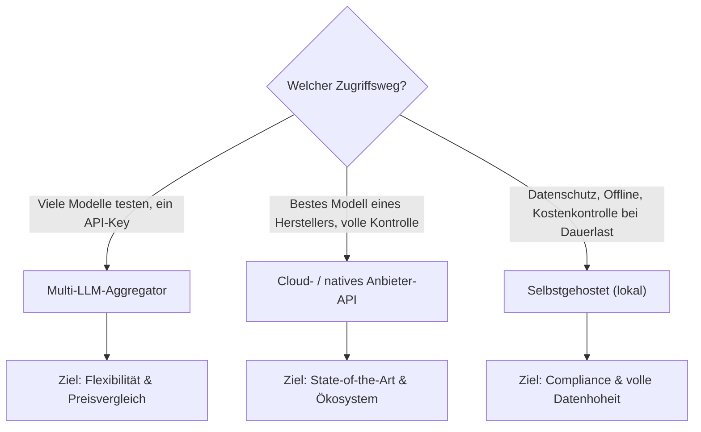

# Multi-LLM- & Sprachmodell-Anbieter im Vergleich

Der Markt für Sprachmodell-Zugriff gliedert sich grob in drei Kategorien: **Aggregatoren**, die mit einer einzigen API auf hunderte Modelle verschiedener Hersteller zugreifen lassen, **native Cloud-Anbieter**, die ihre eigenen Modelle direkt vertreiben, und **selbstgehostete Modelle**, die vollständig auf eigener Hardware laufen. Diese Seite vergleicht alle drei Wege — sortiert von billig zu teuer — und ordnet ein, wann welcher Ansatz sinnvoll ist.

!!! warning "Achtung: Preise ändern sich laufend"
    KI-Anbieter senken und ändern ihre Preise oft im Wochentakt, neue Modelle verschieben ganze Preisstufen. Die Zahlen auf dieser Seite sind eine **Momentaufnahme (Stand: Juli 2026)** und dienen der Größenordnung/Einordnung — vor einer Kaufentscheidung immer die offizielle Preisseite des jeweiligen Anbieters prüfen.

---

## Übersicht

!!! tip "Tipp: Kosten senken unabhängig vom Anbieter"
    Fast alle Anbieter unterstützen **Prompt Caching** (bis zu 90 % günstigere Wiederholungs-Eingaben) und eine **Batch-API** (oft 50 % Rabatt für nicht-zeitkritische Anfragen). Beides vor der Anbieterwahl mit einplanen — der Effekt auf die Gesamtkosten ist oft größer als der Preisunterschied zwischen zwei Anbietern.

### Token-Abrechnung vs. Abo — der wichtigste Unterschied vor der Anbieterwahl

Fast jeder native Anbieter bietet **zwei parallele Zugriffswege** mit komplett unterschiedlicher Kostenlogik an:

- **Token-Abrechnung (Pay-per-Token, API-Zugriff)** — Abrechnung nach tatsächlich verbrauchten Input-/Output-Tokens in USD pro 1 Mio. Tokens. Skaliert linear mit der Nutzung, planbar bei bekanntem Volumen, aber ohne Obergrenze nach oben. Zielgruppe: Entwickler, Integrationen, Agenten, Server-zu-Server-Anwendungen. **Alle Tabellen auf dieser Seite beziehen sich auf diesen Weg.**
- **Abo (Subscription, Endnutzer-Produkt)** — fester Monatspreis (z. B. ChatGPT Plus, Claude Pro/Max, Google AI Pro/Ultra, SuperGrok, Poe) für ein Nutzungskontingent oder „fair use" in der jeweiligen Chat-Oberfläche. Kosten sind planbar und gedeckelt, aber nicht per API nutzbar bzw. nur eingeschränkt (z. B. Claude Pro/Max inkl. Claude-Code-Kontingent, ChatGPT Plus inkl. begrenztem API-Guthaben). Zielgruppe: Einzelpersonen mit primär interaktiver Chat-Nutzung.

!!! warning "Achtung: Abo-Kontingent ≠ API-Zugriff"
    Ein Chat-Abo (ChatGPT Plus, Claude Pro, Gemini Advanced/AI Pro, SuperGrok) deckt in der Regel **nicht** automatisch die Entwickler-API ab — für eigene Anwendungen, Agenten oder Automatisierung wird trotzdem ein separater API-Key mit Token-Abrechnung benötigt. Umgekehrt lohnt sich für reine, hochfrequente Chat-Nutzung durch eine Einzelperson oft das Abo, da die Token-Kosten bei intensiver Nutzung schnell darüber liegen können.

---

## 1. Multi-LLM-Provider (Aggregatoren) — sortiert von billig zu teuer

Aggregatoren bündeln Modelle vieler Hersteller (OpenAI, Anthropic, Meta, Alibaba, DeepSeek, Mistral, …) hinter einer einheitlichen, meist OpenAI-kompatiblen API. Praktisch für Preisvergleiche, Modell-Routing und Fallback-Strategien, ohne für jeden Hersteller einen eigenen Vertrag/Account zu benötigen.

| Anbieter | Preisniveau (Beispiel: Llama 3.3 70B, USD/1M Tokens In/Out) | Abrechnung | Modellauswahl | Besonderheit |
|---|---|---|---|---|
| **DeepInfra** | ≈ $0,23 / $0,40 — meist der Preis-Boden am Markt | Token (Prepaid-Guthaben) | groß (Llama, Qwen, DeepSeek, Mistral, GLM, …) | Serverless-GPU-Backend, unterbietet die meisten Konkurrenten auf offenen Modellen |
| **Groq** | $0,59 / $0,79 | Token (auch kostenloses Kontingent) | mittel (Llama, Mixtral, Gemma) | eigene LPU-Hardware statt GPU → extrem niedrige Latenz/Tokens pro Sekunde |
| **Fireworks AI** | ≈ $0,90 (flat) | Token | groß | „FireAttention"-Inferenz-Optimierung, gute Fine-Tuning-Anbindung |
| **Together AI** | $0,88–1,04 / $0,88–1,04 | Token | groß | eigene GPU-Cluster mietbar, Fine-Tuning & Custom-Deployments |
| **Novita AI** | niedrig bis mittel | Token | groß, plus GPU-Cloud-Miete | Kombination aus Serverless-Inferenz und dedizierten GPU-Instanzen |
| **Replicate** | variabel, pay-per-Sekunde GPU-Zeit statt reinem Token-Preis | Nutzungsbasiert (GPU-Zeit statt Token) | sehr groß (auch Bild-/Audio-Modelle) | einfaches Deployment eigener Modelle/Container, breiter als reine LLM-APIs |
| **OpenRouter** | Pass-Through der Originalpreise ($0,01–150 pro 1M Tokens je nach Modell) + 5,5 % Gebühr beim Guthabenkauf | Token (Prepaid-Guthaben) | sehr groß (987+ Modelle, praktisch alle Hersteller) | eine API für nahezu den gesamten Markt, automatisches Routing/Fallback zwischen Anbietern, kostenlose Modelle im Kontingent verfügbar |
| **Poe (Quora)** | Abo-/Punkte-Modell statt Pay-per-Token ($20–1000+/Monat je nach Plan) | **Abo** (Punkte-Kontingent/Monat) | groß | primär Chat-Endnutzer-Produkt, API-Zugriff nachrangig |

!!! note "Hinweis: OpenRouter als Preis-Referenz"
    Da OpenRouter die Originalpreise nahezu unverändert durchreicht, eignet sich [openrouter.ai/pricing](https://openrouter.ai/pricing) gut als tagesaktuelle Vergleichsquelle über praktisch alle Hersteller hinweg — auch wenn direkt beim Hersteller bestellt wird.

---

## 2. Cloud- & native KI-Anbieter — sortiert von billig zu teuer

Native Anbieter verkaufen ausschließlich ihre eigenen Modelle, meist mit dem größten Funktionsumfang (Tool-Use, Reasoning-Modi, Vision, größte Kontextfenster) und den kürzesten Vorlaufzeiten für neue Modell-Releases.

| Anbieter | Günstigstes Modell (USD/1M In/Out) | Flaggschiff-Modell (USD/1M In/Out) | Abrechnung | Fokus |
|---|---|---|---|---|
| **Mistral AI** | Mistral Small: $0,20 / $0,60 | Mistral Large: deutlich darüber | Token (API) + Abo „Le Chat Pro" (Chat-Produkt) | europäischer Anbieter, Open-Weight-Historie, DSGVO-Standort |
| **DeepSeek** | DeepSeek V3: $0,27 / $1,10 | DeepSeek R2 (Reasoning): teurer, aber weiterhin günstig im Marktvergleich | Token (API), Chat-App kostenlos nutzbar | starkes Preis-Leistungs-Verhältnis bei Reasoning-Modellen |
| **Google (Gemini)** | Gemini 2.0 Flash: $0,10 / $0,40 | Gemini 3.1 Pro: $2,00 / $12,00 | Token (API) + Abo „Google AI Pro/Ultra" (Gemini-App) | riesige Kontextfenster, native Multimodalität (Text/Bild/Audio/Video) |
| **xAI (Grok)** | Grok 4.20: $1,25 / $2,50 | Grok 4: $3,00 / $15,00 | Token (API) + Abo „SuperGrok" (X/Grok-App) | Echtzeit-Wissen über X-Integration |
| **OpenAI** | GPT-5.6 Luna: $1,00 / $6,00 | GPT-5.6 Sol: $5,00 / $30,00 | Token (API) + Abo „ChatGPT Plus/Pro/Team" (Chat-Produkt) | größtes Ökosystem, breiteste Tool-/SDK-Unterstützung |
| **Anthropic (Claude)** | Claude Haiku 4.5: $1,00 / $5,00 | Claude Fable 5: $10,00 / $50,00 | Token (API) + Abo „Claude Pro/Max" (Chat- & Claude-Code-Kontingent) | starkes Agentic Coding, sehr lange Kontexte, Prompt Caching |
| **Cohere** | Command-Modelle im mittleren Preissegment | — | Token (API), primär Enterprise-Verträge | Enterprise-Fokus: RAG, Reranking, mehrsprachige Embeddings |
| **AWS Bedrock / Azure OpenAI / Google Vertex AI** | Reselling der o. g. Modelle plus hauseigene Modelle (z. B. Amazon Nova) | Enterprise-Tarife mit Provisioned-Throughput/Committed-Use | Token (Pay-per-Token) oder Kapazitäts-Abo (PTU/Committed-Use) | VPC-Anbindung, Compliance-Zertifizierungen, ein Vertrag für die gesamte Cloud-Rechnung |

!!! note "Hinweis: Cloud-Wrapper (Bedrock, Azure, Vertex) sind kein vierter Preis-Layer"
    AWS Bedrock, Azure OpenAI und Google Vertex AI bieten dieselben (oder sehr ähnliche) Modelle wie die nativen Anbieter an, meist zu vergleichbaren oder leicht höheren Token-Preisen — der Mehrwert liegt in Enterprise-Verträgen, Datenresidenz und der Abrechnung über die bestehende Cloud-Rechnung, nicht in einem günstigeren Preis.

---

## 3. Kostenlos nutzbare APIs (Free Tiers)

Ein Teil der Anbieter lässt sich ganz ohne Zahlung testen oder sogar dauerhaft im Rahmen eines Kontingents produktiv einsetzen — praktisch für Prototyping, Side-Projects oder um ein Modell vor einer Kaufentscheidung zu prüfen.

| Anbieter | Kostenloses Kontingent | Einschränkungen | Bemerkung |
|---|---|---|---|
| **Google Gemini (AI Studio)** | 1.500 Requests/Tag auf Gemini Flash, kein Ablaufdatum | Rate-Limits pro Minute, im Free-Tier ggf. Nutzung der Daten zur Produktverbesserung | aktuell das großzügigste dauerhaft kostenlose Kontingent am Markt |
| **Groq** | kostenloses Kontingent (Requests/Min. & Tages-Token-Limit je Modell) | niedrige Kontingente, kein Kreditkarte nötig | extrem niedrige Latenz, gut zum Testen |
| **OpenRouter** | dauerhaft kostenlose `:free`-Modellvarianten (u. a. Llama-, Mistral-, Qwen-Modelle) | 20 Req/Min, 50–1.000 Req/Tag je nach Guthabenstand des Accounts | kein kostenloser Zugriff auf Flaggschiff-Modelle, aber breite Auswahl kleinerer Modelle |
| **Cerebras** | kostenloses Kontingent | Modellauswahl schwankt spürbar (kann sich wöchentlich ändern) | Wafer-Scale-Hardware, sehr hohe Tokens/Sekunde |
| **Mistral (La Plateforme)** | kostenloses Entwickler-Tier mit Rate-Limits | eingeschränkte Requests/Tokens pro Minute | Zugriff auf Mistral Small, Codestral u. a. |
| **GitHub Models** | kostenloser Zugriff auf viele Modelle (OpenAI, Meta, Mistral, xAI, …) über den GitHub-Account | Rate-Limits an den GitHub-Plan gekoppelt, nicht für Produktion gedacht | guter Einstieg für Entwickler mit bestehendem GitHub-Account |
| **OpenAI / Anthropic** | kein dauerhaftes Free-Tier; teils einmaliges Start-Guthaben für neue Accounts | Guthaben läuft nach wenigen Tagen/Wochen ab | nur zum kurzen Ausprobieren, danach Token-Abrechnung nötig |

!!! warning "Achtung: Free Tiers ändern sich wöchentlich"
    Kostenlose Kontingente werden häufiger angepasst als bezahlte Preise — Modellauswahl, Rate-Limits und Verfügbarkeit können sich kurzfristig ändern. Vor Produktiv-Einsatz immer die aktuelle Dokumentation des Anbieters prüfen, nicht nur Marketing-Seiten.

!!! note "Hinweis: Datenschutz bei kostenlosen Kontingenten beachten"
    Bei mehreren kostenlosen Tiers (u. a. Google AI Studio) behält sich der Anbieter vor, gesendete Daten zur Produktverbesserung/zum Modelltraining zu nutzen — anders als bei bezahlten API-Tarifen, die das i. d. R. ausschließen. Für sensible oder personenbezogene Daten sind kostenlose Tiers daher meist ungeeignet — hier sind selbstgehostete Modelle die bessere Wahl (siehe Abschnitt „Einsatzgebiete" weiter unten).

---

## 4. Selbstgehostete Sprachmodelle (Lokale Ausführung)

Bei selbstgehosteten Modellen entfallen laufende Token-Kosten vollständig — bezahlt wird stattdessen die eigene Hardware (Anschaffung/Strom) oder gemietete GPU-Zeit. Details zur Einrichtung: [Lokales RAG & LLM-Serving](lokales-rag-ollama.md) (Ollama) und [vLLM High-Throughput Serving](vllm-high-throughput-serving.md).

### Werkzeuge

| Werkzeug | Zielgruppe | Besonderheit |
|---|---|---|
| **Ollama** | Einsteiger, Entwickler | ein Befehl zum Installieren, ein Befehl zum Ausführen; verwaltet Downloads & Quantisierung automatisch |
| **LM Studio** | Einsteiger mit GUI-Präferenz | grafische Oberfläche, lokaler OpenAI-kompatibler Server per Klick |
| **llama.cpp** | fortgeschrittene Nutzer, Edge-Geräte | minimaler Ressourcenverbrauch, läuft auch auf reiner CPU/Raspberry Pi |
| **vLLM** | Produktion, hoher Durchsatz | PagedAttention, OpenAI-kompatible API, für GPU-Server ausgelegt |
| **text-generation-webui / Open WebUI** | Chat-Oberfläche über beliebigem Backend | ChatGPT-ähnliche UI vor lokalem Modell-Server |

### Aktuell empfehlenswerte offene Modelle (Stand Juli 2026)

| Modell | Größe | Einsatzbereich |
|---|---|---|
| **Qwen 3.7 / 3.6** | 8B–72B (auch als 8B-Edge-Variante) | starke Allround- und Coding-Leistung, Apache-2.0-Lizenz |
| **GLM-5.1** | mehrere Größen | führt Coding-Benchmarks an, MIT-Lizenz |
| **DeepSeek V4 Pro** | groß (MoE) | starkes Reasoning, MIT-Lizenz |
| **Llama 3.3 70B** | 70B | breite Tool-Unterstützung, großes Ökosystem an Feintuning-Rezepten |
| **Gemma 3 (4B/12B)** | klein | beste Wahl für Edge-Geräte und Speicherbeschränkungen |
| **Mistral Small 4** | klein–mittel | Apache-2.0, keine Nutzungsbeschränkungen |

!!! tip "Tipp: Hardware-Faustregel"
    Als grobe Richtwerte für quantisierte GGUF-Modelle (Q4): **7–8B-Modelle** benötigen ca. 6 GB VRAM, **13–14B** ca. 10 GB, **70B-Modelle** 40 GB+ bzw. mehrere GPUs. Auf reiner CPU sollten Modelle unter 8B Parametern bleiben, um brauchbare Antwortzeiten zu erhalten.

### Einsatzgebiete für selbstgehostete Modelle

- **Datenschutz & Compliance** — Gesundheitswesen, Recht, Finanzen, Behörden: Daten verlassen niemals das eigene Netz, keine Auftragsverarbeitungsverträge mit Drittanbietern nötig.
- **Air-Gapped-/Offline-Umgebungen** — Industrieanlagen, kritische Infrastruktur, militärische oder isolierte Netze ohne Internetzugang.
- **Kostenkontrolle bei sehr hohem Volumen** — eigene Hardware amortisiert sich gegenüber Pay-per-Token-APIs, sobald die Dauerlast hoch genug ist.
- **Custom Fine-Tuning & Domain-Adaption** — eigene Trainings-/Firmendaten verlassen nie die eigene Infrastruktur.
- **Latenzkritische Edge-Anwendungen** — lokale Inferenz ohne Netzwerk-Roundtrip, z. B. auf Fahrzeugen, Robotik oder IoT-Geräten.
- **Entwicklung & Testing** — Prototyping ohne laufende API-Kosten, bevor eine Cloud-Anbindung entschieden wird.

---

## 5. Weitere Provider im OpenCode-CLI-Ökosystem — sortiert von billig zu teuer

Die Coding-CLI [OpenCode](https://opencode.ai/docs/de/providers/) bindet über AI SDK und Models.dev **75+ Anbieter** einheitlich an (Setup jeweils via `/connect`, Konfiguration in `opencode.json`, Modellauswahl via `/models`). Die folgenden Tabellen listen nur die Anbieter aus dieser Liste, die **nicht** bereits oben in den Abschnitten 1–3 stehen (DeepInfra, Groq, Fireworks AI, Together AI, OpenRouter, Poe, Mistral AI, DeepSeek, Google, xAI, OpenAI, Anthropic, Cohere, Bedrock/Azure OpenAI/Vertex AI, Cerebras, GitHub Models, Novita AI, Replicate, Ollama, LM Studio sind dort bereits erfasst).

### 5.1 Pay-per-Token — sortiert von billig zu teuer

| Anbieter | Preisbeispiel (USD/1M In/Out) | Modell | Besonderheit |
|---|---|---|---|
| **IO.NET** | ≈ $0,04 / $0,10 | günstige Open-Weight-Modelle | Preis nur aus Sekundärquelle, offizielle Preisseite nicht direkt verifizierbar |
| **ZenMux** | ab $0,05 / $0,40 (bis $21 / $168 je nach Modell) | z. B. DeepSeek V3.2: $0,28 / $0,43 | breiter vorkonfigurierter Modellkatalog, zusätzlich Abo-Stufen (siehe 5.3) |
| **OpenCode Zen** | $0,05 / $0,40 (GPT-5-Nano); mehrere Modelle zeitlich befristet kostenlos | offiziell vom OpenCode-Team getestet/verifiziert | eigenes Angebot des OpenCode-Teams |
| **Azure Cognitive Services** | $0,05 / $0,40 (GPT-5-Nano) bis $2,50 / $10,00 (GPT-4o) | Reselling der OpenAI-Modelle | eigenständige Ressource neben Azure OpenAI, ähnliches Preisschema |
| **OVHcloud AI Endpoints** | $0,09 / $0,47 | gpt-oss-120b | europäischer Anbieter |
| **Scaleway** | $0,15 / $0,60 | gpt-oss-120b | Einstiegspreise ab €0,20/1M, europäischer Anbieter |
| **STACKIT** | ≈ €0,45 / €0,65 | Qwen3.6 27B (Standardpreis der meisten Modelle) | europäische Infrastruktur, Embedding-Modell e5-mistral-7b bereits ab €0,02/1M |
| **Z.AI (GLM API)** | $0,43 / $1,74 | GLM-4.6 | alternativ GLM Coding Plan als Abo (siehe 5.3) |
| **MiniMax** | $0,30 / $1,20 | M2 | Drittanbieter-Router zeigen teils günstiger |
| **Nebius Token Factory** | ≈ $0,60 / $2,20 (Näherung über GLM-4.5 im Katalog) | Kimi K2 Instruct | offizielle Preistabelle nicht öffentlich einsehbar, Wert nicht modellscharf verifiziert |
| **Baseten** | median ≈ $0,60 / $2,20 | offene Modelle (Model APIs) | alternativ dedizierte GPU-Deployments nach Zeit (z. B. H100 ≈ $6,50/Std.) |
| **Moonshot AI (Kimi K2)** | $0,55 / $2,20 | Kimi K2 0711 | Context-Caching senkt wiederholten Input auf ≈ $0,10–0,16/1M |
| **Venice AI** | $0,70 / $2,80 | Llama 3.3 70B | Pay-as-you-go per Guthaben (100 Credits = $1), kein Abo nötig für API-Zugriff |

### 5.2 Gateways ohne eigenen Preisaufschlag (Pass-Through)

Diese Anbieter berechnen die Modellkosten des jeweiligen Herstellers unverändert weiter — der eigentliche Preis hängt vom durchgereichten Modell ab (siehe Tabellen oben).

| Anbieter | Eigene Zusatzgebühr | Besonderheit |
|---|---|---|
| **Vercel AI Gateway** | keine (Zero-Markup-Politik), $5 Freikontingent/Monat/Team | Zusatzgebühr nur für Custom Reporting und Provider-Allowlist/ZDR |
| **Cloudflare AI Gateway** | keine auf Modellkosten, 5 % auf gekaufte Unified-Billing-Credits | Caching, Analytics und Rate-Limiting kostenlos nutzbar |
| **Hugging Face (Inference Providers)** | keine auf Partnerpreise (Groq, Together, Fireworks u. a.) | alternativ zeitbasierte Inference Endpoints (ab $0,03/CPU-Kern-Std., GPU ab $0,50/Std.) |
| **Cortecs** | 5 % Servicegebühr auf den Provider-Preis | konkreter Preis für Kimi K2 Instruct auf der Seite selbst nicht ausgewiesen |

### 5.3 Abo- statt Token-Abrechnung

| Anbieter | Preis | Besonderheit |
|---|---|---|
| **OpenCode Go** | $5 im ersten Monat, danach $10/Monat | Nutzungslimits dollarbasiert ($12/5h, $30/Woche, $60/Monat), eigenes OpenCode-Angebot |
| **Ollama Cloud** | Free $0 / Pro $20 / Max $100 pro Monat | Nutzung als GPU-Zeit gemessen, nicht als Tokens; Modelle vorab mit `ollama pull` laden |
| **Z.AI GLM Coding Plan** | Lite ≈ $3–6 / Pro ≈ $15–72 / Max ≈ $30–160 pro Monat | Alternative zur API-Abrechnung aus 5.1 |
| **ZenMux (Abo)** | Free $0 / Pro $20 / Max $100 / Ultra $400 pro Monat | Alternative zur Pay-per-Token-Abrechnung aus 5.1 |
| **GitHub Copilot** | Pro $10 / Pro+ $39 / Max $100 pro Monat (Einzelnutzer); Business $19, Enterprise $39 pro Nutzer | seit Juni 2026 zusätzlich nutzungsbasierte „AI Credits" nach GitHub-API-Listenpreisen |
| **GitLab Duo** | Pro $19/Nutzer/Monat, Enterprise $39/Nutzer/Monat | Duo Enterprise nur mit GitLab Ultimate |
| **Helicone** | Free $0 (10k Requests/Monat) / Pro $79 / Team $799 pro Monat | reiner Observability-Layer, Modellkosten selbst werden unverändert durchgereicht |

!!! warning "Achtung: Datenlage bei kleineren Anbietern lückenhaft"
    Für **SAP AI Core** (Abrechnung über „SAP AI Units"/Compute-Stunden statt USD/Token) und **302.AI** (keine eigene öffentliche Preistabelle als API-Anbieter auffindbar) ließen sich keine belastbaren Pay-per-Token-Preise ermitteln. Bei **IO.NET** und **Nebius Token Factory** stammen die genannten Werte aus Sekundärquellen bzw. Näherungswerten, nicht von der offiziellen Preisseite des Herstellers. Vor einer Entscheidung die aktuelle Preisseite des jeweiligen Anbieters direkt prüfen.

---

## 🔗 Verwandte Themen

- [Startseite](../../index.md) — zurück zur Dokumentations-Zentrale
- [Beste Aggregatoren & Multi-Modell-Provider für Rust-Programmierung (Top 20)](llm-aggregatoren-rust-topliste.md) — dieselben Anbieter, eingeordnet speziell für agentisches Rust-Coding
- [Beste Direkt-Anbieter (Offizielle Entwickler-APIs) für Rust-Programmierung (Top 20)](llm-direktanbieter-rust-topliste.md) — native Anbieter speziell für Rust eingeordnet
- [Beste Abo-basierte Direkt-Anbieter (Offizielle Entwickler-Abos) für Rust-Programmierung (Top 20)](llm-abo-anbieter-rust-topliste.md) — Abo-Angebote speziell für Rust eingeordnet
- [Beste Cloud-Provider für GPU-Hosting eigener Rust-Coding-Modelle (Top 20)](cloud-gpu-provider-rust-topliste.md) — GPU-Vermietung für Abschnitt 4 (Self-Hosting) im Detail
- [Lokales RAG & LLM-Serving](lokales-rag-ollama.md) — Ollama vs. vLLM im Detail
- [vLLM High-Throughput Serving](vllm-high-throughput-serving.md) — produktionsreifes Self-Hosting
- [Local LLM Fine-Tuning (Unsloth)](lora-finetuning-unsloth.md) — eigene Modelle anpassen
- [Skalierbare KI/ML-Infrastrukturen](../../entwicklung/infrastruktur/ki-ml-infrastrukturen.md) — Server-Infrastruktur für Self-Hosting
