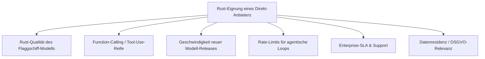
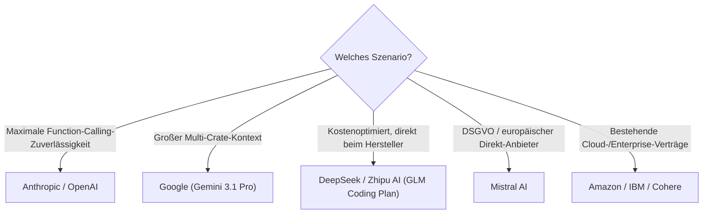

# Beste Direkt-Anbieter (Offizielle Entwickler-APIs) für Rust-Programmierung — Top-20-Topliste

Als Gegenstück zur [Aggregatoren- & Multi-Modell-Provider-Topliste](llm-aggregatoren-rust-topliste.md) geht es hier um den direkten Weg: die **offizielle Entwickler-API des jeweiligen Modell-Herstellers** selbst, ohne Gateway oder Reselling dazwischen. Direkt-Anbieter liefern neue Modell-Releases in der Regel zuerst, bieten die vollständigste Function-Calling-/Tool-Use-Implementierung für agentisches Coding und oft eigene SLAs — Faktoren, die bei produktivem, dauerhaftem Rust-Einsatz stärker ins Gewicht fallen als beim gelegentlichen Ausprobieren über einen Aggregator.

!!! note "Hinweis: Direkt-Anbieter ≠ günstigster Weg"
    Wer nur ein einziges Modell dauerhaft nutzt, fährt über die native API meist am stabilsten — Aggregatoren reichen Preise zwar oft unverändert durch, führen aber gelegentlich Verzögerungen bei neuen Releases oder abweichende Rate-Limits ein. Für einen reinen Preisvergleich über alle Wege hinweg siehe die [Anbieter-Übersicht](llm-anbieter-vergleich.md).

---

## Bewertungskriterien

!!! warning "Achtung: Momentaufnahme, kein Laborwert"
    Wie bei den verwandten Toplisten gibt es keine offizielle, herstellerübergreifende Rust-Benchmark-Suite. Die Einordnung stützt sich auf die Modellbewertung aus der [Sprachmodell-Topliste](llm-rust-topliste.md), API-Reife und Praxis-Feedback zu Function-Calling bei agentischen Rust-Workflows. **Stand: Juli 2026.**

---

## Top 20 im Überblick

| Rang | Anbieter | Flaggschiff-Modell für Rust | Rust-Einschätzung | Besondere Stärke | Schwäche |
|---|---|---|---|---|---|
| 1 | **Anthropic** | Claude Fable 5 | Sehr stark | Top-Platzierung in der Sprachmodell-Topliste, ausgereiftestes Function-Calling für lange agentische Rust-Loops (Claude Code) | Preis im Flaggschiff-Segment |
| 2 | **OpenAI** | GPT-5.6 Sol | Sehr stark | Sehr gutes Trait-/Makro-Verständnis, größtes SDK-/Tool-Ökosystem für eigene Integrationen | `unsafe`-Code teils übervorsichtig annotiert |
| 3 | **Google** | Gemini 3.1 Pro | Sehr stark | Riesiges Kontextfenster direkt nutzbar, keine Aggregator-Kontextlimits, native Multimodalität für Doku/Diagramme neben Code | Async-/Tokio-Fehlerbehebung leicht hinter Top 2 |
| 4 | **DeepSeek** | DeepSeek R2 (Reasoning) | Sehr stark | Direkter Zugriff meist deutlich günstiger als über Aggregatoren, nachvollziehbares Reasoning bei Lifetime-Herleitung | Native API-Dokumentation teils dünner als bei westlichen Anbietern |
| 5 | **Zhipu AI (Z.AI)** | GLM-5.1 | Stark | Führt offene Coding-Benchmarks an, „GLM Coding Plan" als planbares Abo statt Token-Abrechnung direkt beim Hersteller | Kleineres SDK-Ökosystem außerhalb Chinas |
| 6 | **xAI** | Grok 4 | Stark | Solides Systemprogrammierungs-Verständnis, direkter API-Zugriff ohne Umweg | Async-Trait-Kombinationen seltener zuverlässig wie bei Top 5 |
| 7 | **Alibaba Cloud (Qwen/DashScope)** | Qwen 3.7 | Stark | Direkter Zugriff auf eines der stärksten offenen Coding-Modelle, auch kleinere Größen (14B/32B) offiziell verfügbar | Rate-Limits/Region-Verfügbarkeit außerhalb Chinas teils eingeschränkter |
| 8 | **Moonshot AI** | Kimi K2 | Solide bis stark | Context-Caching senkt wiederholten Input bei großen Rust-Workspaces auf einen Bruchteil | Kleineres Function-Calling-Ökosystem als OpenAI/Anthropic |
| 9 | **Mistral AI** | Codestral / Mistral Large | Solide bis stark | Codestral als dediziertes Coding-Modell, europäischer Standort (DSGVO) direkt beim Hersteller | Codestral im reinen Rust-Vergleich hinter den Top-5-Allround-Modellen |
| 10 | **Meta** | Llama 3.3 70B (Llama API) | Solide | Offizielle Llama-API bei größtem Ökosystem an Fine-Tunes/Community-Tooling | Ohne Rust-spezifisches Fine-Tuning schwächer bei Lifetimes als Top 7 |
| 11 | **Amazon** | Nova Pro | Solide | Direkter Modell-Eigentümer (nicht nur Reseller), gute AWS-native Integration für Cloud-Rust-Projekte | Rust allgemein seltener Trainingsschwerpunkt als bei Coding-fokussierten Anbietern |
| 12 | **Cohere** | Command A | Ausreichend bis solide | Enterprise-Verträge, gute Reranking-/RAG-Anbindung für Rust-Dokumentationssuche | Kein dedizierter Coding-Schwerpunkt |
| 13 | **AI21 Labs** | Jamba | Ausreichend bis solide | Hybride Architektur mit sehr langem Kontext bei moderatem Rechenaufwand | Rust im Vergleich zu Top 10 seltener Trainingsfokus |
| 14 | **Perplexity** | Sonar (mit Websuche) | Ausreichend bis solide | Eingebaute Websuche hilfreich beim Nachschlagen aktueller Crate-Dokumentation während der Generierung | Kein reiner Coding-Agent-Fokus, eher Rechercheergänzung |
| 15 | **Databricks** | DBRX / Mosaic-Modelle | Ausreichend | Sinnvoll bei bestehender Databricks-/Lakehouse-Infrastruktur | Coding-Fokus liegt stärker auf Python/SQL als auf Rust |
| 16 | **Nvidia** | Nemotron | Ausreichend | Gut optimiert für eigene Hardware-/Inferenz-Stacks | Rust-spezifische Trainingsanteile geringer als bei Top 10 |
| 17 | **IBM** | Granite (watsonx) | Ausreichend | Sinnvoll bei bestehender IBM-/Enterprise-Infrastruktur, Compliance-Zertifizierungen | Rust vergleichsweise klein im unterstützten Coding-Umfang |
| 18 | **01.AI** | Yi-Large | Ausreichend | Günstiger direkter Zugriff, brauchbare Allround-Leistung | Rust seltener Trainingsschwerpunkt als bei GLM/Qwen |
| 19 | **Reka AI** | Reka Core | Grundlegend | Starke Multimodalität (Bild/Video), praktisch bei gemischten Doku-/Code-Aufgaben | Coding-/Rust-Fokus deutlich sekundär gegenüber Multimodalität |
| 20 | **Snowflake** | Arctic | Grundlegend | Sinnvoll nur bei bestehender Snowflake-Dateninfrastruktur | Für allgemeine Rust-Programmierung nicht der primäre Anwendungsfall des Modells |

!!! tip "Tipp: Rang ≠ einzige Entscheidungsgröße"
    Für **produktive agentische Rust-Workflows** zählt vor allem die Function-Calling-Reife der Top 5 — dort brechen lange Werkzeug-Ketten (Datei lesen → ändern → `cargo build` → Fehler interpretieren → erneut ändern) am seltensten ab. Für **Kostenoptimierung bei bereits gutem Modell** lohnt sich oft der Blick zurück auf die [Aggregatoren-Topliste](llm-aggregatoren-rust-topliste.md), da dieselben Top-5-Modelle dort teils günstiger oder mit Fallback-Absicherung verfügbar sind.

---

## Die Top 5 im Detail

### 1. Anthropic (Claude Fable 5)

Die direkte Anthropic-API bietet die vollständigste Function-Calling-Implementierung für lange agentische Ketten — besonders relevant, da Rust-Refactorings oft viele aufeinanderfolgende Werkzeugaufrufe (Datei-Edits, `cargo build`, Fehleranalyse) benötigen, bevor ein Ergebnis kompiliert. In Kombination mit [Claude Code](claude-code-praxis.md) direkt beim Hersteller aktuell die verlässlichste Gesamtkombination für komplexe Rust-Workspaces.

### 2. OpenAI (GPT-5.6 Sol)

Größtes SDK- und Tool-Ökosystem unter den Direkt-Anbietern, was eigene Integrationen (etwa ein internes Rust-CI-Bot-System) erleichtert. Sehr gutes Verständnis von Generics und `proc-macro`-Entwicklung direkt über die native API, ohne auf einen Aggregator-Umweg angewiesen zu sein.

### 3. Google (Gemini 3.1 Pro)

Der direkte API-Zugriff nutzt das volle Kontextfenster ohne die teils reduzierten Limits mancher Aggregatoren-Durchleitungen — bei großen Multi-Crate-Workspaces mit vielen gleichzeitig relevanten Dateien ein spürbarer Vorteil. Native Multimodalität erlaubt zusätzlich, Architekturdiagramme oder Fehler-Screenshots direkt mit einzubeziehen.

### 4. DeepSeek

Direkt beim Hersteller meist deutlich günstiger als über die meisten Aggregatoren, bei weiterhin starkem Reasoning für Lifetime-Herleitungen. Die native Chat-App ist zudem kostenlos nutzbar, was sich gut zum Vorab-Testen vor produktivem API-Einsatz eignet.

### 5. Zhipu AI (Z.AI)

Führt offene Coding-Benchmarks an und bietet mit dem „GLM Coding Plan" eine Abo-Alternative zur klassischen Token-Abrechnung direkt beim Hersteller — praktisch für Teams mit planbarem, hohem Rust-Agenten-Volumen, die keine nutzungsabhängigen Kosten pro Monat wollen.

---

## Empfehlung nach Einsatzszenario

!!! warning "Achtung: Direktverträge binden — Fallback einplanen"
    Wer sich ausschließlich auf einen einzelnen Direkt-Anbieter verlässt, hat bei dessen Ausfall oder Rate-Limit-Drosselung keinen automatischen Fallback — anders als bei Aggregatoren mit Routing (siehe [Aggregatoren-Topliste](llm-aggregatoren-rust-topliste.md)). Für unternehmenskritische agentische Rust-Pipelines lohnt sich oft eine Kombination: primär Direkt-API für Geschwindigkeit/SLA, Aggregator als Fallback bei Ausfällen.

---

## 🔗 Verwandte Themen

- [Startseite](../../index.md) — zurück zur Dokumentations-Zentrale
- [Beste Sprachmodelle für Rust-Programmierung (Top 20)](llm-rust-topliste.md) — welches Modell hinter dem Direkt-Anbieter läuft
- [Beste Abo-basierte Direkt-Anbieter (Offizielle Entwickler-Abos) für Rust-Programmierung (Top 20)](llm-abo-anbieter-rust-topliste.md) — dieselben Hersteller mit Abo statt Token-Abrechnung
- [Beste lokale Sprachmodelle für Rust-Programmierung (Self-Hosting, Top 20)](lokale-sprachmodelle-rust-topliste.md) — Alternative ganz ohne externe API
- [Beste Aggregatoren & Multi-Modell-Provider für Rust-Programmierung (Top 20)](llm-aggregatoren-rust-topliste.md) — Alternative ohne Vendor-Lock-in
- [Beste Cloud-Provider für GPU-Hosting eigener Rust-Coding-Modelle (Top 20)](cloud-gpu-provider-rust-topliste.md) — Self-Hosting statt API
- [Beste Rust-Frameworks & Web-Backends mit KI-Unterstützung (Top 20)](rust-web-frameworks-ki-topliste.md) — womit die angebundenen Modelle in Rust genutzt werden
- [Multi-LLM- & Sprachmodell-Anbieter im Vergleich](llm-anbieter-vergleich.md) — vollständige Preisübersicht über alle Kategorien
- [Beste KI-Coding-Agenten für Rust-Programmierung (Top 20)](ki-agenten-rust-topliste.md) — welche Agenten diese APIs ansteuern
- [Beste KI-Assistenten & Code-Editoren für Rust-Programmierung (Top 20)](ki-assistenten-rust-topliste.md) — nicht-agentische Alternative
- [Beste IDEs & Editoren mit Rust-Unterstützung (Top 20)](../../entwicklung/system/rust-ide-topliste.md) — reine Editor-/Tooling-Sicht ohne KI-Fokus
