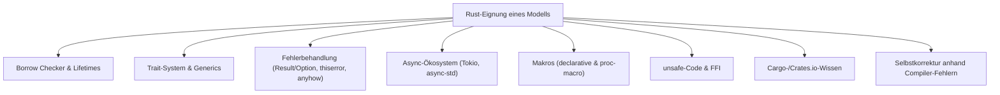
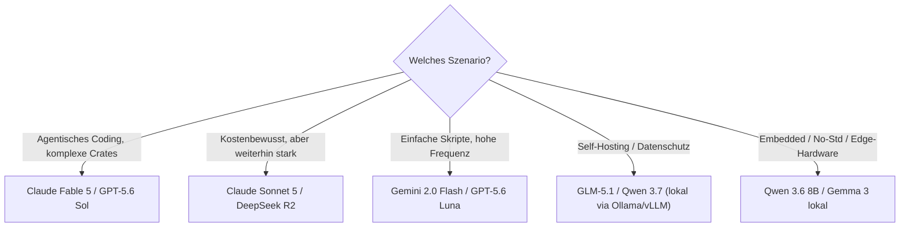

# Beste Sprachmodelle für Rust-Programmierung — Top-20-Topliste

Rust gilt unter Sprachmodellen als eine der anspruchsvollsten Zielsprachen: Der Borrow Checker toleriert keine Unschärfe, das Trait-System verlangt präzises Typverständnis, und `unsafe`-Blöcke, Makros sowie das Async-Ökosystem (Tokio, async-std) erfordern Wissen, das deutlich seltener in Trainingsdaten vorkommt als etwa Python oder JavaScript. Diese Seite ordnet die aktuell verfügbaren Sprachmodelle danach ein, wie zuverlässig sie **kompilierfähigen, idiomatischen Rust-Code** erzeugen — vom ersten Versuch bis zur Fehlerbehebung anhand von Compiler-Meldungen.

!!! warning "Achtung: Einordnung statt Laborwert"
    Es gibt keine einzelne, allgemein anerkannte „Rust-Benchmark-Suite", die alle Anbieter offiziell veröffentlichen. Diese Topliste fasst die Einordnung aus allgemeinen Coding-Benchmarks (SWE-bench, Aider Polyglot, LiveCodeBench), Modellkarten der Hersteller und wiederkehrendem Praxis-Feedback aus der Rust-Community zusammen — sie ersetzt keinen eigenen Test am konkreten Projekt. **Stand: Juli 2026.**

---

## Bewertungskriterien

!!! note "Hinweis: Warum gerade diese Kriterien"
    Anders als in dynamisch typisierten Sprachen liefert der Rust-Compiler bei fast jedem semantischen Fehler eine Fehlermeldung statt eines stillen Bugs. Ein Modell mit schwachem Rust-Verständnis erzeugt Code, der beim ersten Versuch nicht kompiliert — die entscheidende Fähigkeit ist deshalb weniger „fehlerfrei auf Anhieb" als **zielgerichtete Selbstkorrektur** anhand der `rustc`-Diagnose, idealerweise agentisch mit Zugriff auf `cargo build`/`cargo clippy`.

---

## Top 20 im Überblick

| Rang | Modell | Anbieter | Rust-Einschätzung | Besondere Stärke | Schwäche |
|---|---|---|---|---|---|
| 1 | **Claude Fable 5** | Anthropic | Sehr stark | Löst Lifetime-/Borrow-Checker-Fehler iterativ fast immer selbstständig, sauberer idiomatischer Stil (Iterator-Chains statt Index-Loops) | Preis im Flaggschiff-Segment |
| 2 | **GPT-5.6 Sol** | OpenAI | Sehr stark | Sehr gutes Trait-/Generics-Verständnis, starke Makro- und `proc-macro`-Kenntnisse | Neigt bei sehr langen `unsafe`-Blöcken gelegentlich zu übervorsichtigen Annotationen |
| 3 | **Gemini 3.1 Pro** | Google | Sehr stark | Riesiges Kontextfenster ideal für große Workspaces mit vielen Crates, gutes Verständnis von Workspace-`Cargo.toml`-Strukturen | Async-Fehlerbehebung (Tokio-Runtime-Panics) etwas schwächer als bei den Top 2 |
| 4 | **DeepSeek R2 (Reasoning)** | DeepSeek | Sehr stark | Explizites Reasoning macht Lifetime-Herleitung nachvollziehbar, sehr gutes Preis-Leistungs-Verhältnis | Längere Antwortzeit durch sichtbare Denkschritte |
| 5 | **Claude Sonnet 5** | Anthropic | Stark | Guter Kompromiss aus Geschwindigkeit und Korrektheit, verlässlich in agentischen Coding-Loops (Claude Code) | Bei sehr komplexen generischen Trait-Bounds seltener präzise wie Fable 5 |
| 6 | **GLM-5.1** | Zhipu AI | Stark | Führt offene Coding-Benchmarks an, gutes Preis-Leistungs-Verhältnis, MIT-Lizenz für Self-Hosting | Kleinere Rust-spezifische Trainingsanteile als die Top-Anbieter |
| 7 | **Grok 4** | xAI | Stark | Solides Allround-Verständnis, gut bei Systemprogrammierungs-Aufgaben (Embedded, No-Std) | Weniger verlässlich bei komplexen `async`-Trait-Kombinationen |
| 8 | **DeepSeek V4 Pro** | DeepSeek | Stark | Starkes MoE-Reasoning bei moderaten Kosten, gute `unsafe`/FFI-Erklärungen | Gelegentlich veraltete Crate-API-Annahmen (z. B. vor Tokio-1.x-Änderungen) |
| 9 | **Qwen 3.7** | Alibaba | Stark | Sehr gute Coding-Leistung im Open-Weight-Segment, brauchbar auch in kleineren Größen (14B/32B) | Borrow-Checker-Fehler bei tief verschachtelten Lifetimes seltener auf Anhieb gelöst |
| 10 | **GPT-5.6 Luna** | OpenAI | Solide | Deutlich günstiger als Sol bei weiterhin brauchbarer Grundkompetenz | Schwächer bei Makros und generischen Trait-Objekten |
| 11 | **Gemini 2.0 Flash** | Google | Solide | Sehr schnell und günstig, ausreichend für einfache CLI-Tools und Skripte | Bei nicht-trivialen Ownership-Konflikten häufiger mehrere Korrekturrunden nötig |
| 12 | **Kimi K2 (Moonshot AI)** | Moonshot AI | Solide | Guter Allrounder mit günstigem Context-Caching für große Codebasen | Rust seltener Trainingsschwerpunkt als bei Qwen/GLM |
| 13 | **Mistral Large** | Mistral AI | Solide | Solides Grundverständnis von Ownership & Traits, europäischer Anbieter (DSGVO) | Weniger stark bei komplexem Async-Code als die Top 10 |
| 14 | **MiniMax M2** | MiniMax | Solide | Günstig, brauchbar für einfache bis mittlere Aufgaben | Selbstkorrektur anhand von Compiler-Fehlern weniger konsistent |
| 15 | **Llama 3.3 70B** | Meta | Solide | Großes Ökosystem an Fine-Tunes, gut dokumentiertes Verhalten | Ohne Rust-spezifisches Fine-Tuning schwächer bei Lifetimes als GLM/Qwen |
| 16 | **gpt-oss-120b** | OpenAI (Open Weight) | Ausreichend | Frei selbst hostbar, brauchbare Basis für einfache Tools | Deutlich hinter den proprietären OpenAI-Modellen bei komplexem generischem Code |
| 17 | **Command A** | Cohere | Ausreichend | Für RAG-nahe Coding-Assistenz brauchbar | Kein Coding-Schwerpunkt, seltener idiomatisches Rust |
| 18 | **Mistral Small 4** | Mistral AI | Ausreichend | Sehr günstig, lizenzfrei (Apache-2.0) einsetzbar | Für mittelkomplexe Trait-Hierarchien meist zu schwach |
| 19 | **Qwen 3.6 (8B-Edge)** | Alibaba | Grundlegend | Läuft auf Edge-Hardware/Laptops ohne GPU-Cluster | Nur für einfache, kurze Rust-Snippets geeignet |
| 20 | **Gemma 3 (4B/12B)** | Google (Open Weight) | Grundlegend | Kleinster Ressourcenbedarf, lokal auf schwacher Hardware lauffähig | Borrow-Checker-Fehler werden häufig nicht korrekt behoben, eher für Erklärungen als Codegenerierung geeignet |

!!! tip "Tipp: Rang ≠ einzige Entscheidungsgröße"
    Für **agentisches Coding** (Modell arbeitet selbstständig mit `cargo build`/`cargo test` in einer Schleife) zählt vor allem die Selbstkorrektur-Fähigkeit aus Rang 1–5. Für **einmalige Snippets oder Erklärungen** reicht oft ein deutlich günstigeres Modell aus Rang 10–15 — der Qualitätsunterschied fällt dort weniger ins Gewicht, wenn ohnehin manuell nachgeprüft wird.

---

## Die Top 5 im Detail

### 1. Claude Fable 5 (Anthropic)

Stärkster Gesamteindruck bei komplexem, mehrdateiigem Rust: löst verschachtelte Lifetime-Konflikte fast immer selbstständig, bevorzugt idiomatische Iterator-Chains gegenüber manuellen Indizes und erzeugt bei Trait-Objekten (`dyn Trait`, `impl Trait`) selten unnötige Klonaufrufe. In agentischen Setups (Claude Code, siehe [Claude Code Praxis-Handbuch](claude-code-praxis.md)) besonders stark, da Compiler-Fehler gezielt und ohne Umwege behoben werden.

### 2. GPT-5.6 Sol (OpenAI)

Sehr gutes Verständnis von Generics und Trait-Bounds, inklusive komplexerer `where`-Klauseln. Bei `proc-macro`-Entwicklung (z. B. eigene `derive`-Makros) aktuell eines der zuverlässigsten Modelle. Schwäche: bei sehr langem `unsafe`-Code tendenziell zu defensiv, fügt teils überflüssige Sicherheitsprüfungen ein, die die Performance-Vorteile von `unsafe` untergraben.

### 3. Gemini 3.1 Pro (Google)

Das große Kontextfenster zahlt sich bei Workspaces mit vielen Crates besonders aus — Refactorings über mehrere Module hinweg bleiben konsistent. Gute Kenntnis von Cargo-Workspace-Strukturen (`[workspace]`, `path`-Dependencies). Etwas schwächer bei der Fehlerbehebung von Tokio-Runtime-Panics zur Laufzeit, die über reine Compiler-Fehler hinausgehen.

### 4. DeepSeek R2 (Reasoning) (DeepSeek)

Das sichtbare Reasoning macht nachvollziehbar, warum eine bestimmte Lifetime-Annotation nötig ist — didaktisch wertvoll beim Lernen, nicht nur beim reinen Codegenerieren. Bei sehr gutem Preis-Leistungs-Verhältnis (siehe [Multi-LLM- & Sprachmodell-Anbieter im Vergleich](llm-anbieter-vergleich.md)) eine der besten Optionen für kostenbewusste Teams.

### 5. Claude Sonnet 5 (Anthropic)

Guter Mittelweg zwischen Fable 5 und den günstigeren Modellen: deutlich schneller und günstiger als das Flaggschiff, bei weiterhin verlässlicher Ownership-/Borrow-Checker-Logik. In der Praxis oft die wirtschaftlichste Wahl für dauerhafte agentische Coding-Loops, bei denen Fable 5 nur für die schwierigsten Teilaufgaben eskaliert wird.

---

## Empfehlung nach Einsatzszenario

!!! warning "Achtung: Self-Hosting bei Rust besonders sinnvoll prüfen"
    Wer Rust vor allem für sicherheitskritische Systeme (Embedded, Kryptographie, Infrastruktur) einsetzt, sollte ohnehin geneigt sein, generierten Code manuell zu prüfen — dort lohnt sich der Blick auf selbstgehostete Modelle wie GLM-5.1 oder Qwen 3.7 über [Lokales RAG & LLM-Serving](lokales-rag-ollama.md) oder [vLLM High-Throughput Serving](vllm-high-throughput-serving.md) besonders, da Code ohnehin lokal verbleiben sollte.

!!! note "Hinweis: Clippy als Pflichtergänzung"
    Unabhängig vom gewählten Modell sollte generierter Rust-Code immer durch `cargo clippy -- -D warnings` laufen — Modelle erzeugen zuverlässig *kompilierfähigen*, aber nicht immer *idiomatischen* Code im Sinne der Clippy-Lints. Das gilt selbst für die Top-3-Modelle dieser Liste.

---

## 🔗 Verwandte Themen

- [Startseite](../../index.md) — zurück zur Dokumentations-Zentrale
- [Beste Aggregatoren & Multi-Modell-Provider für Rust-Programmierung (Top 20)](llm-aggregatoren-rust-topliste.md) — wo die hier gelisteten Modelle günstig/schnell angebunden werden
- [Beste Aggregatoren & Multi-Modell-Provider für Rust-Programmierung (Abo-Abrechnung, Top 20)](llm-aggregatoren-abo-rust-topliste.md) — dieselben Modelle wählbar unter einem festen Monatspreis
- [Beste Direkt-Anbieter (Offizielle Entwickler-APIs) für Rust-Programmierung (Top 20)](llm-direktanbieter-rust-topliste.md) — direkter Weg ohne Gateway dazwischen
- [Beste Abo-basierte Direkt-Anbieter (Offizielle Entwickler-Abos) für Rust-Programmierung (Top 20)](llm-abo-anbieter-rust-topliste.md) — fester Monatspreis statt Token-Abrechnung
- [Beste Cloud-Provider für GPU-Hosting eigener Rust-Coding-Modelle (Top 20)](cloud-gpu-provider-rust-topliste.md) — Self-Hosting statt API
- [Beste Rust-Frameworks & Web-Backends mit KI-Unterstützung (Top 20)](rust-web-frameworks-ki-topliste.md) — womit KI-Anwendungen in Rust selbst gebaut werden
- [Beste lokale Sprachmodelle für Rust-Programmierung (Self-Hosting, Top 20)](lokale-sprachmodelle-rust-topliste.md) — Vertiefung nur zu offenen, selbst hostbaren Modellen
- [Beste KI-Coding-Agenten für Rust-Programmierung (Top 20)](ki-agenten-rust-topliste.md) — welches Agenten-Tool zum Modell passt
- [Beste KI-Assistenten & Code-Editoren für Rust-Programmierung (Top 20)](ki-assistenten-rust-topliste.md) — nicht-agentische Autovervollständigung & Chat
- [Beste IDEs & Editoren mit Rust-Unterstützung (Top 20)](../../entwicklung/system/rust-ide-topliste.md) — reine Editor-/Tooling-Sicht ohne KI-Fokus
- [Multi-LLM- & Sprachmodell-Anbieter im Vergleich](llm-anbieter-vergleich.md) — Preise & Zugriffswege der hier genannten Modelle
- [Claude Code Praxis-Handbuch](claude-code-praxis.md) — agentisches Coding in der Praxis
- [Lokales RAG & LLM-Serving](lokales-rag-ollama.md) — Self-Hosting von Open-Weight-Modellen
- [vLLM High-Throughput Serving](vllm-high-throughput-serving.md) — produktionsreifes Self-Hosting für Teams
