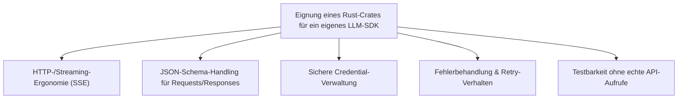
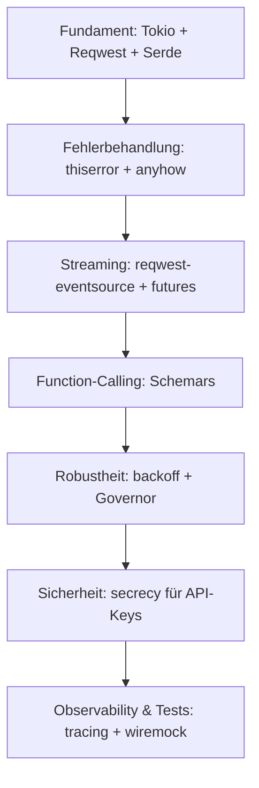

# Beste Rust-Bibliotheken & Frameworks für ein eigenes KI-Sprachmodell-SDK — Top-20-Topliste

Die [KI-Sprachmodell-SDK-Topliste nach Programmiersprachen-Vielfalt](llm-sdk-sprachen-topliste.md) bewertet fertige Anbieter-SDKs wie das offizielle OpenAI- oder Anthropic-SDK. Hier geht es um den Eigenbau: **Welche Rust-Crates eignen sich, um ein eigenes, schlankes LLM-Client-SDK selbst zu programmieren** — Streaming-Antworten, Function-Calling-Schemas, Token-Zählung, Retry-Verhalten und sicheres API-Key-Handling inklusive?

!!! note "Hinweis: Client-SDK statt Agent-Orchestrierung"
    Diese Liste bewertet Bausteine für einen reinen **API-Client** zu Sprachmodellen — kein Agent-Framework mit Tool-Loop oder Multi-Step-Orchestrierung. Wer stattdessen ein eigenes Agent-SDK bauen möchte, findet die passenden Bausteine in der [Rust-Agent-SDK-Topliste](ki-agent-sdk-rust-bibliotheken-topliste.md).

---

## Bewertungskriterien

!!! warning "Achtung: Eigenbau bedeutet Wartungsverantwortung"
    Ein selbst gebautes LLM-SDK muss bei API-Änderungen des Anbieters (neue Parameter, geänderte Streaming-Formate) selbst nachgepflegt werden — anders als bei offiziellen SDKs, die der Hersteller aktuell hält. Der Vorteil: minimale Bundle-Größe und volle Kontrolle über das Antwortformat. **Stand: Juli 2026.**

---

## Top 20 im Überblick

| Rang | Crate | Kategorie | Rolle im eigenen LLM-SDK | Besondere Stärke | Schwäche |
|---|---|---|---|---|---|
| 1 | **Reqwest** | HTTP-Client | Basis für alle Requests an die Modell-API | Ausgereiftester HTTP-Client im Rust-Ökosystem, TLS & Proxy-Support eingebaut | Streaming-Antworten erfordern zusätzliches Crate |
| 2 | **Tokio** | Async-Runtime | Nebenläufige Verarbeitung paralleler Modell-Anfragen | Praktisch Voraussetzung für Reqwest & den gesamten Async-Stack | Reine Laufzeitumgebung, keine LLM-Logik |
| 3 | **Serde / serde_json** | Serialisierung | (De-)Serialisierung von Request-Payloads und Modell-Antworten | Universeller Standard mit exzellenten Derive-Makros | Schema-Validierung selbst nicht enthalten |
| 4 | **reqwest-eventsource** | SSE-Streaming | Verarbeitet Server-Sent-Events für Token-für-Token-Streaming-Antworten | Baut direkt auf Reqwest auf, deckt das gängigste Streaming-Format der Anbieter ab | Nicht jeder Anbieter nutzt reines SSE (teils NDJSON) |
| 5 | **futures** | Async-Kombinatoren | Verarbeitung von Streams aus Token-Chunks (map, buffer, chunks) | Fundamentale Bausteine für praktisch jede Streaming-Pipeline | Abstrakt — erfordert Verständnis von Stream-/Future-Traits |
| 6 | **Schemars** | Schema-Generierung | Erzeugt JSON-Schema aus Rust-Structs für Function-Calling-Definitionen | Nimmt viel Handarbeit bei Tool-/Function-Deklarationen ab | Nicht jedes Rust-Typsystem-Feature 1:1 abbildbar |
| 7 | **tiktoken-rs** | Tokenisierung | Token-Zählung für Kontextfenster-Limits und Kostenschätzung vor dem Senden | Portierung der Original-OpenAI-Tokenizer, hohe Genauigkeit | Modell-/Provider-spezifische Tokenizer müssen separat gepflegt werden |
| 8 | **thiserror** | Fehlerbehandlung | Unterscheidbare, typisierte Fehler (Rate-Limit, Auth, Netzwerk, Validierung) | Sauberste Lösung für Bibliotheks-Fehlertypen in Rust | Erfordert etwas mehr Boilerplate als generisches `anyhow` |
| 9 | **anyhow** | Fehlerbehandlung | Fehlerbehandlung auf Anwendungsseite, die das SDK konsumiert | Sehr ergonomisch für schnelles Prototyping des SDK-Nutzers | Weniger geeignet für die SDK-Bibliothek selbst (dort besser thiserror) |
| 10 | **backoff** | Retry-Logik | Exponentielles Backoff bei 429/5xx-Antworten der Modell-API | Robuste Standardlösung, wenig Konfigurationsaufwand | Keine automatische Unterscheidung zwischen retrybaren und permanenten Fehlern |
| 11 | **Governor** | Rate-Limiting | Client-seitige Drosselung, um Provider-Rate-Limits proaktiv einzuhalten | Feingranular konfigurierbar, verhindert unnötige 429-Fehler | Muss manuell an die jeweiligen Provider-Limits angepasst werden |
| 12 | **secrecy** | Credential-Handling | Schützt API-Keys im Speicher vor versehentlichem Logging/Leaking | Verhindert, dass Keys z. B. über `Debug`-Ausgaben in Logs landen | Erfordert Disziplin, den Typ konsequent statt roher Strings zu verwenden |
| 13 | **url** | URL-Konstruktion | Sauberer Aufbau von Endpunkt-URLs inkl. Query-Parametern | Vermeidet manuelles, fehleranfälliges String-Concatenating | Reines Hilfswerkzeug ohne LLM-spezifische Logik |
| 14 | **bytes** | Puffer-Verwaltung | Effizientes Handling von Streaming-Chunks ohne unnötige Kopien | Wird bereits von Reqwest/Tokio intern genutzt, gute Interop | Direkter Nutzen nur bei performance-kritischem Streaming spürbar |
| 15 | **base64** | Kodierung | Kodierung multimodaler Payloads (Bilder, Audio) für Vision-/Audio-Modelle | Einfache, standardkonforme Kodierung ohne externe Abhängigkeiten | Reines Hilfswerkzeug, keine Validierung des Inhaltstyps |
| 16 | **mime_guess** | Kodierung | Erkennt MIME-Typen hochgeladener Dateien für multimodale Requests | Nimmt Rätselraten bei Content-Type-Headern ab | Erkennung rein dateiendungsbasiert, nicht inhaltsbasiert |
| 17 | **wiremock** | Testing | Mockt HTTP-Antworten der Modell-API für deterministische Integrationstests | Ermöglicht vollständige Tests ohne echte, kostenpflichtige API-Aufrufe | Streaming-Antworten realistisch zu mocken erfordert mehr Setup-Aufwand |
| 18 | **tracing** | Observability | Strukturiertes Logging von Requests, Latenzen und Retries | Guter Ökosystem-Support inkl. OpenTelemetry-Export | Sinnvolle Instrumentierung erfordert disziplinierten Einsatz im Code |
| 19 | **config** | Konfigurationsverwaltung | Verwaltung mehrerer Provider-Endpunkte, Modelle und Umgebungen | Vereinheitlicht Env-Variablen, Dateien und Overrides sauber | Für ein einzelnes Provider-Setup oft unnötige Abstraktion |
| 20 | **async-openai** (als Referenz) | Referenz-Implementierung | Ausgereifte Vorlage für Request-/Response-Strukturen und Streaming-Handling | Guter Fundus bereits gelöster Design-Probleme, teils direkt als Basis forkbar | Eng an OpenAI-Konventionen orientiert, andere Anbieter erfordern Anpassungen |

!!! tip "Tipp: Minimaler Startstack"
    Für ein **schlankes eigenes LLM-SDK** genügt zu Beginn die Kombination aus Reqwest, Tokio, Serde und thiserror. `reqwest-eventsource` kommt erst dazu, sobald Streaming-Antworten unterstützt werden sollen — für rein synchrone Einzelantworten (kein Streaming) ist es zunächst verzichtbar.

---

## Aufbau-Reihenfolge für ein eigenes LLM-SDK

---

## 🔗 Verwandte Themen

- [Startseite](../../index.md) — zurück zur Dokumentations-Zentrale
- [Beste KI-Sprachmodell-SDKs nach Programmiersprachen-Vielfalt (Top 20)](llm-sdk-sprachen-topliste.md) — fertige Anbieter-SDKs statt einzelner Rust-Bausteine
- [Beste Rust-Bibliotheken & Frameworks für ein eigenes KI-Agent-SDK (Top 20)](ki-agent-sdk-rust-bibliotheken-topliste.md) — dieselbe Fragestellung für Agent-Orchestrierung statt reinem LLM-Client
- [Beste Rust-Frameworks & Web-Backends mit KI-Unterstützung (Top 20)](rust-web-frameworks-ki-topliste.md) — fertige Crates wie async-openai im Gesamtkontext von KI-Backends
- [Beste Direkt-Anbieter (Offizielle Entwickler-APIs) für Rust-Programmierung (Top 20)](llm-direktanbieter-rust-topliste.md) — welche Anbieter-API sich für ein eigenes SDK überhaupt lohnt
- [Beste Sprachmodelle für Rust-Programmierung (Top 20)](llm-rust-topliste.md) — Modellauswahl statt SDK-Bausteinen
