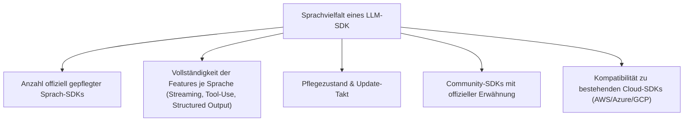
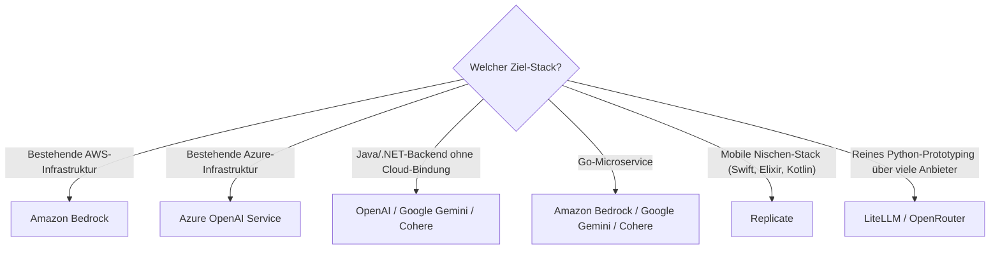

# Beste KI-Sprachmodell-SDKs nach Programmiersprachen-Vielfalt — Top-20-Topliste

Nach dem [Multi-LLM- & Sprachmodell-Anbieter-Vergleich](llm-anbieter-vergleich.md) dieser Serie geht es hier um eine andere Frage: **In wie vielen Programmiersprachen bieten Anbieter offizielle SDKs für ihre Sprachmodell-APIs an?** Wer eine Integration in ein bestehendes Backend plant — egal ob Java-Monolith, Go-Microservice oder .NET-Anwendung —, profitiert davon, wenn der Anbieter eine native, gepflegte Client-Bibliothek statt nur einer rohen REST-Schnittstelle bereitstellt.

!!! note "Hinweis: Zählweise"
    Gezählt werden **offiziell vom Anbieter gepflegte SDKs** sowie etablierte, breit genutzte Community-Bibliotheken, sofern sie in der offiziellen Dokumentation verlinkt sind. Reine OpenAI-kompatible REST-Endpunkte ohne dediziertes SDK zählen nicht als eigene Sprache.

---

## Bewertungskriterien

!!! warning "Achtung: Momentaufnahme in einer sehr dynamischen Kategorie"
    Anbieter erweitern ihr SDK-Portfolio laufend, und Sprachanzahl allein sagt nichts über Funktionsparität aus — häufig erhält das Python- oder TypeScript-SDK neue Features zuerst, während andere Sprachen nachziehen. **Stand: Juli 2026.**

---

## Top 20 im Überblick

| Rang | Anbieter / SDK | Anzahl Sprachen | Sprachen | Einschätzung | Besondere Stärke | Schwäche |
|---|---|---|---|---|---|---|
| 1 | **Amazon Bedrock** (via AWS SDK) | 12+ | Python, Java, JavaScript/Node.js, .NET/C#, Go, Ruby, PHP, C++, Rust, Kotlin, Swift, SDK für R | Sehr stark | Erbt die riesige Sprachbreite des allgemeinen AWS-SDK, ein SDK deckt viele Modelle gleichzeitig ab | Modellzugriff pro Anbieter (Anthropic, Meta, Cohere &c.) unterschiedlich vollständig |
| 2 | **Azure OpenAI Service** (via Azure SDK) | 6 | Python, .NET/C#, Java, JavaScript/TypeScript, Go, C++ | Sehr stark | Nahtlose Einbettung in bestehende Azure-Infrastruktur & Enterprise-Compliance | Volle Feature-Parität zur nativen OpenAI-API oft leicht verzögert |
| 3 | **OpenAI** | 5 offiziell (+ zahlreiche Community-SDKs) | Python, Node.js/TypeScript, .NET, Java, Go — community: PHP, Ruby, Rust, Kotlin, Swift | Sehr stark | Referenzimplementierung, an der sich die meisten OpenAI-kompatiblen APIs orientieren | Community-SDKs außerhalb der offiziellen 5 unterschiedlich gut gepflegt |
| 4 | **Google Gemini API** (Vertex AI / AI Studio) | 5 | Python, Node.js/TypeScript, Go, Java, C# | Stark | Gute Einbettung in Vertex-AI-Plattform inkl. Multimodalität | Zwei parallele SDK-Generationen (AI Studio vs. Vertex AI) sorgen für Verwirrung |
| 5 | **Anthropic (Claude API)** | 4 | Python, TypeScript, Java (Beta), Go (Beta) | Stark | Sehr sauberes, gut dokumentiertes Kern-SDK mit konsistentem Tool-Use-Modell | Java/Go offiziell noch als Beta gekennzeichnet |
| 6 | **Cohere** | 4 | Python, TypeScript/Node.js, Go, Java | Stark | Starker Fokus auf Embeddings & Rerank neben Chat, alle SDKs auf ähnlichem Stand | Kleineres Ökosystem an Drittanbieter-Tools als OpenAI/Anthropic |
| 7 | **Mistral AI** | 3 offiziell (+ Community) | Python, TypeScript/JS, Java — community: Go, Rust | Solide bis stark | Sehr leichtgewichtige SDKs, gute Passform für Edge-/On-Prem-Szenarien | Offizielle Sprachabdeckung schmaler als bei den Hyperscalern |
| 8 | **IBM watsonx.ai** | 3 | Python, Node.js, Java (via REST-Wrapper) | Solide | Gute Anbindung an bestehende IBM-Enterprise-Landschaften | Außerhalb des IBM-Ökosystems wenig verbreitet |
| 9 | **Replicate** | 6 (stark community-getrieben) | Python, Node.js, Go, Swift, Elixir, Kotlin | Solide bis stark | Ungewöhnlich breite Sprachabdeckung dank aktiver Community, gut für mobile/Nischen-Stacks | Modellauswahl breiter, aber SDKs dünner als bei den großen Anbietern |
| 10 | **Alibaba Qwen / DashScope** | 3 | Python, Java, Node.js | Solide | Starke Anbindung an Qwen3-Modellfamilie, gutes Preis-Leistungs-Verhältnis | Dokumentation überwiegend chinesisch-zentriert, englische Doku dünner |
| 11 | **Ollama** (lokales Serving) | 3 | Python, JavaScript, Go (nativ, Kernsprache des Servers) | Solide | Native Go-Bibliothek direkt aus dem Serving-Prozess, sehr geringe Einstiegshürde | Kein Cloud-Hosting — SDK adressiert nur lokale/self-hosted Modelle |
| 12 | **Hugging Face Inference** | 2 | Python (`huggingface_hub`), JavaScript (`huggingface.js`) | Solide | Riesige Modellauswahl über ein einheitliches SDK ansprechbar | Nur zwei Sprachen offiziell, Rest läuft über generische REST-Aufrufe |
| 13 | **Together AI** | 2 | Python, Node.js/TypeScript | Solide | Gutes Preis-Leistungs-Verhältnis bei offenen Modellen | Sprachabdeckung deutlich schmaler als bei Hyperscalern |
| 14 | **Groq** | 2 | Python, Node.js/TypeScript | Solide | Sehr niedrige Latenz dank eigener LPU-Hardware | Modellauswahl kleiner als bei Multi-Modell-Aggregatoren |
| 15 | **Fireworks AI** | 2 | Python, Node.js/TypeScript | Solide | Gute Fein-Tuning- & Serving-Kombination aus einer Hand | Community-SDK-Ökosystem noch jung |
| 16 | **DeepSeek API** | 2 (OpenAI-kompatibel) | Python, Node.js/TypeScript | Ausreichend bis solide | Sehr günstiges Preismodell, direkt über OpenAI-SDKs nutzbar | Kein eigenständiges SDK — nur Kompatibilitätsschicht |
| 17 | **xAI (Grok API)** | 2 (OpenAI-kompatibel) | Python, Node.js/TypeScript | Ausreichend bis solide | Einfache Migration von bestehendem OpenAI-Code | Ebenfalls nur Kompatibilitätsschicht statt eigenem SDK |
| 18 | **Perplexity API** | 2 (OpenAI-kompatibel) | Python, Node.js/TypeScript | Ausreichend | Gute Anbindung an Websuche/RAG-Antworten | Kein natives SDK jenseits der Kompatibilitätsschicht |
| 19 | **OpenRouter** (Aggregator) | 2 | Python, Node.js/TypeScript | Ausreichend | Ein SDK für hunderte Modelle verschiedenster Anbieter | Sprachbreite selbst gering, Mehrwert liegt in Modellzahl, nicht SDK-Sprachen |
| 20 | **LiteLLM** (Aggregator) | 1 | Python (deckt darüber 100+ Anbieter ab) | Ausreichend | Ein einheitliches Python-Interface für nahezu jeden LLM-Anbieter | Keine nativen SDKs für andere Sprachen, nur Proxy-Server als Workaround |

!!! tip "Tipp: Sprachanzahl ist nicht das einzige Kriterium"
    Für **Enterprise-Umgebungen mit bestehender AWS- oder Azure-Infrastruktur** sind Bedrock bzw. Azure OpenAI durch ihre SDK-Breite oft der pragmatischste Einstieg. Für **reine Python-/TypeScript-Backends** liefern OpenAI, Anthropic und Google Gemini die ausgereiftesten, feature-vollständigsten SDKs — unabhängig vom Platz in dieser Sprachanzahl-Rangliste.

---

## Entscheidungshilfe nach Ziel-Stack

---

## 🔗 Verwandte Themen

- [Startseite](../../index.md) — zurück zur Dokumentations-Zentrale
- [Multi-LLM- & Sprachmodell-Anbieter im Vergleich](llm-anbieter-vergleich.md) — Anbietervergleich nach Qualität, Preis & Kontextfenster statt SDK-Sprachbreite
- [Beste KI-Agent-SDKs nach Programmiersprachen-Vielfalt (Top 20)](ki-agent-sdk-sprachen-topliste.md) — dasselbe Kriterium auf Agent-Frameworks statt LLM-APIs angewendet
- [Beste Sprachmodelle für Rust-Programmierung (Top 20)](llm-rust-topliste.md) — Modellauswahl statt SDK-Sprachbreite
- [Beste Direkt-Anbieter (Offizielle Entwickler-APIs) für Rust-Programmierung (Top 20)](llm-direktanbieter-rust-topliste.md) — Anbieterauswahl speziell für Rust-Projekte
- [Lokales RAG & LLM-Serving](lokales-rag-ollama.md) — Ollama im praktischen Einsatz statt reiner SDK-Betrachtung
- [Structured LLM Outputs (Pydantic)](structured-outputs-pydantic.md) — vertiefende Praxis zum Python-SDK-Einsatz
