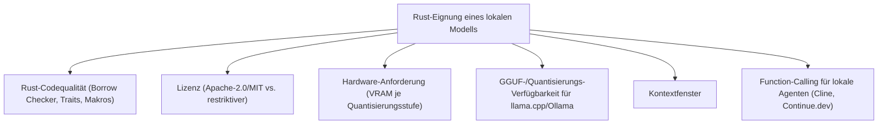
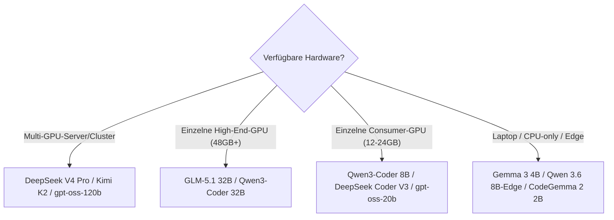

# Beste lokale Sprachmodelle für Rust-Programmierung (Self-Hosting) — Top-20-Topliste

Die [Sprachmodell-Topliste](llm-rust-topliste.md) bewertet Modelle unabhängig vom Zugriffsweg. Diese Seite geht tiefer in genau eine Kategorie: **offene, selbst hostbare Modelle**, die vollständig auf eigener oder gemieteter Hardware laufen — ohne dass Code oder Prompts die eigene Infrastruktur verlassen. Relevant für Rust-Projekte mit Datenschutz-/Compliance-Anforderungen (Embedded, Kryptographie, Behörden) oder bei sehr hohem Dauervolumen, bei dem sich eigene Hardware gegenüber Token-Kosten amortisiert.

!!! note "Hinweis: Modell ≠ Hosting-Ort"
    Diese Liste bewertet ausschließlich die **Modelle selbst** und ihre Lizenz-/Hardware-Eignung. Für die Frage, *wo* diese Modelle laufen sollen, siehe [Lokales RAG & LLM-Serving](lokales-rag-ollama.md) (Ollama, eigene Hardware) oder die [Cloud-GPU-Provider-Topliste](cloud-gpu-provider-rust-topliste.md) (gemietete GPU-Leistung).

---

## Bewertungskriterien

!!! warning "Achtung: Momentaufnahme, keine offizielle Rust-Benchmark-Suite"
    Wie bei den verwandten Toplisten gibt es keine herstellerübergreifende, offizielle Rust-Benchmark-Suite. Die Einordnung stützt sich auf allgemeine offene Coding-Benchmarks, Modellkarten und Praxis-Feedback. **Stand: Juli 2026.**

---

## Top 20 im Überblick

| Rang | Modell | Größe(n) | Lizenz | Rust-Einschätzung | Besondere Stärke | Schwäche |
|---|---|---|---|---|---|---|
| 1 | **GLM-5.1** | 9B / 32B | MIT | Sehr stark | Führt offene Coding-Benchmarks an, gutes Preis-Leistungs-Verhältnis auch bei mittlerer Größe | 32B benötigt bereits deutliche GPU-Ausstattung für flüssige Nutzung |
| 2 | **Qwen3-Coder** | 8B–72B | Apache-2.0 | Sehr stark | Dedizierte Coder-Variante von Qwen 3.7, sehr gutes Trait-/Borrow-Checker-Verständnis | Allgemeinwissen jenseits von Code schwächer als Basis-Qwen |
| 3 | **DeepSeek V4 Pro** | groß (MoE) | MIT | Sehr stark | Starkes Reasoning bei Lifetime-Herleitung, nachvollziehbare Zwischenschritte | Volle MoE-Größe erfordert Multi-GPU-Setup für lokale Nutzung |
| 4 | **Qwen 3.7** | 8B–72B | Apache-2.0 | Stark | Sehr gute Allround-Coding-Leistung, auch als kleinere Edge-Variante brauchbar | Bei tief verschachtelten Lifetimes seltener auf Anhieb korrekt wie GLM-5.1 |
| 5 | **Devstral 2** | 24B | Apache-2.0 | Stark | Speziell für agentisches Coding trainiert, gutes Zusammenspiel mit Cline/Aider lokal | Reines Sprachverständnis jenseits von Coding-Agenten-Aufgaben schmaler |
| 6 | **Kimi K2** | groß (MoE, offen) | Modified MIT | Stark | Sehr großes Kontextfenster, günstiges Context-Caching bei Self-Hosting mit ausreichend VRAM | Volle Größe nur mit erheblicher Multi-GPU-Kapazität sinnvoll |
| 7 | **Codestral 3** | 22B | Mistral Research License | Stark | Dediziertes Coding-Modell mit breiter Sprachabdeckung inkl. Rust | Lizenz nicht vollständig permissiv — kommerzielle Nutzung ggf. eingeschränkt |
| 8 | **DeepSeek Coder V3** | 16B–33B | MIT | Stark | Dedizierte Coder-Variante, gutes Verhältnis aus Größe und Coding-Qualität | Allgemeinwissen schmaler als Basis-DeepSeek |
| 9 | **StarCoder3** | 3B–15B | Apache-2.0 (BigCode) | Solide bis stark | Sehr permissive Lizenz, transparente Trainingsdaten (BigCode-Projekt) | Rust-Anteil im Training kleiner als bei GLM/Qwen |
| 10 | **Llama 3.3 70B** | 70B | Llama-Lizenz | Solide bis stark | Größtes Ökosystem an Fine-Tunes und Tooling-Integrationen | Ohne Rust-spezifisches Fine-Tuning schwächer bei Lifetimes als Top 8 |
| 11 | **gpt-oss-120b** | 120B (MoE) | Apache-2.0 | Solide bis stark | Offenes Flaggschiff-Modell von OpenAI, breite Allround-Fähigkeiten | Für lokale 120B-Nutzung erhebliche Hardware-Anforderung |
| 12 | **CodeGemma 2** | 2B / 9B | Gemma-Lizenz | Solide | Effiziente, kleine dedizierte Coder-Variante, läuft auf bescheidener Hardware | Bei komplexen generischen Trait-Hierarchien deutlich schwächer als große Modelle |
| 13 | **Mistral Small 4** | klein–mittel | Apache-2.0 | Solide | Vollständig lizenzfrei einsetzbar, guter Kompromiss aus Größe und Fähigkeit | Für mittelkomplexe Trait-Konstrukte meist zu schwach |
| 14 | **Yi-Coder 2** | 9B | Apache-2.0 | Solide | Guter Kompromiss aus Größe und Coding-Leistung, permissive Lizenz | Community/Tooling-Ökosystem kleiner als bei Qwen/DeepSeek |
| 15 | **gpt-oss-20b** | 20B | Apache-2.0 | Solide | Läuft bereits auf einer einzelnen Consumer-GPU mit ausreichend VRAM | Deutlich hinter der 120B-Variante bei komplexem Code |
| 16 | **Phi-5** | 7B–14B | MIT | Ausreichend bis solide | Starkes Reasoning für die Größe, sehr effizient auf bescheidener Hardware | Rust-spezifisches Training schmaler als bei Coding-fokussierten Modellen |
| 17 | **Command R7B** | 7B | CC-BY-NC (nicht-kommerziell) | Ausreichend bis solide | Gute RAG-/Retrieval-Anbindung für Dokumentationssuche neben Code | Lizenz schließt kommerzielle Nutzung ohne separate Vereinbarung aus |
| 18 | **Gemma 3** | 4B / 12B | Gemma-Lizenz | Ausreichend | Kleinster Ressourcenbedarf unter den Allround-Modellen, gut für Edge-Geräte | Borrow-Checker-Fehler werden seltener korrekt auf Anhieb behoben |
| 19 | **OLMo 3** | 7B–32B | Apache-2.0 | Ausreichend | Vollständig offene Trainingsdaten und -pipeline (Transparenz, Reproduzierbarkeit) | Reine Coding-Leistung hinter dedizierten Coder-Modellen gleicher Größe |
| 20 | **Qwen 3.6 (8B-Edge)** | 8B | Apache-2.0 | Grundlegend | Läuft auf Laptops/Edge-Hardware ohne GPU-Cluster | Nur für einfache, kurze Rust-Snippets geeignet |

!!! tip "Tipp: Rang ≠ einzige Entscheidungsgröße"
    Für **maximale Rust-Qualität bei ausreichender Hardware** zahlen sich die Top 3 aus. Für **Edge-/Laptop-Einsatz ohne dedizierte GPU** ist eine kleinere Variante aus Rang 12–20 oft die einzig praktikable Wahl — die Qualitätslücke lässt sich durch aktives Nachfragen (`cargo clippy`-Output zurückspielen) teilweise ausgleichen.

---

## Die Top 5 im Detail

### 1. GLM-5.1

Führt offene Coding-Benchmarks an und ist bereits in der 9B-Variante brauchbar, was den Einstieg auf mittlerer Hardware ermöglicht. Die MIT-Lizenz erlaubt uneingeschränkte kommerzielle Nutzung. In Kombination mit [Ollama](lokales-rag-ollama.md) oder [vLLM](vllm-high-throughput-serving.md) aktuell die naheliegendste erste Wahl für selbst gehostetes Rust-Coding.

### 2. Qwen3-Coder

Die dedizierte Coder-Variante von Qwen 3.7 zeigt gegenüber dem Basismodell einen spürbaren Sprung bei Trait-Bounds und Borrow-Checker-Fehlerbehebung. Apache-2.0-Lizenz und Verfügbarkeit in mehreren Größen (8B bis 72B) machen es sowohl für Edge- als auch Server-Deployments geeignet.

### 3. DeepSeek V4 Pro

Das sichtbare Reasoning erklärt nachvollziehbar, warum eine bestimmte Lifetime-Annotation nötig ist — bei Self-Hosting besonders wertvoll für Teams, die das Modell auch zu Lernzwecken einsetzen. Die volle MoE-Größe erfordert allerdings ein Multi-GPU-Setup, siehe [Cloud-GPU-Provider-Topliste](cloud-gpu-provider-rust-topliste.md) für Anbieter mit passender Cluster-Anbindung.

### 4. Qwen 3.7

Guter Allrounder mit starker Coding-Leistung auch jenseits von Rust, praktisch wenn dasselbe selbst gehostete Modell auch für andere Sprachen im selben Projekt (z. B. Python-Tooling um ein Rust-Kernsystem herum) verwendet werden soll.

### 5. Devstral 2

Anders als die übrigen Top-5-Modelle nicht auf allgemeines Coding, sondern speziell auf **agentisches** Coding trainiert — Zusammenspiel mit lokal laufenden Agenten wie Cline oder Aider (siehe [Agenten-Topliste](ki-agenten-rust-topliste.md)) fällt dadurch spürbar zuverlässiger aus als bei gleich großen Allround-Modellen.

---

## Empfehlung nach Hardware-Budget

!!! warning "Achtung: Lizenz vor kommerziellem Einsatz prüfen"
    Nicht jedes offene Modell erlaubt uneingeschränkte kommerzielle Nutzung — Codestral 3 (Mistral Research License) und Command R7B (CC-BY-NC) schränken dies explizit ein. Für kommerzielle Rust-Projekte empfehlen sich primär MIT- oder Apache-2.0-lizenzierte Modelle wie GLM-5.1, Qwen3-Coder oder DeepSeek V4 Pro.

---

## 🔗 Verwandte Themen

- [Startseite](../../index.md) — zurück zur Dokumentations-Zentrale
- [Beste Sprachmodelle für Rust-Programmierung (Top 20)](llm-rust-topliste.md) — Gesamtliste inkl. proprietärer Cloud-Modelle
- [Beste Cloud-Provider für GPU-Hosting eigener Rust-Coding-Modelle (Top 20)](cloud-gpu-provider-rust-topliste.md) — wo diese Modelle gemietet betrieben werden können
- [Beste Aggregatoren & Multi-Modell-Provider für Rust-Programmierung (Abo-Abrechnung, Top 20)](llm-aggregatoren-abo-rust-topliste.md) — Ollama Cloud als abo-basierte Alternative zum eigenen GPU-Betrieb
- [Lokales RAG & LLM-Serving](lokales-rag-ollama.md) — Ollama-Setup auf eigener Hardware
- [vLLM High-Throughput Serving](vllm-high-throughput-serving.md) — produktionsreifes Self-Hosting für hohen Durchsatz
- [Local LLM Fine-Tuning (Unsloth)](lora-finetuning-unsloth.md) — eigenes Fine-Tuning auf Basis dieser offenen Modelle
- [Beste KI-Coding-Agenten für Rust-Programmierung (Top 20)](ki-agenten-rust-topliste.md) — welche Agenten diese Modelle lokal ansteuern
