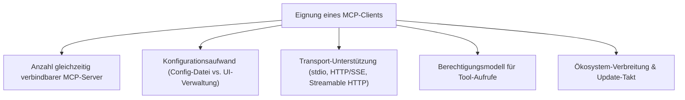
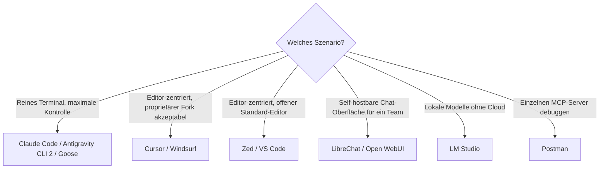

# Beste MCP-Clients — Top-20-Topliste

Die [MCP-Server-Topliste](mcp-server-topliste.md) und die [Open-Source-Software-mit-MCP-Server-Topliste](mcp-server-opensource-software-topliste.md) dieser Serie bewerten die **Anbieter-Seite** des Model Context Protocol. Diese Seite bewertet das Gegenstück: **Welche Editoren, Desktop-Apps und CLI-Agenten fungieren als MCP-Client** — verbinden sich also mit einem oder mehreren MCP-Servern und machen deren Tools/Ressourcen für den Agenten nutzbar?

!!! note "Hinweis: MCP-Client vs. ACP-Client"
    Ein **MCP-Client** verbindet einen Agenten mit externen Tools/Datenquellen (Dateisystem, GitHub, Datenbanken …). Ein **ACP-Client** (siehe [Agent-Client-Protocol-Übersicht](agent-client-protocol-acp.md)) verbindet einen Editor mit dem Agentenprozess selbst. Viele Tools in dieser Liste sind gleichzeitig MCP-Client **und** entweder Agent-Prozess oder ACP-Client — die beiden Rollen schließen sich nicht aus.

---

## Bewertungskriterien

!!! warning "Achtung: Momentaufnahme in einer sehr dynamischen Kategorie"
    MCP-Client-Support wird bei praktisch jedem großen Editor und CLI-Agenten aktuell nachgerüstet oder erweitert — Funktionsumfang zwischen den Versionen kann sich schnell ändern. **Stand: Juli 2026.**

---

## Top 20 im Überblick

| Rang | MCP-Client | Kategorie | Anbieter | Besondere Stärke | Schwäche |
|---|---|---|---|---|---|
| 1 | **Claude Desktop** | Desktop-App | Anthropic | Referenzimplementierung des MCP-Clients, einfachste Konfiguration per `claude_desktop_config.json` | Reine Desktop-App, kein Terminal-/CLI-Workflow |
| 2 | **Claude Code** | CLI-Agent | Anthropic | Sehr ausgereiftes Berechtigungsmodell pro Tool-Aufruf, siehe [Praxis-Handbuch](claude-code-praxis.md) | An Claude-Modelle als Kernagent gebunden |
| 3 | **Cursor** | Editor (VS-Code-Fork) | Anysphere | Sehr komfortable UI-Verwaltung verbundener MCP-Server direkt in den Einstellungen | Proprietärer Fork statt offenem Standard-Editor |
| 4 | **Cline** | VS-Code-Erweiterung (Open Source) | Community | Quelloffen, modellagnostisch, sehr transparente Tool-Aufruf-Anzeige vor Ausführung | Läuft als Erweiterung, kein eigenständiger Editor/Prozess |
| 5 | **Windsurf** | Editor (VS-Code-Fork) | Codeium | Tiefe Codebase-Indexierung kombiniert mit MCP-Tool-Zugriff im „Cascade"-Modus | Proprietärer Fork, ähnliche Einschränkung wie Cursor |
| 6 | **Zed** | Editor | Zed Industries | Referenz-Client für ACP **und** MCP gleichzeitig, sehr performante native Oberfläche | Kleineres Erweiterungs-Ökosystem als VS Code |
| 7 | **VS Code** (mit GitHub Copilot Chat) | Editor | Microsoft/GitHub | Natives MCP-Support direkt im Kern-Editor, riesiges Erweiterungs-Ökosystem | Volle Tiefe erst mit Copilot-Abo bzw. zusätzlichen Erweiterungen |
| 8 | **Gemini CLI** | CLI-Agent | Google | Kostenloses Kontingent, großes Kontextfenster kombiniert mit MCP-Tool-Zugriff | MCP-Tooling-Ökosystem jünger als bei Claude Code |
| 9 | **Antigravity CLI 2** | CLI-Agent | siehe [Antigravity-CLI-Reihe](antigravity-cli.md) | Dediziertes MCP-Kapitel inkl. Headless-/CI-Modus, siehe [Kapitel 9](antigravity-cli-advanced-mcp-cicd.md) | Steilere Lernkurve als einfachere CLI-Clients |
| 10 | **Continue.dev** | IDE-Erweiterung (Open Source) | Continue.dev | Modell- und Provider-agnostische Konfiguration, MCP-Server als First-Class-Config-Objekt | Setup pro Provider/Server erfordert manuelle Config-Pflege |
| 11 | **Goose** | CLI-Agent (Open Source) | Block | Von Grund auf MCP-nativ entworfen statt nachgerüstet, aktive Open-Source-Entwicklung | Kleinere Community als Claude Code/Cursor |
| 12 | **JetBrains AI Assistant** | IDE-Erweiterung | JetBrains | Gute Integration in die gesamte JetBrains-Familie (IntelliJ, PyCharm, …) | Nur innerhalb JetBrains-IDEs nutzbar |
| 13 | **Amazon Q Developer CLI** | CLI-Agent | AWS | Sehr gute Anbindung an AWS-eigene MCP-Server neben Drittanbieter-Servern | Außerhalb des AWS-Ökosystems weniger Mehrwert |
| 14 | **Warp** (Agent-Modus) | Terminal | Warp | MCP-Server-Verwaltung direkt in einem modernen, KI-nativen Terminal | Reine Multi-Datei-Refactoring-Tiefe geringer als bei dedizierten Coding-CLIs |
| 15 | **LibreChat** | Web-Chat-UI (Open Source) | Community | Self-hostbare Chat-Oberfläche mit MCP-Anbindung für mehrere Nutzer gleichzeitig | Setup-Aufwand höher als bei Desktop-Einzelplatz-Clients |
| 16 | **Open WebUI** | Web-Chat-UI | Community | Technisch sehr ausgereiftes natives MCP-Support seit v0.6.31 | Lizenz seit 2025 kein klassisches Open Source mehr (eigene Lizenz mit Branding-Klausel) |
| 17 | **LM Studio** | Desktop-App (lokales Serving) | Element Labs | Verbindet lokal laufende Modelle direkt mit MCP-Servern ohne Cloud-Zwang | Fokus auf lokale Inferenz, kein eigenständiger Coding-Agent-Loop |
| 18 | **5ire** | Desktop-App (Open Source) | Community | Schlanker, plattformübergreifender Cross-Provider-MCP-Client als leichtgewichtige Alternative zu Claude Desktop | Kleineres Ökosystem und kleinere Community als die großen Anbieter-Apps |
| 19 | **Postman** | API-Testing-Tool | Postman | Ermöglicht gezieltes Testen/Debuggen einzelner MCP-Server-Aufrufe außerhalb eines Agenten-Loops | Kein durchgängiger Agent-Workflow, eher Diagnose-Werkzeug |
| 20 | **Raycast** (KI-Erweiterung) | Launcher/Produktivitäts-Tool | Raycast | MCP-Tool-Zugriff direkt aus dem systemweiten Launcher heraus, sehr schnelle Ad-hoc-Nutzung | macOS-fokussiert, kein vollwertiger Coding-Agent-Ersatz |

!!! tip "Tipp: Client-Wahl folgt dem Workflow, nicht umgekehrt"
    Für **reines Terminal-Arbeiten** liefern Claude Code, Gemini CLI, Antigravity CLI 2 und Goose die konsistenteste Erfahrung. Für **Editor-zentriertes Arbeiten** sind Cursor, Windsurf, Zed oder VS Code mit Copilot Chat der pragmatischere Einstieg, da MCP-Server-Verwaltung dort meist direkt in der UI stattfindet statt nur in einer Config-Datei.

---

## Entscheidungshilfe nach Einsatzszenario

---

## 🔗 Verwandte Themen

- [Startseite](../../index.md) — zurück zur Dokumentations-Zentrale
- [Beste MCP-Server (Top 20)](mcp-server-topliste.md) — Server-Seite als Gegenstück zu dieser Client-Topliste
- [Beste Open-Source-Software mit MCP-Server (Top 20)](mcp-server-opensource-software-topliste.md) — weitere MCP-Server jenseits von Entwickler-Tools
- [Beste MCP-Registries (Top 20)](mcp-registry-topliste.md) — Kataloge, über die diese Clients Server finden
- [Agent Client Protocol (ACP) — Übersicht](agent-client-protocol-acp.md) — komplementäres Protokoll für Editor↔Agent statt Agent↔Tool
- [Beste KI-Agent-CLIs (Allgemein, Top 20)](ki-agent-cli-topliste.md) — viele dieser Clients auch als reine CLI-Agenten bewertet
- [Beste KI-Agent-IDEs (Allgemein, Top 20)](ki-agent-ide-topliste.md) — Editor-Clients im IDE-Gesamtvergleich
- [Antigravity CLI 2 — Kapitel 9: MCP, Headless & Security](antigravity-cli-advanced-mcp-cicd.md) — vertiefend zu Rang 9
- [Claude Code Praxis-Handbuch](claude-code-praxis.md) — vertiefend zu Rang 2
