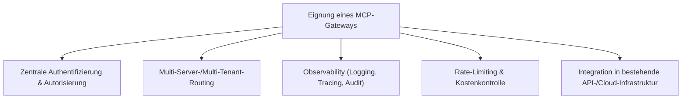
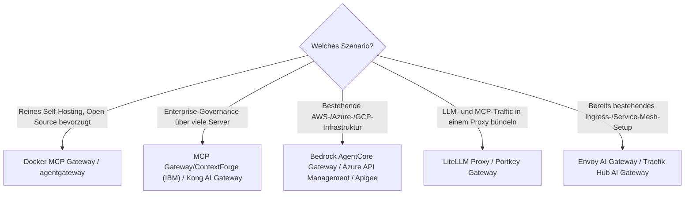

# Beste MCP-Gateways — Top-20-Topliste

Nach [MCP-Servern](mcp-server-topliste.md), [MCP-Clients](mcp-client-topliste.md) und [MCP-Registries](mcp-registry-topliste.md) fehlt in dieser Serie noch eine vierte Ebene: das **MCP-Gateway** — eine Zwischenschicht, die sich vor mehrere MCP-Server schaltet und dort zentral Authentifizierung, Rate-Limiting, Routing, Logging und Zugriffskontrolle übernimmt, statt dass jeder Client jeden Server einzeln und ungefiltert direkt anspricht.

!!! note "Hinweis: Vier Ebenen des MCP-Ökosystems"
    **Registry** (auffinden) → **Gateway** (zentral absichern & routen) → **Server** (Tools bereitstellen) → **Client** (nutzt die Tools im Agenten). Ein Gateway ist optional, aber besonders in Unternehmensumgebungen mit vielen Servern und mehreren Teams/Nutzern der Baustein, der aus einzelnen Server-Verbindungen ein governance-fähiges Gesamtsystem macht.

---

## Bewertungskriterien

!!! warning "Achtung: junge Produktkategorie, viele API-Gateways rüsten gerade erst nach"
    MCP-Gateways sind größtenteils Erweiterungen bestehender API-/AI-Gateway-Produkte, die erst 2025/2026 MCP-spezifische Funktionen ergänzt haben — Reifegrad und Funktionsumfang unterscheiden sich entsprechend stark zwischen reinem Proxy und vollwertiger Governance-Lösung. **Stand: Juli 2026.**

---

## Top 20 im Überblick

| Rang | Gateway | Anbieter | Typ | Besondere Stärke | Schwäche |
|---|---|---|---|---|---|
| 1 | **Docker MCP Gateway** | Docker | Open Source (Teil des MCP Toolkit) | Isolierte, containerisierte Server-Ausführung direkt im Gateway integriert | Setzt Docker-Laufzeitumgebung voraus |
| 2 | **agentgateway** | Solo.io | Open Source | Von Grund auf für agentischen Traffic (MCP **und** A2A) entworfen statt nachgerüstet | Jüngeres Projekt, kleinere Referenzkundenbasis als etablierte API-Gateways |
| 3 | **MCP Gateway / ContextForge** | IBM Research (Open Source) | Open Source | Governance-Fokus (Auth, Virtualisierung mehrerer Server hinter einem Endpunkt) | Enterprise-Ausrichtung, für Einzelentwickler-Setups oft überdimensioniert |
| 4 | **Amazon Bedrock AgentCore Gateway** | AWS | Cloud-Dienst | Nahtlose Anbindung an Bedrock-Agenten und bestehende AWS-IAM-Rechte | Cloud-gebunden, kein Self-Hosting außerhalb AWS |
| 5 | **Higress AI Gateway** | Alibaba Cloud | Open Source + Cloud-Dienst | Kombiniert MCP-Marktplatz und Gateway-Routing in einem Produkt | Fokus stark auf Alibaba-Cloud-Ökosystem |
| 6 | **Kong AI Gateway** | Kong | Kommerziell (Kong-Ökosystem) | Sehr ausgereiftes bestehendes API-Gateway-Fundament, breite Plugin-Basis | Volle MCP-Tiefe teils an Enterprise-Lizenz gebunden |
| 7 | **LiteLLM Proxy** (MCP-Gateway-Modus) | BerriAI (Open Source) | Open Source | Ein einziger Proxy für LLM-Aufrufe **und** MCP-Server-Routing gemeinsam | Primär Python-/LLM-zentriert, weniger generisches API-Gateway-Feature-Set |
| 8 | **Portkey Gateway** | Portkey | Kommerziell (Open-Core) | Gute Kombination aus LLM-Observability und MCP-Routing in einer Oberfläche | MCP-Funktionen jünger als das etablierte LLM-Gateway-Kernprodukt |
| 9 | **Cloudflare AI Gateway** | Cloudflare | Cloud-Dienst | Globales Edge-Netzwerk sorgt für niedrige Latenz beim Routing zu MCP-Servern | Tiefere Konfiguration erfordert Einarbeitung ins Cloudflare-Workers-Ökosystem |
| 10 | **Azure API Management** (MCP-Erweiterung) | Microsoft | Cloud-Dienst | Nahtlose Einbettung in bestehende Azure-Enterprise-Governance | Nur innerhalb des Azure-Ökosystems relevant |
| 11 | **Google Apigee** (Agent-/MCP-Erweiterung) | Google Cloud | Cloud-Dienst | Sehr ausgereiftes bestehendes API-Management-Fundament aus dem klassischen API-Geschäft | MCP-spezifische Funktionen jünger als die generischen API-Features |
| 12 | **Envoy AI Gateway** | Envoy-Projekt (Open Source) | Open Source | Baut auf dem etablierten Envoy-Proxy auf, gute Fit in bestehende Service-Mesh-Landschaften | Konfiguration erfordert Envoy-Kenntnisse, steilere Lernkurve |
| 13 | **Traefik Hub AI Gateway** | Traefik Labs | Kommerziell (Open-Core) | Einfache Integration für Teams, die bereits Traefik als Ingress nutzen | MCP-Feature-Tiefe jünger als bei dedizierten AI-Gateway-Spezialisten |
| 14 | **WSO2 API Manager** (MCP-Modul) | WSO2 | Open Source (Kernprodukt) | Sehr granulares, langjährig erprobtes Policy-/Governance-Modell | MCP-Modul vergleichsweise neu im Produktportfolio |
| 15 | **Tyk API Gateway** (MCP-Support) | Tyk | Open Source (Community Edition) | Leichtgewichtige Open-Source-Basis mit wachsender KI-Traffic-Unterstützung | Community Edition ohne einige Enterprise-Governance-Features |
| 16 | **Gravitee.io** | Gravitee | Open Source (Community Edition) | Gutes API-Design-/Lifecycle-Management kombiniert mit neuen MCP-Policies | MCP-Unterstützung jünger als das etablierte API-Management-Kernprodukt |
| 17 | **Lunar.dev** | Lunar.dev | Kommerziell | Fokussiert speziell auf KI-/LLM-Traffic-Management inkl. MCP-Routing | Kleineres Ökosystem als die großen generischen API-Gateways |
| 18 | **Zuplo** | Zuplo | Kommerziell (Open-Core) | Sehr entwicklerfreundliches, code-first Gateway-Setup | MCP-spezifische Funktionen noch in früher Ausbaustufe |
| 19 | **WunderGraph Cosmo** | WunderGraph | Open Source (Kernprodukt) | Gute Herkunft aus GraphQL-Federation-Welt, überträgt Routing-Konzepte auf MCP | MCP-Anbindung eher Erweiterung als Kernfokus des Produkts |
| 20 | **NGINX / F5 AI Gateway-Modul** | F5 | Kommerziell (NGINX-Ökosystem) | Sehr breite bestehende Produktions-Verbreitung als klassischer Reverse-Proxy | MCP-spezifisches Modul am jüngsten in dieser Liste, Funktionsumfang noch schmal |

!!! tip "Tipp: Gateway lohnt sich ab mehreren Servern/Teams, nicht beim Einzeleinsatz"
    Für **einen einzelnen Entwickler mit ein bis zwei MCP-Servern** ist ein dediziertes Gateway meist unnötiger Overhead — die Client-Config allein reicht. Ein Gateway zahlt sich aus, sobald **mehrere Teams, viele Server oder Compliance-Anforderungen** (zentrales Audit-Log, einheitliche Authentifizierung) ins Spiel kommen — dann lohnt der Blick zuerst auf Docker MCP Gateway oder agentgateway (Open Source) bzw. das Gateway des bereits genutzten Cloud-Anbieters.

---

## Entscheidungshilfe nach Einsatzszenario

---

## 🔗 Verwandte Themen

- [Startseite](../../index.md) — zurück zur Dokumentations-Zentrale
- [Beste MCP-Server (Top 20)](mcp-server-topliste.md) — die Server, die hinter einem Gateway gebündelt werden
- [Beste MCP-Clients (Top 20)](mcp-client-topliste.md) — die Anwendungen, die über ein Gateway auf Server zugreifen
- [Beste MCP-Registries (Top 20)](mcp-registry-topliste.md) — Auffindbarkeits-Ebene, bevor ein Server hinter einem Gateway landet
- [Beste Open-Source-Software mit MCP-Server (Top 20)](mcp-server-opensource-software-topliste.md) — selbst hostbare Server, die typischerweise über ein Gateway abgesichert werden
- [Agent Client Protocol (ACP) — Übersicht](agent-client-protocol-acp.md) — komplementäres Protokoll für die Editor-Anbindung
- [MCP-Sicherheit & Best Practices (Top 20)](mcp-sicherheit-best-practices-topliste.md) — Audit-Logging, Rate-Limiting und weitere Praktiken, die ein Gateway zentral umsetzt
